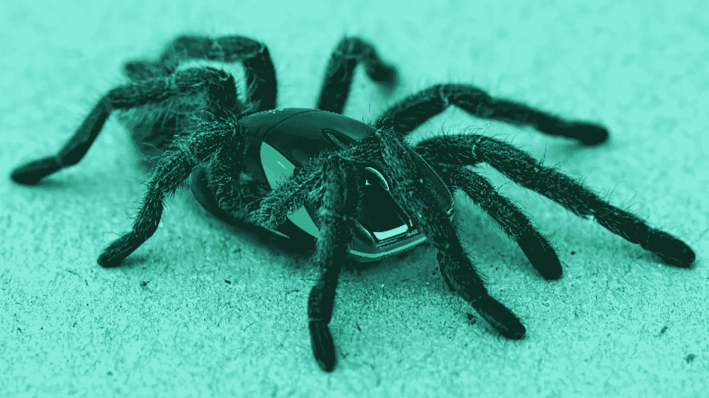
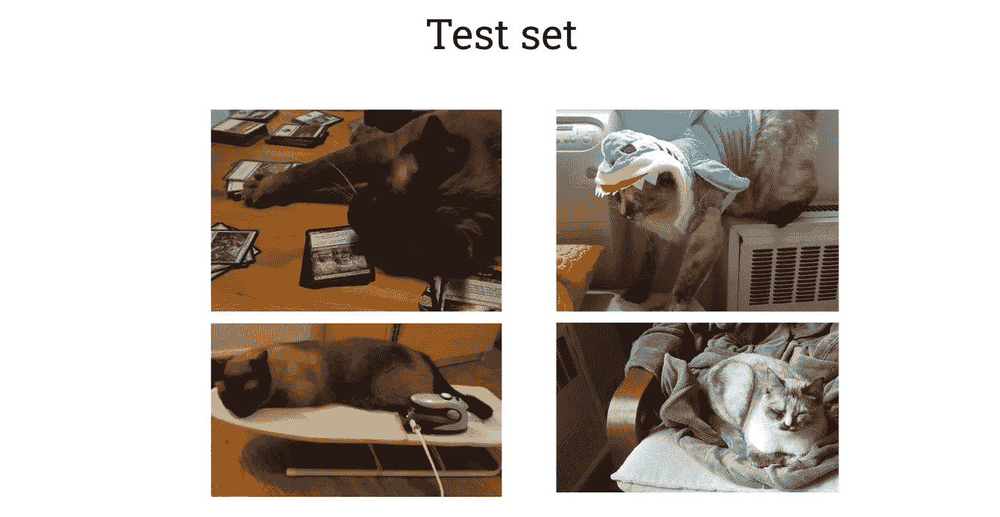
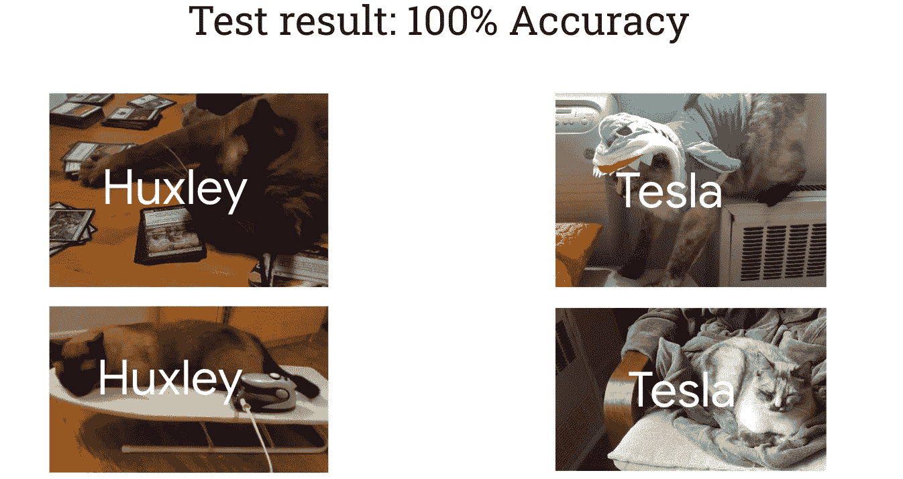
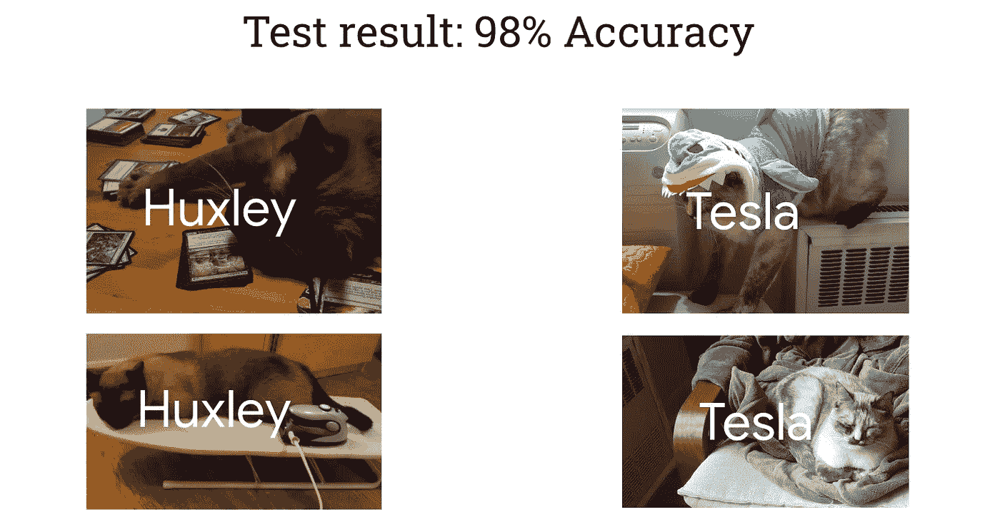
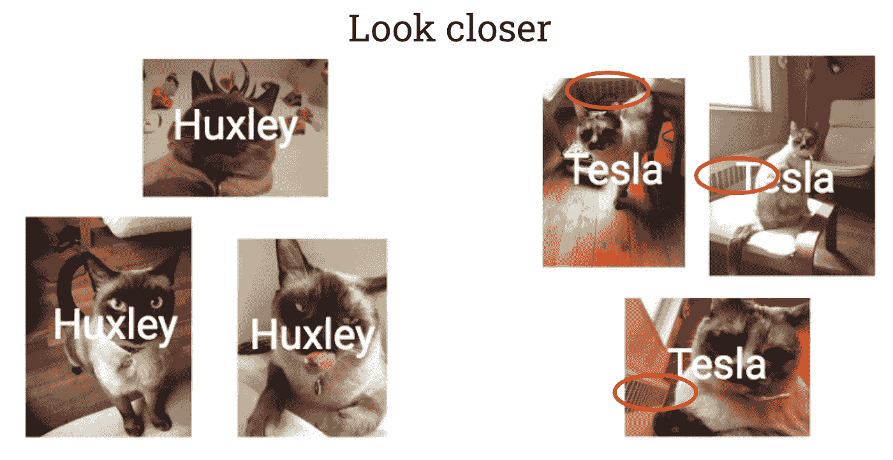
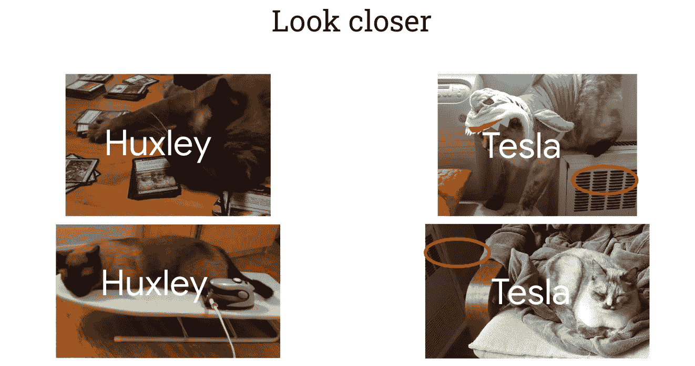

# 每个数据科学家都至少犯过一次的错误

> 原文：<https://towardsdatascience.com/the-mistake-every-data-scientist-has-made-at-least-once-3479002211b4>

## …以及如何增加避免这种情况的机会

如果你在一个没有被证实安全的地方使用一个工具，你造成的任何混乱都是*你的*错……[AI](http://bit.ly/quaesita_donttrust)和其他工具一样，所以同样的规则也适用。千万不要盲目相信。

相反，强迫[机器学习和 AI](http://bit.ly/quaesita_emperorm) 系统去 ***赢得*** 你的信任。

> 如果你想用例子来教学，例子必须是好的。如果你想相信你学生的能力，测试必须是好的。

请始终记住，除了您检查系统的条件之外，您对系统的安全性一无所知，因此请仔细检查！这里有一个方便的提醒列表，它不仅适用于 [ML/AI](http://bit.ly/quaesita_emperor) ，也适用于基于[数据](http://bit.ly/quaesita_hist)的每一个解决方案*:*

*   如果你没有测试过，就不要相信它。
*   如果你没有在你的*环境*中测试过，就不要在你的*环境*中信任它。
*   如果你没有用你的*用户群*测试它，不要用你的*用户群*信任它。
*   如果你没有用你的*数据群体*测试它，不要用你的*数据群体*信任它。
*   *如果一个* [*输入不正常*](https://bit.ly/mfml_086) *，不要相信你的系统会输出合理的东西。考虑使用异常值检测和* [*安全网*](http://bit.ly/quaesita_policy) *(例如，标记一个不寻常的实例以供人工审查)。*

> 设计好的测试是保证我们所有人安全的关键。

数据新手和[数据科学](http://bit.ly/quaesita_datascim)专家之间的一个区别是，专家有一些巨大的信任问题……并且乐于拥有它们。

来源: [Pixabay](https://pixabay.com/photos/spider-scary-mistake-hybrid-mouse-2913761/)

# 专家犯的错误

在我们的[上一篇文章](http://bit.ly/quaesita_testmistake1)中，我们研究了初学者会犯的测试错误以及如何避免它。现在是时候看看一个甚至专家都会犯的更为隐蔽的错误了。

对于那些没有读过[前一篇文章](http://bit.ly/quaesita_testmistake1)的人，让我们来给你补上设置(在一个平行宇宙中，我们没有犯[新手的错误](http://bit.ly/quaesita_testmistake1)):

我们使用 70，000 张输入图像训练了一个像样的[模型](http://bit.ly/quaesita_emperorm)(你在上图中看到的每张图像都是一个占位符，代表 10，000 张带有香蕉、赫胥黎或特斯拉标签的相似照片；其中一个是我的早餐，另外两个是我的猫，你弄清楚哪个是哪个)然后在 40，000 张原始图像上进行测试。

我们得到了…完美的结果！哇哦。

当你观察到在一个机器学习任务上的完美表现时，你应该非常担心。正如[上一篇文章](http://bit.ly/quaesita_testmistake1)警告你不要对 0%抱有错误的态度一样，每当你看到*完美的*结果时，嗅到一丝可疑是一个好习惯。专家的第一个想法是，要么测试太简单，要么标签泄露，要么数据不像我们希望的那样原始。当一位经验丰富的大学教授发现每个学生都完美地回答了每个问题时，他会有同样的想法。他们会疯狂地调试，而不是为良好的教学而沾沾自喜。

由于 100%对于逼真的场景来说不是一个真实的结果，让我们想象我们得到了一些其他高但不太高的分数，比如 98%。

很棒的表演，对吧？听起来原始数据的性能不错。随着所有的[统计假设测试](http://bit.ly/quaesita_fisher)花里胡哨的处理！我们已经建造了一个令人敬畏的特斯拉/赫胥黎探测器，让我们发射吧！！！

小心点。

你会忍不住妄下结论。这可能根本不是 Tes/Hux 检测器，即使它在测试中给出了很好的结果。

专家们犯的错误与技术关系不大，更多的是与人有关:屈服于一厢情愿的想法。

> 专家们也不能避免一厢情愿的错误。

不要假设这些结果对系统实际检测的内容有任何意义。我们没有证据表明它已经学会——或者更糟的是，“它理解”——如何区分 Hux 和 Tes。仔细看…

你注意到所有 Tes 照片背景中的小细节了吗？哎呀，原来我们不小心建立了一个散热器/非散热器分类器！

过度关注问题的某些部分和我们感兴趣的数据——比如两只猫的身份——而忽略其他部分，比如大多数 Tes 照片中的散热器，因为那是她喜欢出没的地方，因此也是她最有可能被拍照的地方，这是一个非常人类的错误。不幸的是，她太喜欢散热器了，以至于在训练数据和测试数据中都出现了相同的问题，所以你不会通过测试来自你用于训练的同一[人群](http://bit.ly/quaesita_vocab)的数据来发现问题。

只要你(以及你的利益相关者和用户)有钢铁般的纪律:

*   不要把可爱的故事读进结果中，比如“这是一个 Hux/Tes 分类器。”这种语言暗示着比我们有证据证明的更普遍的东西。如果你对机器学习系统实际上在做什么的理解符合一个简洁的报纸标题，那么你可能做错了……它至少应该让你对它的细节感到厌烦。
*   痛苦地意识到，如果你测试系统的环境和你训练系统的环境之间存在差异，你就不能保证你的解决方案会有效。

这种学科是罕见的，所以在我们有更好的数据素养之前，我所能做的就是梦想成真，为教育人民尽一份力。

这个系统只能处理以与测试和训练数据集相同的方式拍摄的照片——冬天来自同一间公寓的照片，因为那时特斯拉倾向于在散热器旁闲逛，而赫胥黎却没有。如果你总是用同样的方式拍照，而且你有很多照片，谁会在乎你的系统是如何分配标签的，只要它能给你正确的标签。如果它使用辐射器在标签游戏中获胜，那很好…只要你不期望它在任何其他上下文中工作(它不会)。为此，您需要更好、更广泛的训练和测试数据集。如果你把系统搬到不同的公寓，即使你认为你了解你的系统是如何工作的，也要重新测试它，以确保它*仍然*工作。

> 你的数据所代表的世界是你唯一会成功的世界。

记住，你的数据所代表的世界是你唯一会成功的世界。所以你需要仔细考虑你正在使用的数据。

# 避免专家失误

永远不要假设你理解人工智能系统在做什么。认为自己对一个复杂事物的简单认识是防弹的，这是傲慢的高度。你会为此受到惩罚的。

> 永远不要假设你理解人工智能系统在做什么。认为自己对一个复杂事物的简单认识是防弹的，这是傲慢的高度。你会为此受到惩罚的。

很容易忽略数据中真实世界的细微之处。无论你在这方面有多有天赋，如果你在数据科学领域工作了足够长的时间，你几乎肯定会至少犯一次这种一厢情愿的错误，直到你学会严重缩减你的结论的艰难方法——你可以养成的最好习惯是，在你彻底检查证据之前，避免对事情进行额外的解读。当你对结果的内心独白听起来不像是 TED 演讲，而更像是世界上最无聊的合同的细则时，你就会知道你已经到达了下一个层次。这是好事。如果你坚持的话，稍后你可以用你的快速谈话来迷惑，只是不要因为相信你自己的双曲线而使数据素养尴尬。

从良好的测试结果中，您唯一能学到的是，该系统在与测试条件相似的环境、情况、数据集和人群中运行良好。你对它在这些条件之外的表现的任何猜测都是虚构的。仔细测试，不要妄下结论！

# 感谢阅读！YouTube 课程怎么样？

如果你在这里玩得开心，并且你正在寻找一个为初学者和专家设计的有趣的应用人工智能课程，这里有一个我为你制作的娱乐课程:

在这里欣赏整个课程播放列表:[bit.ly/machinefriend](http://bit.ly/machinefriend)

# 喜欢作者？与凯西·科兹尔科夫联系

让我们做朋友吧！你可以在 [Twitter](https://twitter.com/quaesita) 、 [YouTube](https://www.youtube.com/channel/UCbOX--VOebPe-MMRkatFRxw) 、 [Substack](http://decision.substack.com) 和 [LinkedIn](https://www.linkedin.com/in/kozyrkov/) 上找到我。有兴趣让我在你的活动上发言吗？使用[表格](http://bit.ly/makecassietalk)取得联系。

# 有兴趣尝试图像分类吗？

点击此处开始使用 Google Cloud Vision API 和 AutoML Vision [:](https://bit.ly/googlecloudvision)

 