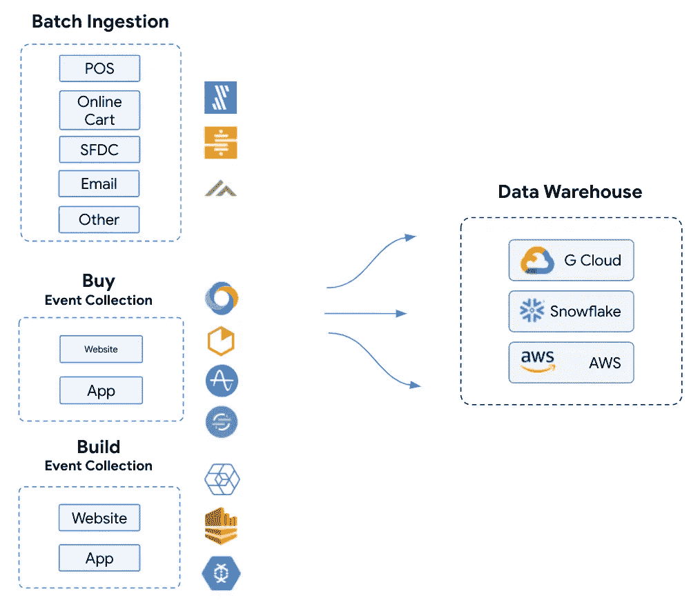
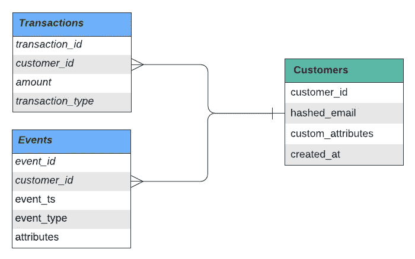
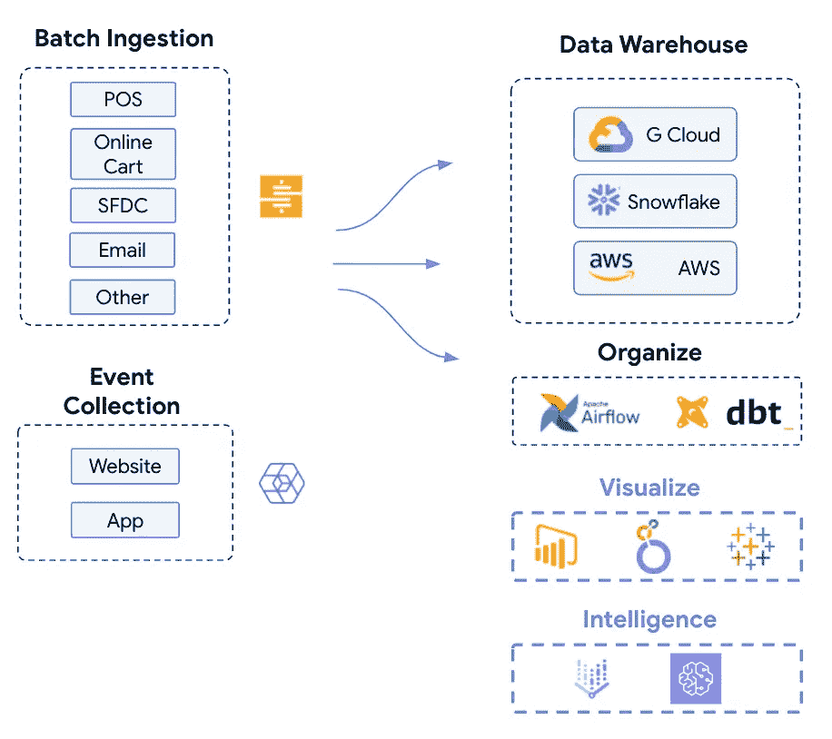
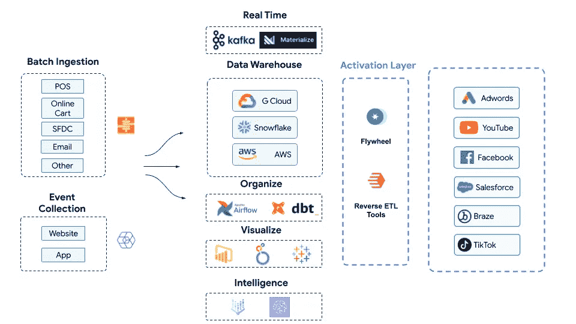

# 现代客户数据堆栈

> 原文：<https://towardsdatascience.com/the-modern-customer-data-stack-3cd91a3e79d1>

## 客户数据平台的更好替代方案

卢克·切瑟在 [Unsplash](https://unsplash.com?utm_source=medium&utm_medium=referral) 上的照片

您知道吗？创新数据和分析领导者正在控制他们仓库中的第一方数据，不再依赖 CDP 等第三方平台。这变得越来越有必要，因为使用 cookies 跟踪用户的做法正在消失，隐私法规是人们最关心的问题，大技术公司正在对可跟踪的内容实施限制。公司需要通过控制他们的第一方客户数据堆栈，开始掌握自己的数据命运。这种方法为您自己的数据提供了完全的隐私和治理，并释放了创新和数据驱动型增长的巨大潜力(您可以在这里[阅读 CDP 不是未来的原因的更详细分析](/cdps-are-not-the-future-f8a3f56114b6))。

我们将这种新方法称为**现代客户数据堆栈**，它完全以数据仓库或数据湖为中心。好消息是，在过去几年中，作为分析领导者，创建和拥有您的现代客户数据堆栈变得更加容易。在本文中，我们将了解现代客户数据堆栈是什么样子，以及我们看到雄心勃勃的数据所有者采取了哪些方法来实现它。

**现代客户数据堆栈的组件:**

1.  **数据层—** 核心数据存储层，包括数据仓库或数据湖
2.  **摄取层** —从各种来源将客户数据摄取到您的数据仓库中
3.  **客户数据模型** —将数据仓库中的客户资料组织到一个视图中
4.  **可视化&智能层** —深入了解客户和营销工作，推动增长
5.  **激活层** —通过激活您对营销、销售、客户服务和产品工具的洞察力来推动增长

# 数据层

现代客户数据堆栈的核心是利用已经为现代数据架构铺平了道路的工具，并在这些工具集的基础上进行构建。只要您的数据集中在一个可查询的存储层中，您就可以获得这种架构的好处。

**数据仓库**

对于系统的数据层，该体系结构由数据仓库的高性能特性提供支持，并建立在这些特性之上。公司已经大量采用 BigQuery、Snowflake 或 Redshift 等数据仓库来集中数据，现代数据堆栈建立在这些工作的基础上，而不是取代它。通过在数据仓库中拥有您的数据，您为您的数据分析和数据科学团队开辟了一条道路，使他们能够在其首选的工具集中进行创新，同时拥有您的数据安全性、隐私和治理。

**数据湖**

如果您的团队使用 AWS Athena 或 Azure Synapse 之类的数据湖架构，您仍然可以将其用作现代客户数据堆栈的存储层，而不是数据仓库。数据湖工具还提供了一个 SQL 查询接口，允许您将它们用作这个堆栈中的存储层。

# 摄入层

构建客户数据堆栈的一个主要步骤是将所有第一方数据放在一个地方。有许多方法可以实现这一点，但我们将触及一些常见的方法。通过将所有的原始数据带入数据仓库并对其建模，您为您的团队释放了大量的价值，让他们可以使用这些数据来实现增长。实际上，您的数据将被分散到不同的内部或外部系统中。其中一些系统具有 API、ODBC 连接器、SFTP 或其他接口，必须集成这些接口才能获取数据。那么，将所有数据放入仓库的方法是什么呢？

## 批量摄入

最快的开始方式是采用您选择的 ETL 工具从各种 API 和连接器加载批量数据。这些工具非常适合按照设定的节奏从不同平台以原始形式导入数据。例如，将数据从您的 Salesforce 实例接收到雪花或 BigQuery 中。您会在这个领域找到各种开源或第三方工具。您最终使用哪种工具取决于您可用的工程资源、成本以及您希望您的团队拥有多少流程。以下是我推荐的几个选项:

*   **开源:**歌手，舵栈
*   **第三方:** Fivetran，Stitch，Matillion

批量摄取—作者图片

## 产品事件收集器(网络和移动)

除了导入批量数据，许多希望实施产品分析的公司将选择直接与其 web 或移动应用程序集成的工具来收集事件。这种方法需要您的工程团队进行更多的前期工作，以将 SDK 集成到您的移动应用程序和 web 应用程序中。它们允许您跟踪产品事件，如登录、搜索或点击。对于产品事件收集者，你可以选择**购买**或者**自己构建**。

**购买工具**

要更快地设置数据堆栈，购买工具是一个不错的选择。如果你选择购买路线，你可以在市场上买到像 Segment、Mixpanel、Amplitude 或 Heap 这样的选项。首先，回顾一下您的团队目前已经在使用哪些分析工具。通常，您的工程团队已经在通过 GA 360、Segment、Amplitude 或 Heap 收集某个地方的事件。

**打造自己**

如果您希望在节省成本的同时扩展您的收藏，您可能需要考虑构建选项。大多数团队都在使用 Amazon Kinesis、Kafka 或 PubSub 来推出他们自己的系统，或者他们使用像 Snowplow 这样的开源框架。如果你有很强的工程文化，并且正在使用建筑方法，我们推荐 Snowplow，因为我们看到公司走得最远，最快。

数据仓库的事件收集—按作者分类的图像

# 客户数据模型

既然您的数据仓库中已经有了原始形式的客户数据，那么是时候对其进行组织以使其对您的团队有用了。这是问题的一部分，好的架构设计和思想将大有帮助。目标是将原始数据组织成可操作的模型或实体，为您的业务用例服务。堆栈的这一阶段可能涉及几个关键组件:

*   **身份解析**:识别不同数据源中的相同用户
*   **主数据模型**:创建您的客户以及相关事实和维度的最终/清晰视图。

这里需要提醒的是，要从简单开始，不要试图煮沸海洋。增量地构建模型并快速迭代会让你更快地获得真正的价值。请记住，我们的目标是在几天内实现价值，而不是几个月。我们看到的一种行之有效的方法是从创建激活营销和销售增长所需的业务对象开始——客户、交易和事件。

**身份解析&重复数据删除**

身份解析的目标是对数据源内部和数据源之间的个人进行重复数据删除，为您拥有的每个客户留下一个单一的标识符(id)。这是出于沟通目的解决客户单一视图的重要一步。身份解析似乎是一项艰巨的任务，但即使对于这个问题，也有一种更简单的方法可以开始。你可能很想钻进兔子洞，看看黑盒/人工智能驱动的身份解析解决方案，但现在先把它们忘掉。我们建议从基于规则和基于优先级的身份解析开始，在不同的表之间匹配特定的键。

数据仓库中基于 SQL 的简单身份解析的关键步骤:

*   **识别匹配关键字:**第一步是确定您将使用哪些字段或列来确定哪些人在源内和跨源是同一个人*。匹配关键字的典型例子可能是电子邮件地址和姓氏。*
*   **聚合客户记录**:第二步是创建一个源查找表，其中包含来自源表的所有客户记录。我们称之为查找表。
*   **Match &分配一个客户 ID:** 最后一步是简单地获取具有相同(或者在某些情况下相似)匹配关键字的记录，并为匹配的客户记录组生成一个唯一的客户标识符。生成的每个客户 id 都可以用于将客户源链接在一起。
*   **滚动更多来源:**当您获得更多来源时，您可以通过为来源设置正确的规则和优先级，开始将它们滚动到相同的流程中。

**创建主模型**

为了创建您的第一个客户视图，您已经解决了第一个身份问题。接下来是让您的数据管道或 ETL 过程就位，以构建将推动分析的主模型。为了推动快速价值，我们建议从“**客户→交易→事件”**框架开始。这个框架需要从源数据中创建三个关键对象。下面是关于这种类型的[模式](https://www.flywheelsoftware.com/help-center-articles/preparing-your-data-for-flywheel)的更多细节。

**客户:**创建一个能够快速添加新字段的客户表

**事务:**将客户表中的键连接到他们的事务历史中

**事件:**您为每个客户跟踪的任何事件

业务实体的简单模式—按作者分类的图片

如果您的公司是一个双边市场或者有不同的业务实体，您可以更改这些主数据模型，以遵循对您有意义的方式。例如，对于一个双边市场，您可能将卖方和买方的表作为不同的实体。对于 B2B 业务，您可能有单独的帐户和联系人实体。

**工具**

虽然有许多方法可以获取源数据并在您的仓库中进行转换，但我们看到创新分析团队使用开源堆栈的速度更快。在过去的几年中，用于创建现代客户数据堆栈的开源工具取得了长足的进步，使管理和维护您的数据变得更加容易。许多团队已经转而使用数据构建工具(DBT)来构建、维护和快速迭代具有生产级数据管道的模型。我们的团队使用 DBT，并且是他的忠实粉丝。同样的事情可以用其他 ETL 工具甚至 Lambda 无服务器架构来完成。

当谈到工作流编排时，Airflow 已经广泛用于运行数据管道或机器学习模型的空间。它还可以作为托管服务部署在 GCP 和 AWS 上，因此您的团队不必管理基础架构。气流的其他替代品包括提督，Dagster，KubeFlow 等。

# 可视化和智能层

建立现代客户数据堆栈的主要驱动力之一是能够灵活地推动洞察、发展业务和改进产品。一旦您将数据集中到一个数据仓库中，您就可以通过可视化和运行预测性分析的能力立即释放这些洞察力。对于可视化，您可以使用 Looker、PowerBI、DataStudio 或任何其他工具。智能层是事情开始变得令人兴奋的地方，它能够为您的数据科学或分析团队创建 ML 模型或扩展创新，使用任何首选工具— python、spark、SQL。您的团队现在可以成为向导，所有数据唾手可得。正如我们之前所写的，这是现代客户数据堆栈与使用客户数据平台([链接](https://www.flywheelsoftware.com/post/cdps-are-not-the-future))的关键区别。

一个简单但经常使用的例子是创建客户流失评分模型。这可以通过利用 Amazon SageMaker、BigQuery ML 或 Vertex AI 等工具进行训练、调优和预测来轻松实现。来自这些模型的预测可以很容易地融入到您的模型中，并为您的营销或销售团队提供服务，以优先考虑他们与客户的联系。

可视化和智能工具—作者图片

一旦这个智能层在一个组织中形成，它就会成为推动增长的良性循环。您的数据团队最了解您的业务和客户数据，因此他们可以创建最有效的见解和模型。您的业务团队使用这些模型来推动营销和销售活动，以影响客户行为和增长。然后，业务团队开始寻求更多的见解和预测，以推动进一步的客户数据创新。在这一周期结束时，您的公司拥有整个数据和见解资产，使您能够灵活地在此基础上进行构建，并在新系统中加以利用，同时永远不会局限于特定的第三方。这就是现代客户数据堆栈的神奇之处。

# 活化层

在对数据进行组织并准备好推动对客户的洞察后，下一个关键问题是如何通过您的销售、营销、客户服务和产品团队激活这些第三方客户数据洞察？毕竟，拥有您的现代客户数据堆栈的关键原因是能够激活它来推动客户行为和增长的变化。通常，我们看到公司在团队中使用各种各样的工具来吸引客户，包括 Salesforce、Marketo、Braze、脸书广告或谷歌广告。那么，在我们前面的例子的基础上，您如何列出可能会流失的客户，并让他们使用这些工具呢？今天，如果你想为这些有风险的客户开展脸书广告活动，你必须创建一个 SQL 查询，从数据仓库中提取一个列表，将其下载到 CSV，并上传到脸书广告或构建一个集成。这个过程是高度手动的、耗时的，并且产生了太多的摩擦，以至于不能实现现代客户数据堆栈的全部潜力。

释放现代业务数据堆栈潜力的一大缺失是**激活层–**从现代客户数据堆栈中获取客户洞察并在销售、营销和客户服务工具中激活它们的能力。这就是为什么反向 ETL 空间现在蓬勃发展，许多工具开始出现，允许你这样做。完全公开，这是飞轮填补的空白，也是我工作的地方。我们构建了第一个专门为企业销售和营销用例构建的智能反向 ETL，该平台可以在任何数据仓库上工作。激活层工具使团队能够基于您的第一方数据洞察运行更多实验，并推动增长速度加快。

# 底线:拥有您的数据，拥有您的增长

**现代客户数据堆栈**为企业提供了一种在不确定环境中掌控自身发展的方式。在过去几年中，创新的基于云的工具使公司更容易构建自己的现代客户数据堆栈，降低了拥有成本。与此同时，随着政府和大型科技公司的变化，企业组织对内部提供第一方客户数据的需求急剧增加。这些关键因素使现代客户数据堆栈成为 2022 年企业的首要任务，我们已经听到这一概念在各行各业引起共鸣。

现代客户数据堆栈—作者图片

我们很高兴看到现代客户数据堆栈的形成，并帮助高增长公司增强其增长引擎。公司现在部署的系统将决定他们拥有数据的能力和未来几年的增长。