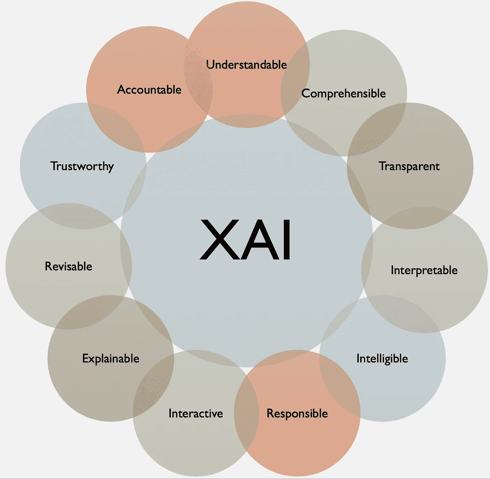
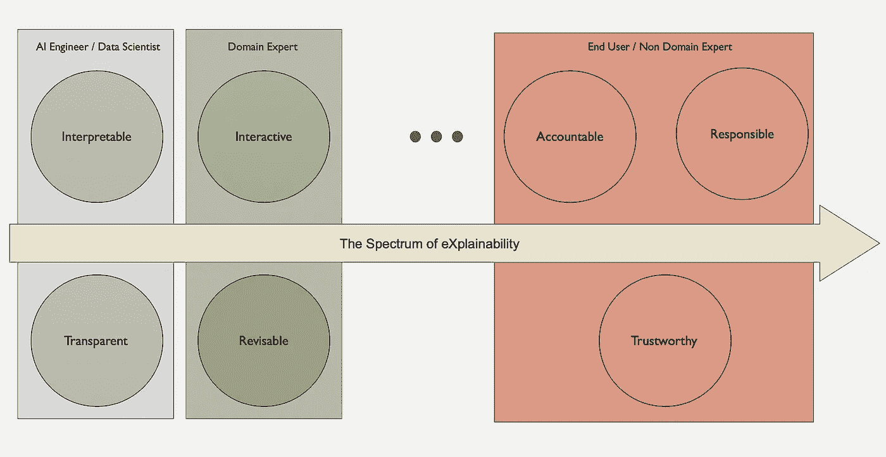

# 最重要的 XAI 类型

> 原文：<https://towardsdatascience.com/the-most-important-types-of-xai-72f5beb9e77e>

## 看看 XAI 的三种高影响力类型

这篇文章讨论了 XAI 的三种关键类型:可解释的人工智能、透明的人工智能和可交互的人工智能。在我从事人工智能的这段时间里，我发现这三者比其他任何一个都更实用。在这篇文章中，我给出了每个的概述和例子。

Jr Korpa 在 [Unsplash](https://unsplash.com?utm_source=medium&utm_medium=referral) 上拍摄的照片

人工智能(AI)围绕着我们生活的许多方面。我们与人工智能在日常生活中影响的许多应用程序进行交互。有一个机会，一个人工智能向你推荐了这篇关于人工智能的文章。它很强大，不可否认这些智能算法对我们社会的影响。但是，每一次成功的背后，似乎都有两倍的失败是由于对算法工作原理的误用或误解。例如，任何处理特定于人的信息的算法都在审查之下(有一个很好的理由[5])。有多少被算法歧视的案例？够了。当我们试图构建更好的算法时，毫不奇怪，可解释性(或 XAI)是我们许多人最关心的问题。令人印象深刻的是，创造性的解决方案使人工智能变得可以解释。但是，并不是所有的 XAI 人生而平等。我论文的重点是 XAI 的一个子集，但它要求我研究 XAI 更广泛的领域。我在 2019 年把这个图像放在一起，所以你可以想象今天还有多少 XAI 词。

图片(由我拍摄)突出了几个 XAI 流行语

并非所有的 XAI 人生而平等。每种类型都有其独特的优势，对于创造一个更容易理解的人工智能至关重要。然而，XAI 的背景将决定你需要什么样的 XAI。XAI 存在于低级解释(对数学家、人工智能工程师和数据科学家来说很好)和高级解释(对对人工智能或其背后的数据一无所知的最终用户来说很好)之间。

图片(由我拍摄)突出了看待 XAI 类别的不同方式。

> 注意:这些不是独立的类别。这意味着，一些 XAI 可能属于多个类别。

让我们举一个不同类别的 XAI 发挥作用的例子——自动驾驶汽车。在我之前关于 XAI 的文章中，我强调了建设 XAI 时需要考虑的三个重要问题。当考虑自动驾驶汽车在人工智能的整个生命周期中所需的 XAI 类型时，它们是适用的。 ***人工智能工程师*** 与低级 XAI 合作，了解它在汽车上部署时将如何工作的界限。然而，这对制造汽车的机械工程师来说是不切实际的。他们可能需要知道人工智能的输出将如何影响车辆本身。如果人工智能识别出停车标志，工程师将需要理解如何应用刹车。

这种 XAI 类型不同于人工智能工程师构建有效人工智能所需的 XAI。所以，机械工程师想要来自人工智能的反馈(交互式的，可修改的)来为硬件(汽车)做出最好的决定。

无人驾驶汽车将多一个用户— ***乘客*** 。乘客们不关心任何工程师的 XAI。司机只关心安全到达目的地，所以他们希望他们的人工智能是负责任和值得信赖的。为了在光谱的右边产生 XAI(比如负责任和值得信赖)，我们必须在光谱的左边建立 XAI。每个 XAI 都浮出水面，因为它在某些情况下是必不可少的，但我发现了三个最好的——可解释的、透明的和交互的。

# 可解释人工智能

可解释人工智能是最重要的 XAI 类型之一，因为它解释了人工智能如何做出决定。“可解释的”有很多定义。但是，我最喜欢的是“一个用户不仅能看到，还能研究和理解输入是如何数学映射到输出的系统。”[1].遵循这个定义，就很容易明白为什么它如此重要。如果人工智能符合可解释的定义，我们可以很容易地构建 XAI 来支持人工智能，因为人工智能不是黑盒。不幸的是，这个定义并不总是可行的，因为会有性能的折衷。可解释意味着更低复杂性的模型，但这与我们模型的轨迹相反。很容易说 GPT-4 是不可解释的。然而，如果一个可解释的人工智能足够满足你的应用，我会强烈推荐它。

# 透明人工智能

透明的 AI 对于建立人与算法之间的信任至关重要。透明度是另一个没有一致定义的流行词，但在实践中，它指的是任何有助于回答人工智能是什么、为什么或如何工作的问题的方法。透明方法不仅分析人工智能，还分析人工智能正在处理的数据。

透明人工智能的一些典型输出是摘要[2]，可视化[3]，甚至是数字描述[4]。这些输出中的每一个都是试图将人工智能的细节翻译给人类。通过更好地了解人工智能如何运作，我们可以在使用它时建立信任。通过查看 AI 如何处理数据，用户可以确保算法的行为符合预期，这有助于建立对机器决策的信心。尽管可解释性可能不可行，但我相信所有的人工智能在某种程度上都应该是透明的。我可以被说服，但我还没有找到一个合理的反驳。

# 交互人工智能

可交互人工智能是一种 XAI，允许用户与机器学习模型进行交互，以理解它为什么做出特定决定。这种类型的 XAI 有利于解释难以解释的复杂模型。通过查看数据和机器学习模型并与之交互，用户可以更好地理解机器如何做出决策。

可交互的人工智能允许人类和算法通过相互提供反馈来共同工作，以实现共同的目标。人类在与机器合作时扮演着至关重要的角色，因为我们可以为算法提供上下文。交互式人工智能可能会带来人类以前无法实现的新成就。可交互的人工智能很棘手，因为它很可能是特定领域的。例如，如果你正在使用人工智能生成一个标志，你将不得不指导人工智能创造一些可以接受的东西。你需要的界面类型与你是一名医生试图诊断一名病人时完全不同。在每种情况下，人类都需要能够将他们的偏好或知识插入到人工智能的决策中。

# 结论

在这篇文章中，我们探索了对人工智能的未来至关重要的三种 XAI。可解释的人工智能提供了对人工智能如何计算输出的直接理解，但这些模型很少见。透明的人工智能对于建立人与算法之间的信任非常重要，因为它有助于用户理解人工智能是如何工作的。交互式人工智能允许用户与人工智能互动，共同工作。我相信这些 XAI 流行语将推动人工智能在新应用和领域的采用。

# 参考

[1] [参考 1](https://arxiv.org/pdf/1710.00794.pdf) (可解释性)

[2] [参考文献 2](https://www.researchgate.net/publication/341948561_Information_Fusion-2-Text_Explainable_Aggregation_via_Linguistic_Protoforms?_sg%5B0%5D=bS3IqMeIntiTXmmdAJ-JmI9gTj5UsUTpZUNJTN71SEJqB3YVqFmI2t1JxDVF8kw2zM5sQYv6piV6FRPH0mklHGgsp2AQ69lyl2lcgaeE.5ovvq2WnDckcbCr0fn4cRK6simrHIuChqwGsCo4s2cqetyUWdPyuvOHHM1OPKrcI33a4CRPvf38VDkLmBcBjeA) (透明文本)

[3] [参考文献 3](https://arxiv.org/abs/1311.2901) (可视化中的透明度)

[4] [参考文献 4](https://www.researchgate.net/publication/343250197_Explainable_AI_for_the_Choquet_Integral?_sg%5B0%5D=bPkG02VSO42uil2_c2_Qtg78X4Y8Uf38ehmEpdjDEwUrguS1g75hJ31ub5QwrueZ-FZHuZTg3YBl25d2Rwgq6iwHi0bYpBPRKMldoEv3.uPt9kRj8OtMJHdQYjSK6_-f0PN0l7n5BAdKZOKsmzhWAGDMfmoEPcrsLAV2qGCfxpla0lDQtofz6kaQ2IEcyTg) (数字透明度)

[5] [参考文献 5](https://hbr.org/2019/05/all-the-ways-hiring-algorithms-can-introduce-bias) (招聘中的偏见)