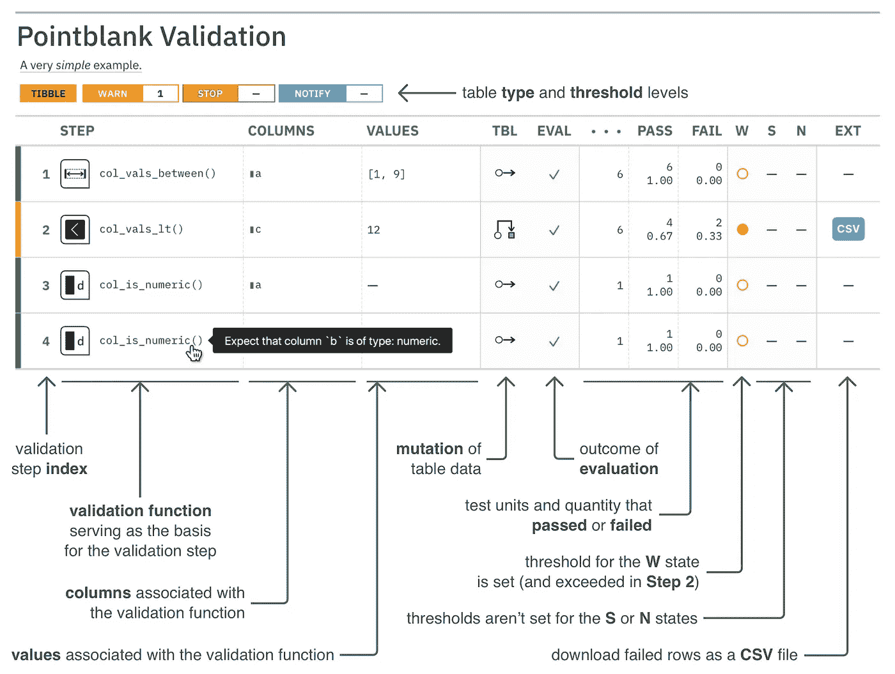
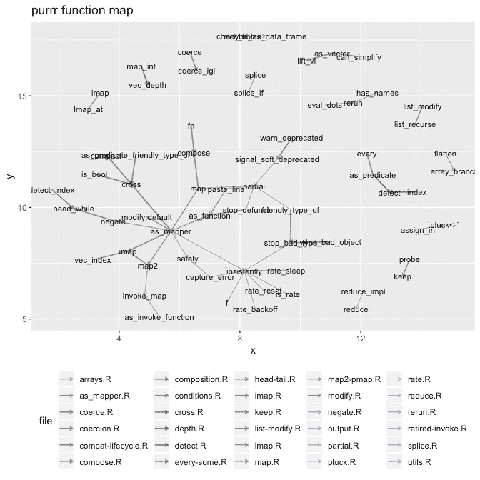

# 最被低估的 R 包:第 2 部分

> 原文：<https://towardsdatascience.com/the-most-underrated-r-packages-part-2-decdc753205c>

## 令人敬畏的和不太为人所知的 R 库的精选列表

特雷弗·瓦诺伊在 [Unsplash](https://unsplash.com?utm_source=medium&utm_medium=referral) 上的照片

所以，我们又来了。几年前[我发表了一份清单](/the-most-underrated-r-packages-254e4a6516a1)列出了当时我认为最被低估的 R 包。那个帖子仍然在产生观点和掌声，所以我觉得是时候更新列表了。

# 开始吧！

## 💥多方面的💥

*   [**屠夫**](https://github.com/tidymodels/butcher) :在`R`中建模管道偶尔会导致拟合的模型对象占用太多内存。有两个主要的罪魁祸首:1)在建模过程中严重依赖于捕获封闭环境的公式和闭包；以及 2)在模型对象本身的构造中缺乏选择性。结果，拟合的模型对象携带了通常是冗余的并且对于拟合后的估计活动不需要的组件。`butcher`可以轻松削减拟合输出中不再需要的部分，而不会牺牲原始模型对象的很多功能。
*   [**编年史**](https://github.com/b-rodrigues/chronicler) :轻松给你的函数添加日志，不干扰全局环境。
*   [**建设性:**](https://github.com/cynkra/constructive) 打印可用于重新创建 R 对象的代码。在某种意义上，它类似于`base::dput()`，但是{constructive}努力使用“自然的”构造函数(`factor`表示因子，`as.Date()`表示日期，`data.frame()`表示数据帧等)，以获得人类可读的输出。
*   [**encryptedRmd**](https://github.com/dirkschumacher/encryptedRmd) :使用[lib 钠](https://doc.libsodium.org/)自加密 html markdown 报表。这个软件包可以让你用密码保护 markdown html 文档，并安全地与他人分享。
*   [**光栅:**](https://github.com/reconverse/grates) 光栅提供了分组日期类的简单而一致的实现。
*   [**secret:**](https://github.com/gaborcsardi/secret) 允许共享敏感信息，例如密码、‘API’密钥等。，在 R 包中，使用公钥加密。
*   [**sessioninfo:**](https://github.com/r-lib/sessioninfo) 查询并打印当前 R 会话的信息。它类似于`utils::sessionInfo()`，但是包含了更多关于软件包的信息，以及它们的安装位置。
*   [**SheetReader**](https://github.com/fhenz/SheetReader-r)**:**它提供了从 Excel OOXML(.xlsx)文件。这个库将 SheetReader 集成到一个 [R](https://www.r-project.org/) 包中，其中`[Rcpp](https://cran.r-project.org/package=Rcpp)`作为用 C++编写的解析代码的接口。对于大文件比 openxlsx 快很多。
*   [**ps:**](https://github.com/r-lib/ps) ps 实现了一个 API 来查询和操纵系统进程。它的大部分代码基于 [psutil](https://github.com/giampaolo/psutil) Python 包。
*   [**regex magic**](https://github.com/jonocarroll/regexmagic):regex magic 的目标是提供一种自动化的方法，用于根据正则表达式匹配将字符串向量分类成组。这不同于在向量中查找已知正则表达式的匹配，而是有助于确定字符串之间的共性。

## ⚙️数据管理/⚙️业务中心

*   [**crew:**](https://github.com/wlandau/crew) 任务队列是一个中心枢纽，用于动态和异步地编排计算要求高的工作负载。`crew`包支持各种具有公共接口的任务队列和用于不同平台的不同类型的工作者，类似于`[future](https://future.futureverse.org/)`包为单个作业和单个 map-reduce 调用提供统一的 R 接口的方式。
*   [在验证工具集之上，这个包为您提供了提供和更新*定义*您的表的信息的方法。](https://github.com/rich-iannone/pointblank/)

来源:Pointblank Github Repo

*   [**projmgr:**](https://github.com/emilyriederer/projmgr) `projmgr`旨在更好地将项目管理整合到您的工作流程中，并腾出时间从事更令人兴奋的任务，如 R 编码和数据分析。因为许多 R 用户和程序员使用 GitHub 作为他们分析的家，所以`projmgr`的目标是用这些相同的工具来简化项目管理。
*   [**目标**](https://github.com/ropensci/targets)**:**`targets`包是一个 [Make](https://www.gnu.org/software/make/) 式的 r 中统计和数据科学的管道工具，有了`targets`，您可以保持一个可重复的工作流，而无需重复自己。`targets`为已经更新的任务跳过昂贵的运行时间，用隐式并行计算协调必要的计算，并将文件抽象为 R 对象。最新的`targets`管道是输出与代码和数据一致的切实证据，这证实了对结果的信任。在我以前的文章中，我已经谈到了德雷克，目标的前任。
*   [**香根草:**](https://github.com/rstudio/vetiver-r) 香根草的目标是提供流畅的工具来版本化、共享、部署和监控一个经过训练的模型。函数负责记录和检查模型的输入数据原型，并从远程 API 端点进行预测。vetiver 包是可扩展的，具有支持多种模型的泛型，对 R 和 Python 都可用。

## 🧐功能和软件包分析🧐

*   [**foreman**](https://github.com/yonicd/foreman)**:**foreman 的目标是解包一个包的函数，以询问其中函数的关系。隔离包中的函数脚本(包括本地路径的文档),并将自包含函数的子集合并到一个文件中，以便集中学习特定的包功能。

来源:Foreman Github Repo

*   [**funspotr:**](https://github.com/brshallo/funspotr)funspotr(R function spotter)的目标是方便识别文件和项目中使用了哪些函数和包。最初编写它是为了创建一些流行的 GitHub 库中使用的函数和包的参考表。
*   [**pkgnet**](https://github.com/uptake/pkgnet)**:**是一个专为 R 库分析而设计的 R 库！该包的目标是构建一个包及其依赖项的图形表示，以通知各种活动
*   [**unlaver:**](https://github.com/nischalshrestha/Unravel)unlaver 是一个 R 包/ Addin，旨在帮助数据科学家理解和探索利用 fluent 接口(通过管道的函数组合)的 tidyverse R 代码。有了解开，你可以解开`dplyr`或`tidyr`代码，在 RStudio 中打开一个闪亮的应用程序。然后，您可以单击这些行来检查 tidyverse 代码的中间输出(通常是数据帧)。代码和输出都将根据发生的更改类型(无更改、可见更改、内部更改、错误)突出显示。

来源:解开 Github 回购

## 📊可视化、表格和报告📊

*   [**gg pattern:**](https://github.com/coolbutuseless/ggpattern)**`ggpattern`提供自定义`ggplot2`几何图形，支持基于几何和图像的填充区域。**
*   **[**plotme**](https://github.com/yogevherz/plotme)**:**`{plotme}`软件包为在 r 中很难创建的情节提供了一个人性化的界面。目前只存在两个功能，创建`{plotly}` *旭日*和 *treemap* 情节，但(希望)更多功能即将到来。**
*   **[**reactable fmtr**](https://github.com/kcuilla/reactablefmtr)**:**{ reactable fmtr }包简化并增强了用{reactable} R 包构建的表格的样式和格式。{reactablefmtr}包提供了许多可高度自定义且易于使用的条件格式化程序。**
*   **[**report factory**](https://github.com/reconverse/reportfactory):{ report factory }是一个 R 包，它简化了处理多个`.Rmd`报告、一次性编译一个或几个报告以及将输出存储在组织有序、带有时间戳的文件夹中的工作流程。下图对此进行了说明:**

****

**来源:Reportfactor Github Repo**

*   **[**vistime**](https://github.com/shosaco/vistime) :一个用于创建基于时间的图表的库，如甘特图或时间表。可能的输出包括`ggplot`、`plotly`图表、`Highcharts`或 data.frames。结果可以在 RStudio 查看器窗格、R Markdown 文档或闪亮的应用程序中使用。**

# **结论**

**就是这样。我希望你找到了对你的 R 相关工作有用或有启发的东西。如果你知道一些其他被低估的库，你觉得其他人应该试着使用，请在评论中写下或者在 Twitter 上 ping 我，如果你错过了这篇文章的第一部分，请阅读它！**

** **