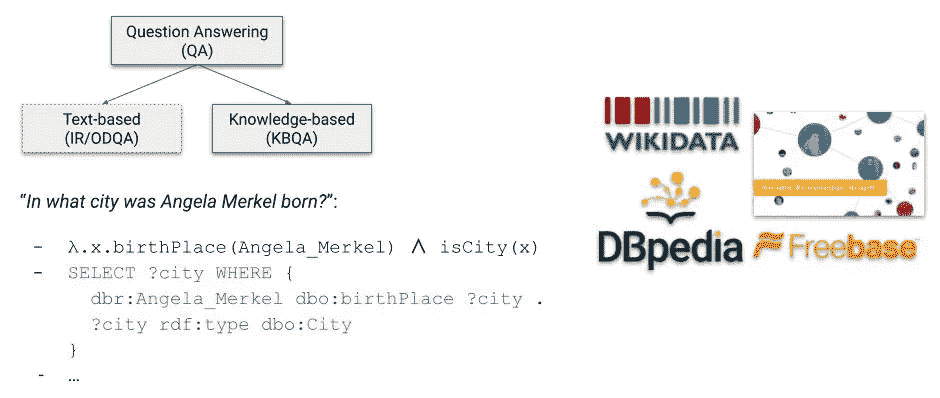
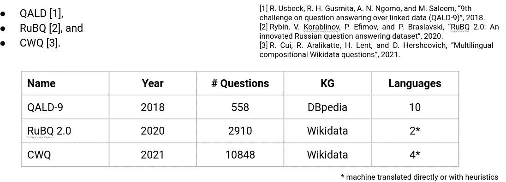

# 知识图问答的新基准——QALD-9-Plus

> 原文：<https://towardsdatascience.com/the-new-benchmark-for-question-answering-over-knowledge-graphs-qald-9-plus-da37b227c995>

## 以及基准旨在解决的多语言问题

# TLDR

对于不同的用户群(如语言、年龄)，以同样有效的方式与 web 应用程序交互的能力是“可访问性”概念中最重要的因素之一。这包括知识图问答(KGQA)系统，它通过自然语言接口提供对来自语义网的数据和知识的访问。在研究 KGQA 系统的多语言可访问性时，我和我的同事们发现了一些最紧迫的问题。其中之一是 KGQA 缺乏多语言基准。

在本文中，我们改进了 KGQA 最受欢迎的基准之一— [QALD-9](https://github.com/ag-sc/QALD/tree/master/9/data) ，将原始数据集的问题翻译成 8 种不同的语言(德语、法语、俄语、乌克兰语、白俄罗斯语、亚美尼亚语、巴什基尔语、立陶宛语)。最重要的一个方面是，翻译是由相应语言的母语使用者提供和验证的。据我们所知，其中五种语言——亚美尼亚语、乌克兰语、立陶宛语、巴什基尔语和白俄罗斯语——以前从未被 KGQA 系统考虑过。两种语言(巴什基尔语和白俄罗斯语)被联合国教科文组织(T4)认定为“濒危语言”。我们将新的扩展数据集命名为“[**”QALD-9-plus**](https://github.com/Perevalov/qald_9_plus)。数据集在[在线](https://github.com/Perevalov/qald_9_plus)可用。

# 知识图问答

[KGQA 系统](https://web.stanford.edu/~jurafsky/slp3/23.pdf)将自然语言问题转换成对特定知识图的查询，从而允许用户访问“知识”而不必学习查询语言(例如 [SPARQL](https://www.w3.org/TR/sparql11-query/) )。这是 KGQA 系统和基于文本的 QA 系统(在文献中也称为 [MRC、ODQA、基于 IR 的](https://web.stanford.edu/~jurafsky/slp3/23.pdf))之间的主要区别，基于非结构化数据工作。

基于知识图的问答系统--一个问题和一个查询的例子。右边是一些最著名的知识图表(图片由作者提供)。

知识图通常是基于[资源描述框架(RDF)](https://www.w3.org/TR/rdf11-concepts/) 创建的。RDF 中的数据被表示为“主-谓-宾”结构的三元组，例如，John-Is_Friend_Of-Mary，这就是为什么将它们可视化为图形是方便的。众所周知的 schema.org[也是基于 RDF 的，被许多网站用来标记他们的内容(事实上，是为了改善搜索结果)。万维网的这种结构是前面提到的语义网的基础，在语义网中，所有的资源都是结构化的并相互链接。因此，KGQA 系统是我们在万维网上结构化信息和知识世界的向导。](https://schema.org/)

知识图表的一个例子。来源:https://www.w3.org/TR/rdf11-primer/

# 基于知识图的问答系统中的多语言问题

*看似自然的通过谷歌获取信息的能力，对于那些不是被数亿人(如德语、俄语)而是被数百万人(如白俄罗斯语)甚至更少人(如巴什基尔语)使用的语言的使用者来说，根本不是真的*。通常，说“小语种”的人也能说主要语种。例如，说白俄罗斯语或巴什基尔语的人也会说俄语，这使得他们可以访问网络的第二大部分。但这并不适用于所有语言，和往常一样，一切都是相对的。说俄语的人只能理解 6.9%的万维网内容，而说英语的用户能理解 63.6%的内容。在这方面，引入了“数字语言鸿沟”这一术语。数字语言鸿沟这个术语是基于这样一个事实，即人们所说的语言会影响他们的网络使用体验和效率。

我们以英语、德语、白俄罗斯语和巴什基尔语为例，做了一个关于谷歌如何处理“大”和“小”语言的小实验。有人问了一个简单的问题:“唐纳德·特朗普多大了？”分别以每种语言。答案就像他们说的，杀了！在下图中，你可以看到谷歌如何成功地回答了用英语和德语提出的问题，以及它如何在白俄罗斯语和巴什基尔语中失败——这难道不是问题的指标吗？值得注意的是，当答案成功时，谷歌会以一种*结构化的形式*呈现出来，这就是发挥作用的[谷歌知识图](https://en.wikipedia.org/wiki/Google_Knowledge_Graph)，这也借助了【schema.org】的[标记。](https://schema.org/)

谷歌用英语、德语、白俄罗斯语和巴什基尔语工作的插图(图片由作者提供)。

# 别人是怎么处理这个问题的？

有一种误解认为，随着无监督、弱监督和半监督方法(如 word2vec 或 BERT)的出现，多语言问题已经解决(因为不需要大量的标记数据)。[然而，事实并非如此](https://thegradient.pub/the-benderrule-on-naming-the-languages-we-study-and-why-it-matters/)。虽然可以在不使用标记数据的情况下评估语言模型，但不可能评估更复杂的系统(例如 KGQA)。因此，拥有多种语言的结构化“黄金标准”数据(基准)仍然是一个紧迫的问题。

知识图上的问题回答仍然是应用科学的一个相当具体的领域，所以关于这个主题的论文发表的并不多。在写这篇文章的时候，KGQA 只有 3 个多语言基准。分别是 [QALD](https://github.com/ag-sc/QALD) 、 [RuBQ](https://github.com/vladislavneon/RuBQ) 和 [CWQ](https://arxiv.org/abs/2108.03509) (见下图)。

现有的 KGQA 多语言基准测试(图片由作者提供)。

以上所有的数据集都不是完美的。例如 QALD-9，虽然它有 10 种语言，但翻译质量，说得好听点，还有待提高。RuBQ 2.0 和 CWQ 使用自动机器翻译来获得译文，这当然是有局限性的。

# 我们做了什么？QALD-9-Plus 数据集

为了改善 KGQA 系统多语言可访问性的情况，我们决定完全更新 QALD-9 数据集，仅保留英文问题，并在这项工作中涉及众包平台([亚马逊机械土耳其](https://www.mturk.com/)、 [Yandex Toloka](https://toloka.ai/) )。此外，来自[开放数据科学社区](https://ods.ai/)的志愿者也参与了翻译过程。

翻译任务包括 2 个步骤:(1)一个母语者将英语翻译成他们的母语，以及(2)另一个母语者检查在先前步骤中获得的翻译选项。这两个步骤彼此独立地进行。

翻译和验证过程的一个例子。每个问题至少被翻译了 2 次(图片由作者提供)。

结果，我们获得了 8 种不同语言的译本:俄语、乌克兰语、立陶宛语、白俄罗斯语、巴什基尔语、亚美尼亚语、德语和法语。其中五种语言迄今为止从未出现在 KGQA 地区(乌克兰语、立陶宛语、白俄罗斯语、巴什基尔语、亚美尼亚语)，两种语言(白俄罗斯语、巴什基尔语)被联合国教科文组织认定为濒危语言。

除了翻译，我们还提高了基准的可用性。最初的 QALD-9 允许我们仅基于 [DBpedia](https://www.dbpedia.org/) 知识图来评估系统。在我们关于 QALD-9-Plus 的工作中，我们决定将基准转移到另一个知识图， [Wikidata](https://www.wikidata.org/wiki/Wikidata:Main_Page) 。这被证明是一项相当困难的任务，因为不同知识图之间的自动 SPARQL 查询转换器还不存在，所以我们必须手动完成这项任务。令人惊讶的是，由于不同的数据模型，DBpedia 和 Wikidata 上的查询可以如此不同(参见下面的代码)。

QALD-9-Plus 基准测试的最终特征及其结构示例以表格和代码片段的形式呈现在下面。

QALD-9-Plus 基准测试及其特点(图片由作者提供)。

# 代替一个结论

如果你一路读到这里，我会非常高兴！在本文的最后，我想分享一些与这项工作相关的有用链接，即:

*   [GitHub](https://github.com/Perevalov/qald_9_plus/)
*   ArXiv (同行评审，即将通过 IEEE 发布)
*   普华永道:[数据集](https://paperswithcode.com/dataset/qald-9-plus)，[论文](https://paperswithcode.com/paper/qald-9-plus-a-multilingual-dataset-for-1)
*   [演示录制](https://youtu.be/W1w7CJTV48c)
*   [幻灯片](https://drive.google.com/file/d/1cDphq4DeSiZr-WBvdwu34rcxQ0aP4q95/view?usp=sharing)
*   [谷歌 Colab](https://colab.research.google.com/drive/1eWsQoIaeT9_vii1v3PVU04Rms4EoyLAh?usp=sharing)

# 感谢

我要感谢这篇文章的合著者，即:Dennis Diefenbach 博士、Ricardo Usbeck 教授和 Andreas 博士。此外，我要感谢参与翻译数据集的所有贡献者，特别是:康斯坦丁·斯米尔诺夫、米哈伊尔·奥尔真诺夫斯基、安德烈·奥古尔佐夫、纳雷克·马洛扬、阿尔特姆·埃罗钦、米哈伊洛·内多代、阿利亚克塞·叶兹雷佐、安东·扎波洛斯基、阿图尔·佩什科夫、维塔利·利亚林、阿尔特姆·利亚利科夫、格莱布·斯基巴、弗拉季斯拉夫·多尔迪伊、波琳娜·福明尼克、蒂姆·施拉德、苏珊娜·博和安娜·施拉德。