# 标记数据的新工具速度提高了 10 倍

> 原文：<https://towardsdatascience.com/the-new-tool-to-label-data-10x-faster-d3c4f5e7b061>

## **使用 Datature 的 Intellibrush 进行高级高效的数据标记**

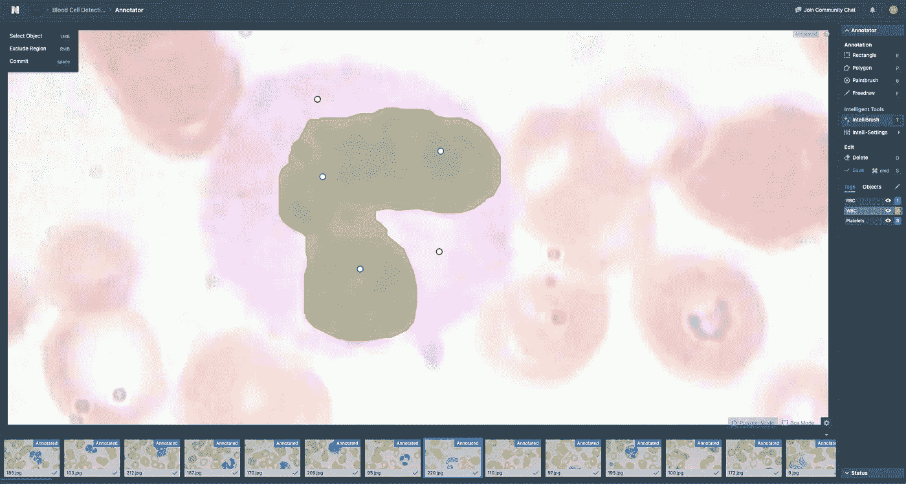

血细胞数据的智能画笔接口

历史上，计算机视觉任务严重依赖人类标注的数据。众所周知，只有在数据输入和标记也准确的情况下，机器学习才能产生准确的结果——无论计算机视觉模型多么花哨或先进，如果我们正在训练的数据集缺乏，都很难实现良好的性能。具体来说，计算机视觉需要大量*数据。然而，手动标记是一个耗时且容易出错的过程，尤其是对于对象检测等计算机视觉任务。*

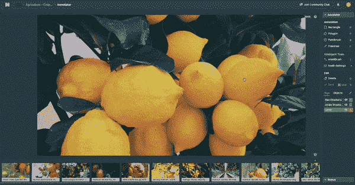

智能画笔在水果图像中的应用。作者 Gif。

对象检测是计算机视觉中最重要的任务之一——它指的是使用边界框对对象进行[检测和定位。对象检测通常涉及检测图像中的对象并将它们分类成不同的类别。这项任务对于安防、监控和汽车等许多应用非常重要。](https://www.v7labs.com/blog/what-is-computer-vision#h3)

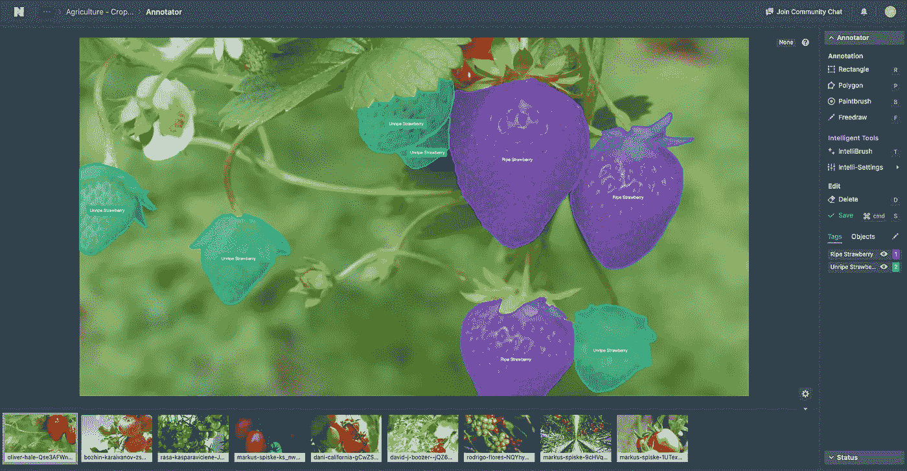

智能画笔被用来识别草莓。图片作者。

有许多不同的对象检测方法。最常见的方法是使用一组训练图像。这是向计算机显示一系列带有物体的图像，然后计算机能够学习识别这些物体。另一种流行的方法是使用深度学习方法。这是给计算机一个大的图像数据集，然后能够学习识别其中的对象。任何对象检测系统最重要的特征是它能够准确地识别图像中的对象，这意味着模型需要能够区分不同的对象，即使它们是同一类型的(即不同的狗品种，即使所有图像都显示狗)。

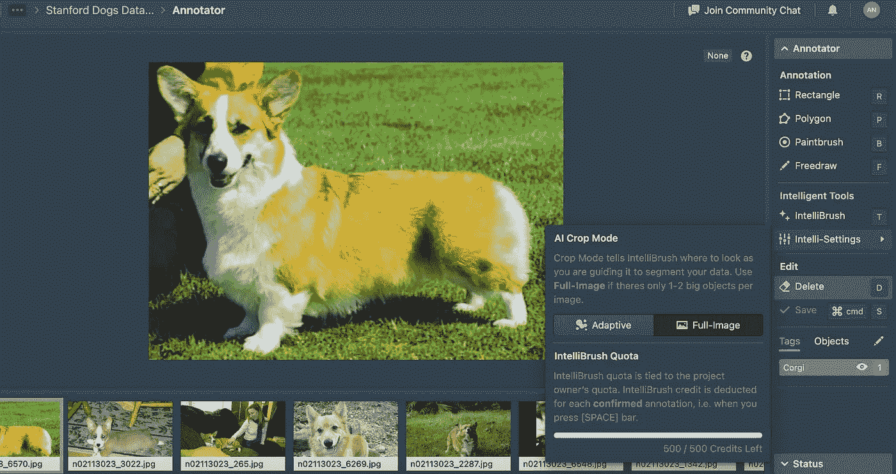

斯坦福狗数据集上使用的数据标注工具的图像

# 标记图像数据的现有限制

手动数据标记有许多限制，使其成为低效的过程。首先，它是劳动密集型和耗时的，这可能导致高成本。跨数据集创建一致的标签也很困难。具体来说，手动标记的一个主要限制是它可能花费的时间。对于大型数据集，手动标注所有数据可能非常耗时，并且需要为对象检测等任务正确绘制多边形。

第二，它容易出错，因为人工注释者在手动标记数据时可能会出错。此外，准确标注数据可能会很困难，尤其是在存在大量类或者数据非常复杂的情况下。手动数据标记通常是不一致的，因为不同的注释者可能对相同的数据进行不同的标记。特别是如果标注器是外包的，额外的培训对于精确标注可能是必要的——一些数据集需要领域专业知识，特别是在医学和制造业领域。

最后，外包标签会变得非常昂贵和低效。手动数据标注的扩展性不好，因为可以手动标注的数据量是有限的，而且如果研究人员需要雇人进行手动标注，成本也会非常高。

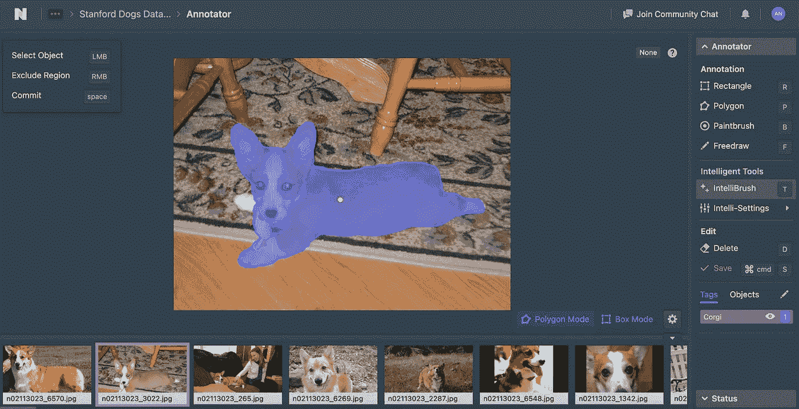

使用 Intellibrush 检测和标记一个 Corgi

# 人工智能辅助标签的兴起

ost 人工智能辅助标记工具的工作原理是首先从图像中提取特征，然后使用这些特征来训练机器学习模型。一旦模型被训练，它可以被用来标记新的图像。

从图像中提取特征有许多不同的方法，但一些最常用的方法包括使用卷积神经网络(CNN)或转移学习。CNN 是一种人工神经网络，旨在模拟人脑处理信息的方式，而迁移学习是一种机器学习方法，将从一项任务中获得的知识应用于另一项类似的任务。

CNN 和迁移学习都可以用来训练用于图像标记的机器学习模型。然而，细胞神经网络往往比迁移学习更准确，因为它们是专门为图像处理设计的。

有许多不同的人工智能辅助标注工具可用，每个工具的准确性将根据其训练的数据集而有所不同。然而，所有的 AI 辅助标记工具都可以用来比人类更准确地标记图像。

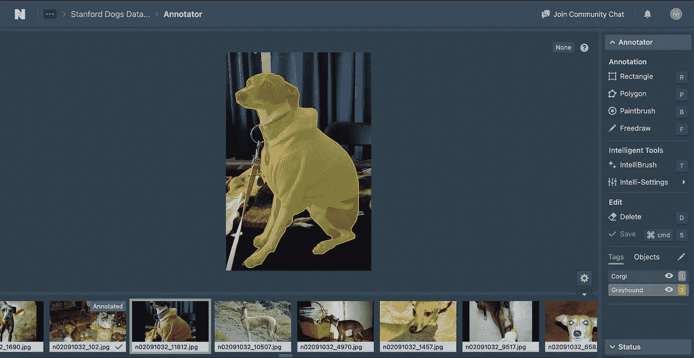

数据标注平台。这是 Intellibrush 正确注释灰狗的图像。

## 模型辅助标记

模型辅助标记是计算机视觉领域中相对较新的技术，近年来发展迅速。对模型辅助标记方法越来越感兴趣的部分原因是，这种方法可以在相对较少的人工干预下为数据集提供高度准确的标记，从而有可能解决我们之前提到的挑战，即效率和准确性。

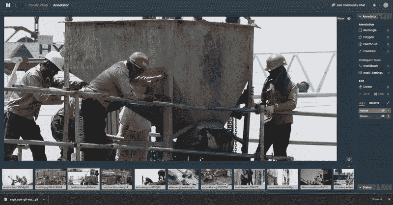

用于构造图像的智能画笔。作者 Gif。

如前所述，为计算机视觉目的注释数据集的传统方法通常是通过手动标记或外包。这一过程既耗时又昂贵，因为它需要熟练的工人仔细标记每一幅图像。尽管在计算机视觉和自然语言处理等领域有其他更有效的数据标记方法，如主动学习，但这些方法仍然非常需要数据。另一方面，模型辅助标注使用计算机模型来自动生成数据集的标签。模型辅助标记是一种计算机视觉方法，其中模型用于帮助识别图像中的对象。特别是，这种方法使用经过训练的人工智能模型来标记现有数据。

使用 MaskRCNN 初始 V2 进行对象检测的数据工作流示例

一种更受欢迎的模型辅助标记方法涉及在标记的数据集上训练一个大型神经网络——换句话说，通过使用深度学习来为新数据集生成高度准确的标签。深度学习模型并不是唯一可以用于模型辅助标记的模型类型。其他方法包括支持向量机和决策树。然而，深度学习模型通常被认为是性能最好的。

现在贴标只需手工贴标的一小部分时间和一小部分成本。模型辅助标记的广泛想法是，数据科学家将训练人工智能*与标记并行*——因此，当模型开始在数据中看到可概括的模式时，[模型本身将为研究人员建议标签](https://www.danrose.ai/blog/model-assisted-labelling-for-better-or-for-worse)。这可以通过为图像中的对象提供标签来完成，或者通过提供一组可以用于训练机器学习模型的训练数据来完成。因此，我们看到，模型辅助标记不仅可以用于提高对象检测任务的准确性，还可以加速标记图像的过程。

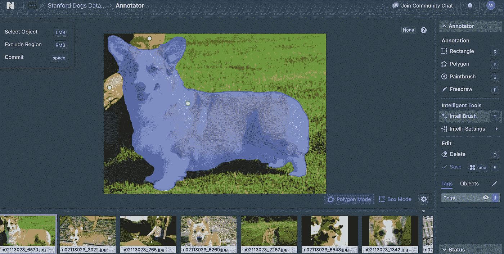

图片由作者提供。

然而，值得注意的是，模型辅助标注的准确性取决于所用数据的质量——早期的模型由于缺乏注释数据而不是非常准确，但这些 CV 模型的性能近年来迅速改善。CV 模型的性能改进可归因于强大 GPU 可用性的增加、新神经网络架构的开发以及对注释数据的更广泛访问。

## 人工智能辅助标记

人工智能辅助标记在计算机视觉领域的兴起已经有一段时间了。随着深度学习的日益普及和可用数据量的不断增长，训练模型自动标记图像的能力变得越来越实用。这项技术有许多不同的应用，包括为训练数据集提供标签，帮助识别图像中的对象，甚至自动生成图像的描述。

人工智能辅助标签是一个为图像添加标签以帮助识别图像中的对象的过程——就像模型辅助标签一样，这可以由人手动完成，也可以由计算机自动完成。人工智能辅助标记的一个关键好处是，它可以帮助减少手动标记数据集所需的时间和资源。这对于大型数据集尤其有价值，因为手动标注会花费大量时间。此外，它还可以帮助提高标签的准确性，因为机器学习模型经常可以识别人类可能看不到的模式。

作者图片

有许多不同的方式可以将人工智能辅助标签用于计算机视觉。一种常见的方法是使用为类似任务设计的预训练模型。例如，有几种不同的图像分类模型可用于标记对象的图像。另一种方法是在特定数据集上从头开始训练模型。这可能更耗时，但通常可以提供更准确的结果，尤其是在给定特定于上下文的数据集的情况下。

与模型辅助标签相比，人工智能辅助标签不需要预先训练——特别是使用像 [DEXTR](https://hasty.ai/content-hub/userdocs/annotation-environment/manual-and-semi-automated-tools/dextr) 这样的模型，它通过在你想要标记的商品边缘放置标记来工作。

无论使用哪种方法，人工智能辅助标注的目标都是减少手动标注数据集所需的时间和资源。随着数据集相对大小的持续增长，以及对更精确注释的需求的增加，这种方法变得越来越重要。

# IntelliBrush:使用支持人工智能的注释器

[IntelliBrush](https://www.datature.io/intellibrush) 是 Datature 的人工智能引导的图像标记工具，使用户能够对复杂图像进行像素精确的注释。它易于使用、灵活，并且不需要对模型进行任何预先训练。作为一个刚刚开始涉足 CV 领域的人，我非常喜欢使用 IntelliBrush 来帮助我进行图像标记和对象检测。

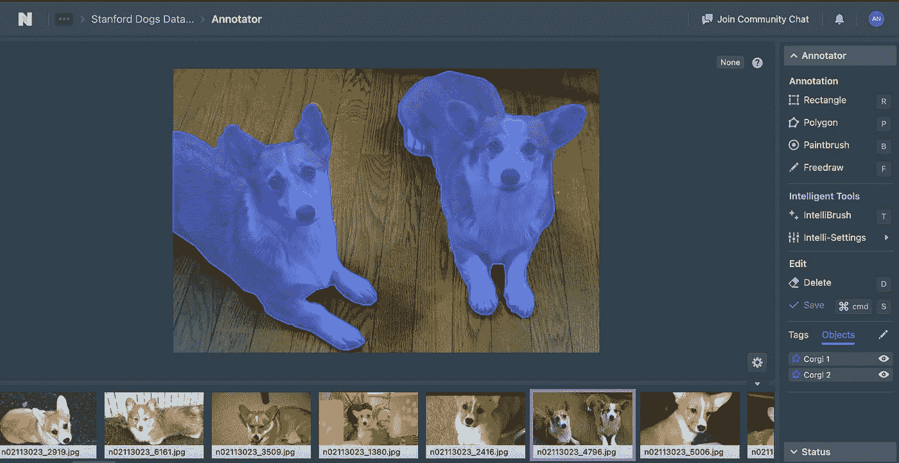

IntelliBrush Nexus 平台，允许用户定义标签和对象

首先，在这里注册你自己的数据账户[，然后你也可以开始使用智能刷。上传数据集和任何已经注释的标签后，选择右边面板上的 IntelliBrush 工具或按键盘上的`T`。](https://www.datature.io/intellibrush#sign-up)

作者图片

您还可以根据使用 Intelli-Settings 标记的图像类型，指定所需的粒度级别。两种常见的设置是`Adaptive`和`Full-Image`。如果您的图像在一帧中有多个感兴趣的对象，前者更适合，而如果您的图像有 1-2 个主要感兴趣的对象，则推荐后者(这是我更常用的方法)。

# TLDR；为什么公司应该利用支持人工智能的注释器

目标检测是计算机视觉中的一项重要任务，并被用于多种应用中。重要的是选择合适的方法用于对象检测，并使用高质量的训练数据。目标检测系统还需要能够实时运行。

手动标记和外包标记可能不是当前标记数据的最佳方式，原因有几个。手动贴标既耗时又繁琐。此外，扩展这种贴标过程是困难的，并且通常与高成本相关，或者需要专业知识。因为手动贴标依赖于人工干预和专业知识，它也经常受到人为错误和不一致的影响。

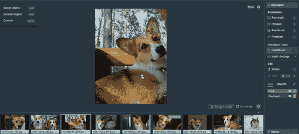

作者图片

有许多不同的因素会影响物体检测系统的精度。最重要的因素是训练数据的质量。如果训练数据质量差，那么系统将不能学习准确地识别图像中的对象。另一个重要因素是用于对象检测的算法。有许多不同的算法可以使用，每种算法都有自己的优点和缺点。选择一个非常适合手头任务的算法是很重要的。最后，目标检测系统需要能够实时运行。这意味着它需要能够非常快速地处理图像，并准确地识别其中的对象。

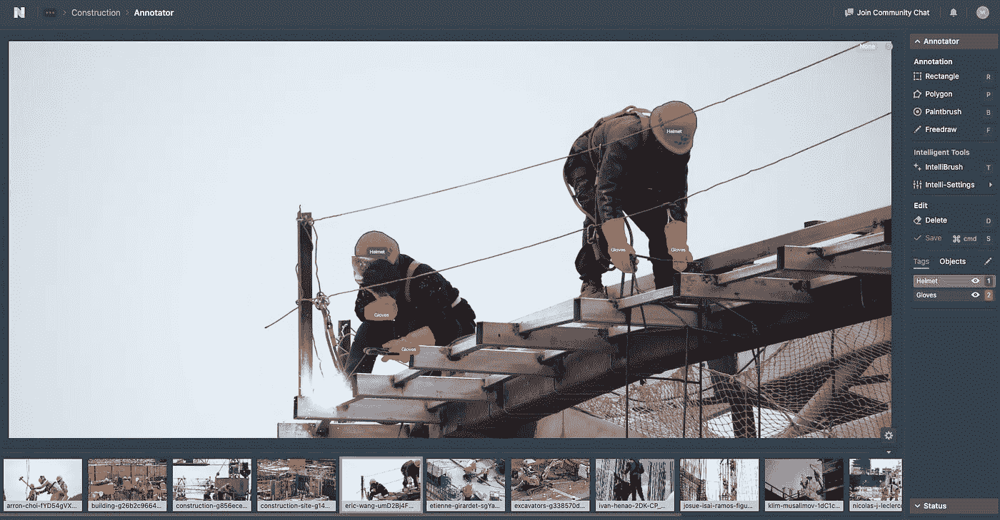

用于构造图像的智能画笔。图片作者。

IntelliBrush 解决了这些挑战，只需几次点击即可创建像素级的数据标签，高效、准确且使用直观。Datature 的 IntelliBrush 平台有几个主要优点，让我觉得非常好用:

1.  它开箱即用。我不需要做太多的设置，也没有太多的平台需要我在网站上添加我的个人信息。令人惊讶的是，也不需要任何编码——通常，我在我的 CV 项目中使用了很多代码，所以能够使用一个平台来获得同样高效和准确的结果，而且事半功倍，这令人耳目一新。
2.  响应注释。我喜欢 IntelliBrush 的一个特性是，用户界面允许我在同一个窗口中平移、缩放，甚至隐藏不需要的类——对于传统代码来说，这些事情自然会更具挑战性。
3.  快速直观。不像其他平台，我在使用之前必须花很多时间学习，IntelliBrush 允许我通过几次点击来选择和取消选择课程——不需要严格的培训。
4.  可调和可配置。在标记图像时，我还能够指定不同的粒度级别——无论这些图像是柯基犬图像、食物图像还是任何其他数据集。,
5.  适应性学习。使用 IntelliBrush 越多，它就越智能，越精确。
6.  多对象标记。如上面的一些例子所示，我能够准确有效地在一幅图像中标记多个对象。
7.  标签过滤。通过过滤我感兴趣的标签来清理注释也是非常容易的——这允许我只在特定的类、标签或标签上训练我的神经网络。

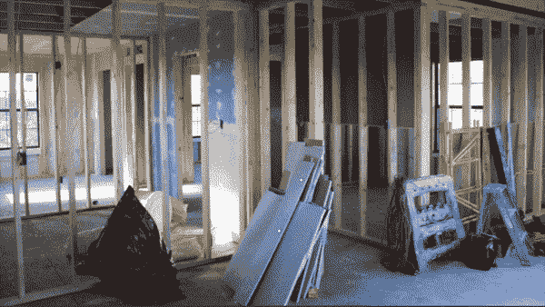

作者 Gif

> 开始使用 [IntelliBrush](https://www.datature.io/intellibrush#sign-up) 并在这里注册自己的账户[。](https://www.datature.io/intellibrush#sign-up)
> 
> 在这里购买我的书[，请务必通过](https://www.amazon.com/Data-Resource-Emerging-Countries-Landscape/dp/1641372524)[电子邮件](mailto:at2507@nyu.edu)向本文报告任何错误或建议。
> 
> *通过*[*LinkedIn*](https://www.linkedin.com/in/angelavteng/)*或*[*Twitter*](https://twitter.com/ambervteng)*与我联系。*
> 
> *跟我上* [*中*](https://medium.com/@angelamarieteng) *。*

# 参考资料:

*   [https://hacker noon . com/top-20-image-datasets-for-machine-learning-and-computer-vision-rq3 w3 zxo](https://hackernoon.com/top-20-image-datasets-for-machine-learning-and-computer-vision-rq3w3zxo)
*   [http://vision.stanford.edu/aditya86/ImageNetDogs/](http://vision.stanford.edu/aditya86/ImageNetDogs/?ref=hackernoon.com)
*   [https://data gen . tech/guides/image-annotation/image-labeling/](https://datagen.tech/guides/image-annotation/image-labeling/)
*   [https://www . IBM . com/ph-en/topics/computer-vision #:~:text = Resources-，什么是%20computer%20vision%3F，推荐% 20 based % 20 on % 20 that % 20 information](https://www.ibm.com/ph-en/topics/computer-vision#:~:text=Resources-,What%20is%20computer%20vision%3F,recommendations%20based%20on%20that%20information)。
*   [https://docs.labelbox.com/docs/model-assisted-labeling](https://docs.labelbox.com/docs/model-assisted-labeling)
*   [https://docs . data ture . io/nexus/annotations/annotating-images](https://docs.datature.io/nexus/annotations/annotating-images)
*   [https://www . danrose . ai/blog/model-assisted-labeling-for-good or-words](https://www.danrose.ai/blog/model-assisted-labelling-for-better-or-for-worse)
*   [https://www . superb-ai . com/blog/a-primer-on-data-labeling-approximates-to-building-real-world-machine-learning-applications](https://www.superb-ai.com/blog/a-primer-on-data-labeling-approaches-to-building-real-world-machine-learning-applications)
*   [https://courses . cs . Washington . edu/courses/csep 576/20sp/lectures/8 _ object _ detection . pdf](https://courses.cs.washington.edu/courses/csep576/20sp/lectures/8_object_detection.pdf)
*   [https://www . ka ggle . com/datasets/paultimothymooney/blood-cells](https://www.kaggle.com/datasets/paultimothymooney/blood-cells)
*   [https://cvlsegmentation.github.io/dextr/](https://cvlsegmentation.github.io/dextr/)
*   注意:对于这个演示，我们使用了[血细胞图像数据集](https://www.kaggle.com/datasets/paultimothymooney/blood-cells)，可以在 [Kaggle](https://www.kaggle.com/datasets/paultimothymooney/blood-cells) 上免费获得。该数据集包含 12，500 个血细胞的增强图像，并附有用于注释的细胞类型标签。