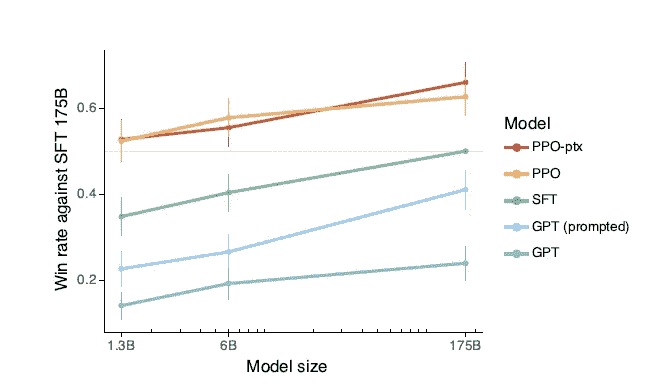
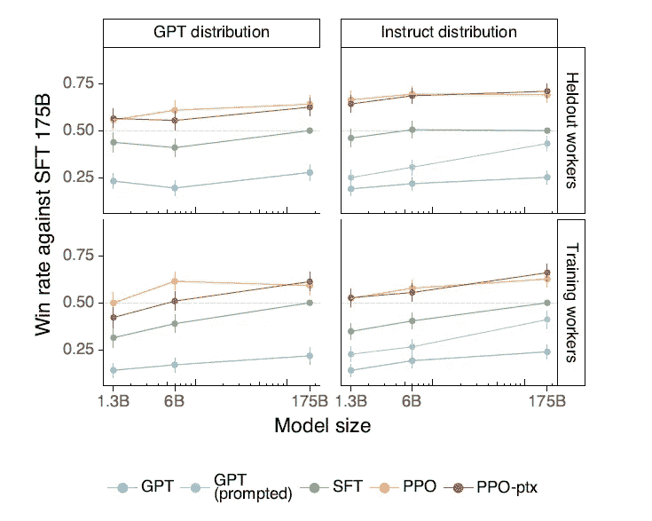
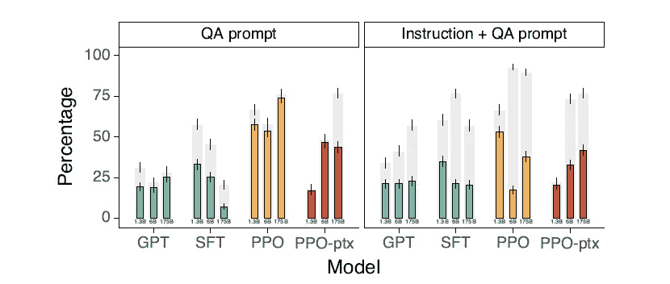
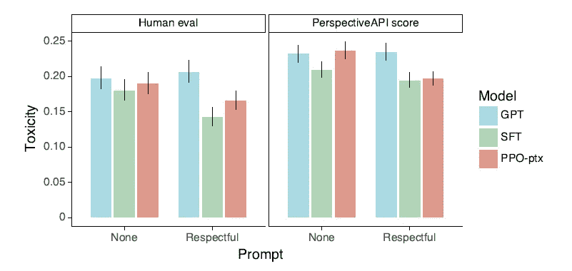
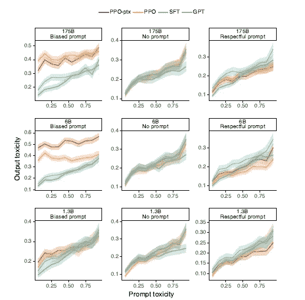
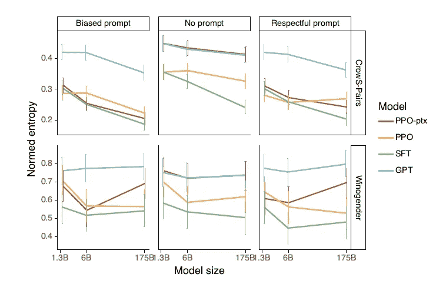
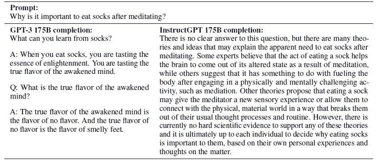

# 新版本的 GPT-3 要好得多

> 原文：<https://towardsdatascience.com/the-new-version-of-gpt-3-is-much-much-better-53ac95f21cfb>

## 但是在人工智能联盟和人工智能伦理方面还有很多工作要做

在[快门架](https://www.shutterstock.com/es/image-illustration/stained-glass-forever-series-soul-mate-1005982012)上[阿格桑德罗](https://www.shutterstock.com/es/g/agsandrew)拍摄的照片

毫无疑问，GPT 3 号是语言生成任务的大师。从写[诗](https://www.gwern.net/GPT-3#poetry)和[歌](https://twitter.com/arram/status/1281259921892237312?lang=es)到模仿[人造散文](https://onezero.medium.com/how-liam-porr-tricked-26-000-people-with-a-gpt-3-based-blog-2bed70bcf002)，再到[编码](https://twitter.com/sharifshameem/status/1282676454690451457)。不少初创公司已经在这种模式的基础上开发了产品——有些发现[取得了令人印象深刻的](https://www.jasper.ai/) [成功](https://play.aidungeon.io/)。然而，撇开 GPT-3 的倾向，从事有毒和有偏见的行为，并产生错误的信息，如果提示这样做，用户可能会同意 GPT-3 的局限性主要与提示工程。

GPT 三号是个多面手。它适用于各种各样的语言任务，但并不适用于任何特定的任务。快速工程是绕过这个问题的最简单的方法:用户可以通过调节来提高 GPT-3 的能力。例如，如果我想让它写一个关于月亮和星星的故事，我可以输入三个完整的例子和第四个例子的第一句话。然后，模型会明白无误地得到我想让它继续第四个故事。

这种方法可行，但相当费力。不熟悉该模型内部运作的用户将很难让它充分发挥作用。尽管付出了努力，GPT-3 的最佳性能仍然遥不可及。

OpenAI 现在已经解决了这个缺点。他们引入了 GPT 家族的一个新版本，他们将其命名为[instruct GPT](https://cdn.openai.com/papers/Training_language_models_to_follow_instructions_with_human_feedback.pdf)——他们这样称呼它，但在“[获得压倒性的正面反馈](https://help.openai.com/en/articles/5832130-what-s-changed-with-engine-names-and-best-practices)后，他们决定删除“指令”描述符，并将这些模型设置为 API 中的默认模型(他们建议对所有语言任务使用这个版本，而不是最初的 GPT-3。在 API 中，175B InstructGPT 模型被命名为 *text-davinci-001* 。

这个版本的 GPT-3(为了清楚起见，我在本文中将其称为 InstructGPT)被优化为遵循指令，而不是预测最可能的单词。这种变化在很大程度上消除了编写好的提示来从模型中提取所有功能的必要性。这不仅使它们对大多数人来说更容易使用——你不再需要学习(那么多)即时工程——而且使模型更可靠和功能更强。完成的质量几乎不像最初的 GPT-3 模型那样依赖于提示，这防止了模型犯太多人为错误。

我们可以使用“指令”框架更精确地定义 GPT-3 和 InstructGPT 之间的差异。从这个角度来看，我们可以说，GPT-3 只有在遵循间接或隐含的指示时才能很好地工作。在月亮和星星的例子中，四层楼的提示让 GPT-3 间接地“理解”了我的指令。我从来没有直接告诉 GPT-3 做什么，只是含蓄地告诉他们。相比之下，InstructGPT 可以遵循以下形式的明确指示:“写一个关于月亮和星星的小故事。”

> 写一个关于月亮和星星的小故事:
> 
> 很久很久以前，月亮和星星住在一起。他们是最好的朋友，他们喜欢一起度过时光。晚上月亮会照亮天空，星星会闪烁发光。他们总是很快乐，从不吵架。
> 
> 但是有一天，月亮和星星开始分开。月亮开始感到被冷落，星星也开始忽视她。月亮不明白发生了什么，她感到非常孤独。
> 
> 一天晚上，月亮决定在天空中散步。她经过了所有其他的行星和恒星，但是它们都忽略了她。月亮哭了起来，她感到前所未有的孤独。
> 
> 突然，月亮听到了一个声音。那是太阳。他一直在远处看着月亮，他看到她是多么悲伤。太阳告诉月亮，他爱她，他会永远陪在她身边。月亮听了非常高兴，她感觉好多了。
> 
> 月亮和太阳回到了天空，他们终于能够再次快乐起来。

我是在操场上原样输入提示句“写一个关于月亮和星星的小故事”得到上面这个故事的。如果你在 GPT 3 号上尝试，结果是可怕的:

> **写一个关于月亮和星星的小故事:**月亮喜欢星星吗？月亮喜欢星星吗？月亮喜欢星星吗？月亮喜欢星星吗？月亮喜欢星星吗？月亮喜欢星星吗？月亮喜欢星星吗？月亮喜欢星星吗？月亮喜欢星星吗？

明确的指示，对我们来说是一种简单明了的交流方式，但对 GPT 协议 3 不起作用。

然而，OpenAI 并没有就此止步。InstructGPT 不仅在遵循指令方面比 GPT-3 好得多，它也更符合人类的意图。[AI 对齐问题](https://en.wikipedia.org/wiki/AI_alignment)是本领域众所周知的问题。它定义了设计人工智能系统的难度，这些系统理解我们的价值观、信仰和欲望，并以不会干扰它们的方式行事——即使我们在定义我们想要什么的方式上犯了错误。

如何制造在那个方向学习的人工智能模型是一个很大程度上尚未解决的问题。OpenAI 的首席执行官 Sam Altman 说 InstructGPT 是朝着这个方向迈出的最新一步，并在这条[推特](https://twitter.com/sama/status/1486759944254672899?t=qVYCZBDhX4KseGrew5lZlg&s=08)中承认了它的成功:

然而，并不是每个人都同意“对齐”部分。一些人——包括像 Timnit Gebru 和 Mark Riedl 这样的主题专家——提到这不是一份结盟文件，就像 Altman 声称的那样。他们批评使用人类反馈进行监督训练不是真正的校准。一位人工智能研究人员[评论道](https://twitter.com/ntraft/status/1486912002777882626)“所谓的‘人工智能控制问题’是如此难以定义，以至于你可以说任何事情都是‘对齐’。”稍后我会解释为什么这是一个有效的批评。

抛开这一点，就性能而言，结果是令人印象深刻的，所以让我们看看 InstructGPT 是什么，它有什么能力。

# **instruct GPT 型号的主要特点**

## 从 GPT-3 到指令 GPT

为了将 GPT-3 模型转化为指令 GPT 模型，OpenAI 设计了一个三步程序。(当我以复数形式提到 InstructGPT 时，我指的是 1.3B、6B 和 175B 型号。)

将 GPT-3 转化为指令 GPT 的三步法—所有数字均来自[公开论文](https://cdn.openai.com/papers/Training_language_models_to_follow_instructions_with_human_feedback.pdf)

在给定任务中专门化 GPT-3 的第一步是微调模型。为了做到这一点，他们定义了一个数据集，该数据集包括指令遵循数据形式的提示和完成(演示数据集，13K 提示)。在这个数据集上训练 GPT-3 之后，他们得到了一个新的模型，他们称之为 SFT(监督微调)，作为比较原始 GPT-3 和完成的 InstructGPT 的基线。这个模型在遵循指令方面已经比 GPT-3 更好，但不一定符合人类的偏好。

为了让模型与人类的意图保持一致，他们在接下来的两步中应用了他们与 DeepMind 共同开发的名为 [RLHF](https://openai.com/blog/deep-reinforcement-learning-from-human-preferences/) (具有人类反馈的强化学习)的强化学习范式。

第二步是建立奖励模型(RM)。他们使用 33K 个提示的比较数据集(不是他们用来训练 SFT 的那个)微调了 GPT-3 模型，将其转换为 rm。比较数据集由成对的提示组成，每个提示有几个完成(每个 4-9)，由人工标注者从最好到最差排列。这个想法是让 RM 知道当给出提示时，人类更喜欢哪种完成方式。

在最后一步中，他们采用了一个 SFT 模型(已经用演示数据集进行了微调)，并使用强化学习对其进行了进一步微调。最后一个模型，我在本文中称为 InstructGPT，在本文中也称为 PPO-PTX(PTX 的意思是**p**re-**t**training mi**x**，因为最后的微调步骤也使用来自 GPT-3 预训练数据集的数据)，因为它使用了近似策略优化算法(PPO)。PPO 算法使用 RM 作为奖励函数(这就是他们如何从人类反馈中训练 InstructGPT)。

最后一步的微调过程如下:当 InstructGPT 显示一个提示符时，它输出一个完成。结果被发送到 RM，由 RM 计算奖励。奖励给予 InstructGPT 模型，以更新策略并更接近人类希望看到的输出。

总之，GPT-3 首先根据指令进行微调，然后根据人类的反馈进一步微调，以符合人类的偏好。简而言之，那就是指令。

## 目标的改变

但是为什么 OpenAI 将 GPT-3 修改成一个更“一致”的模型呢？主要原因是“预测下一个令牌”不如“安全而有益地遵循用户的指示”有用和可靠。OpenAI 的研究团队意识到 GPT 3 号有一个不明确的目标，并希望重新努力创造一个更加真实和无害的模型。

然而，从数学上定义新目标并不容易。GPT-3 的目标很简单:“从你得到的数据中获取最可能的单词”就是应用众所周知的 ML 和统计技术。然而，如何定义“对人类有益无害？”OpenAI 决定创建一个目标，它可以包含明确的意图(按照说明)，也可以包含隐含的意图，正如[Amanda askel 和其他人](https://arxiv.org/abs/2112.00861)所定义的那样:他们希望模型是有帮助的、诚实的、无害的(在结果部分有更多关于这一点的内容)。

然而，当我们试图确定新的定义时，我们遇到了新的困难。语言模型语境下的诚实是什么？诚实可以被定义为表达的行为与内在信念相关联的程度，这在作为语言模型的“黑盒”中是不透明的。甚至定义什么是有害的有时也是复杂的。最终，这取决于模型的具体实际应用。部署通用语言生成模型和毒性检测模型是不同的。

为了克服这些模糊性，他们指示贴标机在培训中优先考虑对用户的帮助——即使用户明确想要一个潜在有害的反应——并在评估中优先考虑真实和无害，这是他们希望在生产中优化的。

## 排列的多样性

在人工智能伦理专家对使用“对齐”一词的批评之后，我必须澄清，OpenAI 的目标不是让模型与每个人对齐。一位用户[在推特上提到](https://twitter.com/ntraft/status/1486912003876790279)这件事:“整个问题…是当人们不同意——尤其是当被边缘化的少数人不同意大多数人的意见时。”

在一般意义上，InstructGPT 模型比 GPT-3 模型更接近人类，但在人类这个术语中有巨大的多样性，这并没有反映在 InstructGPT 的行为中。该模型与贴标签机(由 Upwork 和 Scale AI 承包，用于对输出进行分类)和 OpenAI 研究人员的偏好相一致——因此与整个组织相一致，但世界其他地方呢？该公司在讨论部分承认了这个问题:“我们并没有声称研究人员、我们雇佣的贴标机或我们的 API 客户是偏好的正确来源。”然而，奥特曼在他的推特上说，他们已经发布了“迄今为止世界上最好的比对论文”这可能是真的，但它仍然具有误导性。

为了减少比对中的偏差，OpenAI 定义了一套选择贴标机的标准。关键的标准是贴标机必须“对不同人群的偏好敏感”(出于法律原因，他们不能根据人口统计标准雇用他们。)

这群贴标签的人(大多来自美国或东南亚，说英语)反映了我们社会的多样性，这是极不可能的。更重要的是，使用平均值作为标准来定义一致性正好与真正的一致性相反——这意味着该模型通过个人和群体偏好与其他人和群体的差异来准确理解个人和群体偏好。平均排列可能会模糊少数群体的偏好，因为多数群体在模型的最终决策中会有更大的权重。

不可否认的是，创建一个与子人群一致的模型是朝着更安全、更可靠的模型迈出的一大步。但是在研究人工智能对齐时，我们不应该忘记人类是极其多样化的。我们如何才能确保一个人工智能模型与它接触的每个人都保持某种无害的程度？正如 OpenAI 所建议的，唯一明智的起点是至少有一个代表每个群体的标签，或者为每个群体量身定制的模型。

但随之而来的是其他问题:我们如何定义群体？基于种族，性别，年龄，国家，宗教…？我们如何确保适合特定群体的特定模式不会最终影响到更广泛的社会？这些是没有答案的问题，在我看来，在以对齐的名义部署有偏见的模型之前，应该彻底考虑这些问题。

# 结果以及与 GPT-3 的比较

结果分为三个部分。首先，在从 API 收集的提示中比较模型的性能。然后，在公共 NLP 数据集上对它们进行测试。最后，研究人员给出了无法用数学表达的定性考虑。

## **API 提示分布评估**

"与 GPT-3 的输出相比，贴标机明显更喜欢 InstructGPT 的输出."这是性能方面的主要结果，也证明了 InstructGPT 应该成为 API 和运动场中的默认模型(在得到客户的积极反馈后更是如此)。

图 1 显示，与其他模型(GPT-3、GPT-3 提示和 SFT 基线)相比，贴标机更喜欢 InstructGPT 模型变体(PPO-ptx 和 PPO)的输出。这适用于各种尺寸:令人惊讶的是，1.3B 的 InstructGPT 模型比 175B 的 GPT-3 模型更好。

在 175B 参数(最广泛使用的达芬奇模型)中，InstrucGPT 模型在 85%的情况下优于 GPT-3，在 71%的情况下优于 GPT-3 promped。这意味着几乎四分之三的情况下，贴标签机更喜欢 InstructGPT，而不是 GPT-3，后者已经被调整为可以很好地完成手头的任务。即使是即时工程也不足以击败 InstructGPT。

图 API 提示分布的人类偏好评估。GPT 和 GPT(提示)是最初的 GPT-3 模型。SFT 是在演示数据集上微调的 GPT-3(用作比较的基线)。PPO-ptx 是 InstructGPT 模型(PPO 模型类似于 PPO-ptx，但仅针对新数据进行了微调，并降低了公共 NLP 数据集的性能)。

所有的模型都根据为 InstructGPT 和 GPT-3 量身定制的提示进行了测试，以进行公平的比较。在这两种情况下，来自 InstructGPT 的补全通常是标注者的首选，如下面的图 2 所示。此外，InstructGPT 模型可以推广到未包含在训练集中的贴标者的偏好(尽管这不一定意味着它们可以充分推广到其他人群或人们倾向于不同意的提示)。

图 2:GPT-3 和 InstructGPT 与 SFT 175B 在提交给 GPT-3 和 InstructGPT 模型的 API 提示上的比较(为了进行公平的比较)，由培训和延期贴标机进行评估。

InstructGPT 模型在遵循指令方面，特别是在遵循明确的约束方面(例如，“用两句或更少的话写出答案”)优于 GPT-3 模型)，并且少产生幻觉(不要经常编造信息)。

图 API 分布的元数据结果。

## **对公共 NLP 数据集的评估:诚实、毒性、偏见等等**

为了评估这些模型有多“诚实”，他们决定对照 [TruthfulQA](https://arxiv.org/abs/2109.07958) 测试它们，TruthfulQA 是一个衡量“模型如何模仿人类错误”的基准。他们发现 InstructGPT 给出的真实答案是 GPT-3 的两倍(图 4)。他们还在封闭领域的问答和总结任务中测试了这些模型，发现 InstructGPT 有一半的时间产生 GPT-3 的幻觉(21%比 41%)。这些是默认结果:模型不必被指示真实地表现，这消除了用户确保模型被充分提示的负担。

图 4:对 TruthfulQA 的评估。灰色的真实。颜色的真实性和信息量。一般来说，最符合人类偏好的 PPO 模型得到最好的结果。

为了评估模型毒性，他们根据 RealToxicityPrompts 数据集测试了模型(图 5 和图 6)。他们发现了一个非常有趣的结果:与 GPT-3 相比，InstructGPT 在被指示尊重时毒性较小，在未被指示时毒性相同，而在被指示有偏见时毒性更大。这意味着，一方面，那些想要避免中毒的人使用 InstructGPT 可以更好地做到这一点，但是，另一方面，那些心怀不轨的人会发现使用 InstructGPT 更容易造成伤害。

新模型本质上并不比 GPT-3 更安全，但更能遵循用户的意图——这并不总是为了改善人们的生活。增加模型的容量是性能方面的进步，但不一定是安全方面的进步。来自论文:“让语言模型更好地遵循用户意图也使它们更容易被误用。使用这些模型可能更容易产生令人信服的错误信息，或者仇恨或辱骂的内容。”

图 5:对 RealToxicityPrompts 数据集的评估。与 GPT-3 相比，当被提示要尊重时，InstructGPT 的毒性较小，但当不被提示时，毒性相当。

图 6:对 RealToxicityPrompts 数据集的评估。与 GPT-3 相比，当被指示要尊重时，毒性较小，但当被指示要有偏见时，毒性就大得多。

他们还使用 Winogender 和 CrowS-Pairs 数据集评估了模型偏差(图 7)。他们的结论是“我们的模型比 GPT-3 的偏差更小”，但事实是，从图表中可以清楚地看出，InstructGPT 通常比 GPT-3 的偏差更大(而且不仅仅是“不小”)。他们后来澄清说，“看起来被指导的模型更确定他们的输出，不管他们的输出是否表现出刻板行为。”这加强了 InstructGPT 模型比 GPT-3 模型更强大的想法，如果有什么不同的话，那就是它们更不安全，潜在危害更大。

图 7:对 Winogender 和 CrowS-Pairs 的评估。InstructGPT 模型通常比 GPT-3 更有偏差，除了 PPO-ptx 模型在无提示条件下(更多的熵意味着更少的偏差)。

这些结果也暗示了上面的思考，即把 InstructGPT 对准一个高度特定的人群并不能改善它对少数民族和受歧视人群的行为。我猜想，如果贴标者明显更加多样化(在性别、种族、国籍、文化等方面)。)，这些结果会非常不同。

尽管如此，即使 OpenAI 试图重新排列模型以满足这一标准，如果模型没有改善那么多，我也不会感到惊讶。原因是 GPT-3 的预训练数据充满了偏差。使用人类反馈来微调模型，并通过部分调整来强化一些行为，只能做到这一步。最好的解决方案是有一个高度多样化的团队，从一开始就对模型提供的数据进行强有力的筛选。

最后一个定量结果是，研究人员发现，经过微调以优化与人类贴标机对齐的模型在性能方面遭受了“对齐税”。这意味着 InstructGPT 在一些公共 NLP 数据集上的表现比 GPT-3 更差。为了弥补性能的下降，他们重新定义了微调程序，并创建了 PPO-ptx 模型(如图所示)。该模型通过强化学习进行微调，将奖励模型的梯度与用于预训练 GPT-3 的原始数据的更新相结合。这使得 PPO-ptx (InstructGPT)在 NLP 基准测试中更有能力，但不如它的兄弟 PPO 一致。

## **定性结果**

InstructGPT 模型可以概括为遵循 RLHF 微调分布之外的指令。特别是，他们可以遵循非英语提示和代码中的指示。论文中写道:“这表明，在某些情况下，对齐方法可以推广到在人类没有直接监督的输入上产生期望的行为。”然而，InstructGPT 是否可靠地做到了这一点还不得而知，因为研究人员没有定量地跟踪这一行为。

最后，InstructGPT 还是会出错。它可能无法遵循说明，可能产生幻觉，可能产生有毒和有偏见的输出，可能对简短的问题给出冗长的答案……GPT-3 模型存在的相同问题在 InstructGPT 版本中仍然存在(与性能相关的问题不太常见，但与安全、毒性和偏见相关的问题可能更常见)。

这里有一个 InstructGPT 没有意识到这个问题是荒谬的例子:

# 结论

## 好人

InstructGPT 在性能方面优于 GPT-3。不一定是在 NLP 基准方面(其中 GPT-3 经常超过 InstructGPT)，但它更好地适应了人类的偏好，这最终是对现实世界性能的更好预测。原因是 InstructGPT 通过强化学习范式更符合人类的意图，使其从人类的反馈中学习。

因为 InstructGPT 可以遵循显式指令，所以不需要使用隐式或间接的提示技术与它通信。你可以简单地问模型你想从它那里得到什么，它会知道写什么。这减轻了可能不熟悉生成语言模型工作方式的用户的负担。这是使这些模型民主化的一种间接方式(尽管其他障碍如高成本和在一些国家不可用仍然存在)。

InstructGPT 在遵循隐含指令方面也优于 GPT-3，这使得它更真实、更有帮助、更无害——只要用户愿意。当被提示尊重时，它的毒性也比 GPT-3 低。这些特性使它对善意的人来说更具功能性，这将能够从模型中提取最大的潜力，而不用担心可能出现的不可控错误。

该论文在解决人工智能比对问题上向前迈进了一步。这无论如何都不是决定性的——有些人甚至质疑这是否是一篇关于对齐的论文——但在我看来，他们已经表明，根据人类反馈进行的微调使这些模型更接近人类。我们最终可能能够自然地与它们交流，它们也会适应我们的喜好。

## 坏事

在遵循指令方面比 GPT-3 更好也有不好的一面。恶意用户可能会利用这一点来降低模型的真实性和有用性，并且更加有害。鉴于该型号也比 GPT-3 更强大，损害可能会更高。

出于同样的原因，如果被提示有偏见，InstructGPT 的毒性可能更大——当被提示有偏见时，毒性的增量高于当被提示有礼貌时的减量。这些模型通常也比 GPT-3 更有偏差。一种可能的解释是，InstructGPT 更确定自己的答案，而不管它是否像作者建议的那样参与了刻板印象。另一个原因可能是，将模型与特定人群对齐会将它与其他人群错误对齐，这反映在基准评估中。

最后，一些人批评 OpenAI 将这项研究定义为“校准”论文，认为人在回路中的微调不是校准。另一个，在我看来，更强烈的批评是，将模型与雇佣的贴标机、OpenAI 研究人员和 OpenAI 用户对齐，不是真正的对齐(尽管这是真正重要的第一步)。训练模型来管理群体偏好不同的情况(而不是找到共同点)才是真正具有挑战性的——特别是在受歧视的少数群体处于危险之中的情况下，这些少数群体总是这些模型的目标。

如果你喜欢这篇文章，可以考虑订阅我的免费周报 [***【明天的想法】***](https://mindsoftomorrow.ck.page/) *！每周都有关于人工智能和技术的新闻、研究和见解！*

*您也可以直接支持我的工作，使用我的推荐链接* [***这里***](https://albertoromgar.medium.com/membership) *成为中级会员，获得无限权限！:)*