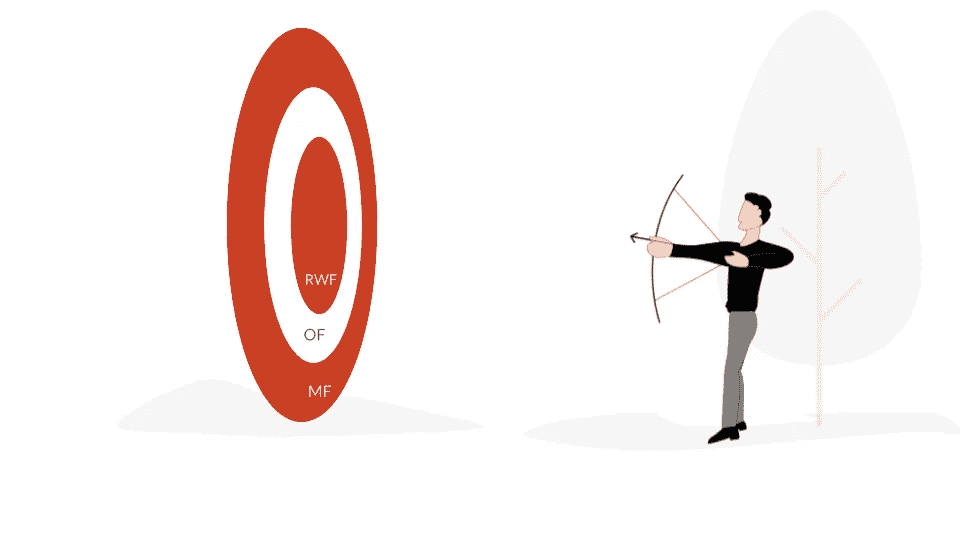
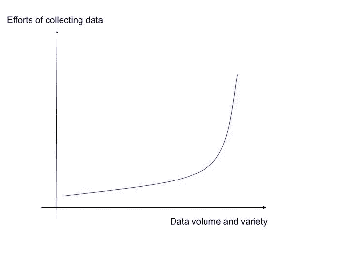

# ML 的开环——第二部分

> 原文：<https://towardsdatascience.com/the-open-loop-of-ml-part-2-ff6f3d2e0ae6>

## 为什么模型准确性是一个欺骗性的指标

这个系列的第一部分是关于 ML 开发者的心理。与模型开发相关联的“准确性”度量标准为模型构建者提供了一种心理上的封闭。然而，准确性度量是模型训练过程的结果，并且它与模型在真实世界中的有用性几乎没有关系。我已经提出，人为的封闭是原型和实际工作的 ML 系统之间的差异的主要原因。

在第一部分发表后，我收到了很多朋友的反馈，他们在构建行业级解决方案方面经验丰富，知识渊博。其中一些建议非常中肯。我可以把它们分成五大类:

1.  通过仔细选择训练数据集，可以提高模型准确性的相关性。数据应该包含足够的数量和种类来反映真实世界。数据中的偏差也应该被识别和纠正。
2.  任何系统都需要多次迭代才能在现实世界中变得有用。ML 系统一旦投入生产，也可以通过增量变化来改进。
3.  为了构建更健壮的系统，设计应该分成许多部分。只有严格要求不确定推理的部分才应该使用模型来构建。
4.  我们应该重新定义闭包的标准，就像我们对待任何正常的软件项目一样。我们应该激励正确的结果。
5.  ML 系统的有用性还取决于使用的类型。虽然“辅助”型需求很容易满足，但“替换”型需求很难满足。

我真的很高兴得到这些建议。回应告诉我，那些与现实问题斗争的人能够与 ML 的开放循环联系起来，他们已经在思考解决方案了。受此鼓舞，我决定将我的其余想法分成两部分——第二部分(这一部分)和第三部分(下一部分)。

*   在这一部分，我将使用前两个建议。我将更多地关注模型的准确性以及为什么它不能反映正确的情况。我还将谈到实施建议 1 和 2 的挑战。
*   在下一部分，我将使用建议 3、4 和 5。我将建议一个措施，使 ML 系统更有用，并可用作关闭标准。

那么，让我从精确度指标开始。不像上一部分，完全是基于我的实践经验，这一部分包含了一些理论材料。这些材料是我的经验和思考的结果，部分是受我正在写的关于智能机器数学的书的启发。

# 真实世界、观察和模型

模型是一种猜测的方法。更好的模型能做出更好的猜测。猜测过程由三个步骤组成:

> 观察(过去的数据收集)
> 
> 检测模式(模型识别和训练)
> 
> 使用模式(推理)

模式可以有多种类型。这里，我们将讨论一种特殊的模式——关系模式。我选择这种模式是有原因的。大多数流行的模型(回归、神经网络、贝叶斯)都使用这种模式。基于关系模式的 ML 算法通常被称为“参数化方法”。关系模式意味着我们感兴趣的量之间存在某种关系(或函数)。例如，回购利率和股票市场指数这两个量由一个关系模式连接。

当我们试图解决一个猜测问题时，我们会遇到三种不同的函数:

*   真实世界函数(RWF):这是真实世界中存在的实际关系。一个例子是疫苗接种数量和传染病传播之间的关系。实际上没有人知道这个函数，因为如果我们知道，我们就不会费心去训练一个模型。
*   被观察的函数(OF):这是我们 ML 工作的观察步骤的输出。我们以输入和输出变量记录的形式创建数据。数据本身是的。这个函数是“映射”形式的，这意味着你只看到数字对(或元组)，而不是任何实际的函数。
*   模型函数(MF):这是我们猜测 RWF 的尝试。这是一个实际的数学函数。虽然在某些情况下(如神经网络)不可能知道确切的功能，但肯定存在一个。在训练模型时，我们使用观察函数和最大似然算法来猜测最佳模型函数。

图片由 [Rajashree Rajadhyax](https://www.linkedin.com/in/rajashreerajadhyax/)

现在，您可以很容易地理解为什么模型精度如此之低:

> 模型精度表明 MF 有多接近 OF。让这个模型有用的是曼氏金融离 RWF 有多近。

稍微思考一下上面的问题，你就会意识到有用的先决条件:

> 奥林匹克公园应该靠近 RWF。

考虑这两个函数的性质。真实世界函数是隐藏的，未知的。观察到的函数是你保存的真实世界现象的记录。事实上，RWF 通过观察来展现自己。为了使这个抽象的观点更简单，我们将举一个例子，这个例子对于 ML 文献的读者来说太熟悉了——识别一只猫。

现实世界的现象是，一张猫的图片包含了某些独特的形状，以及这些形状的一些有区别的排列。你收集的猫的照片是观察数据。神经网络可以学习这些形状/排列和猫的图片之间的关系。这就变成了学习的模型函数。在这个例子中，注意 RWF 和的性质。现实世界的现象产生了猫图片的特征。这样的图算什么？几乎是无限的。世界上的每一只猫，在它的每一个姿势，在每一个环境和光线下，都会产生一幅新的图画。不可能包含所有这些图片。因此:

> 的将永远是 RWF 所有表现的子集。

有了背景知识，我们列出了接近 RWF 的挑战:

*   缺乏知识:由于 RWF 未知，我们实际上不知道我们需要收集多少数据和哪些品种
*   工作的指数性质:收集初始数据量的工作是合理的。随着我们追求更多的数量和品种，努力会成倍增加:

图 1:为什么收集更多数据越来越难

还有一个挑战，我稍后会描述。

这个讨论应该足以强调模型准确性的欺骗性。如果准确率为 90%，MF 和 OF 之间有相当于 10%的距离。但是 RWF 和 OF 之间的距离可能很远，因此这个模型在现实世界中的实用性现在还不知道。

我们如何衡量一个模型在现实世界中的有用性？我将在下一部分谈到这一点，但有一点应该是清楚的:

> 一个模型在现实世界中的有用性只能通过把它放到现实世界中来衡量。

这意味着，除非模型在实际情况下运行足够长的时间，否则它的有用性不会很明显。但是将模型投入现实世界有一个很大的障碍——错误的成本！

一个模型可以犯许多类型的错误。以识别癌症的模型为例。它会产生两种错误——假阳性(FP)和假阴性(FN)。对于这两种错误，错误的成本可以不同。在癌症的情况下，FN 的成本可能是巨大的，因为它错过了现有的医疗条件。现在考虑将模型放入现实世界的以下几点:

> 由于 RWF-OF 缺口的存在，模型会产生一些误差。
> 
> 一些错误的代价可能很大。

这个困难来自于将模型投入生产的方式。然后，系统变成一个循环(称为错误成本循环):

> RWF-的缺口->错误->不愿投入生产->无法填补 RWF-的缺口

这个循环阻碍了 ML 系统的增量改进。

# 结论和下一部分

我们最初的问题是实验和生产 ML 系统之间的差异。在这一部分中，我们讨论了模型准确性度量如此具有欺骗性的原因。虽然它表明了模型与可用数据的接近程度，但它并没有说明模型与现实世界现象的接近程度。事实上，错误循环的成本阻碍了将模型投入生产，并阻碍了进一步的数据收集。

我们现在知道我们必须找到两个问题的答案:

> 我们如何打破上述错误成本循环？
> 
> 对于模型在现实世界中的有用性，我们可以提出什么样的衡量标准？

我将在下一部分尝试给出以上问题的答案。我希望能收到一些关于上述讨论的好的反馈。如果你能把你的想法写在评论里，这样我就可以很容易地参考它们，那真是太好了。

上一篇:[ML 的开环—第一部分](http://The Open Loop of ML - Part 1)