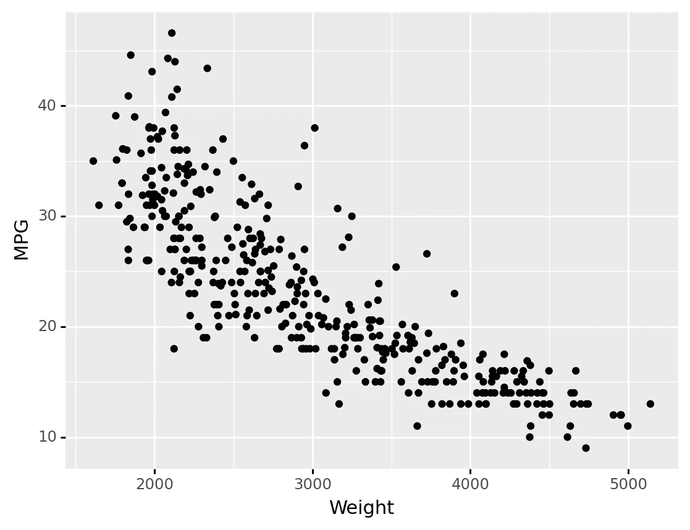
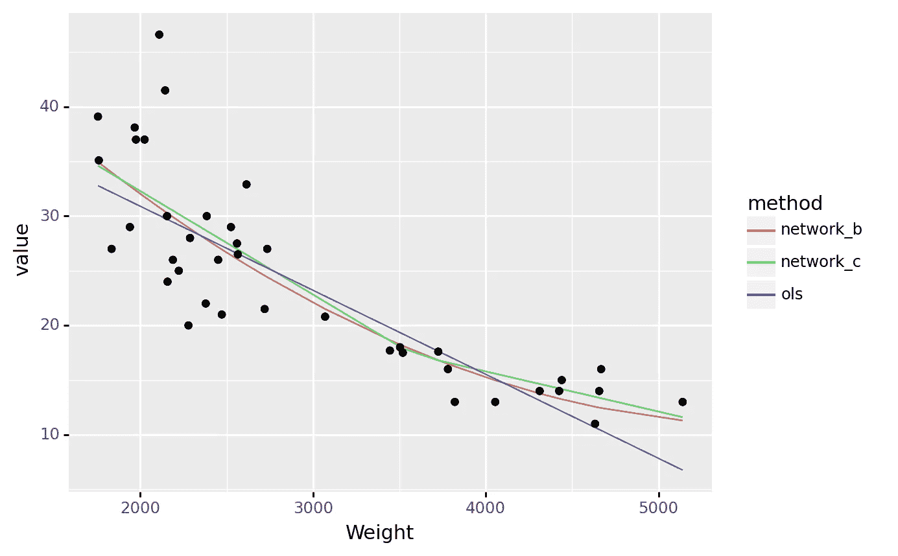

# 深度学习和线性回归的关联比你想象的要多得多

> 原文：<https://towardsdatascience.com/the-opportunity-and-cost-of-the-ability-of-neural-networks-to-solve-any-problem-d678609c49f1>

## 神经网络解决任何问题的能力的机会和成本

当我刚开始在大学学习统计学时，所有的统计模型似乎都是独一无二的工具。完全独立的知识孤岛:我们使用线性回归来预测给定山坡上的土壤侵蚀量，并使用[克里金法](https://en.wikipedia.org/wiki/Kriging)对辐射值进行空间插值。然而，过了一段时间后，我意识到克里金法只是线性回归的一种特殊变体，其中的观测值在空间上是相互关联的。

神经网络尤其具有这种近乎神话般的独特性:这些神奇的黑盒模型解决了以前认为不可能解决的问题。但即使是神经网络也与经典统计学有着紧密的联系。在这篇文章中，我想探索其中的一些联系，以及它们对神经网络的泛化本质的看法。我在这里使用“概括”一词，是指神经网络提供了一类更一般的模型，能够模拟许多其他统计模型。更重要的是，在训练神经网络时，它会有效地选择要模仿的模型，或者创建自己的混合模型。这种变色龙般的特性使得神经网络能够在给出问题的情况下找到合适的解决方案。

所有这些模仿能力回避了一个问题:为什么你不应该使用神经网络？为了回答这个问题，我们将从建立一个燃料效率模型开始，该模型将各种形式的线性回归与神经网络很好地联系起来。

这篇文章和代码可以在 github 上找到[。](https://github.com/PaulHiemstra/neuralnet_generalisation/blob/main/neuralnetworks_generalisation.ipynb)

# 燃油效率模型

这个案例基于经典的 mtcars 数据集，灵感来自教程中的[，其中我们特别关注汽车重量与每加仑英里数(`MPG`)燃料用量之间的关系:](https://www.tensorflow.org/tutorials/keras/regression)



作者图片

我们看到更轻的汽车更省油。这是有意义的，因为汽车不必拖动所有额外的重量。

为了探索神经网络如何呈现更一般的模型类别，我们将实现以下非常简单的网络架构，并将其与来自`statsmodels`包的普通最小二乘(OLS)线性回归进行比较。


作者图片

我们将首先从比较 statsmodels 的网络 **a** 和 OLS 开始。

# 作为神经网络的 OLS

网络 **a** 本质上的行为与线性回归完全一样。实际运行该模型显示了这一点有多正确。

首先，我们需要标准化数据，没有它，Keras 很难拟合一个好的模型。此外，我们将数据分为训练集和测试集。

数据准备好了，我们就可以建立模型 **a** 和 OLS 模型。

查看 OLS 和神经网络的拟合系数，我们可以看到它们大致相同，截距约为-6.5，斜率为 23.5:

```
[array([[-6.6114306]], dtype=float32), array([23.516169], dtype=float32)]
Intercept      23.495049
Weight_norm    -6.500213
dtype: float64
```

所以网络 **a** 本质上是 OLS 线性回归。

# 非线性简介:多项式回归

重量和燃油效率之间的关系似乎不完全是线性的，但对于重量较大的汽车来说，这种关系会稍微减弱。我们可以通过尝试拟合一条二次线来考虑这一点。这正是网络 **b** 通过将权重和权重的平方作为单独的特征输入到网络中所做的事情(受启发的[):](https://medium.com/analytics-vidhya/polynomial-regression-with-keras-ef1797b39b88)

用数据绘制网络 **b** 和 OLS 的预测线很好地说明了所发生的情况:


作者图片

表明网络 **b** 本质上归结为二次线性回归。

# 神经网络的魔力

网络 **b** 的问题是，我们仍然必须通过向网络提供更多特征来手动决定拟合多项式回归。对我来说，神经网络的真正魔力是让数据告知关系的实际功能形式的能力，而不是必须手动做出选择。网络 **c** 通过使用一个*隐藏层*引入了这种灵活性，在这种情况下有 8 个神经元:

隐藏层允许网络自行发现哪种输入要素组合可产生最佳结果，而无需手动创建要素。下图描绘了网络 **b** 、 **c** 和 OLS 的线路:



作者图片

model **c** 提出的解决方案甚至比二次线性回归更复杂，看起来更像一种局部回归。

# 作为一般化的神经网络

燃料效率模型的例子很好地说明了神经网络可以模拟输入和输出之间的任何函数，包括所有类型的(局部)回归。这就是我的意思，神经网络提供了一类更一般的模型。更重要的是，根据我们观察到的数据，它可以即时选择哪种回归是合适的。

当使用深度神经网络时，这种一般化的概念更进一步。这些深层网络可以解决使用更经典的统计问题无法解决的问题。例如，我们应该如何从包含猫和狗的一组图像中获得特征，以便逻辑回归可以有效地看出猫和狗之间的差异？深度神经网络在发现特征层中的什么表示最能让我们看到差异方面令人惊叹。

# 但是权衡是什么呢？

在如此热情洋溢地描述了(深度)神经网络的优点之后，我们为什么还要使用神经网络之外的任何东西呢？我认为神经网络面临以下挑战:

*   *灵活性与计算和数据*。与传统方法相比，神经网络通常使用更多的系数来描述问题。这带来了惊人的灵活性，但需要更多的计算和数据来发现所有这些系数的值应该是多少。对于您的用例，考虑到您的计算资源或数据量，更传统的方法可能是更好的选择。
*   *要一把锤子，每个问题都是一颗钉子*。当我们过多地将神经网络作为默认设置时，我们可能会对更简单有效的解决方案视而不见。例如，我们可以使用递归深度神经网络来尝试并分类公司的哪个部门应该转发支持电子邮件。[然而，如果我们尝试了](https://www.linkedin.com/posts/rohankamath_i-was-a-part-of-the-fraud-detection-team-activity-6907684110697943040-0isE?utm_source=linkedin_share&utm_medium=member_desktop_web)，一组简单的正则表达式可能会执行得更好。了解现有的所有模型，以及为什么它们在给定的环境中有意义。然后明智地选择适合您的问题的模型。
*   *可解释性*。大量的相互作用系数使得很难解释为什么模型会做出特定的选择。对于许多用例来说，这可能不是问题，但例如在医疗应用中，这可能会带来真正的挑战。如果医生不明白为什么它会做出某些决定，他们可能不愿意使用这个模型。相反的效果也可能发生:缺乏可解释性可能导致模型被毫无疑问地遵循。当然有办法让(深层)神经系统变得更加透明，但是一个有几个系数的 OLS 更容易解释。这尤其适用于非技术观众。
*   *熟悉度*。在你给定的上下文中，神经网络可能很少被使用。使用其他人都使用的模型使它更有可能被接受并产生影响。一个奇特的神经网络可能会工作得更好，但你必须首先赢得周围人的信任。

总的来说，我的建议是保持一个开放的心态，广泛地研究你可以使用的所有可能的统计技术。不要被机器学习的魅力所吸引，要为这项工作选择正确的工具。

# 我是谁？

我叫 Paul Hiemstra，是荷兰的一名教师和数据科学家。我是科学家和软件工程师的混合体，对与数据科学相关的一切都有广泛的兴趣。你可以在 medium 上关注我，或者在 LinkedIn 上关注。

如果你喜欢这篇文章，你可能也会喜欢我的其他一些文章:

*   [掌握数据科学并不是学习一系列技巧](/mastering-data-science-is-not-learning-a-series-of-tricks-df66d8529c29)
*   [学习 AI 机器人玩井字游戏系列文章](https://towardsdatascience.com/tagged/rl-series-paul)
*   [牛郎星图解构:可视化气象数据的关联结构](/altair-plot-deconstruction-visualizing-the-correlation-structure-of-weather-data-38fb5668c5b1)
*   [面向数据科学的高级函数式编程:用函数运算符构建代码架构](/advanced-functional-programming-for-data-science-building-code-architectures-with-function-dd989cc3b0da)
*   [通过规范化扩展您的回归曲目](/expanding-your-regression-repertoire-with-regularisation-903d2c9f7b28)