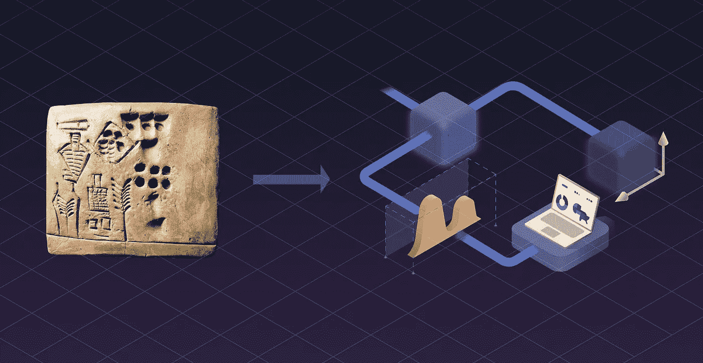
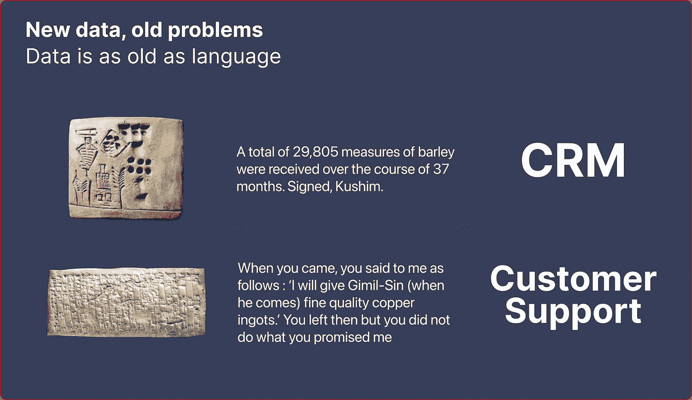
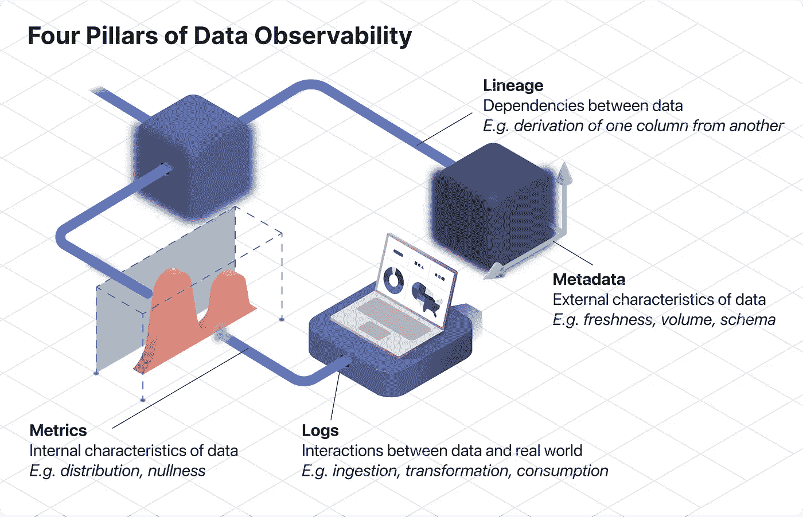
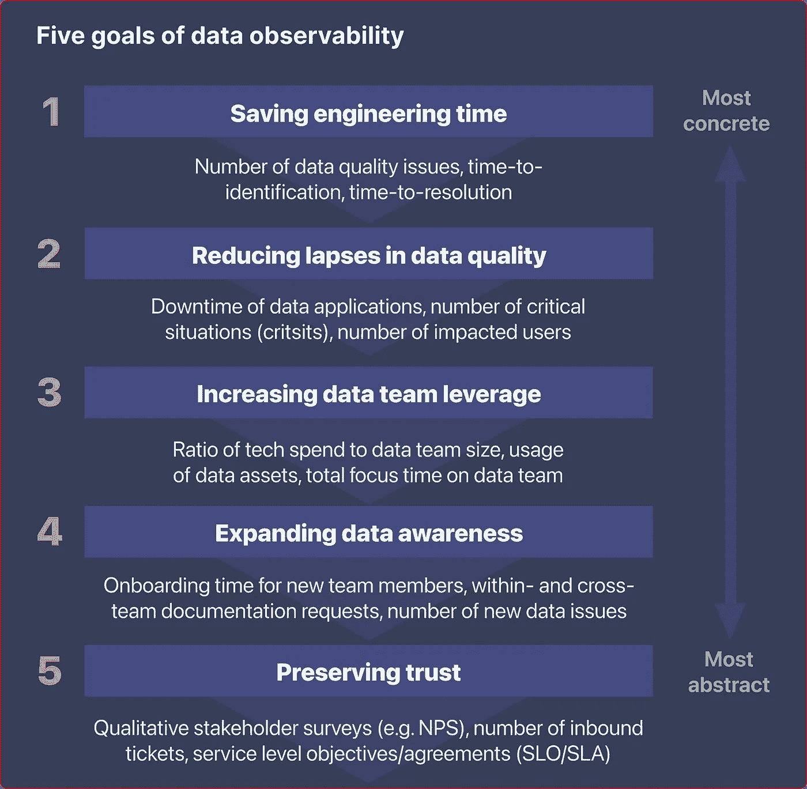

# 数据可观测性的起源、目的和实践

> 原文：<https://towardsdatascience.com/the-origins-purpose-and-practice-of-data-observability-baa12db46755>

数据可观察性是一项新兴技术，它解决了一个古老的问题:了解数据系统的状态，以增加认知和信任。本文改编自作者在[*Open Data Science Conference 2022*](https://youtu.be/UDFxSxEuCqk)*和*[*Data ops Unleashed 2022*](https://dataopsunleashed.com/2022-2/metaplane)*的演讲。*

数千年来，数据一直被用来代表现实世界。虽然围绕数据的技术发生了变化，但问题并没有改变。图片由大都会艺术博物馆和作者提供。

一切旧的都是新的，尤其是在数据世界。随着对[现代数据栈](https://www.fivetran.com/blog/what-is-the-modern-data-stack)甚至[后现代数据栈](https://www.getdbt.com/coalesce-2020/the-post-modern-data-stack/)的大肆宣传，你应该退一步问“从第一台计算机开始，我们就没有处理过数据吗？自从 Edgar Codd 在 1970 年将关系数据库正式化以来，发生了什么变化？”

我们的现在确实是那个时刻的延续，但是它的血统可以一直追溯到人类首次发展文字的时候。

现存最古老的文字之一是大约 5000 年前在苏美尔创造的楔形文字板。这种文字不是史诗或宗教仪式，而是一份由一个叫 Kushim 的人签署的销售收据。

具体来说，这个粘土碎片记录了 37 个月内 29，805 斗大麦的运送情况。虽然 Kushim 当时无法访问企业软件，但这本质上是一项 Salesforce 交易。好在他的数据存储介质有自动保存功能。

虽然我们的技术已经超越了石碑，但客户的抱怨永远不会消失。图片由作者提供。图片由大都会艺术博物馆和大英博物馆的受托人提供。

# 数据可观察性的起源

虽然数据有几千年的历史，但可观测性却有几百年的历史。“数据可观测性”，一个描述我们对数据系统的可见程度的概念，是“软件可观测性”的翻版，它本身来自控制理论。

在 17 世纪，当荷兰学者克里斯蒂安·惠更斯不忙着研究土星环时，他在想风车。当时，风车经常被用来磨面粉。

但是有一个问题困扰着磨坊主:风以不同的速度吹着，当它吹得太快时，磨盘就会产生太大的摩擦。这种摩擦可能会烧焦面粉，甚至引起火花——然后点燃空气中的面粉，并可能导致整个面粉厂烧毁。

问题是调节转速，惠更斯的解决方案是离心调速器。就像溜冰者伸出手臂减速，收回手臂加速一样，调速器有两个摆动的钟摆，将磨盘的速度保持在可接受的范围内。

换句话说，惠更斯承认他无法控制输入(风速)，并选择更好地控制系统(碾磨速度)。两百年后，苏格兰工程师詹姆斯·瓦特将离心调速器应用于工业，包括蒸汽机。

用于控制流出阀门的流速的离心调速器示意图。摘自 R. Routledge 的《十九世纪的发现与发明》。

像蒸汽机一样，离心调速器的技术出现在理论认识之前。在这种情况下，先驱是苏格兰同胞詹姆斯·克拉克·麦克斯韦，他也有一个主要的研究电磁学。

他的想法是:考虑到这个复杂的系统，在任何给定的时间观察每一条被处理的信息是站不住脚的，所以我们通过观察一些关键的输出并做出推论来满足自己。这就成了控制理论领域的“可观性”概念。

再过一百年，可观测性就有了更熟悉的形状。在 20 世纪 60 年代末和 70 年代初，IBM 的 Edward Codd 引入了关系数据库模型。Codd 有一个想法，即在诸如书页、复写纸和穿孔卡片等物理人工制品上收集的许多数据可以用表格的形式数字化地表示，并在它们之间建立关系。

这种关系模型和代数为关系数据库奠定了基础。此外，这些表和关系可以由一组定义良好的操作来操作，这些操作就是 SQL。这些早期的数据库原型催生了我们今天仍在使用的企业数据库。

我的观点是数据不是新的，可观察性也不是新的。以下是*的新内容*:在 Codd 时代，数据被输入贯穿整个组织的一条动脉。通过支持决策，数据是业务数据策略的补充。

如今，数据团队在越来越多样化的用例中为越来越多的利益相关者集中、转换和公开越来越多的数据。数据通过训练 ML/AI 模型来改善运营和产品体验，反馈到软件工具以实现运营目的，并驱动自动化行动，从而为企业提供动力。

在库希姆记录下古代苏美尔的大麦交易五千年后，我们终于实现了数据的承诺。

# 数据可观察性的目的

摩尔定律使得计算和数据存储的成本呈指数级下降，这导致了现代数据堆栈中我们熟悉和喜爱的参与者的崛起。越来越多的数据被 Fivetran 和 Airbyte 等工具复制到 Snowflake、BigQuery 和 Redshift 等云仓库，然后通过 dbt 等工具进行转换。

进步往往是一把双刃剑，数据的爆炸也不例外。问题是更多的数据意味着需要维护更多的表面积。随着维护开销的增加，数据破坏变得更加频繁和严重。随着数据分解，依赖数据的用例开始动摇。这往往会降低利益相关者对数据的信任。

不管你有多少 zettabytes 的数据，如果不能被信任，那都是没有用的。

正如熵会随着时间的推移而增加一样，创建更多的数据而不增加管理数据的能力只会导致更大的混乱和无序。数据的泛滥就像风在惠更斯的风车上吹得太猛。在这个例子中，数据可观测性是防止工厂烧毁的调速器。

现代数据技术使得接收、转换和激活数据比以往任何时候都更容易。但表面积越大，破损的可能性就越大，这会导致利益相关者失去信任。由作者提供。

这种与熵的斗争就是为什么数据可观测性不同于数据质量监控的原因，尽管有些人说它们可以互换。数据质量监控提醒我们注意问题，就像防盗警报一样。数据可观察性致力于了解问题发生的原因以及如何预防。它就像一个防盗报警器，有我们可以查看的监控录像。

数据可观察性的潜在用例不仅限于数据质量监控，还包括事件管理、根本原因分析和使用分析。在这些领域，组织可以应用数据可观察性概念来解决困扰数据团队的工作。

数据可观测性的核心组件是什么？数据工程仍然是一个相对年轻的学科。在整个开发过程中，它经常从其老大哥软件工程的例子中寻求指导。如果你知道软件可观察性的三个支柱:度量、跟踪和日志,“可观察性的支柱”听起来会很熟悉。数据可观测性遵循着相似的路径，尽管方向不同。

十年前，软件工程师和数据工程师处于同样的位置。从物理磁盘到云存储的转变意味着人们对软件寄予了更高的期望。更新速度的加快意味着熵的危险。这导致了像 Datadog 和 Sumo Logic 这样的软件可观察性工具的发展。

现在，我们正处于数据可观测性时代的黎明。虽然软件和数据有许多共同点，但它们也有一些基本的区别，这意味着我们不能盲目地将软件可观察性的原则复制到数据上。我们需要采用可观察性概念，并根据我们的特定领域对其进行调整。数据可观察性建立在四个支柱之上:[指标、元数据、沿袭和日志](https://www.metaplane.dev/blog/the-four-pillars-of-data-observability):

*   **指标**:数据的内部特征。示例:数字列的分布，分类列中的分组数。
*   **元数据**:数据的外部特征。示例:表的模式、视图具体化后经过的时间、表中的行数。
*   **沿袭**:数据之间的依赖关系。示例:数据库列和下游仪表板之间的列级沿袭。
*   **日志:**数据与外部世界的交互。示例:查看仪表板的次数，谁提交了最新的 dbt 提交。

总的来说，这四个支柱对于以任意细节描述数据系统在任意时间点的状态是必要且充分的。

以任意精度逼近我们的数据系统状态的四类信息。图片由作者提供。

# 实践中的数据可观测性

像数据质量一样，当头脑中有一个目标时，实现数据可观测性的努力是最成功的。通过与从小型初创公司到大型企业的各个垂直行业的数据团队合作，我们在采用数据可观察性时遇到了五个一致的目标:

*   **节省工程时间:**如果您的工程团队在处理入站服务单上花费了过多的时间，那么数据可观察性是一种可以更快解决问题并防止问题再次出现的方法。
*   **减少数据质量的失误:**尤其是当数据的可操作性超出了商业智能的范畴，为上市运营、自动化和客户体验提供动力时，数据质量差的成本会直接影响公司的顶线和底线。
*   **提高数据团队的杠杆作用:**大多数数据团队面临的最大问题是雇佣优秀的人才。一旦你有了优秀的人才，你不会希望他们的时间浪费在可以自动化的琐碎任务上。数据团队可以花时间向企业交付数据产品，而不是灭火。
*   **扩展数据意识:**有一个学派认为，数据从业者应该帮助其他团队做出更好的决策，自动化工作流，并了解他们工作的影响。但是数据团队呢？他们需要能够优化自己的工作流程。数据可观察性提供了他们需要的元数据。
*   **保持信任:**信任很容易失去，几乎不可能重新获得。一旦高管失去对数据的信任，他们的团队也开始失去对数据的信任。我们已经看到团队建立了替代的“影子”数据堆栈，使数据团队的工作无效，或者更糟，完全停止使用数据。恢复这种信任是一场艰苦的战斗，需要不断保证你的产品是正确的。

数据可观察性的目的，从最具体(但不一定是最有价值)到最抽象。图片由作者提供。

这五个目标是按照从最具体到最抽象的顺序排列的。然而，没有一个目标一定比其他目标更重要——这取决于你的业务。一旦确定了目标，下一步就是在[指标、人员、流程和工具](https://www.metaplane.dev/blog/how-to-maximize-the-value-of-your-metadata#how-do-you-actually-use-metadata-productively%C2%A0)上达成一致:

*   **指标**:我们在这里向唱诗班说教，但是为了确保针对某个目标的进展，一个有效的方法是定义代表该目标的清晰且可测量的指标。例如，如果您的目标是节省工程时间，您可以跟踪数据质量问题的数量、发现问题的平均时间或解决问题的平均时间。
*   **人**:数据来自无数的工具，而[的输出被组织中的每个人使用](https://www.metaplane.dev/blog/data-quality-begins-and-ends-outside-of-the-analytics-team)。那么谁来负责数据质量呢？我们已经看到在“仅数据团队”和“整个组织”之间的范围内到处都有团队所有都可以工作，但最重要的是对齐。只要组织接受了数据质量的重要性，并且感觉到他们的需求被听到了，那么数据团队就有权拥有测量和提高数据质量的过程。
*   **过程**:有了目标，有了跟踪这些目标进展的度量标准，有了围绕这些度量标准的人，下一个难题就是实现系统化度量和改进的过程。这些流程包括持续监控四大支柱的被动可观察性、集成到 CI/CD 工作流中的主动可观察性、[事件管理行动手册](https://www.atlassian.com/incident-management/incident-response/how-to-create-an-incident-response-playbook)，以及服务级别目标/协议(SLO/SLA)。
*   **工具**:引入[数据可观察性工具](https://www.metaplane.dev/state-of-data-quality-monitoring-2022)的三个主要选项是构建一个内部工具、引入开源解决方案或者采用商业工具。每种方法在可定制性、支持、时间成本和财务成本方面都各有利弊。

# 摘要

旧的又是新的，但来势凶猛。自从我们可以在石碑上记录语言以来，人类已经记录了数据，并且我们总是试图应用输入来改善结果。摩尔定律使得以更大的数量和更大的效果移动、存储和激活数据成为可能。

随着数据表面积的增加，我们的数据系统的熵往往会增加，并导致失去信任，除非我们采取措施来维持秩序。数据可观察性是一种新兴技术，有助于维护数据的有序性。

***如有反馈或想联系，请联系*** [***凯文***](https://www.linkedin.com/in/kevinzenghu/) ***或*** [***在此抢个时间***](https://calendly.com/metaplane/metaplane-demo) ***。感谢阅读！***