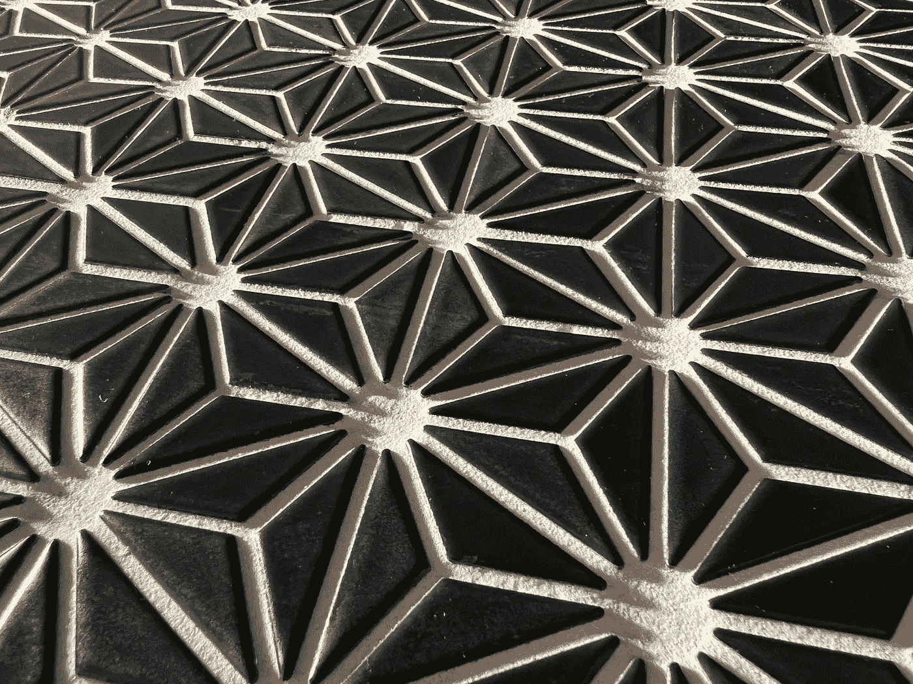

# 无拷贝数据帧操作的性能优势

> 原文：<https://towardsdatascience.com/the-performance-advantage-of-no-copy-dataframe-operations-7bf8c565c9a0>

## StaticFrame 如何通过采用 NumPy 数组视图超越 Pandas



作者图片

NumPy 数组是一个 Python 对象，它将数据存储在一个连续的 C 数组缓冲区中。这些数组的优异性能不仅来自这种紧凑的表示，还来自数组在许多数组之间共享该缓冲区“视图”的能力。NumPy 经常使用“无复制”数组操作，在不复制底层数据缓冲区的情况下生成派生数组。通过充分利用 NumPy 的效率， [StaticFrame](https://github.com/static-frame/static-frame) DataFrame 库为许多常见操作提供了比 Pandas 好几个数量级的性能。

# NumPy 数组的无拷贝操作

短语“无拷贝”描述了对容器(这里是数组或数据帧)的操作，其中创建了新的实例，但是底层数据被引用，而不是被拷贝。虽然为实例分配了一些新内存，但是与潜在的大量底层数据相比，这些内存的大小通常是微不足道的。

NumPy 使无拷贝操作成为处理数组的主要方式。当您对 NumPy 数组进行切片时，您将获得一个新数组，该数组共享从其切片的数据。对数组切片是一种无拷贝操作。通过不必复制已经分配的连续缓冲区，而是将偏移量和步长存储到该数据中，可以获得非凡的性能。

例如，对一个包含 100，000 个整数(~0.1 s)的数组进行切片，然后复制同一个数组(~10 s)，两者之间的差别是两个数量级。

```
>>> import numpy as np
>>> data = np.arange(100_000)
>>> %timeit data[:50_000]
123 ns ± 0.565 ns per loop (mean ± std. dev. of 7 runs, 10000000 loops each)
>>> %timeit data[:50_000].copy()
13.1 µs ± 48.4 ns per loop (mean ± std. dev. of 7 runs, 100000 loops each)
```

我们可以通过检查 NumPy 数组的两个属性来说明这是如何工作的。`flags`属性显示了如何引用数组内存的详细信息。如果设置了`base`属性，它将提供一个数组句柄，该数组实际上保存了该数组引用的缓冲区。

在下面的例子中，我们创建一个数组，取一个切片，并查看切片的`flags`。我们看到，对于切片，`OWNDATA`是`False`，切片的`base`是原始数组(它们有相同的对象标识符)。

```
>>> a1 = np.arange(12)
>>> a1
array([ 0,  1,  2,  3,  4,  5,  6,  7,  8,  9, 10, 11])

>>> a2 = a1[:6]
>>> a2.flags
  C_CONTIGUOUS : True
  F_CONTIGUOUS : True
  OWNDATA : False
  WRITEABLE : True
  ALIGNED : True
  WRITEBACKIFCOPY : False
  UPDATEIFCOPY : False

>>> id(a1), id(a2.base)
(140506320732848, 140506320732848)
```

这些派生的数组是原始数组的“视图”。视图只能在特定条件下拍摄:整形、转置或切片。

例如，在将最初的 1D 数组重新整形为 2D 数组后，`OWNDATA`是`False`，表明它仍然引用原始数组的数据。

```
>>> a3 = a1.reshape(3,4)
>>> a3
array([[ 0,  1,  2,  3],
       [ 4,  5,  6,  7],
       [ 8,  9, 10, 11]])
>>> a3.flags
  C_CONTIGUOUS : True
  F_CONTIGUOUS : False
  OWNDATA : False
  WRITEABLE : True
  ALIGNED : True
  WRITEBACKIFCOPY : False
  UPDATEIFCOPY : False

>>> id(a3.base), id(a1)
(140506320732848, 140506320732848)
```

这个 2D 数组的水平和垂直切片同样会产生只引用原始数组数据的数组。同样，`OWNDATA`是`False`，切片的`base`是原数组。

```
>>> a4 = a3[:, 2]
>>> a4
array([ 2,  6, 10])

>>> a4.flags
  C_CONTIGUOUS : False
  F_CONTIGUOUS : False
  OWNDATA : False
  WRITEABLE : True
  ALIGNED : True
  WRITEBACKIFCOPY : False
  UPDATEIFCOPY : False

>>> id(a1), id(a4.base)
(140506320732848, 140506320732848)
```

虽然创建共享内存缓冲区的轻量级视图提供了显著的性能优势，但也存在风险:改变这些数组中的任何一个都会改变所有数组。如下所示，将`-1`分配给我们的最具衍生性的数组反映在每个关联的数组中。

```
>>> a4[0] = -1
>>> a4
array([-1,  6, 10])
>>> a3
array([[ 0,  1, -1,  3],
       [ 4,  5,  6,  7],
       [ 8,  9, 10, 11]])
>>> a2
array([ 0,  1, -1,  3,  4,  5])
>>> a1
array([ 0,  1, -1,  3,  4,  5,  6,  7,  8,  9, 10, 11])
```

像这样的副作用应该引起你的注意。将共享缓冲区的视图传递给可能改变这些缓冲区的客户端会导致严重的缺陷。这个问题有两个解决方案。

一种选择是调用者在每次创建新数组时进行显式的“防御性”复制。这消除了共享视图的性能优势，但确保了改变数组不会导致意外的副作用。

另一个不需要牺牲性能的选择是使数组不可变。通过这样做，可以共享数组的视图，而不用担心突变会导致意想不到的副作用。

通过在`flags`接口上将`writeable`标志设置为`False`，可以很容易地使 NumPy 数组成为不可变的。设置该值后，`flags`显示将`WRITEABLE`显示为`False`，试图改变该数组会导致异常。

```
>>> a1.flags.writeable = False
>>> a1.flags
  C_CONTIGUOUS : True
  F_CONTIGUOUS : True
  OWNDATA : True
  WRITEABLE : False
  ALIGNED : True
  WRITEBACKIFCOPY : False
  UPDATEIFCOPY : False

>>> a1[0] = -1
Traceback (most recent call last):
  File "<console>", line 1, in <module>
ValueError: assignment destination is read-only
```

通过包含 NumPy 数组的不可变视图，最佳性能是可能的，并且没有副作用的风险。

# 无拷贝数据帧操作的优势

基于不可变数组的数据模型以最小的风险提供最佳的性能，这一见解是创建 StaticFrame 数据帧库的基础。由于 StaticFrame(像 Pandas)管理存储在 NumPy 数组中的数据，所以使用数组视图(而不必制作防御性副本)提供了显著的性能优势。如果没有不可变的数据模型，Pandas 就不能使用数组视图。

StaticFrame 并不总是比 Pandas 快:Pandas 对于连接和其他专门的转换有非常高性能的操作。但是当利用无拷贝数组操作时，StaticFrame 可以快得多。

为了比较性能，我们将使用 [FrameFixtures](https://github.com/static-frame/frame-fixtures) 库创建两个 10，000 行、1，000 列的异构类型的数据帧。对于这两者，我们可以将静态框架`Frame`转换成熊猫`DataFrame`。

```
>>> import static_frame as sf
>>> import pandas as pd
>>> sf.__version__, pd.__version__
('0.9.21', '1.5.1')

>>> import frame_fixtures as ff
>>> f1 = ff.parse('s(10_000,1000)|v(int,int,str,float)')
>>> df1 = f1.to_pandas()
>>> f2 = ff.parse('s(10_000,1000)|v(int,bool,bool,float)')
>>> df2 = f2.to_pandas()
```

无复制操作优势的一个简单例子是重命名轴。对于熊猫，所有底层数据都是防御性复制的。使用 StaticFrame，所有底层数据都被重用；只需要制造轻质的外部容器。StaticFrame (~0.01 ms)几乎比熊猫(~100 ms)快四个数量级。

```
>>> %timeit f1.rename(index='foo')
35.8 µs ± 496 ns per loop (mean ± std. dev. of 7 runs, 10000 loops each)
>>> %timeit df1.rename_axis('foo')
167 ms ± 4.72 ms per loop (mean ± std. dev. of 7 runs, 1 loop each)
```

给定一个数据帧，通常需要在索引中加入一列。当 Pandas 这样做时，它必须将列数据复制到索引，以及复制所有底层数据。StaticFrame 可以重用索引中的列视图，也可以重用所有底层数据。StaticFrame (~1 ms)比熊猫(~100 ms)快两个数量级。

```
>>> %timeit f1.set_index(0)
1.25 ms ± 23.7 µs per loop (mean ± std. dev. of 7 runs, 1000 loops each)
>>> %timeit df1.set_index(0, drop=False)
166 ms ± 3.52 ms per loop (mean ± std. dev. of 7 runs, 1 loop each)
```

从数据帧中提取列的子集是另一种常见的操作。对于 StaticFrame，这是一个无复制操作:返回的 DataFrame 只是保存原始 DataFrame 中列数据的视图。StaticFrame (~10 s)做这个比熊猫(~100 s)快一个数量级。

```
>>> %timeit f1[[10, 50, 100, 500]]
25.4 µs ± 471 ns per loop (mean ± std. dev. of 7 runs, 10000 loops each)
>>> %timeit df1[[10, 50, 100, 500]]
729 µs ± 4.14 µs per loop (mean ± std. dev. of 7 runs, 1000 loops each)
```

连接两个或多个数据帧是很常见的。如果它们有相同的索引，并且我们水平连接它们，StaticFrame 可以重用输入的所有底层数据，使这种形式的连接成为无拷贝操作。StaticFrame (~1 ms)做这个比熊猫(~100 ms)快两个数量级。

```
>>> %timeit sf.Frame.from_concat((f1, f2), axis=1, columns=sf.IndexAutoFactory)
1.16 ms ± 50.1 µs per loop (mean ± std. dev. of 7 runs, 1000 loops each)
>>> %timeit pd.concat((df1, df2), axis=1)
102 ms ± 14.4 ms per loop (mean ± std. dev. of 7 runs, 10 loops each)
```

# 结论

NumPy 旨在利用数据的共享视图。因为 Pandas 允许就地变异，所以它不能充分利用 NumPy 数组视图。由于 StaticFrame 构建在不可变的数据模型上，因此消除了副作用突变的风险，并且包含了无拷贝操作，从而提供了显著的性能优势。