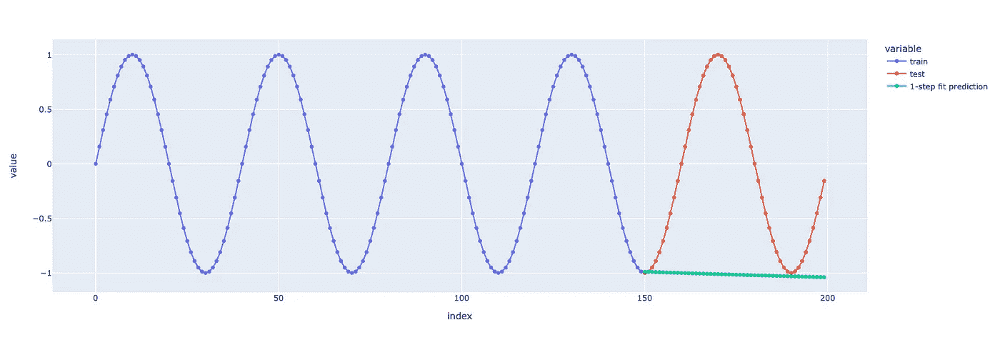
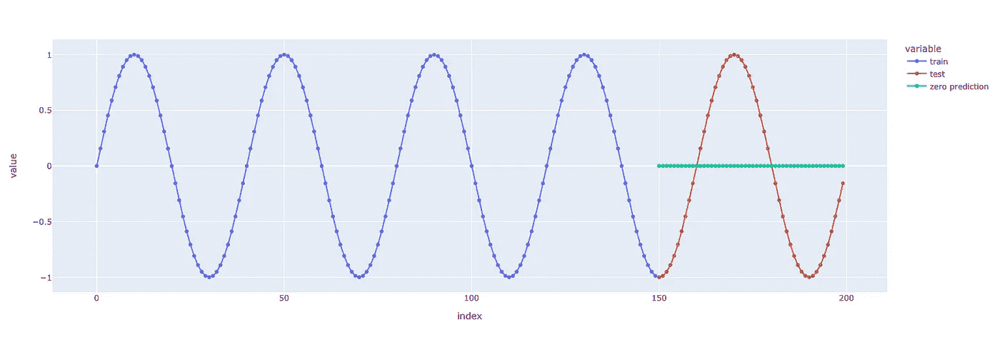
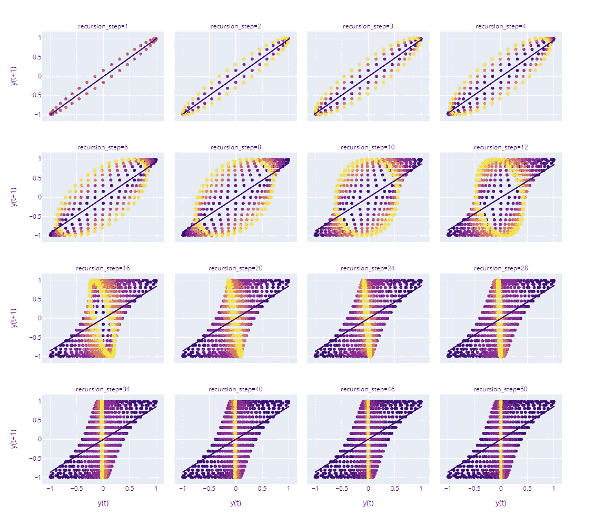
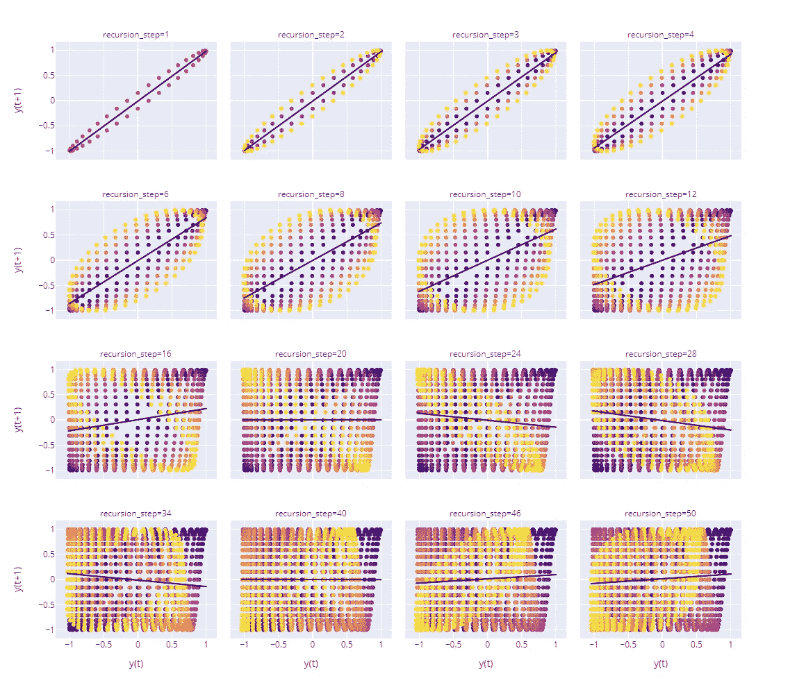

# 递归预测的危险

> 原文：<https://towardsdatascience.com/the-perils-of-recursive-forecasting-82ebd218d147>

# 递归预测的危险

## 为什么你的递归预测模型可能不尽如人意

康斯坦特·肯·林在 [Unsplash](https://unsplash.com/s/photos/firetruck?utm_source=unsplash&utm_medium=referral&utm_content=creditCopyText) 上的照片

时间序列的递归预测乍一看似乎很自然。你学会了如何预测下一步，并利用这些预测来预测下一步。这样，你可以预测任何数量的步骤。很棒，不是吗？

但是，有一点很奇怪。想象一个菜鸟消防员正在学习爬转盘梯子。他的教练告诉他如何从第一级爬到第二级。当学徒成功地练习后，教练说，“太好了，你做好了在紧急情况下一路爬到山顶的准备！只要重复你所学的，直到你到达篮筐。”

菜鸟有一种模糊的感觉，爬上 75 英尺的顶端与仅仅迈出第一步是不同的。

说到递归预测，也是类似的情况。正常的程序是训练模型预测下一步，但是预测下一步要比预测第一步困难得多。

与流行的观点相反，这不仅是关于误差随着每一步变大，而且学习的模型参数可能是错误的。

# 标准的一步到位培训

我们来做一个简单的例子。要预测的时间序列是一个简单的正弦波/正弦曲线，我们将尝试预测它的最后一部分(以红色显示)。

训练和测试分割(图片由作者提供)

预测这个时间序列会非常容易，但是为了说明问题，我们使用了一个不合适的模型:一个只能使用当前值来预测下一个值的线性模型。用数学术语来说 *𝑦(𝑡+1)* =𝑎𝑦 *(𝑡)* +𝑏，这基本上是一个 *AR(1)* 的过程。

模型的一个好的猜测是使用当前值𝑦 *(t)* 进行预测，因为下一个值总是非常接近当前值。所以这个模型会有𝑎=1 和𝑏=0.

训练该模型满足这一期望并产生𝑎=0.9948、𝑏=-0.0063。因此，该模型基本上预测𝑦*(𝑡+1)**(𝑡)*。

现在，让我们尝试用这个模型递归预测未来…

递归预测当前值会产生一条不符合正弦曲线的常数线(图片由作者提供)

这得出的 MSE(均方误差)为 1.26，看起来绝对不是一个好的预测。

看看训练集上一堆递归预测的痕迹。

标准拟合后递归预测的轨迹(图片由作者提供)

直觉上，一个简单预测零(𝑎=0 和𝑏=0)的模型会好得多。

预测零(=均值)是一个安全的赌注(图片由作者提供)

事实上，这减少了一半以上的误差(MSE 1.26 对 0.51)。

然而，该模型无法学习这种策略，因为它从未被训练为递归使用。

# 单步模型的递归训练

根据自己的预测递归地训练模型将会显示，甚至有比简单地预测零更好的策略。

这种递归训练是如何工作的？

首先，将在正常训练数据上训练模型。结果将是一个好的一步估计器。该估计器用于预测整个训练集。这些一步预测可以附加到训练集中，并且可以训练出好的两步预测器。根据它的预测，可以训练一个好的三步预测器，等等。一旦达到必要的预测步骤数，就可以根据参数是否已经收敛来进一步拟合模型。

在递归训练拟合模型 50 步之后，参数是𝑎=0.8584 和𝑏=0.0002，并且测试集的 MSE 已经减少到 0.44。

递归拟合:预测趋近于零(作者图片)

太棒了，AR(1)模型的最佳预测策略是逐渐接近 0，因此最初仍然利用与起始值的接近度。

查看训练集的跟踪…

递归拟合后的递归预测轨迹(作者图片)

这是递归训练的可视化。您可以看到，在最初的步骤中，数据几乎完全符合回归线。此后，随着每个训练步骤的进行，越远的预测点(黄色)越难到达，因此必须调整参数(注意黑色回归线的旋转)。为了整体预测的准确性，牺牲了短期的准确性。

递归训练的可视化(图片由作者提供)

我们可以对标准拟合进行相同的可视化(没有递归训练，模型只拟合一次)。

注意，回归线现在只代表递归生成的数据的最佳线性拟合。𝑏≈0\. 𝑎≈1 每一步所用的模型都是一样的

您可以看到，从第一个模型递归地生成预测，然后根据生成的轨迹训练一个模型也是一种选择。它将产生大约零预测策略:𝑎≈0，𝑏≈0

递归预测标准拟合的可视化(图片由作者提供)

总之，与标准拟合相比，递归拟合将 MSE 降低了 66%。

在这种情况下，递归拟合明显优于一步拟合或常数零预测(图片由作者提供)

这种巨大的改进是由于例子的简单性和 AR(1)模型完全不适合数据的事实。

但是，当使用递归预测模型时，您仍然可以尝试检查递归训练是否改进了您的模型。

请记住，根据您的数据大小、预测步骤的数量和模型的复杂性，训练时间可能会显著增加。

不幸的是，除了增加训练时间之外，如果你的模型倾向于过度拟合，还有一个更糟糕的问题。

# 递归训练中过度拟合的后果

若要检查递归训练期间过度拟合的效果，可以使用一个带有内存的模型，该模型可以完美地再现所有训练数据。对于以前没有见过的数据，它将使用一种回退估计模型。

当递归使用时，过拟合模型完美地再现了样本中的一切。

然而，样本外我们又回到了我们最初开始的地方，就好像我们没有递归训练一样。

由于过度拟合，模型从未发现它会对看不见的数据产生错误，因此它不能在训练期间适当地调整参数。

你可以在[附带的 Kaggle 笔记本](https://www.kaggle.com/tbierhance/perils-of-recursive-forecasting)里试试这个。

# 实用的建议

在现实生活的预测场景中解决这个问题并不容易。

完美的解决方案是在不同的数据上训练每个递归步骤。对于 24 的预测范围，您可以将定型数据拆分为 24 个部分，在第一部分定型一步估计器，预测第二部分，依此类推。但是，您可能没有足够的训练数据用于此策略，因此模型的性能可能会很差。

那么你必须有创意，使用更少的剪辑，添加从样本外预测中采样的噪声，等等。将训练数据分成 4 部分并递归拟合 4 个步骤对于 24 个月的预测来说可能并不理想，但如果真的有所不同呢？！

另一个你可以尝试的方法是用直接多步模型(DMS)代替递归策略。因此，您将训练一个模型来预测𝑦 *(𝑡+1)* ，另一个模型来预测𝑦 *(𝑡+2)* 等等。一些好处:

*   与递归策略相比，预测误差不会增加
*   无需预测可能有用但难以预测的额外变量，例如库存水平
*   短期模型可以使用与长期模型不同的变量，例如，今天的销售和库存对短期模型很重要，但总体趋势和产品生命周期对长期模型更重要

最后一个提示:请务必查看随附的 Kaggle 笔记本中的[，其中包括递归训练代码和绘图代码。如果你像我一样对预测感兴趣，你可能也想在这里或者在推特上关注我。](https://www.kaggle.com/tbierhance/perils-of-recursive-forecasting)