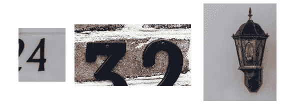

# 为什么人工智能模型组合在一起会失败

> 原文：<https://towardsdatascience.com/the-pitfalls-of-using-ai-as-the-input-of-another-ai-e0a3f0f485e4>

## 在复杂的人工智能流水线上错误是如何累积的

照片由[汉娜·布斯](https://unsplash.com/@hannahbusing?utm_source=medium&utm_medium=referral)在 [Unsplash](https://unsplash.com?utm_source=medium&utm_medium=referral) 上拍摄

在的[上一篇文章](https://medium.com/p/a9b533ee5295)中，我简要提到了顺序使用 AI 是一场噩梦。每当一个人工智能被用作另一个人工智能的输入时，每个模型的个体误差很快就会累积到不可接受的水平，或者简单地说，灾难性的失败。此外，随着你向链中添加更多的节点，问题会成倍恶化。在这篇文章中，我详细阐述了这个问题，解释了为什么序列模型会失败的直觉，以及我们如何补救这些问题。

下面的讨论对于任何开发复杂 AI 管道的人来说都是至关重要的，例如使用对象检测来找到感兴趣的对象，并对这些对象应用一些其他模型。同样，向聊天机器人人工智能提供情绪分析结果，或者尝试使用其他预测模型的结果来预测股票价格。如果第一种模式失败了，那么在所有这些情况下，很难甚至无法保证第二种模式会产生任何有价值的东西。

作为免责声明，串行使用 AI 是*更成问题*，并非不可能。关键在于理解模型之间的误差是如何累积的，并减轻其复合效应。串行人工智能完全是为了设计*公差*，而不是增加精度。换句话说，如何从第一个模型的错误中备份第二个模型。

我们走吧。

# 错误是如何组合的

考虑 MNIST 分类器的简单情况。如果你按照一个[简单的教程](https://www.tensorflow.org/tutorials/quickstart/beginner#train_and_evaluate_your_model)，你会很快达到 97%左右的准确率，这已经相当不错了。这是一个 MNIST 数字的例子。

MNIST 数字样本([来源](https://en.wikipedia.org/wiki/MNIST_database))

现在，考虑识别邮政服务的五位数邮政编码。显而易见的方法是对每个数字运行分类器，然后合并结果。总的来说，您将执行五个 97%准确的分类，并且您需要它们都成功地正确识别邮政编码。**从数字上看，你的准确率现在下降到了 86%(或者 97%⁵).**

换个角度来看，假设你的分类预测值是 10001，而正确值是 90009。然后，在谷歌上快速搜索一下，你就会发现一个寄往洛杉矶(90009)的包裹会被寄往纽约市(10001)！

当使用人工智能产品时，我们往往会被概率的含义搞得有点晕头转向。虽然 86%对于某些问题来说可能很高，但这还远远不够。它表示每 100 个包裹中有 14 个会被发送到错误的地址。这个失败率高得令人无法接受。如果考虑到每秒解析一封邮件，我们每七秒钟就会误读一次。

类似地，一个 **9 位数的邮政编码分类器只有 76%的准确率**。换句话说，大约四分之一的包裹会被发送到错误的地址。同样，邮政编码每四秒钟就会被误读一次。

这个例子显示了当我们增加成功所需的预测数量时，相对较低的误差(3%)如何迅速增长到不可接受的水平。然而，这仍然是一个微不足道的例子，因为每个数字都是相互独立的——实际的最坏情况是模型按顺序运行。

## 顺序误差

考虑一个有点类似的问题:从房屋照片中识别门牌号。例如，你需要找到下图中的数字(510)，然后识别它的数字。

照片由[乔恩·泰森](https://unsplash.com/@jontyson?utm_source=medium&utm_medium=referral)在 [Unsplash](https://unsplash.com?utm_source=medium&utm_medium=referral) 拍摄

假设您的检测模型可以在 80%的情况下正确裁剪门牌号，并且您正在使用 MNIST 分类器来识别这三个数字(准确率约为 91%)。这种设置将我们引向以下三种情况:

1.  该号码被找到(80%)并被正确识别(91%): 73%
2.  该号码已被找到(80%)，但未被正确识别(9%): 7%
3.  没有找到数字:20%

在这个简单的例子中，很明显检测模型如何抑制了我们的总成功率:**如果检测失败，我们甚至无法尝试得出一个数字。换句话说，即使我们有一个完美的数字解析器，我们仍然会受到检测器 80%精度的限制。**

如果我们的模型在检测单个房子时有 73%的准确性，那么要完美地处理一张有三个房子的照片**，我们的系统只有 39%的准确性！**此外，至少有 50%的几率不会检测到一个家庭。此外，还有一种情况我们必须考虑:*错误检测。*

## 错误检测传播

对于第一个问题(邮政编码解析)，每个数字都是独立的，这意味着一个数字分类的成功或失败不会影响其他数字。相反，在第二个问题上，只有当检测发现有用的感兴趣区域(ROI)时，数字识别才能发生。然而，如果我们得到一个*坏检测*呢？

**当一个人工智能算法的输入是另一个算法的输出时，它的结果只会和前一个算法的输出一样好。**在示例中，我提到只有首先找到门牌号，我们才能解析门牌号。但是，**如果检测只发现了*部分*的门牌号呢？如果它检测到某个随机图像区域是一个数字呢？**

你会怪算法检测出 4，79，1 吗？(来源 [A](https://unsplash.com/photos/qzq9rEBX5P4) 和 [B](https://unsplash.com/photos/9GorMM2MziM) )

这里我举例说明了三种情况，其中检测算法报告了一个数字，但是检测不适合于识别。在第一种情况下，很自然地假设 AI 可能会输出 4，而在第二种情况下，由于底部被裁剪，它可能会很高兴地将 32 误认为 79。在第三个案例中，它报告了一个没有车牌的图像区域。在这种情况下，数字识别算法给出的任何输出都没有意义。

回到概率，假设我们的探测器有 80%的机会探测到某些东西，我们仍然必须考虑这些探测有多好。换句话说，我们的成功率很可能远低于我们最初认为的 73%。

# 缓解策略

到目前为止，我们已经分析了多重预测如何损害整体准确性，以及当我们链接预测模型时情况会变得如何糟糕。然而，尽管这些问题总是存在，但是我们可以依靠一些技巧来减轻多模型的负面影响。

**使用冗余检测器**:与直觉相反，如果你部署了两个检测算法，你所需要的就是让其中一个找到你想要的东西(例如，一个门牌号)。由于不需要探测器同意，你将增加你得到一个好的预测的几率。另外，如果它们一致，您可以组合它们的输出。

**后处理检测:**假设第一个模型输出一个边界框。您可以预先计算数据集的平均边界框大小，并将算法输出至少放大到该大小。这对于不完整的检测非常有帮助。另一种方法是使用经过训练的分类器，以确保检测到的 ROI 属于您正在寻找的类别。这有助于抑制虚假检测的出现。

**不确定性建模:**如果一个模型向另一个模型提供错误的预测，研究不确定性建模技术可能会有所帮助。这里的目标是感知何时最好放弃一个预测，而不是沿着模型链强制一个坏的检测。一个简单的方法是蒙特卡罗丢弃:在测试时保持丢弃层活动，并运行模型几次。如果模型是确定的，它的预测应该具有低方差；相反，如果模型预测的是假样本，则输出会有很高的方差。

**模拟生产环境:**在与其生产环境非常相似的条件下训练第二个模型是至关重要的。例如，大量使用数据扩充来模拟检测错误，或者更好的是，将实际预测作为训练数据。

**尽可能使用原始输出:**假设您将一个分类器的结果提供给另一个分类器。使用由该算法产生的原始 logits 向量可能比 class-id 或 one-hot 向量更有利。对于边界框，将对象/置信度分数与坐标一起包含是有益的。天气预报就是一个很好的例子。大多数系统不会告诉你“会/不会下雨。”相反，他们会告诉你下雨的可能性。当你计划你的一天时，你要考虑可能性。

## 当处理视频/流时

在视频和流的特殊情况下，我们可以使用过去的数据对当前(和未来)的事态做出有根据的猜测。以下技巧都是关于*外推过去填补空白*:

**重复检测:**说你在前一帧检测到一个人，现在没有。人不容易在一帧中消失，所以在检测器再次检测到人之前，重复检测几帧可能不会有什么坏处。只要再多一点爱心，你就可以跟踪物体的边界框，并进行外推，而不是简单地重复它。

**追踪器:**如果想全程追踪，可以使用羽翼丰满的追踪器，比如 [DeepSORT](https://github.com/nwojke/deep_sort) 。追踪器将为检测分配身份，并在处理诸如平滑和外推错过的检测之类的事情时，跟踪它们从一帧到另一帧的去向。

**使用移动平均线:**假设你的最终输出是一个从 0 到 1 的值。如果您将这个原始数字发送给最终用户，它可能看起来不稳定，好像算法是随机猜测的。因此，相反，你可以跟踪过去产出的移动平均值，以使事情变得平稳。使用这种技术，您可以优雅地处理丢失/伪造的检测，提供一个整体上更平滑的体验。

总的来说，这些技术旨在从第一个模型故障中备份系统，并为第二个模型的运行提供充足的空间。当谈到视频和流媒体时，你的大部分腿部空间来自于重用过去的数据来推断未来。然而，所有这些技术都有一个共同的特点:**链接模型的关键是设计容错的管道**。

失败时有发生。每秒运行一次的 99%准确的模型仍然会几乎每隔一分钟错误预测一个样本。当使用人工智能时，不存在逃避错误的问题。然而，我们可以容忍它们。

他的一切都是为了现在。如果你对这篇文章有任何问题，请随时评论或与我联系。你也可以订阅我在你的收件箱[这里](https://ygorserpa.medium.com/subscribe)发布的内容。你也可以通过[请我喝杯咖啡](https://www.buymeacoffee.com/ygorreboucas):)来直接支持我

如果你是中新，我强烈推荐[订阅](https://ygorserpa.medium.com/membership)。对于数据和 IT 专业人员来说，中型文章是 StackOverflow 的完美组合，对于新手来说更是如此。注册时请考虑使用[我的会员链接。](https://ygorserpa.medium.com/membership)

感谢阅读:)