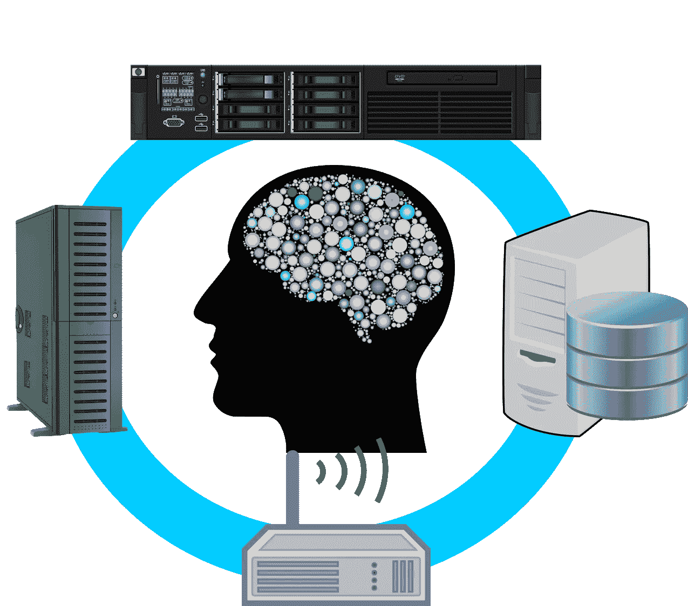
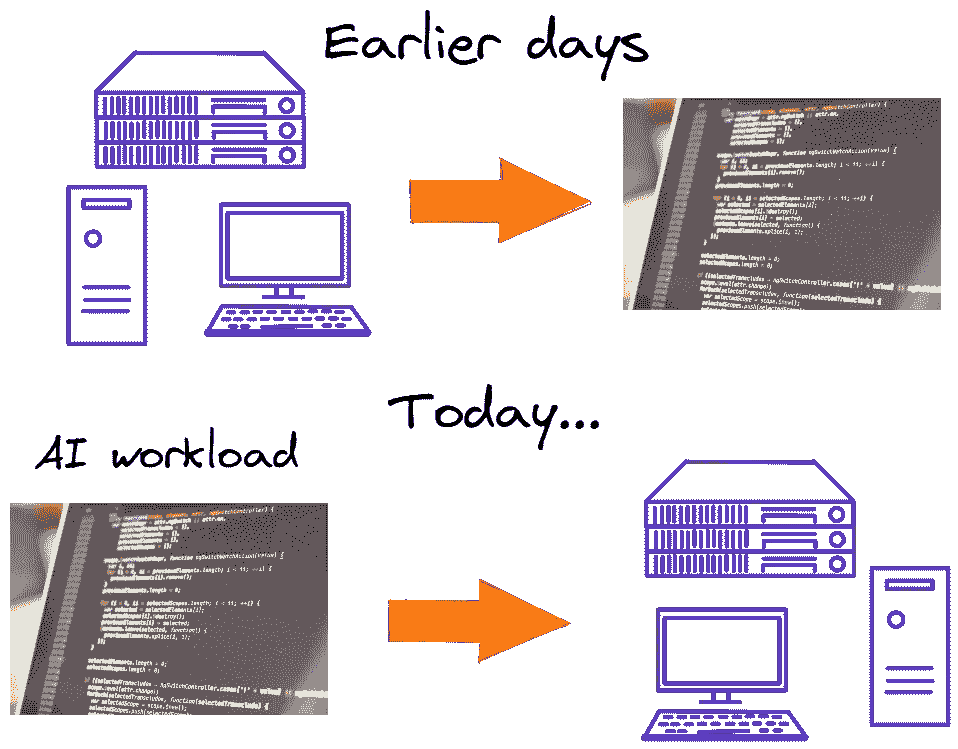
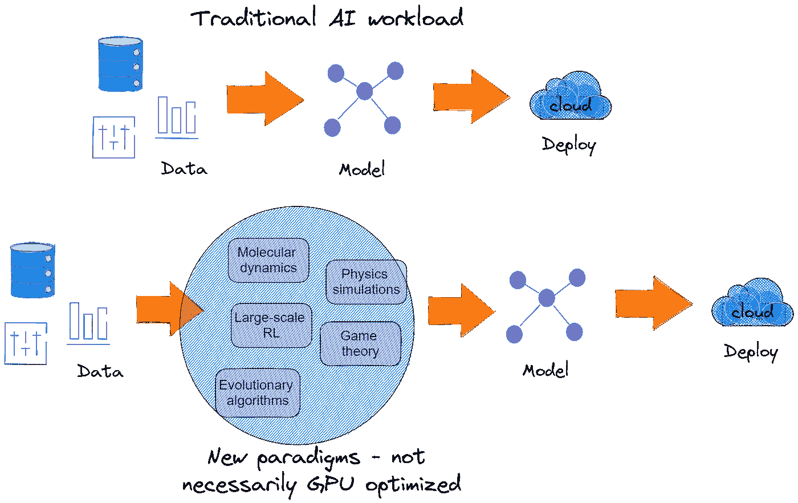
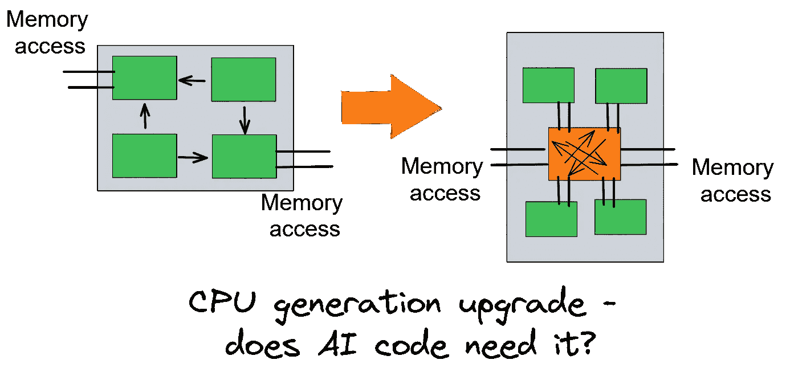
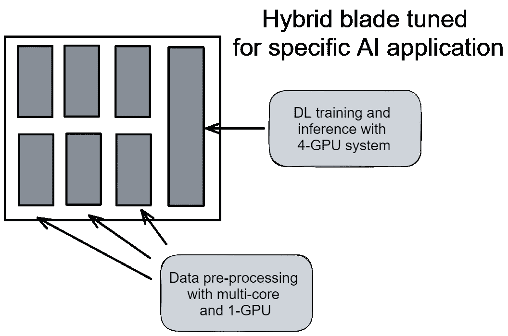
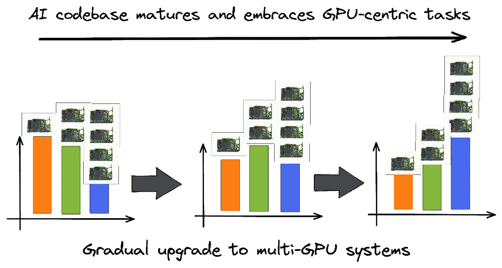
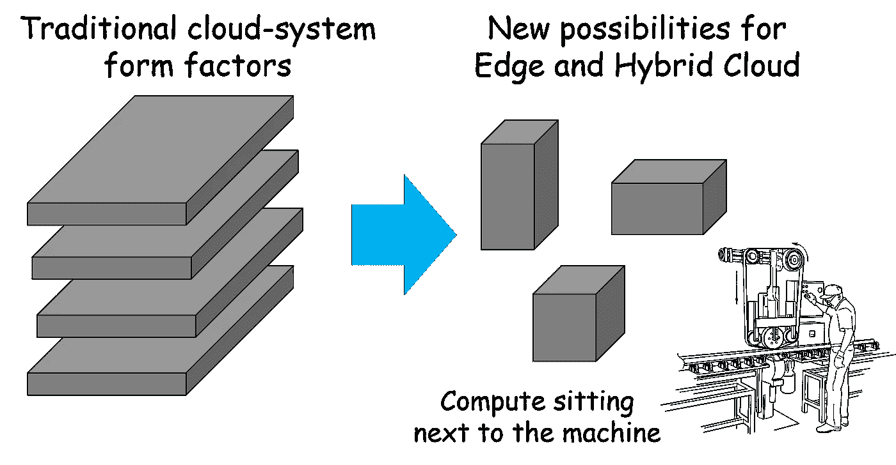

# 适合您的人工智能工作负载的硬件—不同寻常的考虑

> 原文：<https://towardsdatascience.com/the-right-hardware-for-your-ai-workload-unusual-considerations-84e072bb8a30>

## 在为我们的人工智能工作负载设计最佳硬件组合时，我们指出了一些很少被提及和低估的特性和相互关系

图片来源:作者使用 Pixabay images ( [image-1](https://pixabay.com/vectors/server-case-computer-technology-150619/) 、 [image-2](https://pixabay.com/vectors/computer-file-mounted-158930/) 、 [image-3](https://pixabay.com/vectors/cranium-head-human-male-man-3199408/) 、 [image-4](https://pixabay.com/vectors/computer-database-network-server-156948/) 、 [image-5](https://pixabay.com/vectors/computer-network-router-server-159828/) )创建

# 软件控制的硬件

软件正在吞噬世界，人工智能(AI)/机器学习(ML)正在吞噬软件。

越来越多的商业领袖得出相同的结论，即每个企业，无论其最终产品或服务如何，都必须将人工智能工具和技术集成到其业务流程和路线图规划中。这也意味着随着**越来越多的人工智能工作负载/任务消耗计算基础设施**，该组织的信息技术(IT)工作负载的场景也在发生变化——无论是在内部还是在云上。

在这方面有趣的观察是，这些所谓的**“人工智能工作负载”最适合在特定的硬件配置上运行**。当然，它们可以运行在传统的通用计算基础设施上，而这些基础设施可能是一个组织在 10 年前就已经规划并实施的。但是**最佳投资回报或更快的上市时间**只有在硬件针对组织计划运行的特定人工智能工作负载进行了思考和优化的情况下才能实现。

20 世纪的最后几十年(可能也是 21 世纪的第一个十年)见证了摩尔定律推动的通用计算机器和软件的增长，这些机器和软件是为适应硬件的需求和限制而定制的。

我们已经深入到 21 世纪了。**软件栈(主要是 AI)开始规定硬件要求和细节**。

图片来源:作者使用 Excalidraw 和 [Pixabay 免费图片](https://pixabay.com/photos/code-programming-hacking-html-web-820275/)创建

有很多关于这个话题的高质量文章。在这篇文章中，我想指出**一些很少被提及和低估的特性和相互关系**，在为我们的人工智能工作负载设计最佳硬件组合时，我们可能要记住这些特性和相互关系。

# CPU 没有死

在讨论 AI 专用硬件时，CPU 的选择和配置往往会受到兄弟般的对待。这是因为 GPU 在最受欢迎的 AI/ML 任务中的流行和主导地位——计算机视觉(CV)中的深度学习(DL)，自然语言处理(NLP)，或推荐系统。

但实际情况在不断变化。

## 大量非 GPU 优化的任务

然而，许多初创公司和成熟的科技巨头已经开始超越简单的 DL 工作负载，并围绕 DL 平台为其业务混合有趣的预处理或并行计算块。

这些想法几乎没有一个是全新的。它们中的大多数以前只在非常特定的情况下使用，或者没有在学术界或其特定应用领域之外广泛使用。有趣的是，它们现在正与 AI/ML 工作负载融合在一起，并在全球科技巨头的整个业务平台的性能和稳健性方面发挥着重要作用。

下面列出了一些例子，

*   **分子动力学**
*   **基于物理的模拟**
*   **大规模强化学习**
*   **博弈论框架**
*   **进化计算**

由于其历史发展，这些类型的计算任务的大多数代码和算法还没有高度优化以集成到 GPU 中。这使得在设计和决定特定的服务器系统时，为这些任务选择 CPU 对于初创公司或 IT 组织来说至关重要。

图片来源:作者使用 Excalidraw 创建

## 全方位示例

最近，Nvidia 推出了 [Omniverse 平台](https://www.nvidia.com/en-us/omniverse/)，彻底改变了产品和流程设计师在多个领域的合作方式——建筑、媒体、游戏设计、制造等。目标是**将高性能计算(HPC)、AI/ML 模型、基于物理的模拟、设计自动化**融合到一个平台上。

显然，传统上使用不同计算范式和风格的不同领域的融合需要在硬件方面进行仔细的优化，平衡 CPU/GPU/内存的需求。

图片来源:作者创作

## 另一个人工智能任务的例子

一个典型的例子是，CPU 必须进行大量的**定制特征处理，包括预先丢失或杂乱的数据**，并且只发送一小部分用于训练 DL 模型的好数据。完全可能的是，总计算时间和能量支出受到这种数据争论和 CPU 和板载存储的数据 I/O 的瓶颈，而不是 DL 模型训练或推断。

或者，在预先训练的模型可以在 GPU 上运行以进行推理之前，可能需要在前端进行大量的**特定应用信号处理**来提取特征。同样，瓶颈(和改进的机会)在前端 CPU 端。

对于这样的服务器设计来说，核心数量、boost、L1/L2 高速缓存的选择——所有与 CPU 家族相关的考虑因素——比在最好的 GPU 上花费时间和金钱更重要。

## 关键的 CPU 一代选择示例

有时，CPU 代的选择可能取决于微妙的考虑，例如 AI 工作负载是否要求主内存和 CPU 之间完全异步的通信。

图片来源:作者使用 Excalidraw 创建

有些类型的人工智能和数据分析代码利用了这种交流，有些则没有。当不需要时，它可能是多余的，因为支持这种硬件升级的 CPU 一代可能比上一代更昂贵、更耗电。与任何工程决策一样，优化在这种情况下至关重要。

每个人都知道 TCO 的概念，即服务器系统所有权的总成本(T2 ),总成本(T4)。但是有一个越来越重要的概念**TCE——环境总成本**——考虑到这种优化研究。

图片来源:作者使用 Excalidraw 创建

**混搭**也有助于优化。同样，混合策略需要根据应用程序工作负载进行调整。

图片来源:作者使用 Excalidraw 创建

# 被低估的 GPU 考虑因素

即使当 AI 工作负载包括大部分 DL 模型训练和推理时，硬件提供商或设计师也必须与潜在客户进行这些对话。

## CPU 到 GPU 的进程

主要的 DL 框架，如 **TensorFlow 和 PyTorch 已经变得更加灵活——只是在最近几天(过去的 1-2 年)——被用作通用的 ML 问题解决工具**。这为将传统的 CPU 优化问题转化为适合 GPU 的任务铺平了道路。

然而，并不是所有的数据科学/ ML 团队都有足够的装备(或带宽有限)来利用这一进步。对于他们来说，在没有好的代码库的情况下，花很多钱在最新的 GPU 上，仍然是一种资源浪费。在这些情况下，**混合服务器部署**是一个好的起点。

图片来源:作者使用 Excalidraw 和 [Pixabay 免费图片](https://pixabay.com/photos/video-card-gpu-technology-mining-4884119/)创建

## 支持较低精度的数字

许多 DL 工作负载可以通过在其模型和参数中使用较低精度的算法来获得足够的准确性，或者更重要的是，商业价值。这有效地允许组织在相同的硬件上运行更大的模型。

但是，并不是所有的 GPU 家族都原生支持这个特性。大多数老一代 GPU 需要大量的软件和编程调整和优化才能实现这一点。如果客户可以利用这一特性，硬件提供商应该相应地提出建议，并推广适合这一调整的 GPU。

## 多 GPU 集群映射到正确的软件/人工智能堆栈

许多多 GPU 系统是在没有适当规划或考虑人工智能/软件堆栈的情况下构建的，这些人工智能/软件堆栈可以真正利用这样的配置。除了传统的 DL 任务，许多分布式数据分析任务也可以利用多 GPU 系统(查看 Dask、RAPIDS 或 Ray 等库)。

<https://medium.com/dataseries/gpu-powered-data-science-not-deep-learning-with-rapids-29f9ed8d51f3>  

因此，映射准确的软件堆栈和多 GPU 系统配置也是一个重要的考虑因素，其重要性将会增加。

# edge——新的黑马

如果不提到黑马 edge 和混合云，人工智能优化硬件的未来发展和进步就不完整。

## 要改变的外形

硬件设计人员必须适应对外形规格的不寻常要求(甚至背离传统的 1U/2U/4U 设计)。真正的边缘设备通常有一些不寻常的安装限制—高度、空间、重量等。如果你 ***想象一下边缘服务器被安装在制造工厂*** 的大型机器旁边，你就会明白这个想法。

图片来源:作者使用 Excalidraw 和 [Pixabay 免费图片](https://pixabay.com/vectors/machine-factory-polishing-rail-30512/)创建

## 注重推理还是注重分析？

汽车、制造和物联网系统将成为边缘服务器和计算基础设施的主要驱动力。很容易想象，这种服务器上的大部分人工智能工作负载将是以推理为中心的。

但是，越来越多的**复杂的可视化和业务分析任务(通常涉及大型数据库提取)**正在被设想用于边缘智能平台。这种工作负载需要与纯粹专注于人工智能推理任务的硬件配置优化有所不同。

## 对象存储、视频分析、安全性考虑

新的令人兴奋的边缘计算和边缘分析应用领域为实现最佳硬件配置带来了新的挑战。这些问题中有些是值得问的

*   *边缘是否需要对象存储？*
*   *是否有持续的视频分析任务在边缘运行？*
*   *边缘数据(原始数据和已处理数据)的数据保留和安全考虑因素是什么？*

# 总结和结论

总的来说，我们看到企业级计算基础设施的设计和安装不再是单行道。随着典型商业 IT 和工程环境中以 AI/ML 为中心的工作负载的出现和增长，将这种 AI 工作负载的确切需求和限制映射到硬件配置变得越来越重要。

**多管齐下的策略、注重优化的心态、与软件团队的密切关系**，以及对现代 AI/ML 工具和技术的深入了解是在这种情况下取得成功的必要条件。

*喜欢这篇文章吗？成为* [***中等会员***](https://medium.com/@tirthajyoti/membership) *继续* ***无限制学习*** *。如果您使用下面的链接，* ***，我将收取您的一部分会员费，而无需您支付额外费用*** *。*

<https://medium.com/@tirthajyoti/membership> 