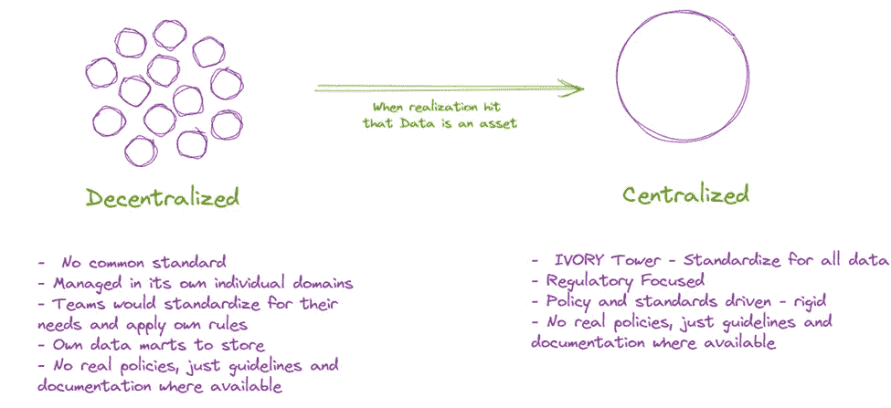
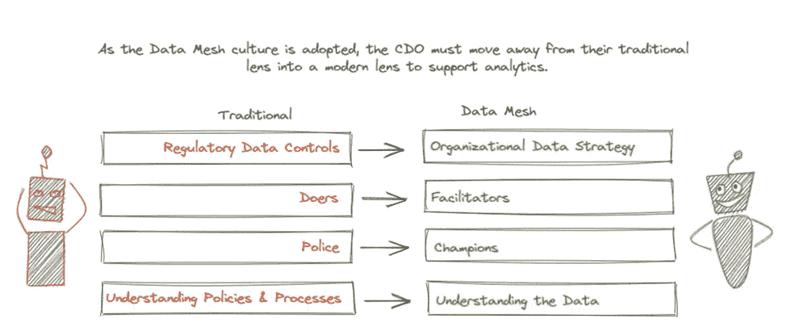
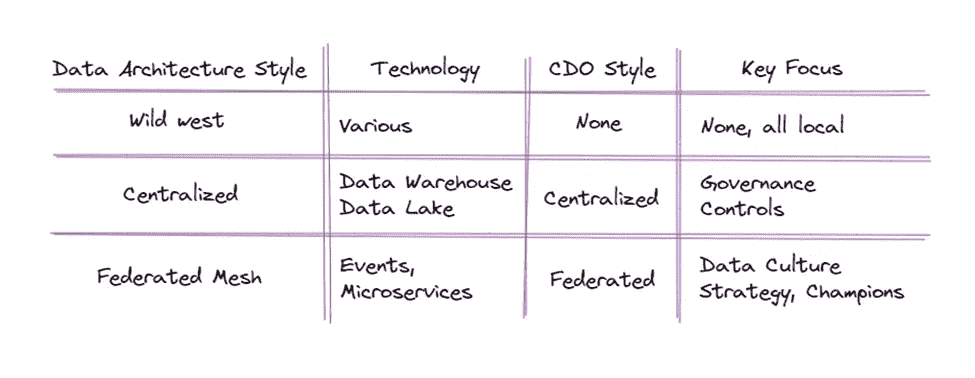

# CDO 在数据网格世界中的角色

> 原文：<https://towardsdatascience.com/the-role-of-the-cdo-in-the-data-mesh-world-f47af8ac7564>

# **CDO 在数据网格世界中的角色**

## **CDO 在数据网格世界中的角色**

首席数据办公室及其组织的相关性在很大程度上取决于组织如何看待其数据。如果数据是流程和系统的“副产品”,那么 CDO 组织将只是另一个功能，它只是给真实业务的整体运行率增加了不必要的成本。如果组织将其数据视为其资产之一和“皇冠上的宝石”，就像其关键流程和应用程序一样，CDO 将在塑造数据文化方面发挥更加突出的作用。数据科学极大地挑战了 CDO 的传统角色，世界需要重新思考 CDO 在分析世界中的真正价值。

Zhamak Dehghani 的数据网格挑战组织对他们的数据进行不同的思考。像对待产品一样对待它，以支持分析和数据科学。可以利用数据网格从根本上重新思考 CDO 组织。传统的 CDO 可以通过两种方式处理数据网格。第一种观点认为网状网络是对现状的严重威胁——它会扰乱 CDO 和相关数据管理团队的正常运营。第二个观点是，网格是一个令人兴奋的机会，有可能从根本上改变组织中的数据叙事，因此是一个应该逐步探索的东西。两种观点都是对的。做得好的话，数据网格将极大地改变 CDO 的运营，但这应该是一种积极的颠覆，让 CDO 不仅保持相关性，而且实际上成为业务的一个更重要的部分，并成为将数据文化嵌入组织的真正领导者。

要了解 CDO 如何发展以支持数据网格，需要了解 CDO 如何随着时间的推移而发展。

**CDO 觉醒**

CDO 出现在企业中，帮助管理组织生成和使用的数据。它们的结构和它们扮演的角色通常反映了企业内部数据的逻辑组织方式。

一个相当典型的演变如下图所示:

作者图片

作者图片

进化阶梯上的第一个状态可以委婉地称为“分散的”。这实际上是蛮荒的西部，每个人都随心所欲，没有重复使用，没有共同的标准。此时，业务的各个部分负责他们自己的数据—本质上几乎都是事务性的。每个业务部门都以自己的方式存储和管理自己的数据—银行存款业务部门保存与客户存款相关的信息，投资业务部门保存与客户投资相关的信息，等等。这导致多个事务性数据池分散在整个组织中，并与职能业务部门保持一致。

在发生数据管理活动的地方，他们主要关注他们持有的交易数据的数据质量和完整性。数据标准是存在的，但是倾向于非常关注集成——定义内部和外部共享数据的文件格式。总的来说，很少或根本没有尝试在整个组织内协调数据活动的策略，数据在很大程度上被视为业务活动的“副产品”。

不足为奇的是，数据控制和使用在发生的地方都是局部优化的，几乎没有跨组织单位的协同作用。这种方法具有高度的灵活性，每个业务部门都可以自由地按照自己认为合适的方式操作和处理数据，但是在整个组织中有效地操作数据的宏伟目标却因此受到了影响。随着跨企业数据的价值开始变得明显，这很快成为一个问题。随着在整个组织中有效使用数据的需求增长，对某种形式的集中控制以帮助管理和协调数据活动的需求也在增长，这导致了 CDO 的诞生。

下一次进化与前一次截然相反。随着公司开始了解他们持有的数据的价值以及对其进行良好控制的重要性，他们开始关注技术和治理机制，以使这种情况更容易发生。正是在这个时候，我们看到了两个相互支持的发展的出现——数据仓库和 CDO / DMO。通过集中整个企业的数据并根据严格的治理控制来维护数据，数据仓库变得强大起来。到目前为止，组织已经确定数据是真正有价值的，因此 CDO 创建了许多机制来确保数据的最高质量。钟摆已经完全翻转，以前的蛮荒西部已经被一个像机器一样组织良好、中央管理的政府所取代——包括它的缺点。

在这一时期，CDO 的重点是确保数据被准确地复制到数据仓库，并且从源到目的地受到良好的治理。数据管理者和数据保管者成为与实施的大量数据管理/治理流程交织在一起的角色。

随着数据湖(另一种形式的中央存储库)的出现，各地的 CDO 只是扩大了他们的权限，并像以前一样继续运营。现在，数据进入了湖泊和仓库，但是数据在组织中流动的方式(通常是批处理驱动的)以及管理和控制数据的方式变化很小。

**嗨，我是数据网格**

随着我们离今天越来越近，对数据的期望也呈指数级增长——数量、丰富程度、需求和用例都大幅增加。在这些需求和先进的数据和技术思想的重压下，集中式模型开始出现问题，领导者开始定义一种不同的方式来看待这个问题。因此出现了数据网格。

Zhamak Dehgani 创建了一个基于域的范式来管理数据资产，以获得更好的分析结果，称为数据网格，它极大地影响了 CDO 建立的集中式结构。

总之，数据网格是一种联合架构，其中数据从逻辑域而不是从集中存储中获得。这些域提供它们负责的数据，消费者从一个或多个域中提取这些数据以满足他们的目的。这是一种数据生态系统，其中数据由最了解数据、最有能力确保数据质量的人提供给消费者。

这种新的架构风格对任何在通用集中模式下轻松运营的 CDO 都有影响。也许数据网格体系结构最基本的方面是数据的所有权和责任被联合到理解、创建和管理数据本身的业务领域——专家。试图遵循许多 CDO 支持的更传统的数据治理模式只会导致模糊的界限、灰色区域、差距和各方之间不必要的摩擦。

**为数据网格支持的未来分析世界构建 CDO**

下一代 CDO 必须适应新的企业数据模式。数据网格需要一个有效的 CDO 函数来达到最佳效果，但这个 CDO 必须是一个与之前几代非常不同的实体。以前主要关注数据管理，现在必须更加重视数据领先。领导力与管理是一个多年来一直让管理咨询公司和智库忙碌的话题，因此我不会详细讨论这个话题，但对我来说，这一切都源于 CDO 的积极主动和代理水平。

本质上，CDO 必须将联邦视角引入联邦架构。他们必须成为一个团队，确保这些域不仅仅是它们各个部分的总和，CDO 带来了一些附加值，使数据网格能够在比其他方式更高的水平上运行。从许多方面来说，这意味着 CDO 必须准备好做得更多，而不是更少，尽管事实上他们当前的一些职责将被纳入到域中(例如，域级数据质量、域级数据治理等)。

作者图片

**成为推动数据议程向前发展的战略性变革思想家**

这不再仅仅是确保每个数据资产都有必要的管理控制。相反，CDO 必须是大局观思想家，他们了解数据对组织的价值，并不懈地创新和鼓励使用企业数据来识别、实现甚至成为新的商业机会。

CDO 的团队成员必须真正具有战略头脑，对数据充满热情，并具备与商业领袖并肩工作、共同探索机遇所必需的庄重态度和沟通技巧。仅仅在某人的职位上加上“战略”是不够的！

**成为推动者而不是实干家**

CDO 必须认识到，他们的持续成功不在于他们做了什么，而在于他们让什么发生。在网状架构中，CDO 的角色是帮助领导域联盟。CDO 必须成为“秘方”,使各个领域在单独工作和协同工作时更加有效。

CDO 的定位应该是支持领域数据团队的活动——利用他们的专业知识和权威来帮助交付领域议程。但是他们也必须愿意让领域来领导这些活动，并扮演更多的支持和指导角色。如果需要的话，CDO 应该派遣教练到领域中去促进活动和鼓励新的想法，就像敏捷教练帮助组织适应敏捷的工作方式一样。

CDO 应该在跨域的互操作性方面领先——这就是为什么网状网络是一个联合架构，而不是纯粹的分散架构。CDO 应该积极引导领域协同工作，并引入轻量级标准、框架和其他工具，使它们更容易做到这一点。这可以通过标准定义小组正式完成，也可以通过同行团体非正式完成，但必须始终以务实的方式完成，不要扼杀创新。CDO 必须记住，当领域成功时，他们也成功了，而且企业数据现在拥有了共享所有权。

**成为数据文化的冠军**

CDO 职能部门必须承担的最重要的任务之一是在整个组织中倡导数据文化。很多时候，数据被认为是次要问题，是真实业务活动的副产品，而不是实际的资产或产品。因此，至关重要的是，由 CDO 来领导将“热爱数据”的文化植入组织中的工作，以激励团队生成更多更好的数据，利用数据做出更好的决策，并探索新的创新方法来从数据中创造价值。

由于数据网格的特殊结构，这种数据文化的创建实际上变得更加容易。在网格中，领域专家成为他们自己数据的管理者，而不是有一个负责所有数据的中央机构。从本质上说，这意味着企业中有多个团队每天都在处理数据，将数据视为一种产品，并根据需求进行创新和发展。在这样的模型中，这些领域数据团队将在进一步传播数据文化中发挥作用，并通过网格在自己的特定领域和相互关联的领域中充当倡导者。在许多方面，这类似于让影响者团队中的每一个都影响组织中的特定群体。因此，CDO 的角色是驾驭这些努力，提供方向，并成为新的、普遍的数据文化的典范。

**实际了解数据**

在建立 CDO 和 DMO 时，关注的焦点通常是与管理数据相关的机械流程的成功运行，并且倾向于招聘流程操作员或所有者，而不是真正了解数据的人。虽然这在以前可能是令人满意的，但重要的是，CDO 要配备理解数据及其带来的价值的人员，而不仅仅是知道如何管理多年来建立的各种治理流程。虽然流程仍然很重要，而且会一直如此，但人们会期望 CDO 是真正的数据专家——即使他们遵从专业领域的专业知识。

**放眼企业之外**

数据网格模型通过离散的逻辑域提供数据，为组织提供了从其拥有的数据资产中获取更大价值的绝佳机会。但是他们不持有的数据资产呢？这是一个强大的 CDO 能够脱颖而出的地方。有效的数据网格依赖于合并来自多个领域的数据，并找到构建复合价值的新方法。因此，它自然地有助于添加更多的领域数据源，这一次是来自外部数据源，因为治理结构、技术和工作方式已经基本就绪。这有可能进一步增加数据对企业的价值——通过向外扩展其自身的影响力，并成为更广泛的数据生态系统的一部分。

总之，CDO 必须从治理职能转变为支持分析和数据文化的职能。

作者图片

作者说明:

# 感谢您的阅读！

非常感谢您通读整篇文章——这是我关于数据网格对现有组织的影响的第二篇文章，我希望能写得更多。

如果您有任何问题/想法或想要分享任何建设性的批评，非常欢迎您通过 [Nazia Shahrin](https://medium.com/u/39a9c63fc8b2?source=post_page-----f47af8ac7564--------------------------------) 联系我。我的 LinkedIn:【https://www.linkedin.com/in/naziashahrin/】T2

参考资料:

德赫加尼，扎马克(2019 年 5 月 20 日)。如何从单一数据湖转移到分布式数据网格。martinFowler.com。[https://Martin fowler . com/articles/data-monolith-to-mesh . html](https://martinfowler.com/articles/data-monolith-to-mesh.html)