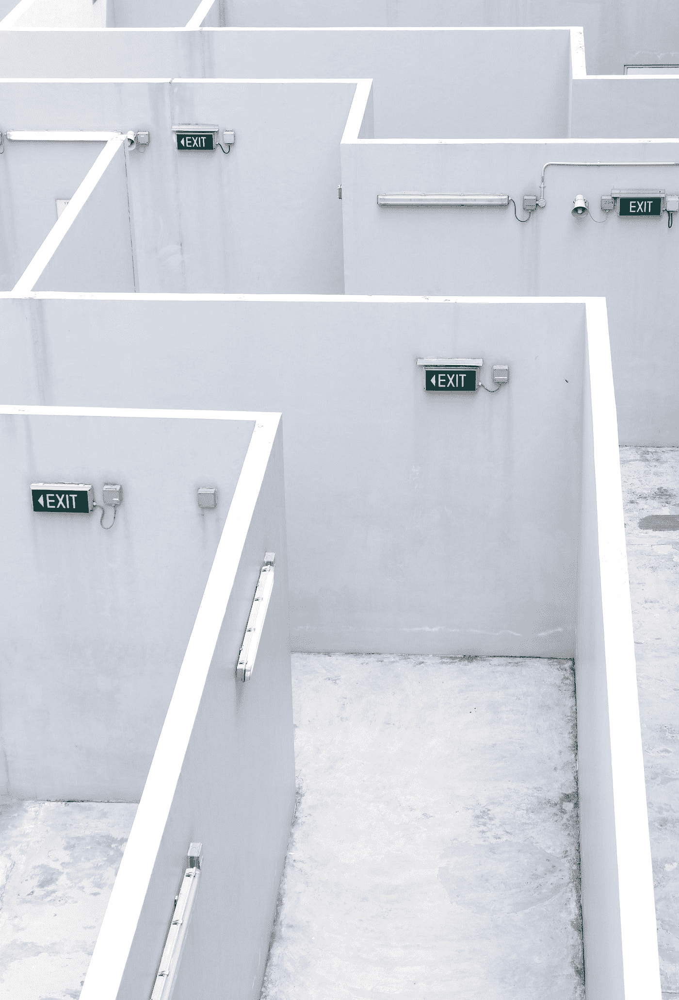
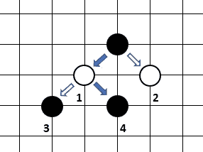

# AlphaGo 和 AlphaGo Zero 背后的科学

> 原文：<https://towardsdatascience.com/the-science-behind-alphago-and-alphago-zero-44aeef000448>

# AlphaGo 和 AlphaGo Zero 背后的科学

## 概念性的友好解释



[陈泰铭](https://unsplash.com/@raysontjr?utm_source=medium&utm_medium=referral)在 [Unsplash](https://unsplash.com?utm_source=medium&utm_medium=referral) 上拍照

# 背景

在我观看由谷歌研究实验室 [DeepMind](https://deepmind.com/research/case-studies/alphago-the-story-so-far) 开发的围棋计算机程序 AlphaGo 上的[纪录片](https://www.youtube.com/watch?v=WXuK6gekU1Y)之前，我不知道在 AlphaGo 之前，计算机程序还无法在专业水平上与人类棋手竞争。我天真地认为，计算机程序能够从游戏的特定状态简单地模拟每一个可能的移动序列(“穷举搜索”)，并选择具有最佳结果的移动。事实证明，由于可能的场景数量惊人，这甚至对于计算机也是不可行的。

这部纪录片只是简单地触及了 AlphaGo 背后的科学，我被这部纪录片迷住了，于是我转向 DeepMind 发表的研究论文，以了解用于开发 AlphaGo(以及 AlphaGo Zero，一个性能更好的 AlphaGo 版本)的机器学习技术。研究论文写得很好，但对于没有深度强化学习和蒙特卡罗树搜索知识的人来说，可能有点太专业了。尽管如此，这不应该阻止任何人抓住这些论文介绍的有趣概念和观察结果，因为人们普遍认为 AlphaGo 和 AlphaGo Zero 代表了开创性的机器学习应用。

写这篇文章的目的是用一种语言来解释 AlphaGo 和 AlphaGo Zero 背后的科学，这种语言让那些有兴趣了解他们如何在超人的水平上学会玩围棋的人理解，但可能会被强化学习或蒙特卡洛树搜索等术语所阻止。

# 简单的游戏规则，复杂的游戏方式

围棋的规则相对简单。游戏在棋盘上 19×19 的格子上进行，两名围棋手轮流在格子的交叉点上放置石头。如果被对手的石头包围，玩家的石头可以被捕获并从棋盘上移走。玩家的最终目标是用他们的石头在游戏板上包围尽可能多的区域。

然而，给定简单的规则，人类多年来已经发展出复杂的策略，以有效地走在周围的领土上。人类做出判断，例如评估现在形成坚固的领土和形成有助于在游戏后期建立影响力以获得领土的石头图案之间的权衡，识别连接不同石头组并防止它们被捕获的方法，等等。

从数学上来说，这个可能的移动序列(“搜索空间”)的数量大约是 250 ⁵⁰.这是因为为了决定一场围棋比赛的获胜者，棋手之间要进行大约 150 轮比赛，在给定的一轮中，每一步平均有大约 250 个合法位置。根据下面的 Python 代码，该数字有 360 位。

```
print(len(str(250**150)))
```

问题陈述实际上可以归结为寻找缩小搜索空间的方法，DeepMind 通过以下方式实现了这一点:

*   训练一个策略来指导从游戏的当前状态中值得探索的移动顺序。这减少了(250)个合法移动的搜索空间。
*   通过给定的棋盘位置训练游戏获胜者的预测器。这减少了(150)轮次的搜索空间。

# **政策**

如前所述，需要一个策略来指导计算机程序搜索值得探索的移动序列，以便它最大程度地模拟这些序列中的游戏。对于 AlphaGo 来说，这一策略是通过观察职业选手如何基于来自 [KGS Go 服务器](https://www.gokgs.com/)的 3000 万场比赛来训练的。本质上，这个策略(“策略 A”)允许 AlphaGo 模仿人类职业比赛。

策略 A 的输出是合理移动的概率分布。为了用一个简单的例子来解释这一点，假设我们正在用下面游戏棋盘中的白石头进行下一步棋，策略 A 可能建议两种可能的棋，棋 1 和棋 2，概率分别为 60%和 40%。60%和 40%将基于人类职业游戏的历史，由此给定游戏的当前状态(即，具有一个黑石的棋盘)，人类职业玩家在 100 次中已经移动 1 60 次(并且在 100 次中移动 2 40 次)。


图 1:策略网络演示。作者图片

然而，凭直觉，即使是职业棋手的模仿，也不一定能让计算机程序在围棋比赛中胜出。然后，策略 A 通过**的自我游戏**进行精炼，由策略 A 指导的两个计算机程序(最初)相互对抗，直到确定赢家。策略 A 将被更新以反映这个博弈的结果，成为策略 A 的更好版本。

有人可能会问，这如何提高政策的绩效。使用与上面相同的例子，计算机程序 A 可以选择进行移动 1，而计算机程序 B 可以选择相同的移动，或者选择**探索**移动 2，因为策略 A 最初应该引导计算机程序进行 100 次移动 1 60 次和 100 次移动 2 40 次。随着这种情况在游戏的每个回合都发生，可以证明移动 2(或者更一般地，在策略 A 下不一定达到最高概率的移动)将最终导致计算机程序 B 获胜，在这种情况下，两个移动的概率可以被更新。在这种情况下，在给定游戏结果的情况下，进行移动 1 的 60%概率减少，同时进行移动 2 的 40%概率增加。同样的过程在数百万次自我游戏中反复重复，直到形成接近最优的策略 B。理论上，策略 B 分配给一步棋的“学习”概率越高，这步棋导致的博弈结果就越好。

退一步说，我观察到，自我对弈隐含地奖励了人类职业棋手的发现，这在一定程度上促成了 AlphaGo 的成功。

# 预测器

预测器输出单个值，指示在给定游戏状态(即当前棋盘位置)的情况下玩家获胜的可能性。

用于训练预测器的数据通过自玩再次收集，这一次是在两个计算机程序之间，这两个程序都由策略 b 指导。在自玩的特定游戏中，收集许多棋盘位置和游戏结果(即，赢或输)。通过足够多的自玩游戏，预测器可以被训练为以良好的准确性告知在特定棋盘位置的玩家赢得游戏的概率。也就是说，它告知游戏的当前状态(和后续状态)对玩家进行下一步棋有多有利。

# 走一步棋——alpha go

概括地说，到目前为止，我们已经培训了以下内容:

*   基于人类职业游戏的最佳策略
*   策略 B，它根据策略 A 发起的自我游戏来通知最佳移动
*   预测器，根据游戏的当前状态通知玩家获胜的可能性

为了选择下一步棋，AlphaGo 从游戏的当前状态开始执行 *N* 次模拟。简单介绍一下模拟，在我的工作中，模拟不仅有助于理解特定事件的平均结果(例如，平均索赔成本)，而且有助于理解可能结果的范围(例如，每 200 年发生一次的不利索赔事件的成本，可以从 200 次模拟中返回最高索赔金额的模拟中获得)。在围棋中，模拟的走法序列假设你和你的对手会选择最佳走法，直到游戏结束。此外，模拟增加了选择一系列移动的随机性，这一点很重要，因为我们确实想探索可能没有被策略看到或引导的移动。

对于 AlphaGo 来说，在一个特定的模拟中 *n，*要模拟的走法顺序主要由以下几个因素控制:

1.  特定序列被访问的次数
2.  之前在特定动作序列中获胜的经验

我将用一个简单的例子来解释这两个要点。让我们假设在之前的模拟 *n -1* 中，在**策略**的指导下，选择了第一步之后是第四步的顺序(由下图中的蓝色实心箭头表示)，并且基于第四步的游戏状态，预测器通知获胜。也就是说，这个特殊的模拟序列导致了胜利。



图 2:移动选择演示。作者图片

对于当前的模拟，AlphaGo 识别出已经访问了移动 1 之后是移动 4 的序列，然后它将驱动模拟更可能采用以前没有访问过的其他序列，例如移动 2，或者移动 1 之后是移动 3。这样做是为了鼓励探索。

另外，由于移动 1 后跟随移动 4 的顺序导致了上一次模拟中的胜利，它也将驱动模拟在当前模拟中采用这一特定顺序(反之亦然，即失败)。这有时被称为**剥削**。

我想强调一下上面提到的一些有趣的结果:

*   在游戏开始时，当 a 玩家有更多的选择来放置下一颗石头时，AlphaGo 鼓励搜索人员**探索**，因为先前的获胜经验是不确定的，因为即使在政策的指导下，下一步最好的棋也有很大的搜索空间。
*   相比之下，当棋盘上合理地填满了石头时，来自策略或预测者的先前获胜经验会变得更有影响力，因为 AlphaGo 会推动一系列移动，从而导致最有可能获胜的状态或棋盘位置。这个**利用了**以前从人类专业人员以及自我游戏中获得的经验。
*   我觉得有趣的是，模拟中的探索通常是由策略 A 而不是策略 B 指导的，因为人类的智能被认为是更加多样化的，机器无法完全学习。AlphaGo 策略 B 的主要用途是训练预测器。

在进行了 *N* 次模拟后，AlpohaGo 选择了访问次数最多的移动顺序(尽管只有第一个顺序是相关的)。默认情况下，这应该是在勘探和开发之间取得正确平衡的举措。

# 开始行动——alpha go Zero

简而言之，AlphaGo Zero 是 AlphaGo 的更好版本，“Zero”强调了与人类专业游戏的解耦。

虽然 AlphaGo Zero 的整体(训练)结构在很大程度上与 AlphaGo 一致，但它们的主要区别在于:

1.  AlphaGo Zero 的策略和预测器完全是靠自弹自演训练出来的。也就是说，在训练 AlphaGo Zero 时没有使用人类输入，如人类专业游戏。
2.  AlphaGo 架构使用了许多“手工制作”的功能。例子是空的相邻点的数量和捕获的石头的数量。这些在 AlphaGo Zero 中被删除，它只使用原始棋盘位置作为输入。
3.  Alpha Go Zero 结合了大部分策略和预测模型。也就是说，他们是一起受训的。
4.  在 AlphaGo Zero 下训练的预测器进一步减少了模拟中的回合数。这在一定程度上加快了 AlphaGo Zero 的训练速度。

总的来说，AlphaGo Zero 是机器学习更通用的应用，相比 AlphaGo 结构更简单，人机交互更少。DeepMind 认识到，人类在围棋游戏中的知识可以通过单独的自我游戏**和随机策略发起的**来学习(并超越)。事实上，AlphaGo Zero 仅用了 40 个小时的训练就超过了 AlphaGo 的表现。

我发现这很有趣，但同时也很直观。让我们假设总有一个最优策略来引导玩家稳赢。给定我们的当前策略(很可能是一个随机的表现不佳的策略)，通过自我游戏的迭代，随着时间的推移，当前策略应该逐渐收敛到最优策略。

用另一个简单的例子来说明，在下图所示的博弈状态中，我们假设最优策略的概率分布为(100%，0%)，也就是说，采取行动 1 肯定会赢。另外，为了简单起见，我们假设游戏从当前状态一步结束。为了了解最优策略，如果我们通过自玩游戏的互动，分别从移动 1 和移动 2 的随机策略(50%，50%)开始，随机策略将总是收敛到最优策略，因为在每次自玩游戏中，策略将随着移动 1 的进行而更新以增加移动 1 的概率，反之亦然。

在 AlphaGo 下，我们以上面的(50%，50%)开始自玩的随机策略可能更接近策略 A 下的最优策略(例如(90%，10%))，因为它是基于人类职业游戏形成的。然而，AlphaGo Zero 证明了无论我们如何启动策略，机器总是可以通过与先前版本的策略进行博弈来学习迭代地改进策略，并最终找到接近最优策略的代理。


图 3:自学演示。作者图片

# 人类直觉的学习

正如 DeepMind 的研究论文所示，在 AlphaGo Zero 接受训练时，它学会了玩一些“普通角球序列”，这些策略是由人类开发并经常玩的，而不需要像 AlphaGo 一样“观察”人类专业人士如何玩。令人着迷的是，在这些策略被发现后的几个小时内，一些策略被忽略了，因为它发现了新的和据称更好的变化。

此外，在训练的早期，AlphaGo Zero 像人类初学者一样，专注于尝试立即捕捉对手的石头。这与展示更平衡的策略和随着自我游戏的继续掌握游戏的基本原理相比。

# 摘要

在这篇文章中，我用一些简单的例子解释了 AlphaGo 和 AlphaGo Zero 是如何被训练来选择最佳走法的。在高水平上，AlphaGo 和 AlphaGo Zero 通过有效地减少下一个最佳步骤的搜索空间的呼吸和深度，成功地实现了超人的性能。

关于 AlphaGo 和 AlphaGo Zero 的运行方式，有许多发人深省的观察，我想再次强调一下:

*   尽管 AlphaGo Zero 并不依赖人类知识(即策略 A，尽管策略 B)，但人类知识在 AlphaGo 搜索下一步最佳棋时具有更大的影响力，因为人类往往会选择“一系列不同的有前途的棋步”，尤其是在游戏的早期阶段，玩家往往会探索更多。
*   Alpha Go 和 AlphaGo Zero 背后的走法选择是由一个政策引导的，但同时鼓励违背政策建议的探索。在哲学层面上，它告诉我们，有时我们不应该害怕选择让我们走出舒适区的道路，这可能会更有回报。
*   模拟或采样一系列动作有助于形成最佳策略。这与随机森林算法优于单个决策树的优势没有什么不同。你永远不知道在未知的道路上会发现什么！

以下是我从上述观察中得到的一些自我反思。

## **完美与实用**

想象一下，我们确实有一个计算机程序，它可以进行彻底的搜索，寻找最佳的走法，并在每个回合都打出完美的走法。这有必要吗？

在许多商业应用中，某些任务达到 100%准确率的边际收益(相比之下，比如说 95%的准确率)可能不会超过收益递减的成本。例如，训练一个 0.05 或 5%精度改进的模型可能需要 10 倍的时间。另一个例子是，在职业锦标赛中，以 4 比 1 或 5 比 0 击败 Lee Sedol 是否有助于决定获胜者。

## 指导与说明

执行某项任务的政策或指令可能是一把双刃剑，在某种意义上，它为用户提供了指导，也带来了限制。AlphaGo Zero 通过删除先前被认为对训练 AlphaGo 有价值的人类知识，实现了更好的性能，这证明了这一点。

作为人事经理，我有时会根据自己的经验对完成任务的最佳方式有一个主观的看法，并倾向于根据这一看法向我的直接下属提供和执行这样的指示。指令可能更受过程驱动，而 AlphaGo 和 AlphaGo Zero 的成功告诉我，通过关注最终目标(或机器学习语言中的奖励)来领导更有效，允许人们“搜索”并学习完成任务的最佳方式。

## **勘探与开采**

AlphaGo 和 AlphaGo Zero 背后的科学让我想起了生活中发生的事情。难道我们不都倾向于**探索**以获得经验，然后**利用这些经验**来做决定吗？

最后，对于有兴趣深入了解 AlphaGo 和 AlphaGo Zero 技术方面的读者，我推荐阅读这篇[文章](https://jonathan-hui.medium.com/alphago-how-it-works-technically-26ddcc085319)。

# 参考

[1] Silver，d .，Huang，a .，C. *等*用深度神经网络和树搜索掌握围棋博弈。*自然* **529，**484–489(2016)，[https://storage . Google APIs . com/deepmindmaedia/alpha go/alpha gonaturepaper . pdf](https://storage.googleapis.com/deepmind-media/alphago/AlphaGoNaturePaper.pdf)，2022 年 1 月 25 日获取

[2] Silver，d .，Schrittwieser，j .，Simonyan，K. *等*掌握无人类知识的围棋博弈。*自然* **550，**354–359(2017)。https://doi.org/10.1038/nature24270，2022 年 1 月 26 日访问