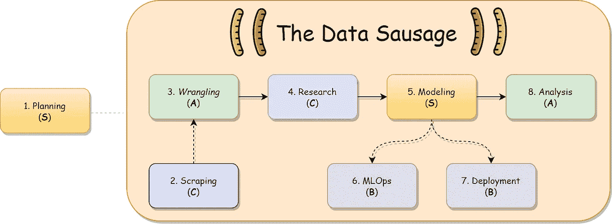

# 数据科学项目的框架

> 原文：<https://towardsdatascience.com/the-skeleton-of-a-data-science-project-1559138480d0>

## 从头到尾，我们讨论了令人毛骨悚然的数据内部结构，它们创造了漂亮的图形、报告和见解

播放侏罗纪公园的音乐。乔恩·巴特沃斯在 [Unsplash](https://unsplash.com?utm_source=medium&utm_medium=referral) 上的照片

一个数据门外汉走进一个数据项目架构会议，肯定会很快被工程、数学、研究和统计淹没。再加上关于模型部署和拒绝处理代码的 GPU 的激烈讨论，就有了完美的信息风暴。

在一天结束的时候，它将会被整合成一根*数据香肠*，在这里你看起来会忘记所有独立的部分，但仍然非常美味可口。

为了充分理解数据项目创建的一般过程，我们需要将它分成关注的领域:每个步骤的输入和输出是什么，谁负责，以及我们应该知道什么工具才能有效地工作。

但是首先，让我们先做一些描述:**什么是数据项目？**简而言之，数据项目的目标是处理原始数据，使用某种聚合/组合/统计模型丰富原始数据，并以最终用户可以理解的方式交付原始数据。

 [## 构建数据解决方案的基础

### 第一章。关键数据项目类型和注意事项任何成功的数据项目的基础是清楚地了解…

www.oreilly.com](https://www.oreilly.com/library/view/foundations-for-architecting/9781492038733/ch01.html) 

我们可以进一步分离一个数据项目:一个这样的分离是在 **OSEMN** 框架中(获取、清理、探索、建模、解释),它处理了上面抽象描述的几乎所有事情。对于数据科学家来说，这是一个创建独立项目的好方法，但是它仍然缺乏从开发到生产的途径。

 [## 数据科学项目生命周期的 5 个步骤

### 通常，当我们谈论数据科学项目时，似乎没有人能够给出一个可靠的解释来说明…

towardsdatascience.com](/5-steps-of-a-data-science-project-lifecycle-26c50372b492) 

# 香肠

最终的项目/味道可能包含任何这些步骤/味道。每个步骤也有一个基于字母的层次，表明它对项目的整体重要性。图片由我制作，以图表形式完成。

我们来解剖一下前面提到的香肠。您可能会注意到，OSEMN 步骤与本文中讨论的步骤有所重叠:

1.  这一切都从**计划**阶段开始，在那里你描述你的项目的目标，每个处理步骤的输入和输出，以及你的团队在其中的角色。
2.  如果我们手头没有原始数据，我们必须从某个地方**搜集(获取)** 数据，无论是从 API 还是网页。
3.  原始数据的格式化是在**争论(擦洗**)阶段完成的。
4.  有时我们需要那种最先进的模型，那是在**研究**阶段制造的。
5.  一切就绪后，我们可以开始**建模(探索/建模)**。
6.  去镇上的工程区！我们需要使用 **MLOps** 来关注我们模型的生命周期…
7.  并且**在生产环境中部署**我们的解决方案。
8.  最后，我们收集丰富的数据，并使用仪表板和报告对其进行分析。

## 规划(必备)

规划一个数据项目意味着将原始信息为了变成可操作的知识而需要跟踪的路线写在纸上。这是通过会议和大量描述业务需求的文档(文本和视觉)来完成的，如何通过科学和工程工作来转化这些需求，项目的总体范围是什么，以及谁负责什么。

 [## 规划数据项目|在线数据素养培训| Kubicle

### 在接下来的几课中，我们将学习数据分析项目应该如何工作。但是，我们不会…

kubicle.com](https://kubicle.com/learn/data-literacy/data-literacy-thinking-and-communicating-with-data-planning-a-data-project) 

这是一个团队的努力:科学家知道什么模型可以用于这项任务；工程师知道如何管理数据，并将数据从一个过程发送到另一个过程；PM 范围和时间盒。在这里，通才通常比专家更有价值:将来自多个领域的知识联系起来，可以减少产生孤立的机构知识的机会。

参与规划的人的工具箱包括:

*   项目管理工具( **JIRA** 、**泰加**、**观念**)来计划任务和目标；
*   图表工具(**米罗**、**露西德查**、**diagrams.net**)创建可视化文档；
*   要遵循的项目描述模板(**征求意见**)。下面的链接是一个数据科学项目 RFC 的例子:建模的抽象部分描述得非常好，但它也可以使用时间框和更好的分步实现描述。

 [## RFC 021:管道中的数据科学

### https://labs.wellcomecollection.org/feature-similarity。这有很大的缺点:数据重复，过时…

docs.wellcomecollection.org](https://docs.wellcomecollection.org/developers/rfcs/021-data_science_in_the_pipeline) 

## 刮擦(C-情景)

在某些情况下，你手头没有你需要的原始数据。这意味着您需要制定一个流程，通过 API 从数据供应商那里或者甚至从 Web 本身那里抓取数据。

这与软件工程人员更有关系，但对于对从基本上任何他们想要的东西制作概念证明感兴趣的数据科学家来说，这可能是一笔很好的资产(当然，要尊重你的国家关于个人数据的法律)。

刮刀工具包包括:

*   易于部署的刮痧框架( **Scrapy** ，**木偶师**)；

 [## 一个极简的端到端的零碎教程(第一部分)

### 通过 Scrapy 为初学者抓取网页

towardsdatascience.com](/a-minimalist-end-to-end-scrapy-tutorial-part-i-11e350bcdec0) 

*   查询 HTML 文档的语言( **XPath** 或**CSS**)；
*   在本地或云中保存原始数据的管道( **Scrapy 管道，AWS 消防软管，GCP 数据流**)；
*   原始数据查询和管理( **AWS Glue/Athena** )。

 [## Web scraping @edge，AWS Kinesis Data fire hose & Glue-Vittorio Nardone

### 什么是「网页抓取@edge」或者「内网网页抓取」？从私人网站提取数据的能力，即从…

www.vittorionardone.it](https://www.vittorionardone.it/en/2020/12/15/web-scraping-edge-aws-kinesis-data-firehose-glue/) 

## 争吵(有助于你的日常工作)

争论数据的行为意味着*对数据*进行打孔，直到它符合您的数据库建模。标准化、映射、清理、结构化……这一切都属于数据争论的范畴。

数据工程师通常主要负责基本的数据争论活动，管理表的血统及其结构完整性。

但我们也可以将这种活动与科学家通常对其数据集进行的预处理数据进行比较，以便训练和预测模型:L2 归一化、一键编码……这是*局部*争论(仅在模型上下文中使用)而不是*全局*争论(公司中的任何人都使用)。

牧马人的工具包包括靴子、套索和:

*   **SQL** 。牧马人的大部分工作将通过 SQL 查询完成，通过视图和过程导出数据，以及一般的优化。了解几个数据库的语法( **PostgreSQL** 、 **MySQL** 、 **Presto** )以及了解一个管理你的数据模型的工具( **DBT** )会给你的日常生活带来福音；

 [## SQL |高级 SQL 模式的数据争论

### 从这里开始？本课是使用 SQL 进行数据分析的完整教程的一部分。看看开头…

mode.com](https://mode.com/sql-tutorial/data-wrangling-with-sql/)  [## dbt 实践教程

### 通过只编写 SQL SELECT 语句，将 dbt 用于复杂的数据转换。运行测试，生成文档，使用…

towardsdatascience.com](/a-hands-on-tutorial-for-dbt-f749f7749c8d) 

*   你选择的语言的数据操作库(例如 Python 的 **Pandas** ，Scala 的**Spark**)；
*   数据验证概念和工具(**远大前程，Pytest** )。

 [## 如何满怀期望地测试您的数据| DigitalOcean

### 作为“为捐赠而写”计划的一部分，作者选择了“技术多样性基金”来接受捐赠。在…

www.digitalocean.com](https://www.digitalocean.com/community/tutorials/how-to-test-your-data-with-great-expectations) 

## 研究(C——情境)

大多数数据科学项目不需要最先进的准确性指标。对于那些这样做的人，我们需要研究和深入研究学术论文和博客，以精心制作一个接近任务目标的模型。

理论上，这种类型的研究应该由专注于学术知识领域的 ML 研究人员和数据科学家来完成。在实践中，数据科学家通常被期望帮助项目的其他方面(争论、部署、分析),并且也做研究，这使得数据科学的开发稍微复杂一些。

作为研究人员，您的日常生活包括:

*   了解如何对学术文章进行搜索和编目(**门德利**、 **arXiv** 、**谷歌学术**)；

 [## 门德利-参考管理软件

### 只需点击几下鼠标，就可以直接从浏览器添加论文，或者从桌面导入任何文档。访问您的资料库…

www.mendeley.com](https://www.mendeley.com/) 

*   具备一定的神经网络建模框架知识( **Pytorch** 、 **Tensorflow** 、**Keras**)；

 [## PyTorch 深度学习:60 分钟闪电战- PyTorch 教程 1.11.0+cu102 文档

### 作者:Soumith Chintala PyTorch 是一个基于 Python 的科学计算包，有两个广泛的用途:一个是

pytorch.org](https://pytorch.org/tutorials/beginner/deep_learning_60min_blitz.html)  [## Keras 教程:Python 深度学习的终极初学者指南

### 在这个循序渐进的 Keras 教程中，您将学习如何用 Python 构建卷积神经网络！事实上，我们会…

elitedatascience.com](https://elitedatascience.com/keras-tutorial-deep-learning-in-python) 

*   使用 GPU 加速处理来加速那些繁重的网络( **CUDA** /NVIDIA，**ROCm**/AMD)；

 [## ROCm 学习中心- ROCm 4.5.0 文档

### Google 是 Google LLC 的注册商标。PCIe 是 PCI-SIG 公司的注册商标。Linux 是…

rocmdocs.amd.com](https://rocmdocs.amd.com/en/latest/Tutorial/Tutorial.html) 

*   使用所有与建模相关的工具…

## 建模(必备)

这是项目的关键，也是数据科学家日常生活的主要部分:创建从数据中产生知识的模型。这可以使用 ML 来完成更复杂的任务，但也可以使用基本的统计、聚合和变量组合来完成！有时，一个包含少量计算的 Excel 表格可能是解决问题的理想方案。

但是抛开基本的统计知识，做建模需要哪些工具呢？

*   通用领域的基本建模框架( **scikit-learn** 用于一般的建模， **spaCy** 用于语言处理， **OpenCV** 用于计算机视觉，以及预先训练好的模型库，如 **Keras 应用**)；

 [## 空间 101:所有你需要知道的空间使用文档

### 最重要的概念，用简单的术语解释，不管你是 spaCy 的新手，还是只想温习一些…

空间. io](https://spacy.io/usage/spacy-101) 

*   用于日常建模任务的高级自动化工具( [**Pycaret**](https://www.datacamp.com/tutorial/guide-for-automating-ml-workflows-using-pycaret) 和 [**AutoML**](https://cloud.google.com/vision/automl/docs/tutorial) 用于预处理和模型选择， **SweetViz** 用于探索性数据分析)；

 [## 使用这 10 个库自动进行探索性数据分析

### 什么是探索性数据分析自动化探索性数据分析的需求是什么

www.analyticsvidhya.com](https://www.analyticsvidhya.com/blog/2021/04/top-python-libraries-to-automate-exploratory-data-analysis-in-2021/) 

*   这里也需要像 **Pandas** 和 **Dask** 这样的数据操作工具；
*   如果你有太多的数据，并行处理是必不可少的: **Spark** 是实现这一点的最简单的方法，而 **Databricks** 可以帮助你适应笔记本电脑和管理集群。

 [## 作为数据科学家开始使用 Databricks

### 本教程将引导您使用 Databricks 数据科学与工程工作区来:创建集群和

docs.databricks.com](https://docs.databricks.com/getting-started/quick-start.html) 

*   其他笔记本服务工具也很有用(JupyterLab，Sagemaker)。

## MLOps

MLOps 是机器学习和 DevOps 之间的结合点:管理数据应用程序整个生命周期的工具和技术。从数据接收到部署，它是将这个故事中的所有步骤与可观察性实践、部署策略和数据验证连接起来的粘合剂。

这是每个参与数据项目的人都应该顺便知道的事情:了解 MLOps 的数据科学家将创建具有适当日志记录、模块化设计和实验跟踪的可维护模型；数据工程师将能够轻松地编排这些模型，并以连续的方式部署它们。

有几个库和工具可以使 MLOps 变得更加容易。

*   MLOps 的基础在于存储您的 ML 实验参数和结果。为此，您可以使用**权重&偏差**或 **mlflow** :这两者都可以轻松集成到您的模型训练代码中，并且可以立即生成有趣的报告。

 [## 一个完整的重量和偏见教程|人工智能夏天

### 重量和偏见已经成为人工智能社区最喜欢的图书馆之一。该团队完成了出色的工作，创造了…

theaisummer.com](https://theaisummer.com/weights-and-biases-tutorial/)  [## 使用 MLFLOW 的机器学习工作流-初学者指南-分析 Vidhya

### 本文作为数据科学博客的一部分发表，本文将涵盖以下主题…

www.analyticsvidhya.com](https://www.analyticsvidhya.com/blog/2021/07/machine-learning-workflow-using-mlflow-a-beginners-guide/) 

*   如果你在你的 ML 管道中使用 Kubernetes，你应该看看 **Kubeflow** :它使用 K8s 的所有可伸缩性来处理模型的整个生命周期。

 [## 快速入门

### Kubeflow Pipelines 入门如果您想了解 kube flow Pipelines 用户，请使用本指南…

www.kubeflow.org](https://www.kubeflow.org/docs/components/pipelines/overview/quickstart/) 

*   如果你已经在某种程度上使用了气流，看看**元流**。它允许您使用类似 DAG 的代码模块化您的训练步骤。

 [## 10 分钟学会元流——网飞的数据科学 Python/R 框架

### 花更多时间建模，花更少时间管理基础架构。实践教程。

towardsdatascience.com](/learn-metaflow-in-10-mins-netflixs-python-r-framework-for-data-scientists-2ef124c716e4) 

*   如果你想专注于云提供商，你也可以选择他们自己的 ML 部署套件，如 **AWS Sagemaker** 或 **GCP 数据实验室**。

## 部署

在部署阶段，我们需要将我们的模型移植到当前的架构中。这主要是数据工程的责任，但数据科学家必须随时准备与他们一起工作，以调整他们的代码:在 Docker 环境中安装一个由 GPU 驱动的库，确保 AWS 批处理作业使用其实例的 100%的处理能力。

在这一步提高技能的最好方法是了解管道工具的一般原型，以及它们在其他云中的相似之处。Satish Chandra Gupta 有一篇关于它的精彩文章，去看看吧！

 [## 基于云的高吞吐量低延迟大数据管道架构

### 对于分析和 ML 的成功，可扩展和高效的数据管道与可靠的供应线一样重要…

towardsdatascience.com](/scalable-efficient-big-data-analytics-machine-learning-pipeline-architecture-on-cloud-4d59efc092b5) 

*   通常，ML 相关的东西应该在 **Docker** 镜像中运行:为了训练/推理代码正确运行，需要预先安装大量的系统和 Python 库。
*   你可以在 **EC2/Compute** 机器中手工执行那些代码，将它们包装在**无服务器**服务中，如 **AWS Batch** 或 **GCP 云函数**，使用 **Databricks** 等外部平台，并通过**气流**触发笔记本……
*   为了让您的部署看起来像一个微服务，您可以使用消息队列系统来定义输入和输出通道，例如 **ActiveMQ、Kafka、SQS、Pub/Sub** 。

 [## Apache Kafka + KSQL + TensorFlow 通过 Python + Jupyter 笔记本提供给数据科学家…

### 为什么数据科学家会在一个笔记本中同时使用 Kafka Jupyter Python KSQL tensor flow？有一个…

www.datasciencecentral.com](https://www.datasciencecentral.com/apache-kafka-ksql-tensorflow-for-data-scientists-via-python/) 

*   要将这一切投入生产，基础设施即代码(IaC)工具对于一个合理的 CI/CD 过程是必不可少的: **Terraform** 和**无服务器**包是您的基础设施和应用程序部署的好伙伴。

 [## 将 Terraform 用于无服务器框架的权威指南

### 如果您的组织使用自动化来管理云基础架构，您几乎肯定听说过 Terraform。还有…

www.serverless.com](https://www.serverless.com/blog/definitive-guide-terraform-serverless/) 

## 分析

这是管道的尽头！有了这些经过处理的数据，我们就可以开始将它们咀嚼成易于理解的仪表板和报告，这样我们就可以从中获得可操作的见解。在这一部分，我们能够将业务度量与建模度量联系起来:我们的模型结果是否向我们的客户交付了我们期望的特性？

 [## 如何评估一个机器学习模型的商业价值

### 最难的事情是保持事情简单，这在数据科学中也是如此。在任何数据科学项目中…

www.analyticsvidhya.com](https://www.analyticsvidhya.com/blog/2021/09/how-to-evaluate-the-business-value-of-ml-model/) 

这部分的责任主要在数据分析师的手上，他们的能力涉及统计(理解数据)、仪表板(创建报告)和用户体验(创建*好的*报告)。数据科学家也是这个过程的一部分，通过讲故事，解释他们的模型结果和目标。

*   最好的数据分析工具是我们已经熟悉的套件: **Tableau、Looker、PowerBI** 。这些价格昂贵，但非常值得他们的许可费。Apache 超集是一个开源的选择。
*   仪表板工具对于分析过程也很有用:我个人使用过很多**元数据库**，带有到各种数据库的连接器和一个简单的部署脚本。也可以对 **Redash** 和 **Google Data Studio** 感兴趣。
*   但是这一步最好的工具不是具体的工具:**业务领域知识**对于了解客户需求和可能的数据相关特性之间的联系是必不可少的。

数据项目通常是有风险的工作，但是通过适当的计划、工具包和角色定义，我们可以最大限度地缩短从构思到执行的时间。如果你想增加你作为开发人员的影响和范围，开始寻找学习邻近领域的资源(例如，如果你知道如何争论，你可以在你的建模印章上工作，或者看看你的摄取管道如何工作)。

这个故事是我在[# the deviconf 2022，TDC Connections](https://thedevconf.com/tdc/2022/connections/) 中所做演讲的总结。