# PDP 和 ICE 绘图的最终指南

> 原文：<https://towardsdatascience.com/the-ultimate-guide-to-pdps-and-ice-plots-4182885662aa>

## **部分依赖图和个体条件期望图背后的直觉、数学和代码(R 和 Python)**

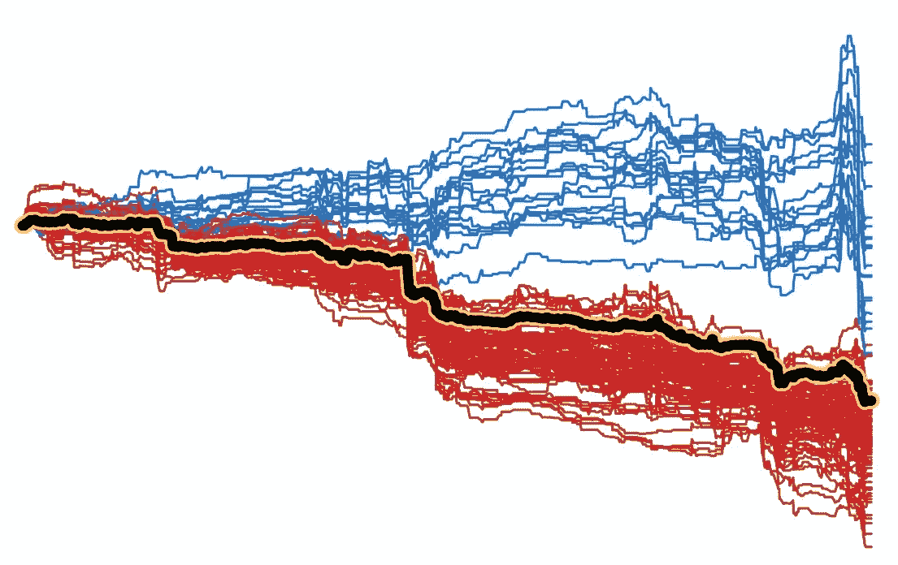

(来源:作者)

PDP 和 ICE 图都可以帮助我们理解我们的模型如何做出预测。

使用**PDP**，我们可以可视化模型特征和目标变量之间的关系。他们能告诉我们一段关系是线性的、非线性的还是没有关系。

类似地， **ICE Plots** 可以在特征之间存在交互时使用。我们将深入研究这两种方法。

我们从**PDP**开始。我们将带您**一步步**了解 PDP 是如何创建的。你会发现它们是一种直观的方法。即便如此，我们也要解释一下 PDP 背后的**数学**。然后我们继续前进到**冰原**。您将会看到，如果对 PDP 有很好的了解，这些都很容易理解。在此过程中，我们讨论了这些方法的不同应用和变体，包括:

*   连续和分类特征的 PDP 和 ICE 图
*   二元目标变量的 PDP
*   2 个型号特性的 PDP
*   衍生 PDP
*   基于 PDP 和 ICE 图的特征重要性

我们一定要讨论这两种方法的**优点**和**局限性**。这些是重要的部分。它们帮助我们理解什么时候方法是最合适的。它们还告诉我们在某些情况下它们会导致不正确的结论。

最后，我们将带您浏览这些方法的 **R 和 Python 代码**。对于 R，我们应用 [**冰箱**](https://cran.r-project.org/web/packages/ICEbox/ICEbox.pdf) 和 [**iml**](https://cran.r-project.org/web/packages/iml/iml.pdf) 包来创建可视化。我们还使用 [**vip**](https://www.rdocumentation.org/packages/vip/versions/0.3.2) 来计算特征重要性。对于 Python，我们将使用 scikit-learn 的实现，[**partialdependicedisplays**](https://scikit-learn.org/stable/modules/generated/sklearn.inspection.PartialDependenceDisplay.html)。您可以在这些部分找到带有代码的 GitHub repos 的链接。

# 部分相关图

我们从 PDP 的逐步演示开始。为了解释这种方法，我们随机生成了一个包含 1000 行的数据集。它包含了二手车销售的细节。你可以在**表 1** 中看到这些特性。我们希望使用前 5 个特征来预测汽车的**价格**。你可以在 [Kaggle](https://www.kaggle.com/datasets/conorsully1/pdp-and-ice-plots) 上找到这个数据集。

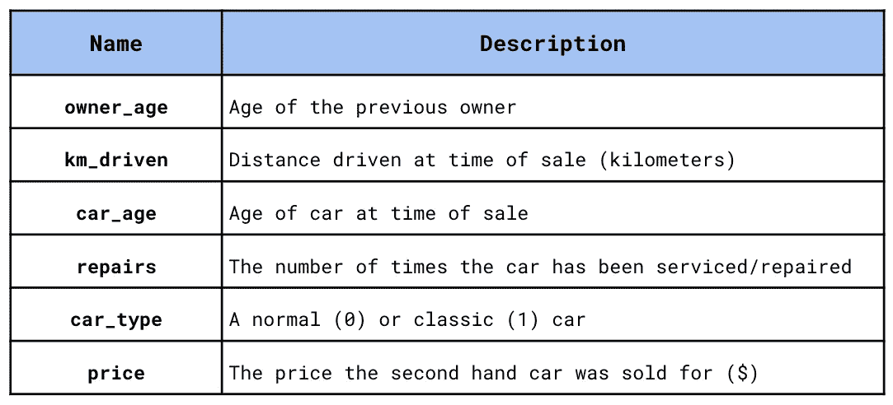

表 1:二手车销售数据集概述(来源:作者)(数据集: [kaggle](https://www.kaggle.com/datasets/conorsully1/pdp-and-ice-plots/settings) )(牌照:CC0)

为了预测价格，我们首先需要使用该数据集训练一个模型。在我们的例子中，我们用 100 棵树训练了一个随机的森林。确切的模型并不重要，因为 PDP 是一种[模型不可知的](/what-are-model-agnostic-methods-387b0e8441ef)方法。我们现在将看到它们是使用模型预测构建的。我们不考虑模型的内部运作。这意味着我们探索的可视化将类似于随机森林、XGBoost、神经网络等…

在**表 2** 中，我们的数据集中有一个观察值用于训练模型。在最后一列中，我们可以看到这辆车的预测价格。为了创建 PDP，我们改变其中一个特性的值，并记录结果预测。例如，如果我们改变**汽车年龄**，我们将得到不同的预测。我们这样做的同时保持其他特性的真实值不变。例如，**车主 _ 年龄**将保持在 19， **km_drive** 将保持在 27544。

表 2:训练数据和预测示例(来源:作者)

看**图 1** ，可以看到这个过程的结果。这显示了针对该特定观察的**预测价格**(部分 yhat)和**车龄**之间的关系。你可以看到，随着车龄的增加，预测价格下降。黑点给出原预测价格( **4，654** )和 car_age ( **4.03** )。

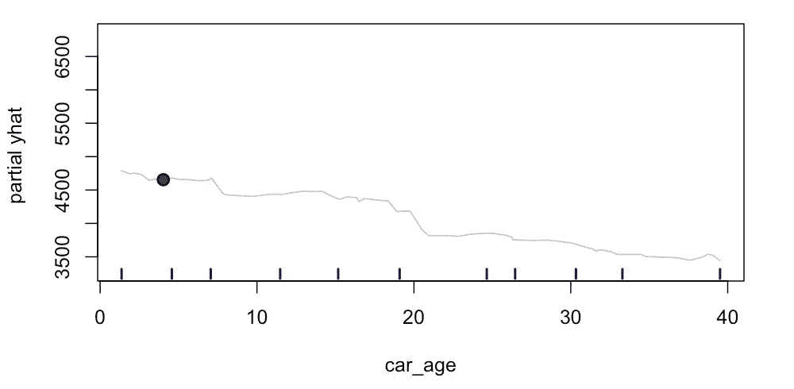

图 1:观察 1 中不同车龄的预测价格(来源:作者)

然后，我们对数据集中的每个观察值或观察值子集重复这个过程。在**图 2** 中，可以看到 100 次观测的预测线。为了清楚起见，对于每个观察，我们只改变了**车龄**。我们将剩余的特征保持在它们的原始值不变。这些值与我们在**表 2** 中看到的值不同。这就解释了为什么每一行的起点都不同。

图 2:100 次观察的预测线(来源:作者)

要创建 PDP，最后一步是计算**汽车年龄**的每个值的平均预测值。这给了我们**图 3** 中的粗黄线。这条线是 PDP。通过保持其他特征不变并对观察值进行平均，我们能够分离出与 car_age 的关系。我们可以看到，预测价格会随着车龄的增长而下降。

图 3:汽车时代的部分依赖图(来源:作者)

你可能已经注意到了 x 轴上的短线。这些是**汽车时代**的四分位数。也就是说，10%的 car_age 值小于第一行，90%小于最后一行。这就是所谓的地毯阴谋。它向我们展示了特征的分布。在这种情况下，car_age 的值在其范围内相当均匀地分布。当我们讨论 PDP 的局限性时，我们将理解为什么这是有用的。

您可能还注意到，并非所有的预测线都遵循 PDP 趋势。一些较高的线似乎增加了。这表明，对于这些观察，价格与车龄有相反的关系。也就是说，预测的价格会随着车龄的增加而增加。请记住这一点。当我们讨论冰的情节时，我们将会回来。

## PDP 背后的数学

对于更注重数学的人来说，PDP 也有一个正式的定义。让我们从刚刚创建的 PDP 函数开始。这由**等式 1** 给出。集合 C 将包含除 car_age 之外的所有特征。对于给定的 **car_age** 值和观察值 I，我们使用 c 中特性的原始值找到预测价格。我们对所有 100 个观察值都这样做，并找到平均值。这个等式将给出我们在**图 3** 中看到的粗黄线。

等式 car _ age 的 PD 函数(来源:作者)

在**等式 2** 中，我们对上述等式进行了推广。这是一组特征的 PD 函数。S. C 将包含除 s 中的特征之外的所有特征。我们现在还对 n 次观察进行平均。这可以达到数据集中的观察总数(即 1000)。

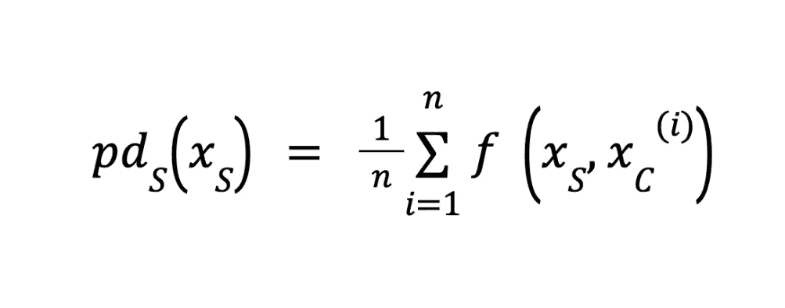

等式 2:特征集 S 的近似 PD 函数(来源:作者)

到目前为止，我们只讨论了 S 由一个特征组成的情况。在上一节中，我们有 S = {car_age}。稍后，我们将向您展示包含 2 项功能的 PDP。我们通常不会在 s 中包含超过 2 个特征，否则，将很难可视化 PD 功能。

上述等式实际上只是 PD 函数的近似。真正的数学定义在**等式 3** 中给出。对于集合 S 中的给定值，我们找到了集合 c 中的预期预测值。为此，我们需要将模型函数 w.r.t .与观察到集合 c 中的值的概率进行积分。要完全理解此方程，您需要一些随机微积分方面的经验。

等式 3:特征集 S 的 PD 函数(来源:作者)

使用 PDP 时，对近似值的理解就足够了。真正的 PD 功能实现起来并不实际。首先，与近似法相比，它的实现在计算上更加昂贵。其次，考虑到我们有限的观测数据，我们只能估算出大概的概率。也就是说，我们无法找到每个观察值的真实概率。最后，许多模型不是连续的函数，这使得它们很难集成。

## 连续功能的 PDP

了解我们如何创建 PDP 后，我们将继续使用它们。使用这些图我们可以理解模型特征和目标变量之间关系的本质。比如我们已经在**图 4** 中看到了 **car_age** PDP。预测价格以相当稳定的速度下降。这表明 car_age 与价格有一个线性关系。

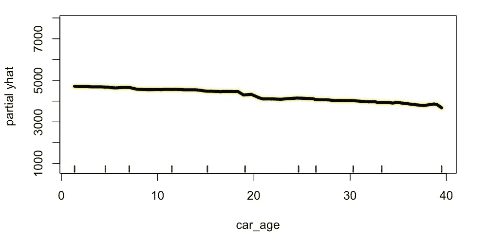

图 4:汽车时代 PDP(来源:作者)

在**图 5** 中，我们可以看到另一个特性的 PDP，**修复**。这是汽车接受维修/服务的次数。最初，预测价格往往会随着维修次数的增加而增加。我们希望一辆可靠的汽车接受一些定期保养。然后在 6/7 修左右，价格趋于降低。过度维修可能说明车有问题。由此我们可以看出，价格与维修之间存在**非线性关系**。

图 5:维修 PDP(来源:作者)

从上面，我们可以看到 PDP 在**可视化**非线性关系时是有用的。我们将在下面的文章中更深入地探讨这个话题。在处理许多功能时，查看所有 PDP 可能不切实际。所以我们也讨论使用互信息和特征重要性来帮助**找到**非线性关系。

</finding-and-visualising-non-linear-relationships-4ecd63a43e7e>  

在**图 6** 中，我们可以看到一个特性与目标变量没有关系时的 PDP 示例。对于**车主年龄**，PDP 保持不变。这告诉我们，当我们改变所有者年龄时，预测价格不会改变。稍后，我们将看到如何使用 PDP 变化的思想来创建特性重要性分数。

图 6: owner_age PDP(来源:作者)

## 分类特征的 PDP

我们上面讨论的特征都是连续的。我们还可以为分类特征创建 PDP。例如，参见图 7 中**的 **car_type** 的绘图。这里我们计算每种汽车的平均预测值——普通型(0)或经典型(1)。我们用柱状图来代替直线。我们可以看到，老爷车往往售价更高。**

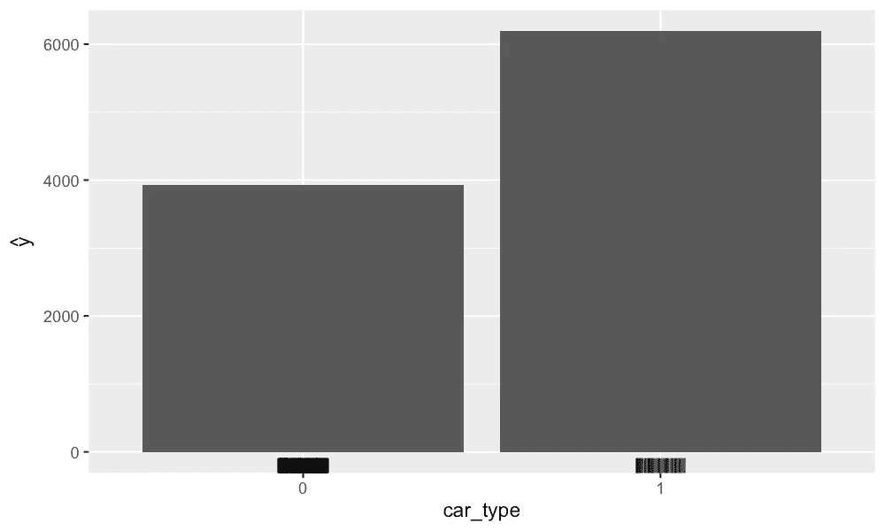

图 7: car_type PDP(来源:作者)

## 二元目标变量的 PDP

二元目标变量的 PDP 与连续目标的 PDP 相似。假设我们想预测汽车价格是高于(1)平均值还是低于(0)平均值。我们构建了一个随机森林，使用相同的特征来预测这个二进制变量。我们可以使用与之前相同的流程为此模型创建 PDP。只不过现在我们的预测是一种可能性。

比如在**图 8** 中，可以看到 car_age 的 PDP。我们现在在 y 轴上有一个预测的概率。这是汽车高于二手车平均价格的概率。我们可以看到，随着车龄的增长，概率有降低的趋势。

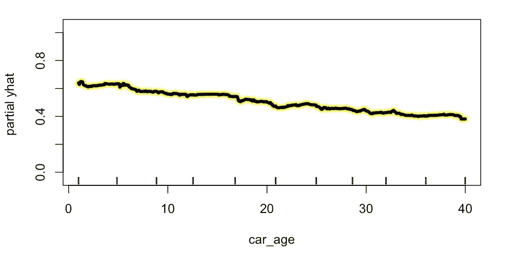

图 8:二元目标变量的 PDP(来源:作者)

## 两个功能的 PDP

回到我们的连续目标变量。我们还可以看到两个特性的 PDP。在**图 9** 中，我们可以看到 **km_driven** 和 **car_age** 不同组合下的平均预测值。该图表的创建方式与一个特性的 PDP 相同。也就是说，保持其余特征的原始值。

图 9: 2 专题 PDP(来源:作者)

这些 PDP 对于可视化功能之间的交互非常有用。上图显示了行驶里程和车龄之间可能的相互作用。也就是说，当两个特性的值都较大时，预测价格往往会较低。在得出这些类型的结论时，你应该谨慎。

这是因为如果两个特征相关，我们可以得到相似的结果。稍后，当我们讨论 PDP 的局限性时，将会看到事实确实如此。即行驶里程与车龄相关。车越老，行驶里程越多。这就是为什么当两种特性都较高时，我们会看到较低的预测价格。

## 衍生 PDP

衍生 PDP 是 PDP 的变体。它显示了 PDP 的斜率/导数。它可用于更好地理解原始 PDP。然而，在大多数情况下，我们从这些情节中获得的洞察力是有限的。它们通常对非线性关系更有用。

例如，以**图 10** 中的维修衍生 PDP 为例。这是我们之前在**图 5** 中看到的线的导数。我们可以看到，在大约 6 次修复时，导数为 0。此时，导数由正变负。换句话说，最初的 PDP 从增加到减少 w.r.t .维修。这告诉我们，经过 6 次修理后，汽车的价格将会下降。

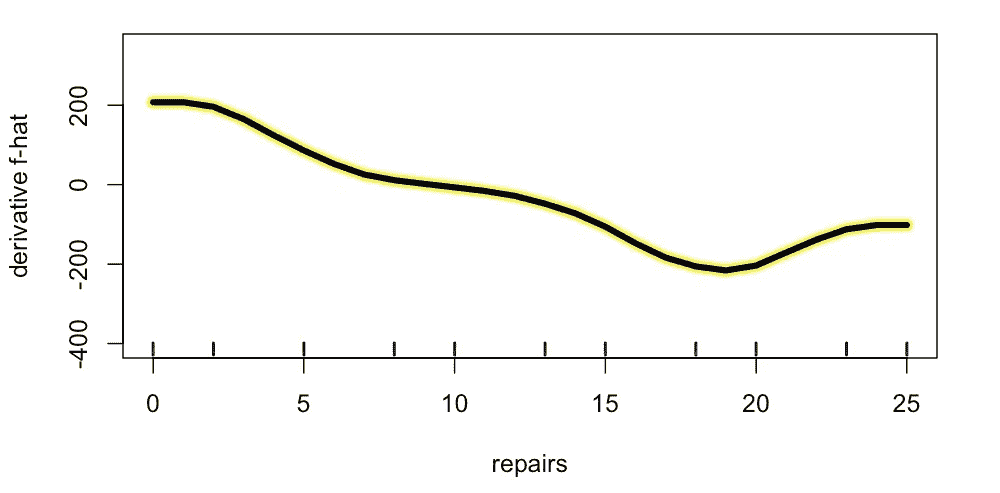

图 10:维修衍生 PDP(来源:作者)

## PDP 功能重要性

在结束这一部分时，我们有一个基于 PDP 的功能重要性分数。这是通过确定每个特性的 PDP 的“平坦度”来实现的。具体来说，对于连续变量，我们计算绘图值的标准偏差。对于分类变量，我们通过首先取范围来估计标准差。即最大值减去最小 PDP 值。然后我们将范围除以 4。这个计算来自一个叫做范围规则的概念。

您可以在**图 11** 中看到基于 PDP 的功能对我们功能的重要性。请注意，owner_age 的分数相对较低。如果我们回想一下图 6 中的 PDP，这是有意义的。我们看到 PDP 相对稳定。换句话说，y 轴值总是接近它们的平均值。它们的标准差很低。

图 11:基于 PDP 的特性重要性(来源:作者)

有更广为人知的特征重要性分数，例如排列特征重要性。您可能更喜欢使用这种基于 PDP 的评分，因为它可以提供一定的一致性。如果您正在分析要素趋势，现在可以使用通过类似逻辑计算的要素重要性分数。你也可以避免解释两种不同方法的逻辑。

# 个体条件期望(ICE)图

随着 PDP 的方式，让我们继续到冰图。您会很高兴地知道，我们已经讨论了创建它们的过程。取**图 12** 下图。这是我们在**图 3** 中的 car_age PDP 之前创建的图。这是一个汽车时代的**冰图**。冰图由每个单独观测的预测线组成。

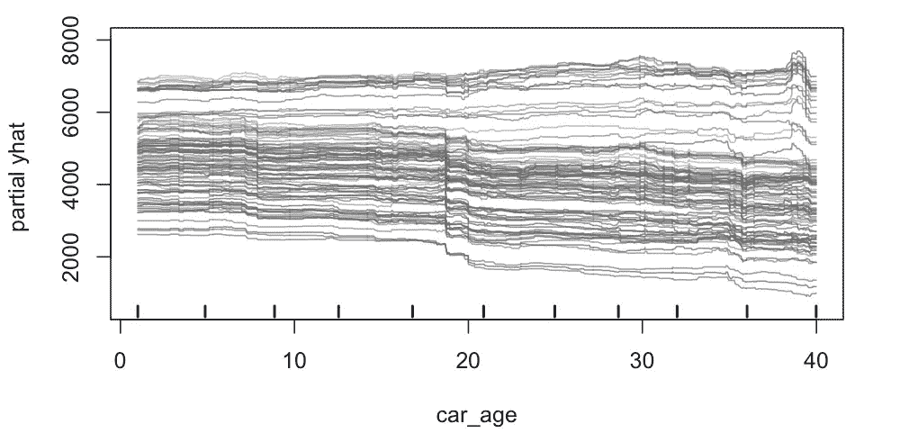

图 12:汽车时代的冰图(来源:作者)

当模型中存在交互时，冰图非常有用。也就是说，一个特征与目标变量的关系取决于另一个特征的值。在上图中可能很难看出这一点。为了使事情更清楚，我们可以把我们的冰图放在中间。在**图 13** 中，我们通过让所有预测线从 0 开始来实现这一点。现在很清楚，根据一些观察，预测的价格会随着车龄的增加而增加。

图 13:中心冰图(来源:作者)

为了理解是什么导致了这种行为，我们可以改变冰图的颜色。在**图 14** 中，我们根据汽车类型改变了颜色。我们把老爷车的线弄成蓝色，普通车的线弄成红色。我们现在可以看到，这种关系来自于 car_age 和 car_type 之间的交互。凭直觉，一辆老爷车随着年龄的增长会升值是有道理的。

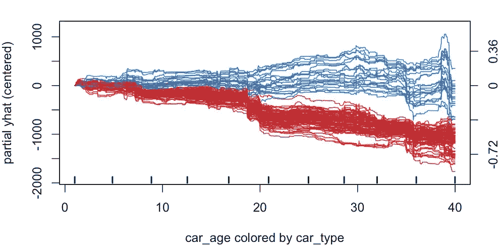

图 14:彩色冰图(来源:作者)

最后一项添加是将 PDP 线添加到图中。这样，我们就可以将 ICE 图和 PDP 结合起来。这可以强调一些观察结果如何偏离平均趋势。我们可以看到，如果我们只依赖 PDP，我们将会错过这种互动。也就是说，当使用**图 3** 中的 PDP 时，我们得出的结论是，所有汽车的价格都会随着车龄的增长而下降。

图 15:PDP 和 ICE 的组合图(来源:作者)

与 PDP 一样，ICE 图可以帮助我们可视化数据中的重要关系。为了找到这些关系，我们可能需要使用像特性重要性这样的指标。另一种专门用于突出模型中交互作用的度量是弗里德曼的 H-统计量。我们将在下面的文章中讨论使用所有这些方法。

</finding-and-visualising-interactions-14d54a69da7c>  

## 分类特征的冰图

我们可以用箱线图来显示分类特征的冰图。例如，我们在**图 16** 中有 **car_type** 的 ICE 图。方框中间的粗线给出了平均预测值。换句话说，他们就是 PDP。我们可以看到普通汽车的预测价格更低(0)。

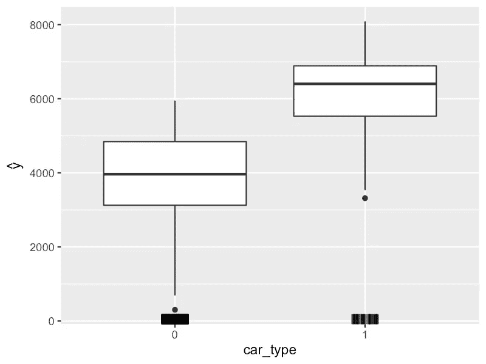

图 16: car_type ICE 情节(来源:作者)

## 基于 ICE 图的特征重要性

我们还可以计算基于 ICE 图的特征重要性分数。这类似于基于 PDP 的评分，只是我们不再考虑平均预测线。我们现在使用单独的预测线来计算分数。这意味着分数将考虑特征之间的相互作用。

在图 17 中，我们有我们的模型的基于 ICE 图的分数。我们可以将这些与**图 11** 中基于 PDP 的分数进行比较。最大的不同是汽车时代的分数现在更大了。从 300 增加到 345。根据我们上面的分析，这是有意义的。我们看到了影响车龄和价格之间关系的交互作用。基于 PDP 的特征重要性不考虑这种相互作用。

图 17:基于 ICE 图的特征重要性(来源:作者)

# PDP 和 ICE 图的优势

到目前为止，希望我们已经很好地理解了 PDP 和 ICE 图，以及我们可以从中获得的见解。我们将继续讨论这些方法的优势。然后在下一节中，我们将讨论其局限性。理解这些是至关重要的，这样你就不会从图中得出不正确的结论。

## 隔离功能趋势

我们可以使用散点图来可视化数据中的关系，但数据是杂乱的。例如，我们可以在**图 18** 中看到 car_age 和 car_type 之间的交互作用。这些点围绕真正的潜在趋势而变化。这是因为统计噪声和价格与其他特征也有关系的事实。在真实的数据集中，这个问题可能会更严重。最终，很难看出数据的趋势。

图 18:汽车年龄和汽车类型交互的散点图(来源:作者)

使用 PDP 和 ICE 图时，我们不再使用原始数据值。我们正在研究模型预测。如果构建正确，模型将捕捉数据中的潜在关系，并忽略统计噪声。然后，我们可以分离出特定特征的趋势。这是通过保持其他特征值不变并对观察值进行平均来实现的。

这就是 PDP 和 ICE 图如此有用的原因。它们允许我们去除噪声和其他特征的影响。这使得我们更容易看到数据中的潜在关系。在这个意义上，这些方法可以用于数据探索，而不仅仅是理解我们的模型。

## 开门见山地解释

希望通过向您介绍构建 PDP 的过程，您会很容易理解。这样，你就可以获得对该方法的直观理解，而不需要一个数学定义。这也意味着这些方法很容易向非技术人员解释。这在工业环境中很有用。

## 易于实施

这些方法也很容易实现。我们只需要改变特征值并记录结果预测。我们甚至不需要考虑模型的内部运作。这意味着相同的实现可以用于任何模型。当我们讨论 R 和 Python 代码时，你会看到这些方法已经有了很好的实现。

# PDP 和 ICE 图的局限性

## 假设特征独立

继续讨论局限性，我们将从这些方法的主要问题开始。这是因为他们假设特征是独立的。这并不总是如此，因为特征可以是相互关联的。例如，以**图 19** 中的 km_driven 和 car_age 散点图为例。有明显的相关性。直觉上，这是有道理的。老式汽车往往行驶更长的距离。

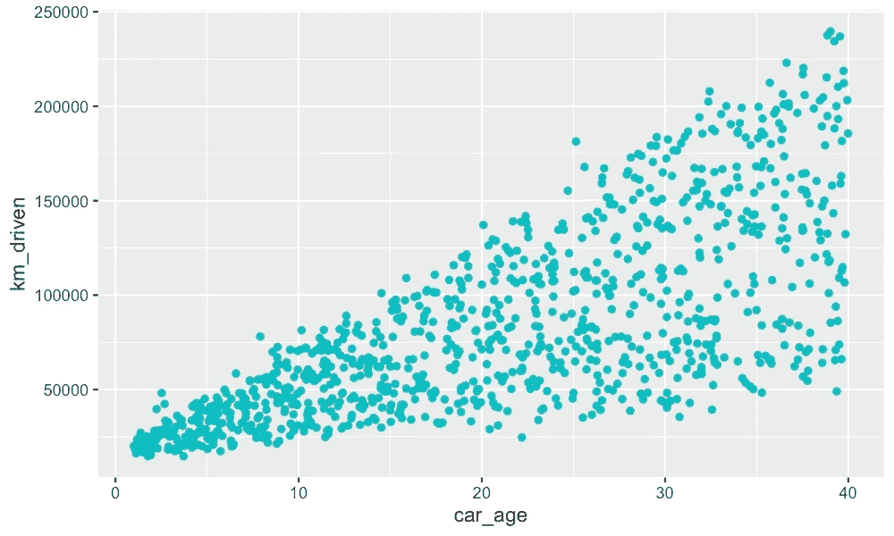

图 19:行驶里程与车龄的散点图(来源:作者)

问题是，当我们为观测值构建预测线时，我们将对某个要素的所有可能值进行采样。例如，假设我们想为 km_driven 构建一个 PDP。以图 20 中红色给出的观察结果为例。它的车龄是 10 年。为了建立预测线，我们将改变虚线椭圆中所有值的 km_driven。然而，在现实中，这种车龄的观测只能在实心椭圆内行驶一段距离。

图 20:随机抽样的问题(来源:作者)

我们的模型不是在实心椭圆之外的观察上训练出来的。尽管如此，我们仍在根据这些观察结果的预测创建 PDP。结果是，预测线是建立在模型以前没有“看到”的观察结果上的。这可能会产生不直观的结果，并导致关于特征趋势的错误结论。

## 同等关注所有特征值

即使特征是不相关的，我们仍然会得出不正确的结论。对于每个观察值，我们对所有可能的特征值进行采样。这给予所有值同等的权重。实际上，该特性的一些值不太常见。例如在特征分布的极端。这些数值的趋势将会有更多的不确定性。

考虑到这一点，通常包括地毯情节。这些有助于我们理解特征的分布。在我们看到地毯图的分位数版本之前。**图 21** ，给出了替代版本。在这里，我们为每个观察值设置了单独的行。我们可以看到，km_driven 值越高，观测值越少。因此，我们应该更加小心地解释这些值的趋势。

图 21:km _ driven 的替代 PDP(来源:作者)

## 结论取决于你的模型

正如优势中提到的，使用模型预测可以帮助我们更清楚地看到关系。问题是模型可能做出不正确的预测。一个不合适的模型可能会错过重要的关系。通过对噪声建模，过度拟合的模型可以呈现实际上并不存在的关系。最终，我们得出的结论将取决于我们的模型。考虑模型的性能很重要。

即使有了一个精确的模型，我们仍然会有问题。一个模型可以忽略一些关系而支持其他关系。我们会得出错误的结论，即被忽略的特征与目标变量没有关系。这意味着，在进行数据探索时，您可能希望将要素限制在您有兴趣探索的子集内。

## PDP 忽略交互

如前所述，通过使用平均值，PDP 可能会错过交互。因此，基于 PDP 的特征重要性也将错过这些交互。这意味着，如果存在交互，分数可能会低估某个特征的重要性。我们在 car_age 特写中看到了这一点。一个解决方案是使用 ICE 图或坚持排列特征重要性。

## 实施的局限性

在接下来的部分中，我们将带您浏览用于实现这些方法的代码。我们将看到每种实现都有其优缺点。有些包没有我们讨论的所有情节的实现。例如，如果您正在使用 Python，那么就我所知，对于派生 PDP 或特性重要性，没有实现。

# PDP 和 ICE 图的 r 代码

在本节中，我们将带您浏览用于创建 PDP 和 ICE 图的 R 代码。我们将研究使用三种不同的包。我们使用[冰箱](https://cran.r-project.org/web/packages/ICEbox/ICEbox.pdf)和 [iml](https://cran.r-project.org/web/packages/iml/iml.pdf) 来创建情节。结合这些允许我们创建我们上面讨论的所有情节。对于特征重要性分数，我们使用 [vip](https://www.rdocumentation.org/packages/vip/versions/0.3.2) 。你可以在 [GitHub](https://github.com/conorosully/medium-articles/blob/master/src/interpretable%20ml/PDPs%20and%20ICE%20Plots/PDP_ICE.R) 上找到我们讨论的所有代码。

我们从加载数据集开始(第 1 行)。这与我们在本文开头的表 1 中讨论的是同一个问题。我们还将 car_type 设置为分类特征(第 2 行)。

## **造型**

在我们创建 PDP 和 ICE 图之前，我们需要一个模型。我们使用 randomForest 包来做这件事(第 1 行)。我们使用价格和 6 个特征建立一个模型(第 4-6 行)。具体来说，我们使用了一个有 100 棵树的随机森林(第 6 行)。

对于下面的大多数图，我们将使用模型 **rf** 。这已经在连续目标变量上进行了训练。我们还想在二进制目标变量上建立一个模型， **rf_binary，**。这是为了向您展示不同类型的目标的代码和输出是如何不同的。

首先，我们创建二进制目标变量。如果原始汽车价格高于平均值，则该值为 1，如果低于平均值，则该值为 0(第 2-4 行)。然后，我们像前面一样构建一个随机森林(第 7–9 行)。有了这些模型，我们现在可以继续使用 PDP 和 ICE 图来了解它们是如何工作的。随着我们的深入，输出将显示在相关代码的下方。

## 包装—冰箱

我们将从冰箱包开始(第 1 行)。我们将使用它为 car_age 创建一个 PDP。我们使用 **ice** 函数为 car_age 创建一个 iceplot 对象(第 4–7 行)。我们传递我们的模型、特性和目标变量(第 4-6 行)。该对象将包含 car_age 的所有单个预测行。它还将包含平均预测线(即 PDP)。

然后我们使用 plot 函数显示 iceplot 对象(第 9–11 行)。默认情况下，此包将始终显示冰图。要创建 PDP，我们需要隐藏各个预测线。我们通过将它们全部变成白色来做到这一点(第 11 行)。我们还隐藏了给出原始 car_age 值的点(第 10 行)。

(来源:作者)

要创建冰图，我们可以使用相同的冰图对象。现在，我们不再隐藏单独的线条，而是根据它们的汽车类型给它们着色(第 5 行)。经典车和普通车的区别在于它们的线条分别是蓝色和红色。我们也进入了冰情节(3 线)。我们通过仅绘制 10%的单独线条(第 2 行)将绘图限制为 100 个观察值。

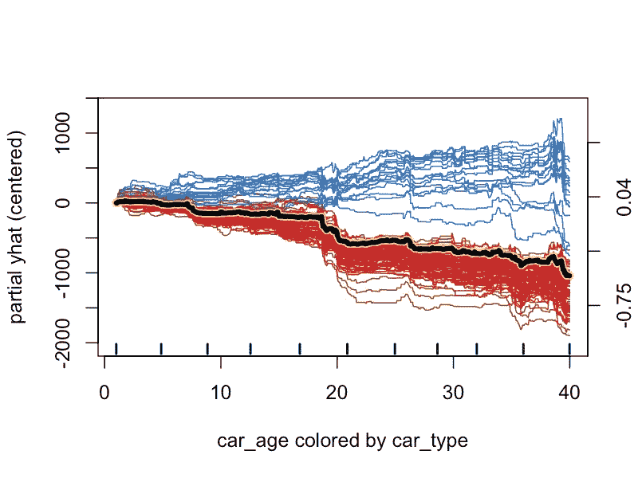

(来源:作者)

我们也可以使用 ICEBox 包来绘制衍生 PDP。我们以与之前相同的方式创建一个 iceplot 对象进行修复(第 1–4 行)。然后我们用它来创建一个骰子对象(第 5 行)。最后，我们绘制骰子对象(第 7–10 行)。我们已经设置了 plot_sd = F(第 10 行)。这隐藏了各个预测线的标准偏差。

(来源:作者)

我们用这个包创建的最后一个图是二进制目标变量的 PDP。代码类似于之前。除了使用 **rf_binary** 之外，唯一的区别是传递了一个预测函数(第 4–6 行)。这让 **ice** 函数知道我们的预测是根据概率给出的。

(来源:作者)

冰箱包装有一些优点。通过用另一个特征给冰图着色，它允许我们清楚地看到相互作用。它也是唯一一个实现了衍生 PDP 的包。就局限性而言，它不处理分类特征。这意味着我们不能为 car_type 特征创建图。它也没有为 2 个功能实施 PDP。

## 包装— iml

下一个包 iml 可以解决这些限制。首先，我们将使用它为 car_age 创建一个 PDP。我们使用随机森林和数据集创建一个预测器对象(第 4 行)。使用它，我们创建一个特征效果对象(第 7 -9 行)。我们使用“pdp”作为功能效果方法(第 9 行)。最后，我们绘制这个特征效果对象(第 10 行)。

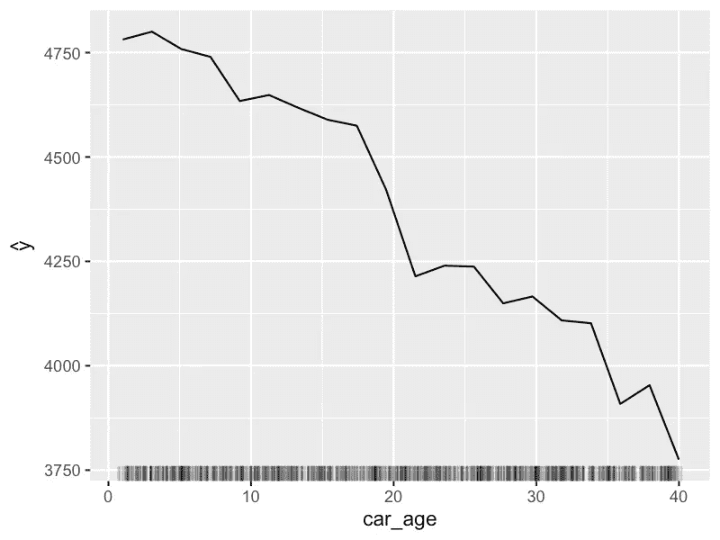

(来源:作者)

我们使用类似的代码为 car_age 创建一个 ICE 图。我们使用与之前相同的预测器对象(第 1 行)。我们现在将方法设置为“pdp+ice”(第 3 行)。这将给我们一个组合的 PDP 和 ICE 图。我们还将图居中，因此所有预测线都从 0 开始(第 4 行)。将方法设置为“ice”将删除黄色 PDP。

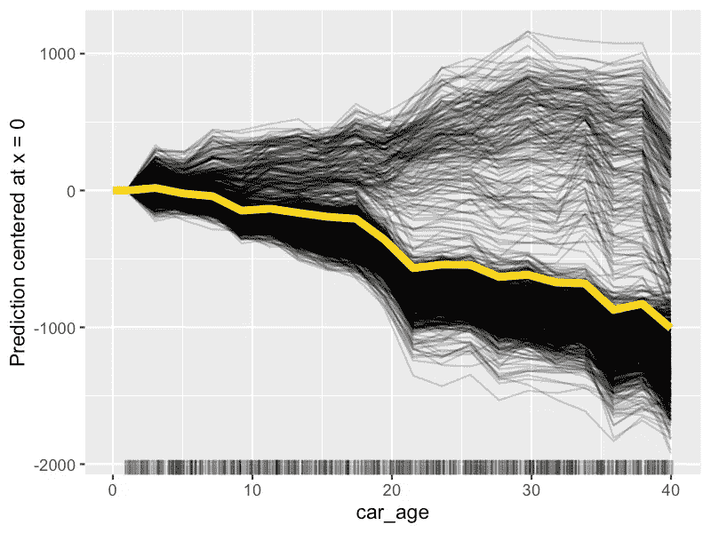

(来源:作者)

iml 包也可以处理分类特征。下面我们为 car_type 创建 PDP(第 2-5 行)。这给了我们下面的直方图。类似地，我们为 car_type 创建一个 ICE 图(第 8–11 行)。这给了我们箱线图。

(来源:作者)

iml 的另一个优势是它为 2 个特性实现了 PDP。下面我们为汽车年龄和公里驾驶创建一个 PDP。代码类似于之前。唯一的区别是我们传递了一个带有两个特性名称的向量(第 2 行)。

(来源:作者)

最后，我们为二元目标变量创建一个 PDP。我们用 **rf_binary** (第 1 行)创建预测器对象，但是代码的其余部分和以前一样。你可以看到我们现在有两个图。请注意，它们是彼此相反的。这是因为第一个图给出了汽车低于平均值(0)的概率。第二个图给出了高于平均值(1)的概率。当目标变量有两个以上的值时，为每个值绘制图表非常有用。

(来源:作者)

## 套餐— vip

以上两个包都没有实现特性重要性分数。为了计算这些，我们使用 vip 包(第 1 行)。创建基于 PDP 的分数(第 4 行)和基于 ICE 的分数(第 7 行)非常简单。我们已经将方法设置为“固定”。这代表特征重要性排序度量。

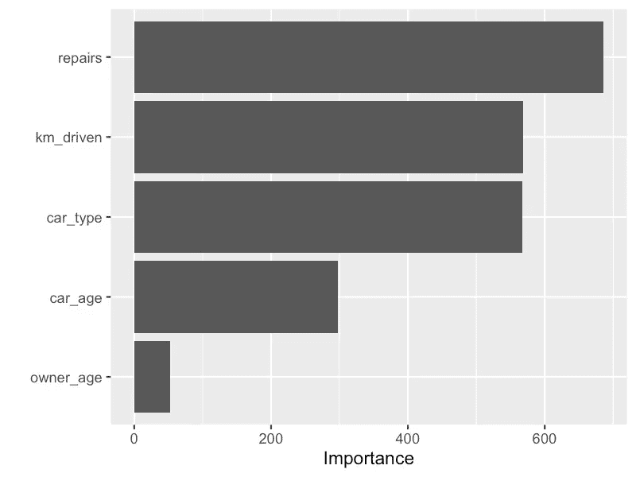

(来源:作者)

# 用于 PDP 和 ICE 图的 Python 代码

在本节中，我们将带您浏览用于创建 PDP 和 ICE 图的 Python 代码。你也可以在 [GitHub](https://github.com/conorosully/medium-articles/blob/master/src/interpretable%20ml/PDPs%20and%20ICE%20Plots/PDP_ICE.ipynb) 上找到这个。我们将使用 scikit-learn 的实现， [PartialDependenceDisplay](https://scikit-learn.org/stable/modules/generated/sklearn.inspection.PartialDependenceDisplay.html) 。另一个我们不会讨论的包是 [PDPbox](https://pdpbox.readthedocs.io/en/latest/index.html?highlight=importance#the-common-headache) 。

我们从导入 Python 包开始。我们导入了一些用于处理和可视化数据的通用包(第 2–4 行)。我们有两个不同的建模软件包— **RandomFrorestRegressor** (第 6 行)和 **xgboost** (第 7 行)。最后，我们有用于创建 PDP 和 ICE 图的包(第 9–10 行)。第一个包用于可视化绘图。第二个包用于获得用于创建图的预测。这在我们以后探索分类特征时会很方便。

PDP 包由 scikit-learn 提供。您仍然可以将它们用于不是用 scikit-learn 包创建的模型。稍后当我们用 xgb 包建模二进制目标变量时，您将会看到这一点。

## 连续目标变量

我们将从连续目标变量开始。我们加载数据集(第 2 行)。这与我们在本文开头的表 1 中讨论的是同一个问题。我们得到了目标变量(第 5 行)和特征(第 6 行)。我们用这些来训练一个随机的森林(第 9-10 行)。具体来说，随机森林由 100 棵树组成。每棵树的最大深度为 4。

我们现在可以使用 **PartialDependenceDisplay** 包来理解这个模型是如何工作的。首先，我们将为 car_age 创建一个 PDP。为此，我们使用 **from_estimator** 函数。我们传入模型、X 特征矩阵和特征名称。您可以在代码下面看到输出。

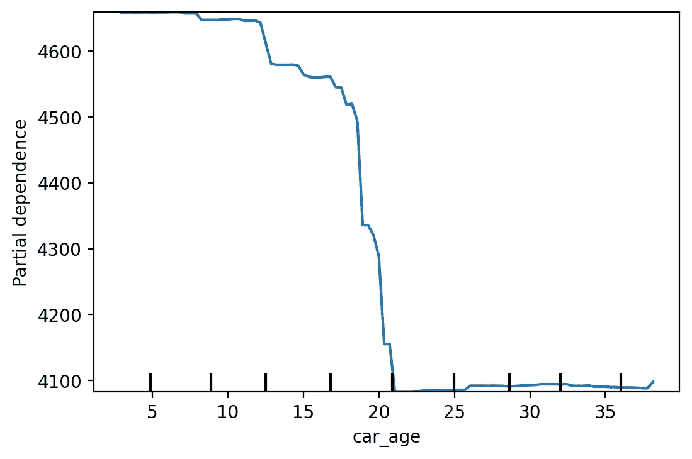

(来源:作者)

为了创建一个 ICE 图，我们需要将**种类**参数设置为‘individual’(第 4 行)。我们还将情节居中(第 6 行)。默认情况下，这些函数只显示特征的 5%到 95%的百分位数。如果你想显示汽车年龄的全部范围，你需要改变它。也就是 0 到 40 岁。我们在第 5 行做这个。

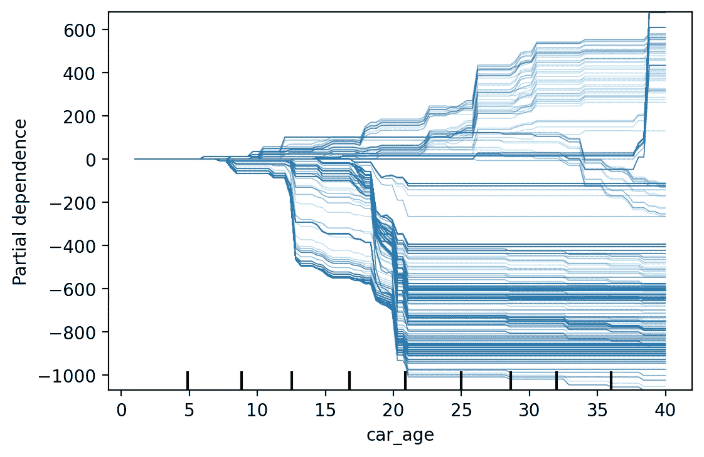

(来源:作者)

我们在下面探索一些其他的选择。将种类特性设置为“两者”将显示 PDP 和 ICE 图(第 4 行)。我们还可以使用 **ice_lines_kw** (第 4 行)和 **pd_line_kw** (第 5 行)参数分别更改 ice 图和 PDP 线的样式。

(来源:作者)

创建包含两个功能的 PDP 与之前类似。我们所需要做的就是传递一个特性名称的数组，而不是一个单独的特性名称。你可以在下面看到我们是如何为车龄和公里数做这些的。

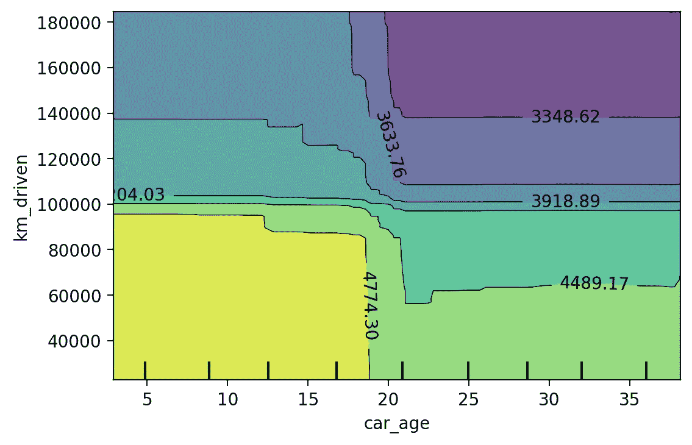

(来源:作者)

scikit-learn 包的缺点是它将分类特征视为连续特征。你可以在下面看到这样做的结果。PDP 和 ICE 图由线条给出。直方图和箱线图会给出更好的解释。

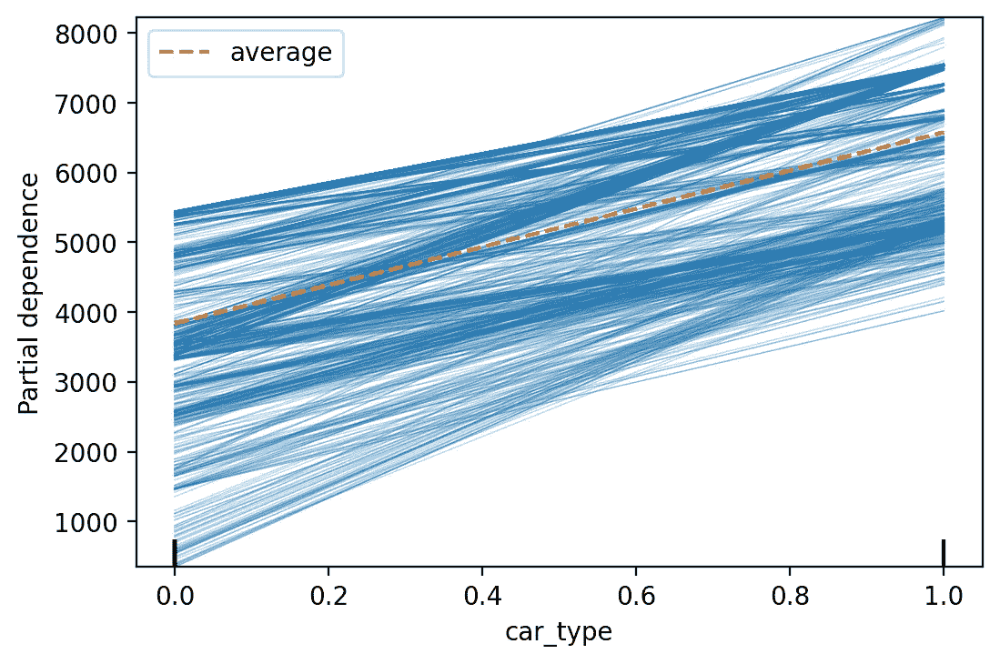

(来源:作者)

我们可以通过创造自己的情节来解决这个问题。我们使用**partial _ dependency**函数来实现这一点(第 3 行)。我们使用该函数的方式与使用 **for_estimator** 函数的方式相同。不同的是，它不显示一个情节。它仅返回用于创建图的数据。 **pd_ice** 将包含 car_type 的 PDP 和 ice 图的数据。

您可以在下面看到我们如何使用它来创建 PDP。我们从从 **pd_ice** (第 2 行)获取平均值开始。这将是普通车和老爷车的平均预测。使用这些，我们绘制一个条形图(第 5-14 行)。

[分手]

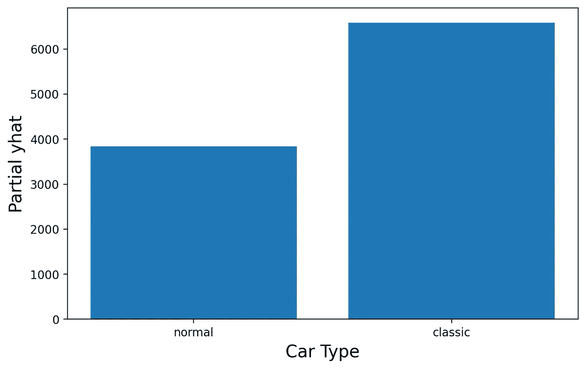

(来源:作者)

对于冰图，我们可以创建一个箱线图。我们从 **pd_ice** (第 2 行)中得到单独的预测。然后，我们将这些分为普通车和经典车预测(第 4-6 行)。最后，我们绘制箱线图(第 9-14 行)。

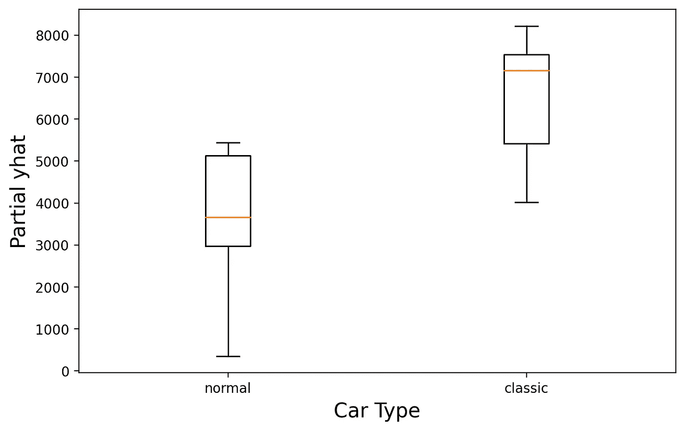

(来源:作者)

## 二元目标变量

最后，我们将创建一个二元目标变量的 ICE 图。首先，我们创建变量(第 2–3 行)。如果原始汽车价格高于平均值，则其值为 1，如果低于平均值，则其值为 0。我们使用这个二元变量训练一个模型(第 6–7 行)。这一次我们使用了一个最大深度为 2 的 XBGClassifier 和 100 棵树。

我们像以前一样为汽车时代画一个冰图。你会注意到 y 轴现在给出的是概率而不是价格。您还可以看到，将 scikit-learn 包与其他建模包一起使用非常简单。

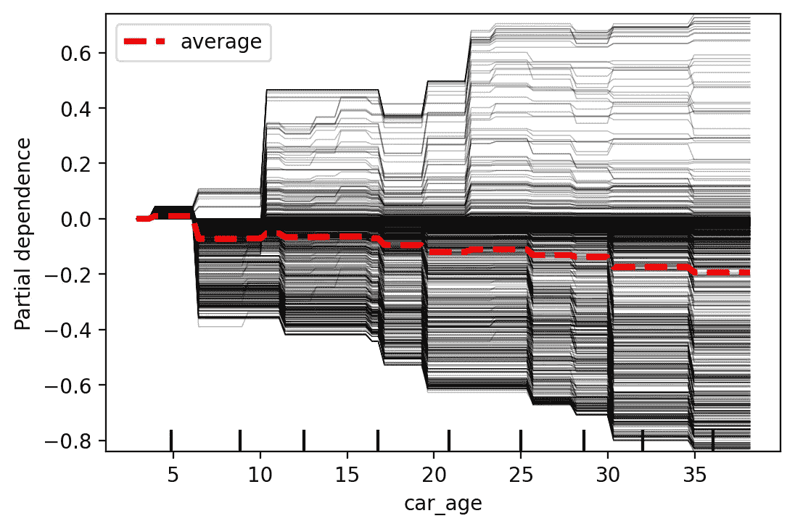

(来源:作者)

使用 Python 的缺点是没有衍生 PDP 和特性重要性分数的实现(据我所知)。虽然，对于大多数问题，上面的图表是你所需要的。如果您需要其他方法，您可以使用**partial _ dependency**函数自己实现它们。

我希望这篇文章对你有用！我真的希望它成为 PDP 和 ICE 情节的终极指南。如果你认为我错过了什么，请在评论中提出。另外，如果有什么不清楚的地方，请告诉我。我很乐意更新文章:)

PDP 和 ICE 图是**可解释的机器学习**方法。它们被用来理解我们的模型是如何做出预测的。另一种流行的方法是 SHAP。SHAP 值的一个优点是它们可以用来理解个人预测是如何做出的。还可以将它们聚合起来，以了解模型作为一个整体是如何工作的。在下面的文章中，我们将探索如何在 Python 中应用这种方法。

</introduction-to-shap-with-python-d27edc23c454>  

我希望这篇文章对你有帮助！你可以成为我的 [**推荐会员**](https://conorosullyds.medium.com/membership) **来支持我。你可以访问 medium 上的所有文章，我可以得到你的部分费用。**

<https://conorosullyds.medium.com/membership>  

你可以在|[Twitter](https://twitter.com/conorosullyDS)|[YouTube](https://www.youtube.com/channel/UChsoWqJbEjBwrn00Zvghi4w)|[时事通讯](https://mailchi.mp/aa82a5ce1dc0/signup)上找到我——注册免费参加 [Python SHAP 课程](https://adataodyssey.com/courses/shap-with-python/)

## 参考

C.莫尔纳尔、**可解释机器学习** (2021)、[https://christophm.github.io/interpretable-ml-book/](https://christophm.github.io/interpretable-ml-book/)

南用 Python 进行可解释的机器学习 (2021)

格伦威尔，B.M .，博姆克，B.C .和麦卡锡，a . j .(2018)。**一种简单有效的基于模型的可变重要性度量**。[https://arxiv.org/abs/1805.04755](https://arxiv.org/abs/1805.04755)