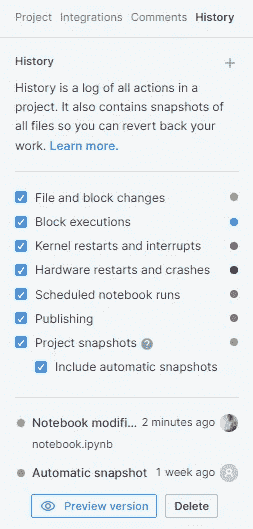

# Jupyter 笔记本的终极替代品

> 原文：<https://towardsdatascience.com/the-ultimate-replacements-to-jupyter-notebooks-51da534b559f>

## 讨论 Jupyter 笔记本电脑的最佳替代方案，用于解释数据科学项目

照片由[星球卷](https://unsplash.com/es/@planetvolumes?utm_source=medium&utm_medium=referral)上的 [Unsplash](https://unsplash.com?utm_source=medium&utm_medium=referral)

有多种工具可供数据科学爱好者探索这一主题。在代码编辑器和集成开发环境的几个选项中，开发人员可以选择来构建他们的项目，其中一个更受欢迎的选项是 Jupyter 笔记本。

Jupyter 笔记本通常是大多数初级数据科学家深入研究该主题的推荐方式。它们提供了一种快速、简洁、基于单元的执行方式，来有效地解释基础主题的项目。

在每个单元的执行过程中跟踪您的进度的能力允许用户跟上他们特定任务所需的步伐。Jupyter 笔记本无疑是执行探索性数据分析的最佳选择，以便相应地可视化和解释您的数据。

虽然 Jupyter 笔记本是初学数据科学家的绝佳选择，但大多数专家为了更好的体验而远离它们。在这篇文章中，我们将讨论 Jupyter 笔记本的一些缺点，以及这些笔记本在 ***Deepnote*** 中令人难以置信的替代品。

如果观众不完全熟悉 Jupyter 笔记本是什么，以及它们对数据科学有多有用，我建议通过下面提供的链接查看我以前的一篇文章。它涵盖了初级数据科学爱好者从头开始使用 Jupyter 笔记本所需了解的几乎所有内容。

  

# Jupyter 笔记本的缺点:

照片由 [Tim Gouw](https://unsplash.com/@punttim?utm_source=medium&utm_medium=referral) 在 [Unsplash](https://unsplash.com?utm_source=medium&utm_medium=referral) 上拍摄

Jupyter 笔记本是向初学数据科学家推荐的开始学习机器学习和数据科学的最佳选择。尽管这些 Jupyter 笔记本对于初学者来说是一个出色的入门工具，但过渡到开发人员可用的一些更好的选择变得至关重要。在文章的这一部分，我们将看看本地 Jupyter 笔记本的三个主要缺陷。

## 1.缺少 IDE 功能:

Jupyter 笔记本被归类为基于网络的交互式计算平台。然而，它们缺乏大多数其他代码编辑器和 ide 所具备的一些基本特性。其中一些特性包括语法突出显示、代码辅助工具、调试器和其他类似的附加特性。因此，初学者可能倾向于其他选择，如 Visual Studio Code 或 Pycharm，以获得更好的开发环境。

> 还有一个新的选项，允许开发人员在 Visual Studio 代码环境中计算 Jupyter 笔记本。然而，在运行这些笔记本电脑时，仍然存在明显的限制。超出文件大小的输出需要在文本编辑器中打开，整体执行机制可能会给一些人带来不便。

## 2.协作团队效率较低:

一旦你作为一名数据科学家取得了足够的进步，你就会意识到数据科学最重要的一个方面就是团队合作。数据科学领域的大多数复杂项目都需要有效的协作团队。虽然您可以与您的团队共享 Jupyter 笔记本，但缺少允许您在同一台笔记本上同时工作的功能是一个很大的缺陷。

共享功能没有太大价值，因为即使简单的 Python 文件也可以与个人共享。Jupyter 笔记本的其他访问权限需要远程托管，这本身就有潜在的风险。因此，我们可以得出结论，这些 Jupyter 笔记本电脑，尽管对开发人员来说是一个很容易分享的选择，但缺乏一个重要的功能，使用户能够与他们的团队合作，有效地解决更复杂的项目。

## 3.内核崩溃和安装问题:

在本节中，我们将触及 Jupyter 笔记本中存在的两个主要问题，以及初学数据科学家面临的一个关键问题。有多少数据科学爱好者第一次安装 Jupyter 笔记本就认为可以立刻上手一些编程？

在经历了安装 Jupyter 笔记本(通过 anaconda 或本地虚拟环境)的繁琐过程后，您意识到要解释项目，您需要在开始之前再安装几个库。除了安装之外，您还会浪费一些宝贵的时间来管理数据库、跟踪您的实验，或者耗尽内存，导致内核崩溃。

# deep note:Jupyter 的协作式云托管替代方案:

虽然 Jupyter 笔记本有一些缺点，但大多数数据科学家更喜欢基于单元的 Jupyter 笔记本风格的环境来执行他们的大多数机器学习和数据科学项目。如果前面提到的问题都解决了，但你仍然有一个类似 Jupyter 的界面，那不是很酷吗？

解决前面提到的所有问题并提供详细解决方案的最佳平台之一是 ***Deepnote*** 。 *Deepnote* 为与您的数据科学团队进行高效协作提供了解决方案。它的大部分主要服务都是免费的，允许几乎任何用户直接投入到他们项目的开发中。

Deepnote 的工作环境中内置了一些最好的特性。它为用户提供了下图中显示的自动完成属性。访问这些特性允许开发人员以更快的速度更有效地解释他们的代码。

作者截图

它还有一个奇妙的嵌入功能，允许数据科学家将他们的代码单元嵌入到代码片段中，以便轻松共享。在每个代码单元中，您可以选择嵌入和共享代码选项，通过该选项，用户可以共享各自的代码块。下面是一个用 Deepnote 嵌入代码块的例子。这段代码代表了我以前的一篇文章[中提到的条形图的可视化。](/8-best-visualizations-to-consider-for-your-data-science-projects-b9ace21564a)

虽然 Deepnote 允许团队协作是首屈一指的，但它也解决了 Jupyter 笔记本中持续存在的大多数安装和内核问题。大多数先决条件库，包括像 TensorFlow 这样的深度学习框架，都已经安装在工作环境中，允许数据科学爱好者直接投入到他们的研究中。

笔记本电脑在云环境中运行，可以更好地跟踪您的项目进度。Deepnote 引入的历史特性解决了大部分内核问题。该功能允许用户在发生事故或崩溃的情况下回溯并恢复到之前的工作。

作者截图

最后，Deepnote 通过集成几个生产工具解决了数据管理和实验跟踪的问题。这些工具包括 Google Drive 和 Google Cloud Storage、Amazon-s3、My SQL 和 Postgre SQL、Redshift、Big Query 和大量其他选项，进一步增强了 Deepnote 的功能。

# 与 Google Colab 的比较:

我们已经讨论了 Deepnote 如何为初学者和专业数据科学家提供一些最好的实用工具，以有效地与他们的团队合作，顺利地构建他们的项目。在本节中，让我们将 Deepnote 与另一个免费服务(如 Google Colab)进行直接比较，以了解一些关键的复杂性。

## 1.共享笔记本的不便之处:

Google Colab(协作实验室)运行在云环境中，允许用户访问 Jupyter 笔记本来执行和记录他们的代码。

虽然该平台提供了预装库的免费笔记本，但代码共享的问题仍然存在。虽然用户可以共享一个帐户或各自的笔记本，但与 Google Colab 进行有效的团队合作是复杂的。

另一方面，Deepnote 允许您将数据科学小组添加到工作空间，以便您可以立即开始工作。

## 2.乏善可陈的功能和集成:

之前提到的 Jupyter 笔记本的问题对于 Google Colab 仍然存在。它缺少一些关键的 IDE 特性，比如代码辅助和有效调试的帮助。

与 Deepnote 相比，Google Colab 的集成选项较少。Google Colab 可以有效地链接到 Google Colab 或 Google Cloud 环境，但在其他一些关键集成方面存在困难。虽然您可以将 Google Colab 与其他一些流行的工具联系起来，但它们更复杂，并且无法无缝执行。

## 3.有限使用问题:

Google Colab 主要与 Google Drive 集成，后者只有 15GB 的活动空闲空间，对于大数据和复杂的机器学习项目来说几乎不够用。运行时间也是有限的，有时可能会因为较长的空闲时间而导致服务器意外关闭。

Google Colab 的内核问题更加明显，因为有时它们可能会在一段时间后自动关闭，导致一些数据丢失。与 Deepnote 相比，缺乏有效的历史跟踪系统也是一个关键问题。

因此，Deepnote 是一个很好的选择。我建议初学者和高级数据科学家都来看看并构建他们独特的项目！

# 结论:

乔安娜·科辛斯卡在 [Unsplash](https://unsplash.com?utm_source=medium&utm_medium=referral) 上的照片

> “从文明诞生到 2003 年，总共有 5eb 的信息，但现在每两天就有这么多信息产生。”
> — ***埃里克·施密特***

在本文中，我们探讨了 Jupyter 笔记本的一些缺点，这些缺点伤害了大多数初学数据科学爱好者的体验。Deepnote 是一款 Jupyter 兼容的数据笔记本，无缝运行在云环境中，并与 GitHub 和亚马逊 S3 等一些最好的工具相集成。

除了所有生活质量的增加，Deepnote 还提供了高效的团队合作机会和项目协作。我们对 Deepnote 和另一个流行的平台 Google Colab 进行了简单的比较。我们研究了 Deepnote 相对于后者的一些优势，以及为什么它是初学数据科学的爱好者必须了解的免费服务。

我强烈建议您亲自尝试该平台，并与您的团队合作构建创新项目！在接下来的文章中，我将使用 Deepnote 进行一些很酷的机器学习和可视化项目。

如果你想在我的文章发表后第一时间得到通知，请点击下面的[链接](https://bharath-k1297.medium.com/subscribe)订阅邮件推荐。如果你希望支持其他作者和我，请订阅下面的链接。

  

如果你对这篇文章中提到的各点有任何疑问，请在下面的评论中告诉我。我会尽快给你回复。

看看我的一些与本文主题相关的文章，你可能也会喜欢阅读！

      

谢谢你们坚持到最后。我希望你们都喜欢这篇文章。祝大家有美好的一天！