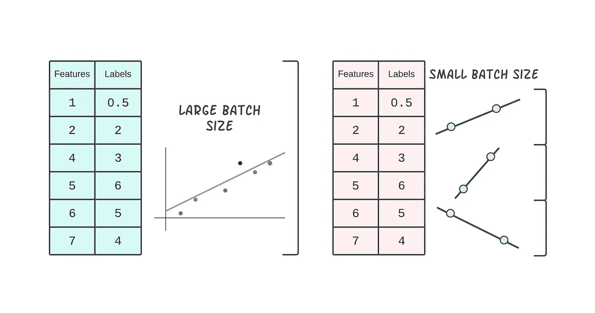
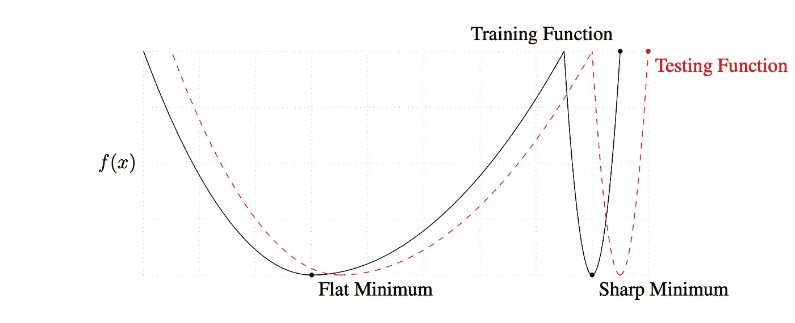
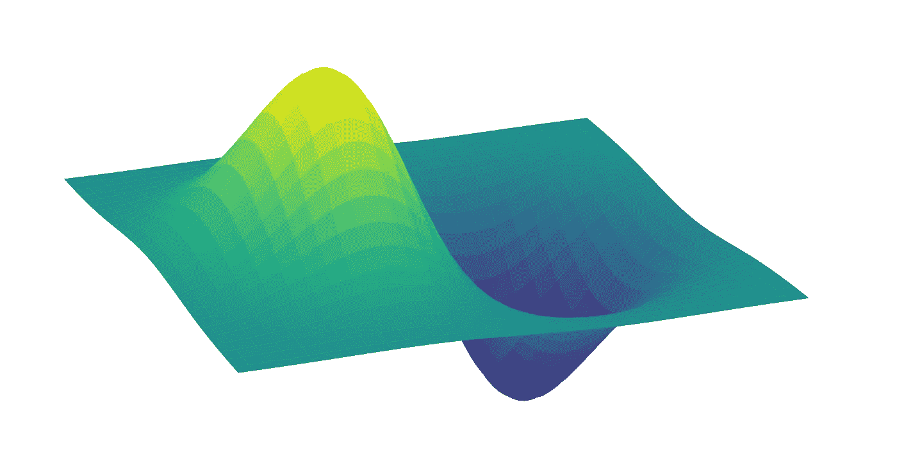
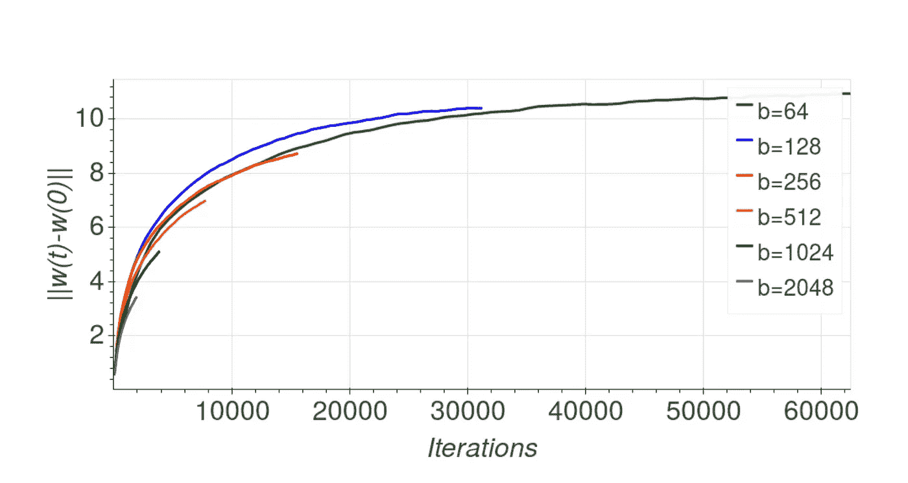
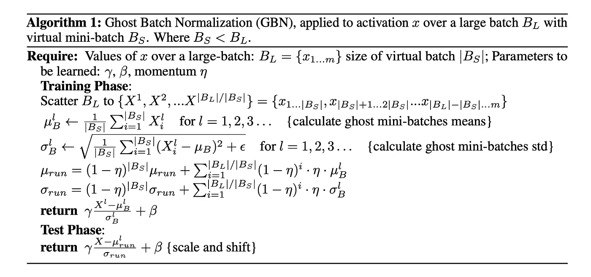

# 大批量训练计划背后的潜在危险

> 原文：<https://towardsdatascience.com/the-underlying-dangers-behind-large-batch-training-schemes-6cdc0e511ef1>

Julian Hochgesang 在 [Unsplash](https://unsplash.com?utm_source=medium&utm_medium=referral) 上拍摄的照片

## 一般化差距背后的方法和原因，以及如何将其最小化

近年来，深度学习以其多功能性、广泛的应用范围和并行化训练能力，席卷了机器学习领域。深度学习算法通常使用基于梯度的方法进行优化，在神经网络中称为“优化器”。优化器使用损失函数的梯度来确定对网络参数值的最佳调整。大多数现代优化器偏离了原始的梯度下降算法，并采用它来计算从整个数据集提取的一批样本中的梯度的近似值。

神经网络的本质及其优化技术允许并行化或批量训练。当允许计算能力显著加快具有多达数百万个参数的神经网络的训练时，通常采用大批量。直观上，批量越大，每次梯度更新的“有效性”就越高，因为数据集的相对重要部分被考虑在内。另一方面，具有较小的批量意味着基于从数据集的较小部分估计的梯度来更新模型参数。从逻辑上讲，数据集的较小“块”不太能代表要素和标注之间的整体关系。这可能导致一个结论，即大批量总是有利于训练。

大批量与小批量。图片由作者提供。

然而，上述假设是在没有考虑模型推广到看不见的数据点的能力和现代神经网络的非凸优化性质的情况下推导出来的。具体而言，各种研究已经通过经验证明并观察到，无论神经网络的类型如何，增加模型的批量大小通常会降低其推广到未知数据集的能力。“泛化差距”这个术语就是为这种现象创造的。

在凸优化方案中，访问数据集更重要的部分将直接转化为更好的结果(如上图所示)。相反，访问更少的数据或更小的批量会降低训练速度，但仍然可以获得不错的结果。在非凸优化的情况下，这是大多数神经网络的情况，损失图的确切形状是未知的，因此问题变得更加复杂。具体来说，两项研究试图调查和模拟由批量大小差异引起的“泛化差距”。

# 泛化差距的方式和原因

在 Keskar 等人(2017)的研究论文“ ***关于深度学习的大批量训练:泛化差距和尖锐极小值*** ”中，作者围绕大批量训练制度进行了几项观察:

1.  与用较小批量训练的相同网络相比，大批量训练方法倾向于过度适应。
2.  大批量训练方法容易陷入甚至被亏损前景中的潜在鞍点所吸引。
3.  大批量训练方法倾向于放大它找到的最接近的相对最小值，而用较小批量训练的网络倾向于在确定有希望的最小值之前“探索”损失情况。
4.  与用较小批量训练的网络相比，大批量训练方法倾向于收敛到完全“不同”的极小点。

此外，作者从神经网络如何在训练期间导航损失景观的角度解决了泛化差距。相对较大批量的训练往往会收敛到尖锐的极小值，而减少批量通常会导致陷入平坦的极小值。一个尖锐的极小值可以被认为是一个狭窄而陡峭的峡谷，而一个平坦的极小值类似于一个低而温和的丘陵地形的广阔景观中的山谷。用更严谨的术语来表述:

> **锐极小元**的特征在于 f(x)*的 Hessian 矩阵的大量正特征值，而**平极小元**的特征在于f(x) *的 Hessian 矩阵的大量较小正特征值。**

*“落入”尖锐的极小值可能会比平坦的极小值产生看似更好的损失，但它更容易对看不见的数据集进行较差的概化。下图显示了 Keskar 等人的一个简单的二维损失图。*

**

*与平坦最小值相比的急剧最小值。来自凯斯卡等人。*

*我们假设看不见的数据点的特征和标签之间的关系类似于我们用于训练的数据点，但不完全相同。如上例所示，训练和测试之间的“差异”可能是轻微的水平偏移。当应用于看不见的数据点时，由于其对最小值的狭窄适应，导致尖锐最小值的参数值变成相对最大值。不过，如上图所示，在平坦最小值的情况下,“测试函数”的轻微变化仍会将模型置于损失格局中相对最小的点。*

*通常，与使用较大批量相比，采用小批量会增加训练的噪音。由于梯度是用较少数量的样本进行估计的，因此相对于整个数据集的“损失景观”,每次批量更新时的估计将相当“嘈杂”。早期阶段的嘈杂训练有助于模型，因为它鼓励探索损失情况。Keskar 等人还指出…*

> *“我们已经观察到，深度神经网络的损失函数景观是这样的，大批量方法被吸引到具有尖锐极小值的区域，并且与小批量方法不同，**不能逃脱这些极小值的吸引盆地。***

*虽然较大的批量被认为给训练带来更多的稳定性，但是小批量训练提供的噪音实际上有利于探索和避免急剧最小化。我们可以有效地利用这一事实来设计一个“批量调度程序”,从小批量开始，以允许探索损失情况。一旦确定了大方向，我们就专注于(希望是)平坦的最小值，并增加批量大小以稳定训练。如何在训练中增加批量以获得更快更好的结果的细节将在下面的文章中描述。*

* [## 为什么在神经网络中使用学习率调度器可能是浪费时间

### 提示:批量大小是关键，它可能不是你想的那样！

towardsdatascience.com](/why-using-learning-rate-schedulers-in-nns-may-be-a-waste-of-time-8fa20339002b)* 

*在 Hoffer 等人(2018 年)在他们的论文“ ***训练更长，推广更好:在神经网络*** 的大批量训练中缩小推广差距”中的一项更近期的研究中，作者扩展了 Keskar 等人先前探索的想法，并提出了一种简单而优雅的解决方案来缩小推广差距。与 Keskar 等人不同，Hoffer 等人从不同的角度攻击泛化差距:权重更新的次数及其与网络损耗的相关性。*

*Hoffer 等人对泛化能力缺口现象提出了一个有些不同的解释。请注意，批量大小与重量更新次数成反比；也就是说，批量越大，更新就越少。基于经验和理论分析，随着权重/参数更新次数的减少，模型接近最小值的机会大大减少。*

*首先，需要理解通过基于批次的梯度下降的神经网络优化过程本质上是随机的。从技术上来说，术语“损失景观”指的是高维度表面，其中所有可能的参数值相对于由这些参数值产生的所有可能的数据点的损失值绘制。请注意，损失值是跨所有可能的数据样本计算的，不仅仅是定型数据集中可用的数据样本，而是针对该方案的所有可能的数据样本。每次从数据集中对一个批次进行采样并计算梯度时，都会进行更新。从整体损失情况来看，这种更新被认为是“随机的”。*

**

*一个可能亏损的例子。这里，z 轴是损耗值，而 x 和 y 轴是可能的参数值。图片由作者提供。*

*Hoffer 等人进行了类比，即通过基于随机梯度的方法优化神经网络是一个粒子在随机位势上进行随机行走。你可以把这个粒子想象成一个“步行者”，盲目地探索一个有着山丘和山谷的未知高维表面。在整个表面的尺度上，粒子的每个移动都是随机的，它可以向任何方向移动，无论是朝向局部最小值、鞍点还是平坦区域。基于先前对随机电位上的随机行走的研究，行走者从其起始位置行进的距离与其行走的步数成指数关系。例如，要翻过一座高度为 *d* 的山，需要粒子 *eᵈ* 随机行走才能到达山顶。*

**

*说明“行走”次数和行走距离之间的指数关系。*

*在随机高维表面上行走的粒子可以被解释为权重矩阵，每个“随机”步骤或每次更新都可以被视为“粒子”采取的一个随机步骤。然后，从我们上面建立的移动粒子直觉出发，在每个更新步骤 *t* ，权重矩阵到其初始值的距离可以建模为*

*其中 **w** 是权重矩阵。在随机电位上行走的“粒子”的渐近行为被称为“超慢扩散”。从这种统计分析并基于 Keskar 等人的结论，平坦极小值通常比尖锐极小值更好地“收敛”,可以得出以下结论:*

> *在初始训练期间，为了搜索具有“宽度” **d** 的平坦最小值，权重向量，或者在我们的类比中的粒子，必须行进距离 **d** *，*，从而至少花费 **eᵈ** 迭代*。*为了实现这一点，需要高扩散率，这保持了数值稳定性和总的高迭代次数。*

*“随机电位上的随机行走”中描述的行为可以在 Hoffer 等人进行的实验中得到经验证明。下图绘制了不同批次大小的迭代次数与权重矩阵的欧几里德距离的关系。可以看出明显的对数(至少是渐近)关系。*

**

*根据权重矩阵与初始化的距离绘制的迭代次数。来自霍弗等人。*

# *缩小推广差距的方法*

*在神经网络训练中不存在固有的“泛化差距”，可以对学习速率、批量大小和训练方法进行调整以(理论上)完全消除泛化差距。基于 Hoffer 等人做出的结论，为了在训练的初始步骤期间增加扩散率，可以将学习率设置为相对较高的数。这允许模型采取相当“大胆”和“大”的步骤来探索更多的损失领域，这有利于模型最终达到平坦的极小值。*

*Hoffer 等人还提出了一种算法来降低泛化差距的影响，同时能够保持相对较大的批量。他们检查了批处理规范化，并提出了一个修改，幽灵批处理规范化。批量标准化减少了过度拟合，提高了泛化能力，并通过标准化前一个网络层的输出加快了收敛过程，实质上是将值“放在同一尺度上”以供下一层处理。统计数据是在整个批次上计算的，在标准化之后，学习一种转换来适应每一层的特定需求。典型的批处理规范化算法如下所示:*

*其中 *γ* 和 *β* 代表学习到的变换， ***X*** 为一批训练样本的前一层输出。在推断过程中，批处理规范化使用预先计算的统计数据和从训练阶段学习到的转换。在大多数标准实现中，平均值和方差在整个训练过程中存储为指数移动平均值，动量项控制每次新的更新对当前移动平均值的改变程度。*

*Hoffer 等人提出，通过使用“幽灵批次”来计算统计数据并执行批次标准化，可以减少泛化差距。通过使用“幽灵批次”，从整个批次中提取小块样本，并通过这些小“幽灵批次”计算统计数据。通过这样做，我们将增加权重更新次数的概念应用于批量标准化，这不会像整体上减少批量大小那样修改整个训练方案。但是，在推断过程中，会使用整个批次的统计数据。*

**

*幻影批处理规范化算法。来自霍弗等人。*

*在 Tensorflow/Keras 中，可以通过将 Batch Normalization 层中的`virtual_batch_size`参数设置为 ghost 批处理的大小来使用 Ghost 批处理规范化。*

# *结论*

*在现实世界的实践中，泛化差距是一个相当容易被忽视的话题，但它在深度学习中的重要性不容忽视。有一些简单的技巧可以减少甚至消除这种差距，例如*

*   *Ghost 批处理规范化*
*   *在训练的初始阶段使用相对较大的学习率*
*   *从小批量开始，随着训练的进展增加批量*

*随着研究的进展和神经网络可解释性的提高，泛化差距有望完全成为过去。*