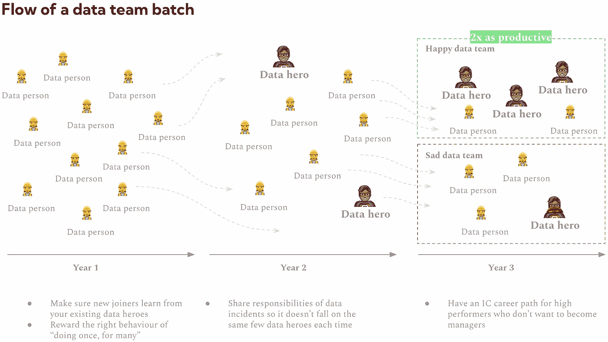

# 无名的数据英雄

> 原文：<https://towardsdatascience.com/the-unsung-data-heroes-ac51bef6ed2c>

## 几个数据英雄如何推动高增长公司的发展，为什么你不能失去他们

许多最优秀的数据人员希望在高增长的技术公司工作，这是有充分理由的。学习曲线很陡，你可以进步很快，公司的使命令人兴奋，你可以用最新的技术工作。

但是在高增长公司工作也意味着每时每刻都在变化。业务的不断变化意味着数据预期也必须改变。初创公司的平均任期是[两年](https://carta.com/blog/employment-tenure-startups/)，而且总是有很多新员工加入。

这为数据英雄创造了完美的环境。

**数据英雄通常是数据团队中最年长的成员之一。这个人仍然理解有 500 个上游依赖项的 fct_orders.sql 表，也是唯一一个有足够勇气做出改变的人。**

来源:Unsplash.com(作者修改)

如果你管理一个数据团队，你就会知道，当事情变得非常糟糕时，你总是可以依靠这些人来挽救局面。他们解决问题的速度比其他任何人都快，如果他们不知道什么，他们总能想出办法，如果数据是错误的，他们会对业务发生的后果承担个人责任。

数据英雄的问题在于，他们隐藏了团队中的问题，否则这些问题就会暴露出来，如果他们离开，很难找到替代者。

不幸的是，经理们依赖数据英雄来完成太多的日常工作，比如解决紧急问题，因为他们知道这些工作会完成。这份工作并不光彩，在两年左右的时间里，数据英雄们往往会厌倦，开始在其他地方寻找工作。

数据英雄们提前离开给公司带来的机会是巨大的。

作者图片

适应新的数据角色需要一段时间。你必须了解业务，理解现有的数据模型，并与合适的人建立关系。我预计平均数据雇员在第二年的生产力会翻一番。尽管如此，初创公司的平均任期只有两年。

如果你能让你最优秀的员工呆上四年而不是两年，你就能以同样的价格获得两倍的生产率。

那么，如何留住你的数据英雄呢？让我们从*不*做什么开始

*   不要因为他们知道如何做，就把所有琐碎的工作都交给他们。不要让他们在你的“model _ with _ 500 _ dependencies _ that _ nobody _ knows . SQL”每次失败时都去修复它。
*   不要让他们总是在周末登录，因为他们非常关心数据出错给业务带来的后果。

相反，在你的数据文化中建立正确的行为。

# 创造一种留住数据英雄的文化

通过设计让关心重要数据成为每个人的责任。建立一个机制，将他们应该关心的数据问题通知给合适的人，这样就不会每次都落在相同的几个人身上。

奖励数据英雄分享最佳实践或分离最大数据模型的行为，以便更多人可以做出贡献。

确保为个人贡献者(ICs)提供一条晋升路径，让你的优秀员工在不进入管理层的情况下有发展空间。我们开始看到*员工*数据角色的出现，但与工程相比，他们仍然不常见。

作者图片

在上面的例子中，如果你选择了快乐的道路，你将拥有一个两倍生产力的数据团队。

照顾好您的数据英雄，不要忘记为新的数据英雄腾出空间。

对这个话题有什么想法或反馈吗？[让我知道](https://uk.linkedin.com/in/mikkeldengsoe)！