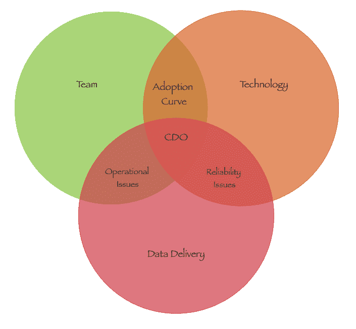

# 第三波 CDO 事业成功的蓝图

> 原文：<https://towardsdatascience.com/the-wave-3-cdo-blueprint-for-career-success-bd76574dbabb>

阿曼德·库利在 [Unsplash](https://unsplash.com/s/photos/geometric-wave?utm_source=unsplash&utm_medium=referral&utm_content=creditCopyText) 上拍摄的照片

## 现代 CDO 如何应对当今数据环境的复杂挑战

成为首席数据官从未如此艰难。一方面，对 CDO 的需求比以往任何时候都高，超过三分之二的企业任命了 CDO，而 2012 年这一比例还不到八分之一。另一方面，工作缺乏保障，CDO 平均持续时间仅为 2.5 年。这比所有其他高管都要短，是高管层 5 年平均任期的一半。

这部分是由于过去十年 CDO 关税的迅速扩大。第一波 CDO，专注于数据管理，特别是建立数据集市和数据仓库。他们还向这些数据仓库添加了数据治理。他们创建并实施了一些流程，以确保数据得到高效、安全的使用，免受网络盗窃、隐私风险、降级和其他任务的影响。换句话说，他们主要扮演坏警察的角色，监督员工如何使用数据。

然而，纯粹的防御角色让工人和 CDO 都士气低落，这催生了第二波 CDO 浪潮。而 CDO 比谁都懂数据。他们了解应用分析和创建数据管道和数据应用程序的力量。因此，第二波 CDO 成为了内部创新的领导者，倡导他们的公司如何看待和使用数据的转型，从一个被动的档案库，如布满灰尘的图书馆中的书籍，转变为数字企业的命脉。

如今，我们看到了第三波 CDO 的出现。我会解释的。

第三波 CDO 负责监督技术、运营和可靠性。(图片由作者提供)

**第三波 CDO 的作用**

‍Convinced 的价值分析，第三波 CDO 正在寻求纳入更多的数据源，如实时事件流。Wave 3 CDOs 希望构建运营仪表板，并定期向其业务提供数据。他们正在寻求机器学习生成的预测分析，以更好地做出决策。他们迫切需要基于人工智能的工作流来自动化流程，以提高效率、灵活性和成本节约。第三波 CDO 不仅仅被要求构思、计划和支持。他们被要求执行这些转换。为了做到这一点，他们被赋予了专门的数据运营团队、对数据技术和领域的监督，以及对整体数据可靠性和数据交付的责任。

**对现代 CDO 的期望**

如果 CDO 如此重要，那么为什么他们被解雇得如此之快、如此之频繁？

‍One 的理由是，对业务风险不了解的 CDO 往往试图在削减错误成本的同时实现数据基础设施的现代化。今天的第三波 CDO 部分或全部负责多样化的多云设置，包括 ERP 系统、Salesforce 实例、传统数据库、数据湖和其他大数据部署，以及云原生数据仓库。

‍To 从他们的数据管道和数据仓库中提供了更多的价值，他们不断修补和升级他们的基础设施。将数据带入云中是最常见的升级。由于云中易于切换和扩展，这种迁移看起来似乎很容易。

‍But:我们不要低估成功迁移所涉及的复杂性和工作。将数据从本地数据仓库迁移到云实例，无论是简单的提升和转移还是整体重构，都需要密切监控和认证数据迁移时所有数据集、模式和依赖项都保持不变。[验证和协调数据](https://medium.com/acceldata/acceldata-and-snowflake-26cae0a97e53)迁移前和迁移后是劳动密集型工作，时间紧迫的 CDO 和他的团队可能觉得他们没有足够的带宽来完成这项工作。‍

我们看到太多的 CDO 满足于让他们的运营团队快速查看迁移的数据以发现任何数据错误或数据可靠性受损。这样做对任何公司来说都是一个很大的风险，但对那些以支持销售、业务运营或任何其他关键任务的方式使用数据的公司来说则是一个巨大的风险。在这种情况下，不可避免地会出现数据错误和损坏的数据管道。最糟糕的是，如果在实际迁移过程中没有强有力的监督，这些问题将会在很长一段时间内持续出现，甚至在最糟糕的时候出现。数据迁移失败是 CDO 失业的一个重要原因。

**业务需要更多数据**

‍Reason 的第二个问题是无法支持企业对新数据工作流的巨大需求。即使他们没有主动将数据从集群迁移到云中，大多数 CDO 仍在不断添加新的数据源。其中包括实时客户点击流、来自内部存储库和第三方数据集市的变更数据捕获(CDC)同步、首先由您的 ERP 系统获取的物联网传感器数据，然后共享给更广泛的分析，等等。‍

该数据不符合单一结构。此外，处理数据的现代方式不再是写模式，而是读模式。这是一种更加灵活的策略，使得在大型数据湖中存储各种非结构化和半结构化数据类型变得更加容易。但是到了机器学习和分析的时候——特别是微妙、难以检测的异常和[数据科学家为](https://www.acceldata.io/blog/data-observability-for-data-scientists)而生的大胆的大趋势——来自不同来源的数十亿字节的数据必须经过协调才能被处理和查询。‍

所有这些都是繁重而复杂的工作，数据科学家完全无法处理。如果缺乏必要的工具，这给 CDO 和训练有素的数据工程师带来了大量潜在的苦差事。但是，由于当今许多 ML/AI 项目被赋予了高优先级，无法快速构建这些数据管道的 CDO 面临着被视为业务障碍的风险。

‍In 除了他们在进攻方面的职责之外，第三波 CDO 还负责防御数据——数据治理、安全和访问控制。然而，已经发生的巨大转变是，所有这些领域现在实际上都是可操作的，并且必须实时进行。数据治理不再是一次性的年度审计，而是必须持续执行并达到完美。

**导航现代数据环境**

CDO 们忙于平衡长期优化项目和消防演习。有些是常见的日常任务，有些对长期业务成功至关重要。担任这些角色的人需要始终评估他们应该评估的数据。他们必须知道数据是否可用。必须意识到计算系统是否在工作，业务流程是否管理良好？当 CDO 从这些问题开始并愿意回答这些问题时，他们就能更好地理解企业数据投资的内在可能性。

根据我领导数据团队的经验，运营成功的基础显然是数据的可靠性和有效性。在你的数据能够产生很大影响之前，你必须知道你可以信任它，并且它是最高质量的。CDO 需要一定程度的可见性，这不仅能让他们洞察问题所在，还能让他们理解数据活动。

随着时间的推移，我清楚地认识到，作为一名数据主管，为了确保我能够对我的组织产生有意义的影响，我必须知道的不仅仅是如何处理警报。我的价值来自于能够就支出预测、扩展和性能问题以及构成数据环境的无数其他问题做出明智的决策。当我寻求对数据操作智能的持续感知，使我能够解释数据供应链的状态时，我对数据操作的状态有了更好的处理。

这就是我如何想到第三代 CDO 的。他从数据管道/平台和数据应用程序的角度考虑内部数据环境。不仅仅是作为环境要素的那些，而是作为整体组成部分的它们之间的相互作用。意识到这些活动和行为是 CDO 成功的基础。最终，凭借可见性和战略地图，CDO 可以成功驾驭新的数据格局，并在未来几年蓬勃发展。