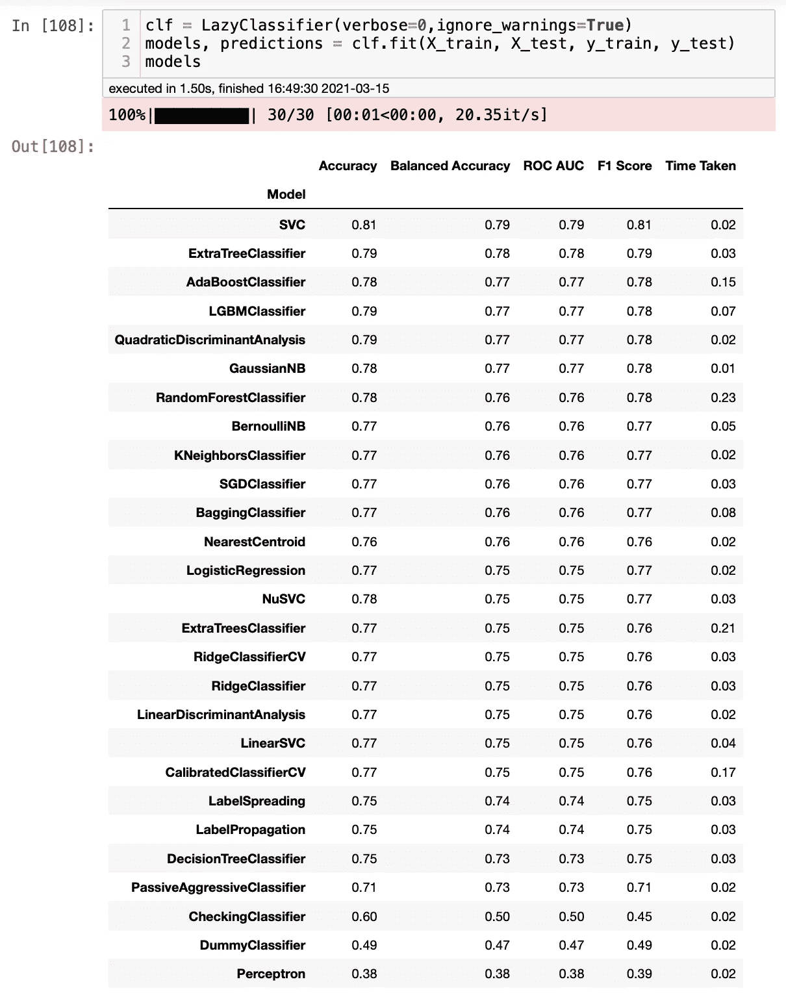
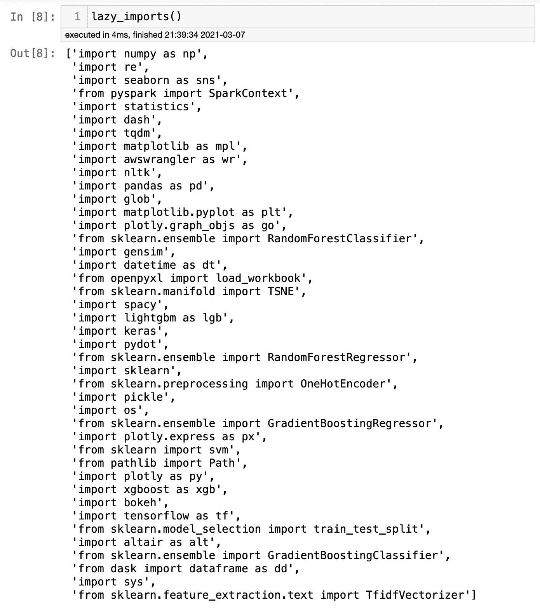
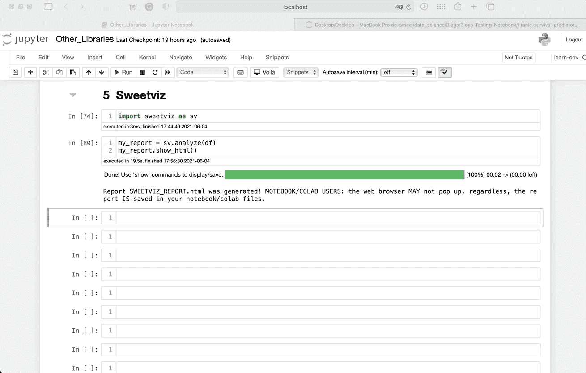

# 这些是你应该知道的 10 个最好的鲜为人知的 Python 库

> 原文：<https://towardsdatascience.com/these-are-the-10-best-lesser-known-python-libraries-you-should-know-about-9c551842fc39>

## 大蟒

## 这些是你应该知道和尝试的一些最好的 Python 库


来自 [Pexels](https://www.pexels.com/photo/man-holding-teacup-infront-of-laptop-on-top-of-table-inside-the-room-925786/?utm_content=attributionCopyText&utm_medium=referral&utm_source=pexels) 的 Andrea Piacquadio 的照片

数据科学的变化比以往任何时候都快，在学习如何提高我们的生产力时，我们需要创建一些捷径，Python 库非常适合这一点。如果你不熟悉我的博客，有一件事你应该知道:我喜欢测试 Python 库，并写关于它们的文章。我尝试了几十个图书馆，有些我比其他人更喜欢。

所以今天，我决定收集我最喜欢的 10 个鲜为人知的图书馆，你可能不知道，但应该知道。所以不多说了，让我们开始吧！

# 懒惰预测

先说我最喜欢的 Python 库:[懒预测](https://lazypredict.readthedocs.io/en/latest/)。Lazy Predict 是一个低代码的机器学习构建器，允许您用两行代码运行多达 40 个机器学习模型。

您需要准备好数据集，在训练和测试中拆分数据，并运行 Lazy Predict。就是这样。几秒钟后，它将返回几十个模型及其基线结果的列表。

```
import lazypredict
from lazypredict.Supervised import LazyClassifierclf = LazyClassifier(verbose=0,ignore_warnings=True)
models, predictions = clf.fit(X_train, X_test, y_train, y_test)
models
```



作者图片

如果你像我一样，你可能会认为这太好了，不像是真的，所以我不得不做一些测试来确认。我决定使用 Scikit-Learn 并测试随机模型，比如 Random Forest，结果非常相似。


我还尝试了逻辑回归，同样，结果非常相似。太神奇了！


作者图片

我写了两篇关于 Lazy Predict 的博客——一篇是关于分类模型的，另一篇是关于回归模型的，其中包括了我对它的想法和代码，这样你就可以自己测试了。

[](/how-to-run-30-machine-learning-models-with-2-lines-of-code-d0f94a537e52)  [](/how-to-run-40-regression-models-with-a-few-lines-of-code-5a24186de7d)  

# 勒克斯

Lux 是另一个你绝对应该尝试的黄金图书馆。它允许您进行探索性的数据分析，并通过一次点击构建数据可视化。你正在学习 Python，想学习更多关于数据探索和数据分析的知识吗？那莱克丝就是你的了。你是一个为你的项目寻找快速见解的专业人士吗？莱克丝也是给你的。

下面是 Lux 的开发商 T1 对此的看法:

> “Lux 是一个 Python 库，它通过自动化数据探索过程的某些方面来简化数据科学。Lux 旨在促进更快的数据实验，即使用户不清楚他们在寻找什么。Lux 集成了一个[交互式 Jupyter 小工具](https://github.com/lux-org/lux-widget)，允许用户直接在 Jupyter 笔记本上快速浏览大量数据。”


作者图片

如果你想进一步了解莱克丝，我还为此写了一篇博客。

[](/how-to-create-data-visualizations-on-python-with-one-click-f6bafbd8de54)  

# 黑色

这里说一些道理吧。你可以成为世界上最好的 Python 程序员，但是如果人们不能理解你写的东西，他们会认为你没有那么好。在 Python 中使用适当的间距受到许多 Python 用户的监督，借口是代码将以相同的方式运行。尽管如此，足够的间距有助于其他人(甚至是编写代码的人)更好地理解代码中发生的事情，而黑色有助于这一点。Black 是一个扩展，它在代码中添加了空格，使代码更加全面。

你安装扩展，把它添加到你的笔记本上，每次你运行一个单元，它就会固定间距。就这么简单！看下图，你会看到间距是如何自动固定的。


作者图片

# QuickDA

[QuickDA](https://pypi.org/project/quickda/) 是一个 Python 库，可以帮我们节省很多时间。它使数据探索和数据可视化变得容易。您可以用很少的代码完成数据探索、数据分析、数据清理和数据可视化。

它将其他超级酷的库，如 Pandas Profiling、Matplotlib、Plotly 等放在同一个库中。如果你正在做一个项目或者只是学习 Python，QuickDA 是你可以尝试的最好的库之一。


作者 GIF

QuickDA 太棒了，我在两个博客中写了关于它的内容。一个侧重于数据清理、数据探索和数据分析，您可以在此找到:

[](/save-hours-of-work-doing-a-complete-eda-with-a-few-lines-of-code-45de2e60f257) [## 用几行代码完成一个完整的 EDA，节省大量时间

towardsdatascience.com](/save-hours-of-work-doing-a-complete-eda-with-a-few-lines-of-code-45de2e60f257) 

另一个关注数据可视化，你可以在这里找到:

[](/how-to-create-data-visualizations-in-python-with-one-line-of-code-8cda1044fe69) [## 如何用一行代码在 Python 中创建数据可视化

towardsdatascience.com](/how-to-create-data-visualizations-in-python-with-one-line-of-code-8cda1044fe69) 

# PyForest

PyForest 是我写的第一批 Python 库之一。我发现 PyForest 时，我正在用多个笔记本进行一个大型项目，我总是忘记导入我必须使用的许多库。PyForest 在这方面有所帮助。您可以用一行代码将 40 个库“导入”到您的项目中。请注意，我在引号中使用 import，因为 PyForest 只会在您使用它时导入库。否则，它不会被添加到您的 Jupyter 笔记本中。

你需要做的就是导入 PyForest，并在你的笔记本中调用它。嘣！如果你需要的话，所有最流行的库都可以使用。请参见下面可供使用的 Python 库列表。



作者图片

你可以在这里找到我的博客:

[](/how-to-import-all-python-libraries-with-one-line-of-code-2b9e66a5879f)  

# Bamboolib，米托和 D-Tale

Bamboolib、米托和 D-Tale 不是一个图书馆。它们实际上是三个不同的库。我将它们放在一起的原因是它们有一个相似的概念:通过一个看起来更像电子表格的图形用户界面，帮助人们完成诸如数据清理、数据探索、数据可视化等任务。

对于学习者来说，它们非常棒，因为除了允许人们通过一两次点击来完成需要多行代码的任务之外，它们还会给你代码，这样你就可以看到每个任务是如何完成的。

哪一个是我最喜欢的？我看不出来！虽然他们有相似的概念，但他们也有独特的功能。他们中的一些人比其他人拥有更多。还有，我觉得有些比较好用，所以我推荐你自己试试，自己下结论。我可以补充一点说明，Bamboolib 有免费版和付费版。我只测试了免费版。

如果你想了解更多，我为这三个图书馆写了博客。

## Bamboolib

这里有一个小 GIF 展示了 Bamboolib 的样子。有免费版和付费版；我只测试了免费版本，因为我们有其他类似的选择，我不认为我会为此付费。


作者 GIF

这是我关于 Bamboolib 的博客

[](/bamboolib-one-of-the-most-useful-python-libraries-you-have-ever-seen-6ce331685bb7)  

## 米托

在这三个博客中，我关于米托的博客可能是我最喜欢的，但它并不是一成不变的。我认为他们的 GUI 是这三个库中最好的，但是缺少 Bamboolib 的一些功能。我听说他们总是包括更多的功能，所以这可能会改变。


作者 GIF

这是我关于米托的博客:

[](/mito-one-of-the-coolest-python-libraries-you-have-ever-seen-5261dbfedceb)  

## 数字童话

与米托和 Bamboolib 相比，D-Tale 具有更复杂的特性，但它不像它的兄弟姐妹那样直观。开发人员做了出色的工作，但有时会令人困惑，而且在 Jupyter Notebook 中使用时有点慢。幸运的是，您可以在浏览器中打开另一个标签，继续您的工作。


作者 GIF

[](/d-tale-one-of-the-best-python-libraries-you-have-ever-seen-c2deecdfd2b)  

# PyCaret

PyCaret 是一个用 Python 编写的开源、低代码的机器学习库，可以自动化机器学习工作流。你需要有一个数据集来预测，PyCaret 会做探索性数据分析、数据预处理、模型训练、模型可解释性、MLOps 等任务。与 LazyPredict 类似，它也可以用很少的几行代码运行多个机器学习模型。


作者 GIF

如果你想在测试之前看一下，他们还有一个漂亮的[网站](https://pycaret.org/)。

几个月前我写过这个。是时候写一篇关于它的新博客了，因为他们增加了更多的功能，但是你可以在这里了解 PyCaret:

[](/how-to-run-complex-machine-learning-models-with-2-lines-of-code-e0a541502ee9)  

# SweetViz

最后但同样重要的是，我们有超级酷的 SweetViz。SweetViz 创建了一个 HTML 文件，您可以通过两行代码获得完整的探索性数据分析报告。我在工作环境中用过，所有同事都印象深刻。

以下是它的开发者[对此的评论](https://pypi.org/project/sweetviz/):

> “Sweetviz 是一个开源 Python 库，只需两行代码即可为 kickstart EDA(探索性数据分析)生成漂亮的高密度可视化效果。输出是一个完全独立的 HTML 应用程序。
> 
> 该系统围绕快速可视化目标值和比较数据集而构建。它的目标是帮助快速分析目标特征、训练与测试数据以及其他类似的数据表征任务。"

我在这篇博客中已经谈到了 Lux，那么为什么还要测试 SweetViz 呢？因为 SweetViz 有很多 Lux 没有的功能，反之亦然。他们之间我没有最喜欢的，因为他们完成相似但不同的任务。



作者 GIF

几个月前我写了一篇关于它的博客，如果你想了解更多的话:

[](/5-python-libraries-that-you-dont-know-but-you-should-fd6f810773a7) [## 5 个你不知道但应该知道的 Python 库

towardsdatascience.com](/5-python-libraries-that-you-dont-know-but-you-should-fd6f810773a7) 

# 最后的想法

今天我浏览了一些我一直最喜欢的 Python 库。我真诚地相信每个人都应该了解它们，即使我们不会每天都使用它们。我每周都收到无数的消息，人们谈论这些图书馆如何帮助他们学习和提高工作效率，所以我决定把它们都放在同一个博客里。

数据科学在不断变化，我们每天都需要学习如何提高工作环境中的效率。了解一些可以节省您的编码时间的库是提高您的生产力并使我们更具竞争力的一个很好的方法。我建议你自己尝试一下，然后得出你的结论。如果你有，让我知道你的想法。编码快乐！