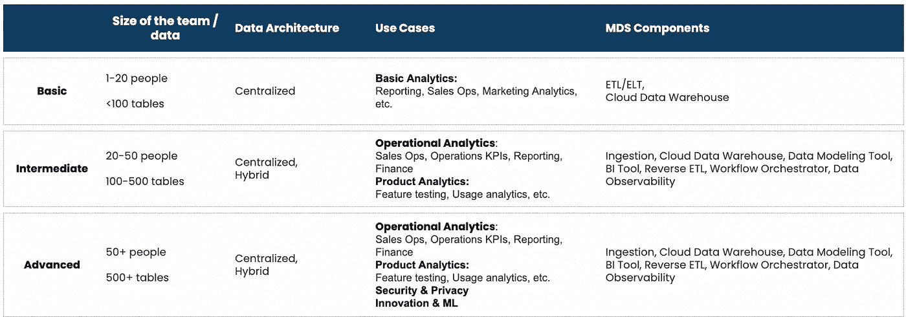

# 我希望在组建数据团队时就知道的事情

> 原文：<https://towardsdatascience.com/things-i-wish-i-knew-when-i-was-building-a-data-team-efcb43591204>

## 如何根据您公司的数据成熟度阶段为成功的数据实践奠定正确的基础

资料来源:Randy Fath [，Unsplash](https://unsplash.com/photos/ymf4_9Y9S_A)

在之前的一次经历中，我被要求建立一个数据团队。这项任务对我来说是全新的，所以我做了任何人在我的情况下都会做的事情:我谷歌了一下。我找到了许多关于这个主题的资源，但是大多数的博客和文章主要集中在更技术性的方面。虽然有些信息很有帮助，但我仍然不知道从哪里开始。

这种挫败感是我写这篇文章的动机。这里的目的是就关注什么、如何确定优先级以及其他考虑事项提供指导，这些将有助于组织的现代领导者向数据成熟度迈出第一步。

## **一、设定正确的目标**

数据团队的目标应该在实施之前设定。它们应该包括来自不同业务部门(工程、产品、营销、财务等)的关键利益相关者。)，因为许多人最终将成为数据产品的消费者。

数据团队的目标反映公司的数据素养水平也至关重要。考虑到您正在从零开始建立数据团队，您的公司可能正处于数据成熟的早期阶段。稍后将详细介绍。

数据团队的目标通常可以分为以下几类:

*   **试探性**:公司有一些数据，但你不知道如何利用这些数据，因为你不知道去哪里找，也不知道是否应该信任这些数据。
*   **分析**:你的领导层确信，数据驱动是做出更好商业决策的关键。可能已经有人尝试在 Microsoft Excel 或其他工具中进行分析，但是您希望将数据使用提升到一个新的水平。
*   **创新**:当你已经有了做决策的必要洞察，你认为 AI/ML 会帮你创造下一个差异化优势；所以，你要开始往那个方向投资。

## **二。定义组织结构**

现在您已经定义了业务目标，您应该从公司组织的角度决定数据团队的位置。这一步至关重要，因为它将为避免各自为政和所有权不明奠定适当的基础。一些流行的设置:

*   **在工程部门**:在一些像 LinkedIn 这样的组织中，数据团队是工程部门的一部分。在过去看到过类似的设置，我认为数据和工程团队应该作为合作伙伴，因此，有单独的报告线。在两者之间创建报告动态可能会危及协作的效率，并使数据团队远离业务。
*   **在产品内**:当产品与数据紧密相关，并且组织主要依赖数据进行特性测试和其他产品分析用例时，这是有意义的。
*   **在业务实体中:**财务或营销，例如，这通常是小型数据团队的情况，其范围和目标仅与该特定团队相关(不建议大型公司使用)。
*   **作为独立实体:**直接向首席执行官或首席财务官报告。这对于一个组织来说是有意义的，该组织已经:a .达到了良好的数据成熟度和公司范围的数据素养水平，b .跨不同业务功能的各种定义良好的用例，并且正在考虑迎合各种业务领域的“数据作为产品”类型的方法。

## **三世。选择合适的数据堆栈和数据平台。**

有了为您的数据团队定义的目标和组织报告，您现在需要考虑几个方面:公司的数据成熟度阶段、数据堆栈和数据平台。

**1。数据成熟度阶段**

*   **基础**:这适用于任何刚开始接触数据并希望通过分析工具从数据源中获取洞察力的组织。团队的规模可以从 1 人(通常是创始人之一或数据工程雇员)到 1-5 人的小型数据团队不等。
*   **中间:**数据用于各种用例:产品、增长、业务监控等。您已经有了数据堆栈的初始版本，并且您的数据团队正在成长。
*   **高级:**数据是贵公司战略和决策的核心。每个部门在日常运营中都依赖于数据；用例多种多样，从运营分析到在产品差异化和目标设定中对人工智能和人工智能的高级利用。

**2。数据栈** 现代数据栈(MDS)是一个工具和技术的集合，帮助企业收集、转换、存储和利用数据进行分析和 ML 用例。现代数据堆栈基于云、模块化，通常包括以下几层:

*   **集成，ETL/ELT:** 数据从源传输(在某些情况下，进行规范化和转换)到存储的地方。想想像 Fivetran、Stitch 和 Airbyte 这样的工具。
*   **存储:**数据存储的地方，一般是云数据仓库或者数据湖。想想像雪花、数据块和 BigQuery 这样的工具。
*   **转换&建模:**将原始数据转换成便于运营分析访问的格式、形状和结构。想想像 Dbt 和 Dataform 这样的工具。
*   **商业智能/数据可视化:**数据被消费的地方，通常是在仪表板、图表或表格中，并可供业务用户访问。想想像 Tableau、Looker 和 Mode 这样的工具。
*   **工作流程编排:**通过允许用户创建、调度和监控数据管道，将所有这些组件结合在一起的“粘合剂”。
*   **反向 ETL:** a [反向 ETL](https://medium.com/towards-data-science/trends-that-shaped-the-modern-data-stack-in-2021-4e2348fee9a3) 是将数据从数据仓库转移到其他基于云的业务应用程序(CRM、营销、财务工具等)。)因此它可以用于分析目的。想想像 Hightouch 和 Census 这样的工具。
*   [**数据可观察性**](https://medium.com/@salmabakouk/data-quality-monitoring-is-dead-say-hello-to-full-data-stack-observability-f73cac27ea52) **:** 这是“栈顶”层，确保数据在整个栈中可靠可信。作为首席执行官和 Sifflet 的联合创始人，我对此有偏见。

**3。
数据平台**一般来说，数据平台可以是:

*   **集中化:**这可以说是最容易实现的团队结构，也是那些开始向数据驱动转变的公司的必经之路。团队和架构都集中在这里。
*   **混合:**该公司正处于一个成长阶段，多个团队每天都利用数据来做出决策。数据被视为一种产品，虽然数据团队是集中的，但在组织内进一步民主化数据的努力已经完成。在这种情况下，可能存在“专家”，通常是每个业务职能部门内的数据分析师或分析工程师，他们拥有足够的技术技能来与数据团队沟通和自主工作，同时还具有业务背景。
*   **完全去中心化:**该公司在其数据平台中完全采用去中心化，利用来自[数据网格](/trends-that-shaped-the-modern-data-stack-in-2021-4e2348fee9a3)等概念的原则。数据团队(尽管在这种情况下，传统团队的概念不太相关)反映了数据无处不在的本质。每个业务领域都可以利用数据平台的模块化和面向自助服务的特性来开启最先进的数据驱动案例。想想微服务，但对于数据平台来说，领域专业知识符合数据及其基础设施的民主化。

资料来源:Salma Bakouk

## **四世。招聘部分**

现在让我们把重点放在人力资源方面。数据团队有三种核心技术能力:数据工程、数据分析和数据科学。这些角色的其他变化或组合导致了分析工程师、ML 工程师、MLOps、BI 开发人员等角色的出现。在数据更成熟的组织中，类似 DataOps、MLOps、DataSecOps 等职位。，经常受到追捧。

让我们详细介绍一下这三个突出的角色。

*   数据工程师:负责创建、扩展和维护支持和产生数据的基础设施。需要的技能:云技术、数据库、ETL、Java、Python。由 [Cord 提供更多信息。co](https://cord.co/insights/skillset-demand/articles/in-demand-data-skills-2022)
    Maxime Beauchemin 写了一系列关于数据工程作为职业道路的伟大文章，值得一读:[数据工程师的崛起](https://www.freecodecamp.org/news/the-rise-of-the-data-engineer-91be18f1e603)和[数据工程师的衰落](https://maximebeauchemin.medium.com/the-downfall-of-the-data-engineer-5bfb701e5d6b)。
*   **数据科学家**:负责使用高级统计学、数据建模和 ML 技术创建、维护和扩展数据科学模型。找的技能:统计分析&计算，编程(Python，SQL，R)，机器学习，数据扯皮。拉希·德赛对此有更多报道。
*   **数据分析师:**负责将数据转化为洞察。数据分析师可以将最终业务需求与源数据联系起来，同时评估所需的转换和争论。要寻找的技能:SQL，商业理解(通常是低调的，但却是必不可少的)，商业智能知识，创造力。WINC 的分析工程师 Madison Schott 发表了一系列关于适用于数据分析的分析工程最佳实践的文章[。](https://medium.com/geekculture/what-companies-really-want-in-an-analytics-engineer-1ac03ff4494a)

**你应该先雇佣谁？**

如果你刚刚开始，我建议你遵循“少即是多”的原则。从小处着手，支持“完整数据堆栈”功能，并牢记您的数据团队的目标；随着需求的发展，你可以一次增加一名成员。

在早期阶段，数据团队倾向于专注于实验和初始概念验证，而不是将一个大项目投入生产。在这种情况下，数据分析师或具有分析技能(Python、SQL 等)的数据工程师。)作为第一次雇佣会更有价值。这个人可以在第一次 POC 中与软件工程师一起工作，这将有助于确定第一个管道需求。这为第二次雇用铺平了道路，第二次雇用应该是具有更多数据和架构工程技能的人，以继续构建平台并做出适当的基础架构选择。此后，应根据正在进行的项目进行进一步的招聘。

**有哪些需要寻找的软技能？**

评估数据专业人员时，软技能至关重要。默认情况下，数据实践是跨职能的；数据团队的核心任务是帮助企业从数据中获取最大价值，并成为数据驱动型企业。因此，靠近商业是必不可少的。另一方面，尤其是在数据成熟的早期阶段，数据团队还与 IT 和软件工程密切合作，以确保数据基础设施的稳定性和可持续性。一名优秀的数据员工应具备以下技能:

*   沟通:候选人需要是一个清晰高效的沟通者，有能力适应技术和非技术受众。
*   **业务知识**:这对于确保顺利采用数据计划、帮助数据消费者将数据转化为可操作的见解，以及知道优先处理什么和何时处理至关重要。
*   **道德和安全第一的心态**:在早期阶段，您的流程可能仍然很脆弱，缺乏数据隐私和安全性。合适的员工将确保研究和实施最佳实践，从而为数据保护和遵守数据法规(即使是在早期阶段)奠定适当的基础。
*   **灵活性和适应性**:数据团队需要能够适应贵公司的发展和可能由此产生的业务考虑，同时还要适应数据基础设施和工具行业的快节奏。

## **V .需要牢记的事情**

*   **专注于业务**:大多数公司的业务不是为了分析而分析，他们通过其他方式增长，而分析是为了增长服务的。
*   **不要低估内部宣传** —您的组织需要强有力的管理层认同和数据领导力来培育数据文化。
*   **数据领导至关重要**避免数据组织分裂，业务部门无法从数据团队获得所需的帮助，因此不得不雇佣其他分析师。
*   **传达数据团队的期望**。业务部门领导会对与数据团队合作感到非常兴奋。然而，由于资源在一开始是有限的，所以从一开始就设定正确的期望值是至关重要的。
*   **品牌是关键**。创建数据团队的一致形象将影响组织的其他部分如何看待数据团队并与之交互。
*   不要低估技术上的缺陷:了解团队存在之前的过去。许多内部快捷方式(非常长的 SQL 查询、电子表格等。)是作为一种临时解决方案来完成的。通过展示有价值的例子和案例研究来证明改变组织内现有数据实践的重要性是至关重要的。如果团队内部需要恢复信任，这一点尤为重要。
*   **定义清晰的成功 KPI:**一般来说，这些 KPI 需要支持 ROI，而不是直接影响它。

## **结论**

建立数据实践不仅仅是做出技术选择；您可能必须从第一次迭代开始，并期望它随着您的业务增长而发展。虽然没有放之四海而皆准的方法，但我从自己的经验以及与数据领导者围绕该主题的多次对话中收集了一些最佳实践。从“为什么”开始，通过评估您组织的数据成熟度为您的现代数据团队设定正确的目标至关重要。处于不同数据成熟度阶段的公司有不同的需求，这应该会推动您在创建团队时做出选择。此外，您需要为组织内的数据团队定义一个明确的角色，以避免孤岛和不明确的所有权。除此之外，您需要为您的组织选择最佳的数据堆栈和数据平台。虽然它可能无法满足所有的考虑，但本博客旨在为您提供最佳实践的概述和建议的非详尽列表，以克服在构建现代数据团队时可能出现的一些非技术性挑战。考虑到组织在团队创建阶段面临的非技术挑战，技术方面也值得详细关注。我将在另一篇博客中详细讨论这些。