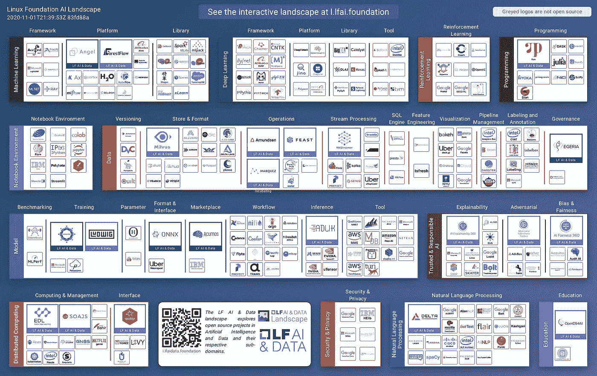

# 为数据科学思考快与慢

> 原文：<https://towardsdatascience.com/thinking-fast-and-slow-for-data-science-e739513becbf>

## 知道何时使用实验和何时使用 MLOps 的重要性

云层上的日落。作者图片

这些天来，几乎每一个与数据科学和机器学习工程相关的内容似乎都是关于 MLOps 的。自从《机器学习系统中隐藏的技术债务》(Sculley 等人)在 2015 年末出版以来，学习和教授 MLOps 概念的人数急剧增加。这篇论文中的这张著名图片在几乎所有 MLOps 文章和书籍(包括我自己的一些演练)中作为学习 MLOps 的前提#1 被分享。

[机器学习系统中隐藏的技术债务](https://papers.nips.cc/paper/2015/file/86df7dcfd896fcaf2674f757a2463eba-Paper.pdf)，斯卡利等人

通常，前提#2 是关于有多少机器学习模型最终进入生产的一些统计，作为从大量机器学习模型中获得最小价值的启发。

MLOps 的谷歌搜索趋势。作者图片

> MLOps 是实验的对立面，数据科学家的成功依赖于能够高度敏锐地利用这两种心智能力。

MLOps 已经(并将继续)席卷数据科学界，以至于它被视为数据科学专业人员发展的自然进程。即使作为一个对这个领域非常着迷并参与过多个与 MLOps 相关的项目的人，我也想澄清一下，这种主导地位对该领域的整体寿命是有害的。MLOps 是实验的对立面，数据科学家的成功依赖于能够高度敏锐地利用这两种心智能力。过度关注其中一个范例会降低另一个范例的重要性，但是两者都是最大化所产生价值的关键。

丹尼尔·卡内曼的《思考的快慢》是我最喜欢的书之一，这位诺贝尔奖获得者在书中强调了你大脑中的两个主导系统——系统 1 和系统 2。系统 1 是自动和冲动的能力，而系统 2 是有意识和方法的能力。虽然我不会在这里深入研究这本书，但我会对书中讨论的概念进行类比，因为我认为它非常适用于数据世界。无论如何，我鼓励阅读这本书——它很吸引人，而且有科学依据。

在我们的案例中，数据科学家在使用 MLOps 概念和原则构建系统时，需要非常小心谨慎。他们需要锻炼他们的系统 2 心智模型，让他们能够慢慢设计出远远超越他们的东西。由于工艺的技术严谨，这种类型的思维被吹捧为最重要的。为了让数据科学家取得巨大成功，他们需要利用自己的直觉和好奇心来寻找创造性的解决方案。这套系统 1 心智模型允许他们提出各种各样的智能问题，并进行足够的实验，以确定继续前进的正确问题。

对于数据科学家来说，系统 1 和系统 2 思维的差异不在于你是否在进行机器学习，而在于你在指导有效决策方面的目标。数据科学家必须在每个项目中微妙地平衡速度和规模。从运行专家分析到工程统计方法，两个系统顽强地相互平衡着。就像系统 1 和系统 2 在我们的大脑中从心理上起作用一样，这些系统在工作时会一致地一起工作，看到它们各自的价值和缺陷对我们有利。这两者之间有明显的区别:

> 系统 1:在好奇心的引导下，提出更好的问题。
> 
> 系统 2:严谨领导下的方法和缓慢的专业知识，以提供更好的答案。

谷歌首席数据科学家凯西·科兹尔科夫(Cassie Kozyrkov)开创了决策科学作为一个领域的重要性。她写道[卓越的分析完全是关于速度](/analytical-excellence-is-all-about-speed-6881c848c09c)以真实地展示数据分析师、机器学习/人工智能工程师和数据科学家的重要性以及他们各自的闪光点。虽然我同意他们都应该学习自己的专业知识，但我经常看到高级+分析师、mle 和数据科学家执行以上所有的一点点。他们必须是某些方面的大师，至少也是所有方面的大师。行业需要这种多方面的数据专业人员，这使得每个人都发展了这两种主要的思维系统。

系统 1 包括对数据的快速实验，以获得对它包含什么、极限在哪里、可能存在什么样的选择偏差、它可以合理地产生什么样的答案等等的有力把握。

系统 2 包括精心构建系统，利用系统中的数据，通过能够归纳出具有可再现性、透明性和抗脆弱性的新数据的模型进行有效扩展。

最后，为了简洁起见，我将称“数据科学家”为任何从事企业机器学习工作的人的简称。这对于机器学习工程师或其他数据从业者也同样重要。

# MLOps 困扰的根源

任何参与 Twitter 机器学习社区的人几乎每隔一周就会看到一张新的 MLOps 图。一个架构的一些新的“需要的”组件声称使机器学习项目更加系统化。

最简单的图增加了开发和生产区域的二分法，最复杂的看起来像整个 IT 组织。

Twitter 公共域，tweet 作者@suzatweet。作者图片

不同组织在构建机器学习系统方面的差异也催生了过多的工具和技术，试图解决一些或所有 MLOps 的不满。

生产机器学习工具的精选列表由伦理人工智能研究所维护。[图片来源](https://landscape.lfai.foundation/)

因此，这使得数据科学家争相成为各种工具的大师，努力建立这些“鲁棒和可扩展的”机器学习系统。这一点和执行方向的驱动原因似乎源于这样一种想法，即最小的机器学习模型最终会进入生产，因此从这些大规模项目中检索到的价值最小。

尽管关于有多少机器学习模型进入生产的这些指标的准确性还没有定论，但我主要想首先质疑这个前提的必要性。让每一个机器学习模型投入生产的需求是什么？从什么时候开始，这个行业盲目地接受了这样一种观点，即除非一个模型进入生产阶段(因此需要所有这些周围的基础设施)，否则价值很难达到？

Lak Lakshmanan 写了一篇很棒的文章[“不，你不需要 MLOps”](https://medium.com/@lakshmanok/no-you-dont-need-mlops-5e1ce9fdaa4b)在那里他阐明了大规模构建机器学习系统的过度复杂性。存在更简单的解决方案来“执行 MLOps”并遵循适当的准则，而不需要过度设计架构，这将导致比 2015 年更大的技术债务。

在继续我的观点之前，我想非常清楚地表明，我确实相信构建高效、健壮和可扩展的机器学习系统的价值，不管有没有简单的解决方案。我相信数据科学家学习如何思考和构建超越 Jupyter 笔记本，但这并不意味着他们的角色应该仅仅局限于这一功能。

当目标是构建超越 Jupyter 笔记本时，最好从版本控制、特性存储、模型注册以及帮助 MLOps 的数百种工具或技术方面开始考虑。这个深得吓人的兔子洞会很快欺骗你，让你认为这是需要优化的“首要”技能。实验和系统 1 思维的价值是人们雇佣数据科学家的原因，因为他们有能力建立大规模的数据系统，但这在 Kubernetes、Docker、Terraform 等的噪音中变得相形见绌。尽管 MLOps 确实可以非常好地服务于某些项目，但它并不是每个数据项目的最佳答案。

# 可悲的是，实验被低估了

我说的“实验”并不是指 A/B 测试和贝叶斯推断方法；我指的是最广义的实验。通常，它可以被认为是“R&D 工作”，但从根本上说，它是能够在您的数据项目中从 0 到 1 的技能。

当你设计一个大规模的系统时，你需要可重复的步骤，在这些步骤中你可以选择一个随机的系统，并使它尽可能的可理解和可控制。但是除非你知道该问什么样的问题以及去哪里寻找答案，否则你很可能会建立一个没有人会使用或从中发现价值的系统。我们可以衡量预测的价值，当它们失败时会发生什么，并设置 okr 以确保我们可以定量地“成功”。这与测量实验的价值截然不同，后者的目标是从零到一。实验是帮助你确定要解决的正确问题的方法，它要求你以数据为导向，以产品为导向，并对领域有很强的理解。这可以涉及 ML，也可以不涉及；它更多的是关于开发一个你的数据集想要表现的世界的强大模型。

> 如果不能在头脑中模拟超出现有数据集的数据集模型，您就无法很好地理解如何构建一个系统来推广现实世界中部署的新数据。

在实践中，实验通常是分析师和/或产品经理所期望的，但我经常看到数据科学家/mle 在他们变得更高级时不得不自己做这项工作。你越进步，似乎你就越被期望在两个系统中思考，并拥有更多你构建的整个数据产品。你也开始对你可能遇到的陷阱的领域有了具体的直觉，这极大地提高了你捕捉随后可能出现的错误的能力。这种直觉真的只来自于强大的实验。如果不能在头脑中模拟超出现有数据集的数据集模型，您就无法很好地理解如何构建一个系统来推广现实世界中部署的新数据。

问题在于给这项工作分配一个数值。这是艰难的，模糊的，不可预测的。理解一个领域和组成该领域的人，对为什么会出现某些空值、缺少什么混杂因素(以及为什么)以推断因果关系、总体打算采用什么分布等有一个具体的想法，这可能是一个学习和探索的随机过程，需要系统 1 比系统 2 思考更多。很多工作几乎不可能有效地重复。它处理数据的上下文性质，这在很大程度上受您对领域的看法和在领域中花费的时间的影响。

尽管这项工作可能会很慢并且需要深思熟虑，但是在进行大规模数据科学项目时，您通常会面临紧迫的截止日期，并且您很少有“足够”的时间来完成所有工作。这实质上意味着这种实验工作几乎总是会得到快速跟踪，因此行业需要深入了解某个领域并建立强大数据系统的专家——他们的直觉很深刻，并在谨慎的假设下得到明智的引导。这被认为是有价值的，但这通常没有转化为在这项工作上花费的时间。

# 建立有效的系统需要聪明的好奇心

过度关注 MLOps 最大的遗憾是，我们给人的印象是，它位于数据科学这座大山的顶端，其他一切都是前进道路上的垫脚石。现实是，MLOps 只是两座大山中的一座，另一座是实验。这两座山都值得攀登，也富有挑战性，而且都有潜力产生难以置信的价值。一名经验丰富的数据专业人员受雇能够翻越任何一座山，这意味着了解:何时翻越哪座山，翻越每座山时的常见陷阱/如何导航，到达山顶的最有效方法，以及如何开辟一条其他人也可能遵循的道路。

几乎总是，攀登实验山使攀登姆罗普斯山变得更好。这通常不是因为你可以在任何关于“如何进行机器学习”的普通博客帖子中读到的公式化原因。这是因为精确的领域知识让您能够洞察数据，并帮助您为不断变化的真实世界数据集创建可概括的模型。

> 攀登实验之山的有效方法是保持好奇心和探索精神。相关领域材料的异步阅读，对数据集上下文研究的定性查询，用度量和直觉驱动的想法分析数据，等等都是驱动这种系统 1 思维模式的因素。
> 
> 攀登 MLOps 之山的有效方法是战略和方法。规划所需的系统和工具，协调监督某些方面的人员，制定策略来平衡系统的触发和启发，等等都是驱动系统 2 思维的因素。

专家们在紧张的时间期限下平衡两者，而不会精疲力竭。这才是我们应该放在数据科学这座大山的顶峰的东西。正因为如此，它不同于真正的软件工程角色，我认为我们通过认识和教授另外 50%的角色，为这个领域做出了巨大的贡献。

非常感谢你给我时间来读这个故事。我休了很长一段时间的假，因为我度过了一个多事之秋(搬到了一个新的城市，结婚了，开始了一份新的工作)，不幸的是，这个夏天把我的一些爱好搁置了。我很兴奋能重新开始写作，尤其是这首曲子开启了写作的序幕。和我所有的故事一样，我欢迎辩论，所以请不要盲目地同意我的观点——找出它们的漏洞，让我们聊聊吧！

# 通过我的推荐链接成为中级会员

Medium 是我日常阅读的大型存储库，如果你在数据领域，这个平台就是一座金矿。如果你想订阅，这是我的推荐链接。完全披露:如果您使用此链接订阅 Medium，您的订阅费的一部分将直接交给我。希望你能成为我们社区的一员。

 [## 通过我的推荐链接加入媒体- Ani Madurkar

### 阅读 Ani Madurkar(以及媒体上成千上万的其他作家)的每一个故事。您的会员费直接支持…

animadurkar.medium.com](https://animadurkar.medium.com/membership)