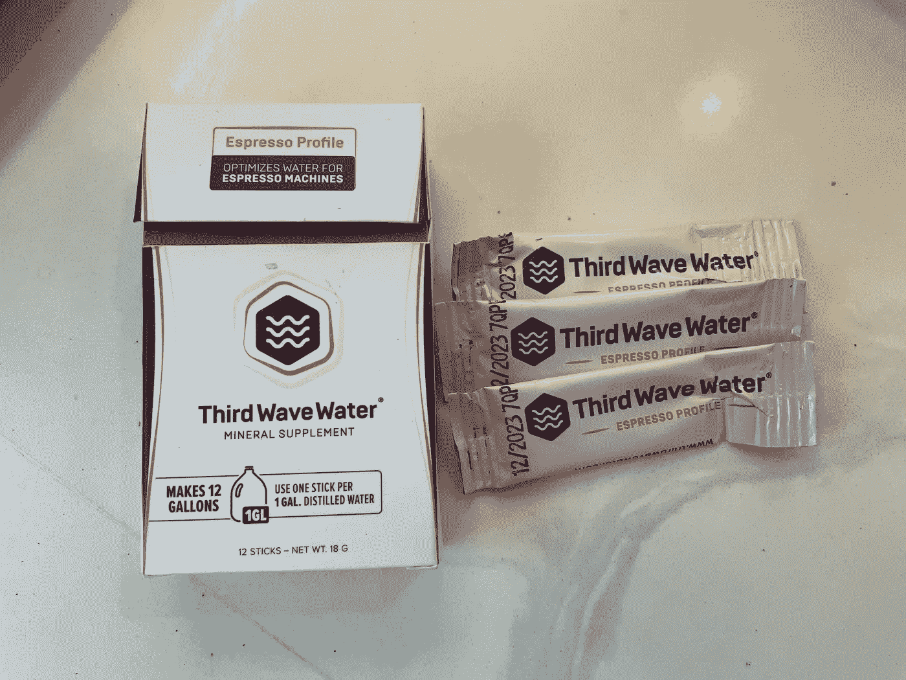
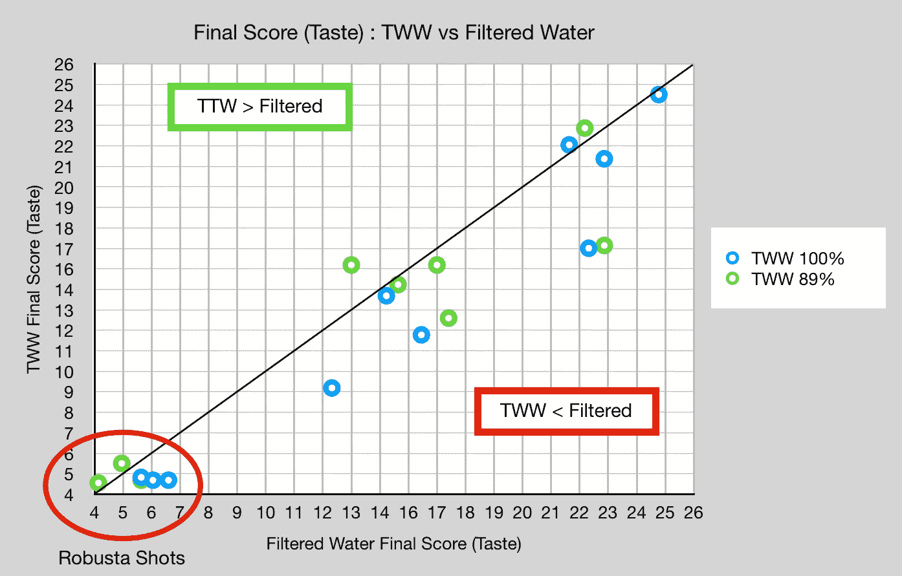
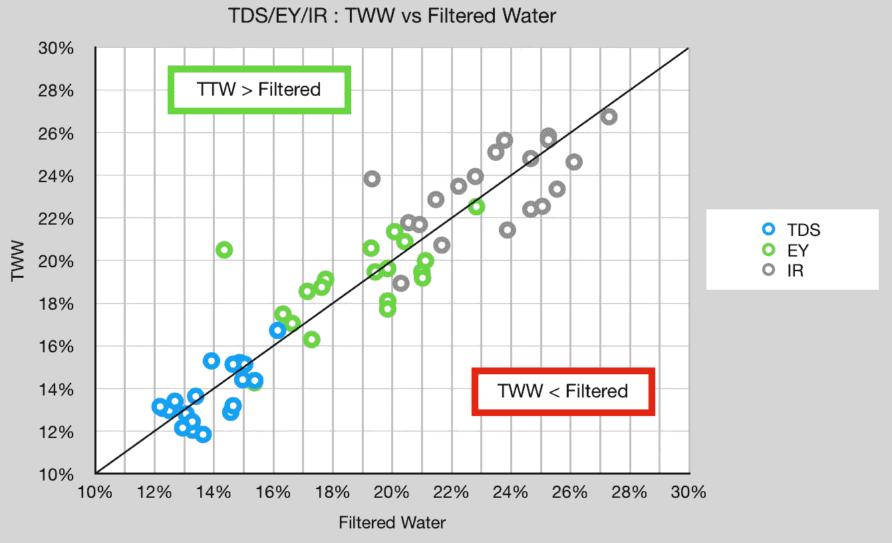
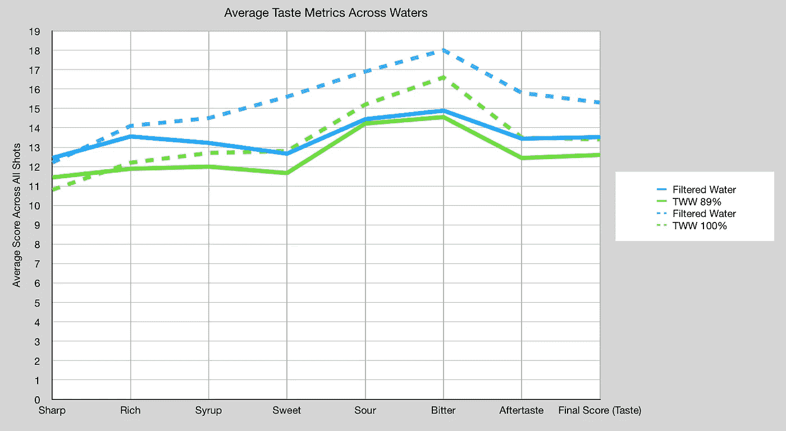
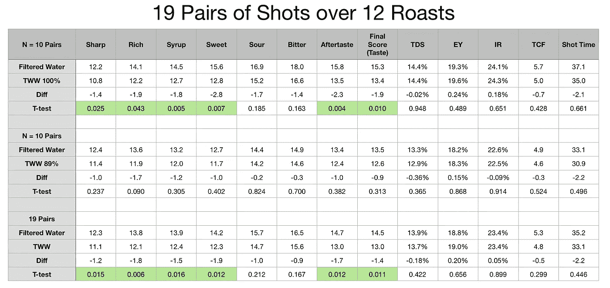

# 浓缩咖啡的第三波水与过滤水

> 原文：<https://towardsdatascience.com/third-wave-water-vs-filtered-water-for-espresso-955f9588693>

## 咖啡数据科学

## 我更喜欢我习惯的水还是更好的水？

第一次用[第三波水(TWW)](/stumbling-in-water-espresso-water-experiment-6e3e78b03b5e) 的时候，用的是一般的配方，不是浓缩咖啡专用的那种。我决定尝试混合浓缩咖啡，来自 [TWW](https://thirdwavewater.com/) 的泰勒送来了样品。我查看了一组多次烘烤的成对照片，我发现味道有所下降，但对提取没有明显影响。

所有图片由作者提供

TWW 背后的想法是，你拿起蒸馏水，加入他们的矿物质包。无论当地水质如何，这都能让你获得适合喝咖啡或浓缩咖啡的稳定水源。

我住在加州的圣克拉拉县，我用的是冰箱里的过滤水。这个实验的警告是，自从八年前我来到加州，我就一直是这种浓缩咖啡的过滤水。所以很有可能我是有偏见的，我鼓励有兴趣的人自己做研究，更好地了解他们的口味。

另一个警告是，我比大多数人更喜欢食物中含盐量高的食物。当某种东西对我来说咸得恰到好处时，对其他人来说却似乎咸得过头了。所以每个人的味蕾都不一样。

# 设备/技术

[意式咖啡机](/taxonomy-of-lever-espresso-machines-f32d111688f1) : [像样的意式咖啡机](/developing-a-decent-profile-for-espresso-c2750bed053f)

[咖啡研磨机](/rok-beats-niche-zero-part-1-7957ec49840d) : [小生零位](https://youtu.be/2F_0bPW7ZPw)

咖啡:[家庭烘焙咖啡](https://rmckeon.medium.com/coffee-roasting-splash-page-780b0c3242ea)，中杯(第一口+ 1 分钟)

镜头准备:[断奏夯实](/staccato-tamping-improving-espresso-without-a-sifter-b22de5db28f6)和[断奏](https://medium.com/overthinking-life/staccato-espresso-leveling-up-espresso-70b68144f94)

[预灌注](/pre-infusion-for-espresso-visual-cues-for-better-espresso-c23b2542152e):长，约 25 秒

输液:[压力脉动](/pressure-pulsing-for-better-espresso-62f09362211d)

[过滤篮](https://rmckeon.medium.com/espresso-baskets-and-related-topics-splash-page-ff10f690a738) : 20g VST

其他设备: [Atago TDS 计](/affordable-coffee-solubility-tools-tds-for-espresso-brix-vs-atago-f8367efb5aa4)， [Acaia Pyxis 秤](/data-review-acaia-scale-pyxis-for-espresso-457782bafa5d)

# 绩效指标

我使用两组[指标](/metrics-of-performance-espresso-1ef8af75ce9a)来评估技术之间的差异:最终得分和咖啡萃取。

[**最终得分**](https://towardsdatascience.com/@rmckeon/coffee-data-sheet-d95fd241e7f6) 是评分卡上 7 个指标(辛辣、浓郁、糖浆、甜味、酸味、苦味和余味)的平均值。当然，这些分数是主观的，但它们符合我的口味，帮助我提高了我的拍摄水平。分数有一些变化。我的目标是保持每个指标的一致性，但有时粒度很难确定。

</coffee-solubility-in-espresso-an-initial-study-88f78a432e2c>**使用折射仪测量总溶解固体量(TDS)，这个数字结合咖啡的输出重量和输入重量用于确定提取到杯中的咖啡的百分比，称为**提取率(EY)** 。**

**[**【IR】**](/improving-coffee-extraction-metrics-intensity-radius-bb31e266ca2a)**强度半径定义为 TDS vs EY 控制图上原点的半径，所以 IR = sqrt( TDS + EY)。这一指标有助于标准化产量或酿造比的击球性能。****

# ****数据****

****我有两组使用完整数据包(TWW 100%)和 89%数据包(TWW 89%)的数据。在之前的品尝实验中，我用四种浓度的水杯装了一杯咖啡，其中 89%是剩余的水。****

****总的来说，在 12 次咖啡烘烤中，我有 19 个镜头对。****

****在这两种浓度下，TWW 并不比我的过滤水好。最好的情况是，已经很接近了。我也没有看到从 89%到 100%的趋势，这表明我应该考虑增加 TWW 矿物的浓度。****

********

****在查看 TDS、EY 和 IR 时，我没有看到任何趋势。所有的镜头都非常相似。****

********

****所以我根据个人口味指标将它们分类，除了酸味和苦味，大多数都有差异。****

********

****我把两组数据汇总起来看差距，但这并没有改变任何结论。****

********

****我用一些统计数据完善了这个数据。除了酸味和苦味之外，味道的差异在统计学上是显著的。TDS、EY 和 IR 没有统计学上的显著差异，这让我怀疑水对味道的影响来自水，而不是它能够从咖啡中提取的东西。****

********

****对于 TWW 89%来说，味道的差异没有统计学意义，所以我可以尝试更低的浓度，但我没有兴趣进一步研究。****

****在这项研究中，我使用第三波水和过滤自来水收集配对数据。我发现过滤后的自来水味道更好，但提取咖啡的能力没有区别。目前，我坚持使用过滤水，除非数据显示并非如此。****

****当我们的味蕾如此不同时，水似乎是一个棘手的变量。****

****如果你愿意，可以在推特、 [YouTube](https://m.youtube.com/channel/UClgcmAtBMTmVVGANjtntXTw?source=post_page---------------------------) 和 [Instagram](https://www.instagram.com/espressofun/) 上关注我，我会在那里发布不同机器上的浓缩咖啡照片和浓缩咖啡相关的视频。你也可以在 [LinkedIn](https://www.linkedin.com/in/dr-robert-mckeon-aloe-01581595) 上找到我。也可以关注我在[中](https://towardsdatascience.com/@rmckeon/follow)和[订阅](https://rmckeon.medium.com/subscribe)。****

# ****[我的进一步阅读](https://rmckeon.medium.com/story-collection-splash-page-e15025710347):****

****[我未来的书](https://www.kickstarter.com/projects/espressofun/engineering-better-espresso-data-driven-coffee)****

****[我的链接](https://rmckeon.medium.com/my-links-5de9eb69c26b?source=your_stories_page----------------------------------------)****

****[浓缩咖啡系列文章](https://rmckeon.medium.com/a-collection-of-espresso-articles-de8a3abf9917?postPublishedType=repub)****

****工作和学校故事集****