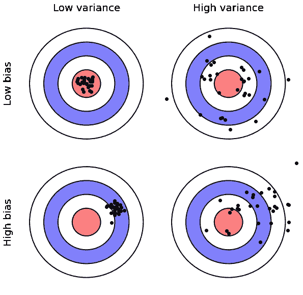
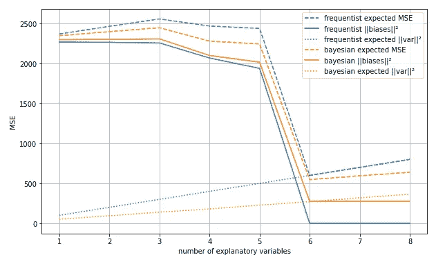
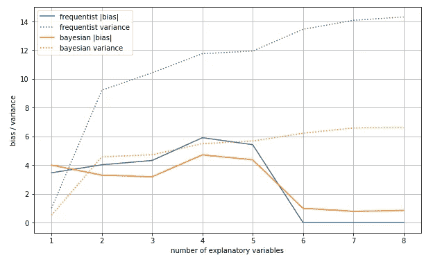
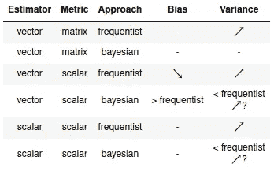

# 线性回归中偏差和方差的彻底检验

> 原文：<https://towardsdatascience.com/thorough-examination-of-bias-and-variance-in-the-linear-regression-4b08bc2bb8da>

## 概率定义和机器学习解释之间的联系

估计量的方差和偏差的数学定义和机器学习的解释是一致的吗？来源:[rawpixel.com-www.freepik.com 创作的机器人手照片](https://www.freepik.com/photos/robot-hand)

# 为什么一个新的偏见差异职位？

在我的概率课程中，我很难清楚地理解估计量的[方差](https://en.wikipedia.org/wiki/Variance)和[偏差](https://en.wikipedia.org/wiki/Bias_of_an_estimator)的定义之间的联系，以及我随后参加的机器学习课程的解释。在第一种情况下，数学定义是明确的，没有留下任何含糊不清的余地。相反，从机器学习课程的角度来看，偏差和方差通常使用视觉解释来解释，如 Scott Fortmann-Roe 的文章[2]中众所周知的解释。

受[2]启发的偏差-方差权衡。来源:[1]

它们也可以用一般规则来解释，如下面的摘录:“偏差和方差都与模型的复杂性有关。低复杂度意味着高偏差和低方差。增加复杂性意味着低偏差和高方差”[3]或“偏差-方差权衡是复杂和简单模型之间的权衡，其中中等复杂性可能是最好的”[4]。简而言之，我在下图中描述了我的担忧。

估计量的方差和偏差的数学定义和机器学习的解释是一致的吗？来源:[1]

为了调和这两种方法(数学定义和机器学习解释)，我对线性回归进行了深入分析。

# 我看了什么？

在这篇文章中，我分析了在为[线性回归](https://en.wikipedia.org/wiki/Linear_regression)模型添加解释变量(也称为特征)时，在频率主义方法和 L2 正则化贝叶斯方法中偏差和方差的变化。后者假设“β是具有指定的[先验分布](https://en.wikipedia.org/wiki/Prior_distribution)【5】、均值为 0 的多元正态分布和与单位矩阵成比例的协方差矩阵的[随机变量](https://en.wikipedia.org/wiki/Random_variable)。从机器学习的一般解释来看，我预计偏差会减少，方差会增加。然而，当估计量不是单个标量时，改善或恶化偏差和方差意味着什么？我们能比较两个向量估计量的偏差和协方差吗？为此，我研究了向量估计量和单个估计量的偏差和方差。

# 如何比较估计量？

估计器的[均方误差(MSE)允许比较估计器。当估计量是标量时，定义是清楚的。然而，当估计量是多维的时，我发现了以下两个定义:](https://en.wikipedia.org/wiki/Mean_squared_error#Estimator)

第一个[6]是矩阵，第二个[7][8]是标量。因为，在这一点上，我没有选择两个定义中的一个，我考虑了两个，首先是矩阵定义，其次是标量定义。当考虑 MSE 矩阵时，可以通过分析两个 MSE 矩阵之差的符号来比较两个估计量。如果结果矩阵是:

*   正，那么第二向量估计量更好，
*   负的，那么第一向量估计器更好，
*   既不肯定也不否定，什么都下不了结论。

当在两个 MSE 定义中插入线性回归解时，结果可以分成两部分，偏差相关项和方差相关项。

矩阵均方误差定义的均方误差分解

标量 MSE 定义的 MSE 分解

# 分析

所有的数学证明都在一个笔记本上[那里](https://github.com/kapytaine/bias_variance_in_linear_regression)【1】，都有一个可重复的例子，其中 8 个独立解释变量 X 中的 7 个已经从正态和伽玛分布中产生(第 8 个是常数)。因变量 Y 是解释变量与系数β和随机多元正态噪声ε的线性组合:Y = Xβ+ε。一些系数被设置为 0，以考虑线性回归中无效解释变量的增加。在线性回归中考虑越来越多的解释变量时，分析了指标的偏差和方差项。例如，第一个模型只考虑一个解释变量，常数。对于所有的观测值，估计值都是相同的。

我欢迎任何反馈，更正，进一步的信息…

## 多维估计量

当考虑矩阵 MSE 时，我注意到，在没有正则化的线性回归中添加新变量时，方差项会增加。不幸的是，我没有观察到其他任何东西。如果矩阵 MSE 是比较估计量的合适度量，那么当增加变量时，偏差项不会系统地减少。

当考虑标量 MSE 时，我注意到更多值得注意的行为。在 Frequentist 方法中，当添加新变量时，偏差项增加，无论它是有用的变量(相关系数非空)还是无用的变量(相关系数为空)，与增加的方差相反。贝叶斯方法中的偏差项大于频率项，与方差相反，贝叶斯方法中的偏差项小于频率项。根据[可重现示例](https://github.com/kapytaine/bias_variance_in_linear_regression)，所有结论如下图所示。第 2、第 3、第 7 和第 8 个变量是无用的变量，即相关的系数都是零。我特意加入了这样的变量，来说明加入无效变量时偏倚和方差的变化。正如所证明的，当增加新的变量时，Frequentist 方法中的偏差项减少。贝叶斯偏差总是大于频率主义者的偏差。类似地，当增加新变量时，频繁项中的方差项增加，贝叶斯方差总是低于频繁项方差。正如所料，当考虑所有解释变量时，Frequentist 方法中的偏差项在第 6 个变量后为零。

根据解释变量的数量，贝叶斯和频率主义方法中的标量 MSE、偏差和方差项。来源:[1]

## 一维估计量

当考虑线性回归模型的单个标量估计量时，对于估计量的偏差不能得出任何结论。估计量的方差在频率主义方法中增加，并且大于贝叶斯方法中的方差，如下文根据相同的可再现示例所示。

根据解释变量的数量，贝叶斯和频率主义方法中线性回归的单个估计量的偏差和方差。来源:[1]

我只显示单个估计量的偏差和方差。如果你对可视化单个预测的分布形状感兴趣，我建议你看看这篇文章“线性模型中的偏差和方差”。

# 结论

为了更好地理解估计量的偏差和方差与机器学习模型的偏差和方差之间的联系，我分析了频率主义者和贝叶斯(L2 正则化)方法中的线性回归。

首先，**我使用了两个指标来评估线性回归**的偏差和方差:整个训练估计量(在所有训练点上)的矩阵和标量 MSE，这允许在偏差和方差方面比较两个估计量。在 Frequentist 方法中，对于标量 MSE，我得到了预期的结果:当增加新的变量时，偏差项减少，方差项增加。此外，正则化减少了方差，不利于偏差。

其次，**我已经使用了标量估计量的偏差和方差来评估模型**的单个预测的偏差和方差。即使结果与之前的方差相似，增加一个变量也不能保证减少单个估计量的偏差。

我所有的观察总结在下表中。我观察到两个我无法证明的行为，在表格中用问号标出。

添加解释变量时偏差和方差项的变化。来源:[1]

估计量的方差和偏差数学定义和机器学习解释的协调。来源:rawpixel.com-www.freepik.com 创作的[机器人手照片](https://www.freepik.com/photos/robot-hand)

# 参考

[1] Arnaud Capitaine，[深入分析线性回归中的偏差和方差](https://github.com/kapytaine/bias_variance_in_linear_regression/blob/master/bias_variance_linear_regression.ipynb)，github
【2】Scott fort Mann-Roe，[了解偏差-方差权衡](http://scott.fortmann-roe.com/docs/BiasVariance.html)(2012)
【3】Ismael Araujo，[偏差和方差如何影响机器学习模型](https://medium.com/swlh/how-bias-and-variance-affect-a-machine-learning-model-6d258d9221db)(2020)
【4】Anthony Schams，[线性回归中的偏差、方差和正则化:套索、岭和弹性网——差异和](/bias-variance-and-regularization-in-linear-regression-lasso-ridge-and-elastic-net-8bf81991d0c5) [概率和统计计算导论](https://cermics.enpc.fr/~delmas/Enseig/ensta_cours.pdf) (2010)，Les Presses de l 'ENSTA，VIII.4 第 205 页
【7】Guy Lebanon，[估计值的偏差、方差和均方误差](http://theanalysisofdata.com/notes/estimators1.pdf)(2010)
【8】Gersende Fort，Matthieu Lerasle，Eric Moulines，[统计和研究](https://lerasle.perso.math.cnrs.fr/docs/mainpoly.pdf) (2020)，I-4