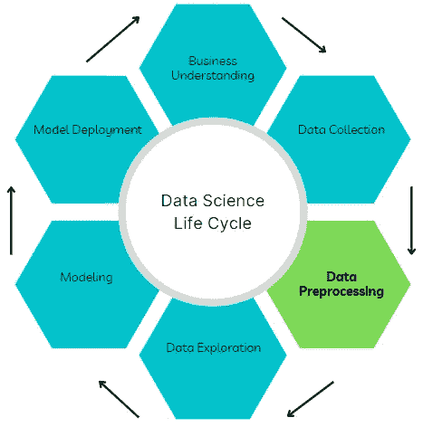
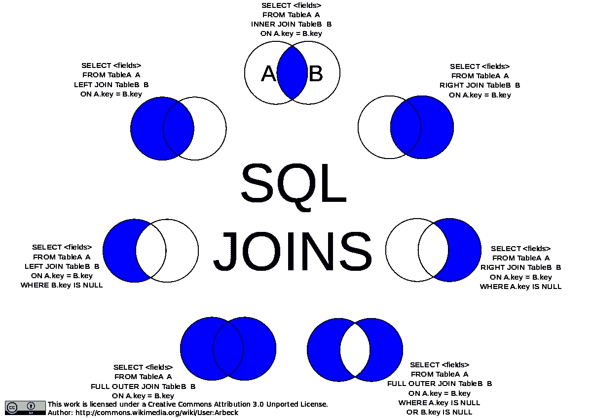

# 数据预处理的三个关键要素—第 1 部分

> 原文：<https://towardsdatascience.com/three-critical-elements-of-data-preprocessing-part-1-3c16f46f8ced>

## 数据科学中建模的主干。

沙拉碗，就像一个混合数据集。安娜·佩尔泽在 [Unsplash](https://unsplash.com?utm_source=medium&utm_medium=referral) 上的照片

在本文中，我将分享数据科学项目生命周期中数据预处理步骤的主要组件，并提供一些有价值的资源来有效地执行这一步骤。

作者图片

数据预处理是将不同来源的原始数据转换成可用于获得可操作见解的精炼形式的关键步骤。它需要整合、清理和改造。

作者图片

此外，数据预处理确保机器学习模型可以获得高质量的数据，从而实现出色的预测性能。事实上，建模中的“垃圾进垃圾出”在很大程度上依赖于提供给模型的数据质量。

> 因此，数据预处理可以被描述为建模的主干。

用于数据预处理的工具选择是 Pandas 和 Numpy，但是，也可以使用其他语言的等效库，并且从数据库中提取数据主要是通过 SQL 查询来完成的。

本系列的每一部分都将详细介绍数据预处理的一个关键要素，从数据集成开始。

# 数据集成

数据预处理的这一部分包括利用不同数据集之间的关系，通过使用相似的特征作为连接点来组合它们。

> 数据集成技能可以帮助数据科学家利用孤岛中可用的信息数据，从而从现有资源中创造更多的商业价值。

数据集成可以通过使用 SQL 查询直接连接到不同的数据源并返回由数据源的属性组成的单个数据集来执行。

或者，可以编写单独的查询来从不同的源提取数据，并且可以使用 Pandas 和 Numpy 等 python 库来组合数据以产生所需的数据集。

根据我的工作经验和 Python 编程知识，上面的选项 2 是我的首选方法。

数据集成期间执行的关键操作包括:

## **加入**

该操作会导致列数的增加，而主数据的行数会根据联接的类型发生变化或不发生变化。例如，该动作可用于通过向现有训练数据添加新特征(列)来丰富机器学习模型的输入数据。

在 Python 中，Pandas 的 Concat、Merge 和 Numpy 的 Concatenate 模块可用于执行连接操作。

下图显示了不同类型的连接:

图片由 Arbeck 提供，CC 由 3.0 提供，来自维基媒体

*资源:*

SQL 连接:[https://www.w3schools.com/sql/sql_join.asp](https://www.w3schools.com/sql/sql_join.asp)

熊猫 Concat:[https://pandas . pydata . org/docs/reference/API/pandas . Concat . html](https://pandas.pydata.org/docs/reference/api/pandas.concat.html)

熊猫合并:【https://pandas.pydata.org/docs/reference/api/pandas. DataFrame.merge.html

numpy Concatenate:[https://numpy . org/doc/stable/reference/generated/numpy . Concatenate . html](https://numpy.org/doc/stable/reference/generated/numpy.concatenate.html)

## **工会**

此操作增加了主数据集的行数，而不改变列数。例如，该动作可用于增加可用于训练机器学习模型的示例数量，以减少过度拟合。要联合的所有数据集必须具有相同的要素，返回的数据集才可用。

执行工会操作时，必须小心避免重复数据。如果允许，UNION ALL 操作允许在返回的数据中表示两个数据集的所有数据，而不考虑重复的示例。

Pandas Concat 也可以用于执行 union 操作。

联合对联合所有(图片由作者提供)

*资源:*

SQL 联合:

1.  [https://www.w3schools.com/sql/sql_union.asp](https://www.w3schools.com/sql/sql_union.asp)
2.  [https://www.tutorialspoint.com/sql/sql-unions-clause.htm](https://www.tutorialspoint.com/sql/sql-unions-clause.htm)

# 结论

在本文中，我们探讨了数据集成，这是数据科学项目生命周期中数据预处理步骤的关键组成部分。它包括组合不同来源的数据，以获得包含所有可用相关特征和示例的数据集。

在下一篇文章中，我们将讨论数据清理，这是数据预处理的另一个关键部分。

我希望你喜欢阅读这篇文章，直到下次。干杯！

什么更有趣？你可以通过下面我的推荐链接订阅 Medium 来获得更多我和其他作者的启发性文章，这也支持我的写作。

<https://aolaoye.medium.com/membership> 