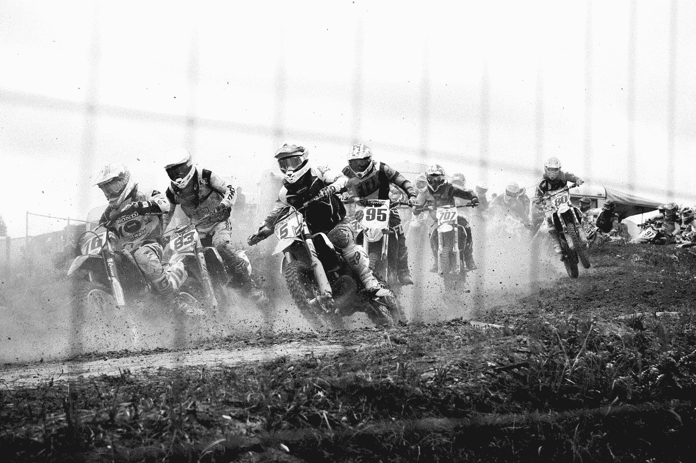
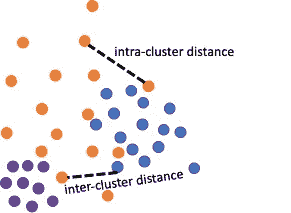
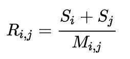
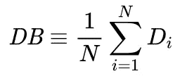

# 地面实况标签不可用时聚类的三个性能评估指标

> 原文：<https://towardsdatascience.com/three-performance-evaluation-metrics-of-clustering-when-ground-truth-labels-are-not-available-ee08cb3ff4fb>

## 无监督学习

## 如果基础事实标签不可用，应该使用哪个度量来评估聚类结果？在这篇文章中，我将介绍其中的三种。



西蒙·穆格在 [Unsplash](https://unsplash.com?utm_source=medium&utm_medium=referral) 上的照片

模型评估始终是机器学习管道中的一个重要步骤，因为它告诉我们模型在描述数据方面有多好。

当谈到模型评估时，我们更多地是指监督学习模型，其中数据的真实标签是可用的。监督学习中的性能度量可以基于来自模型的真实标签和预测标签之间的差异/一致来开发。

虽然不太直接，但对无监督学习模型的性能评估也很重要。在这篇文章中，我将谈论如何评估聚类模型的性能，这是无监督学习中的一项主要任务，如果地面真相标签不可用的话。

因此，我将要谈到的每种方法都需要完成聚类步骤，这意味着每个数据点都有一个聚类标签以及用于进行聚类的那些特征。

## 聚类评估的主要思想

聚类评估的思路很简单。它比较**类内**(自身类)距离和**类间**(相邻类)距离，以决定类的分离程度。

一个好的聚类应该具有较小的类内距离和较大的类间距离，如下图所示。


良好聚类结果中的类间距离和类内距离的示例。用三种颜色突出显示的分类标签。(图片由作者提供)

但是，如果聚类不好，则簇间距离和簇内距离没有那么明显，如下所示。



不良聚类结果中的类间距离和类内距离的示例。用三种颜色突出显示的分类标签。(图片由作者提供)

要注意的是，当我们谈论聚类是好是坏时，聚类实际上是指数据点和聚类标签之间的分配。对于同一个数据集，用一种方法聚类可能很好，但用另一种方法聚类可能很差。上述所有距离定义都必须基于已经聚类(标记)的数据集。

好的，在理解了聚类评估的主要思想之后，你会发现下面三个指标非常简单。

## 轮廓系数

作为最常用的聚类评估指标之一，轮廓系数将类内/类间距离比较总结为-1 到 1 之间的分数。

接近 1 的值指示超好的聚类结果，其中聚类间距离远大于聚类内距离；而接近-1 的值意味着完全错误的聚类分配，其中聚类间距离甚至不能与聚类内距离相比。

接下来我们来看看-1 比 1 之间的分数是如何构造的。

首先，我们需要知道如何计算特定点的平均类内/类间距离。

至于**类内**距离，对于类 C 内的任何数据点 I， **a** 被定义为 I 和 C 内所有其他数据点之间的平均距离


组内距离定义。(图片由作者提供)

其中| **C_I** |是属于簇 **i** 的点数， **d(i，j)** 是簇 **C_I** 中数据点 **i** 和 **j** 之间的距离。

因此，对于任何给定点 I，小的**分数**a(I)表示点 I 的**好的**聚类分配，因为它接近相同聚类内的点。相反，**大的**分数 **a(i)** 表示点 I 的**差的**聚类，因为它远离它自己的聚类中的点。

关于**类间**距离，对于类 C 内的任何数据点 I， **b** 被定义为 I 到任何其他类中所有点的*最小*平均距离，I 不是该类的成员。换句话说， **b** 是 **i** 到其最近邻簇所有点之间的平均距离。


聚类间距离定义。(图片由作者提供)

在获得数据集中每个点的聚类内和聚类间平均距离之后，轮廓分数被如此定义，


轮廓分数定义。(图片由作者提供)

对于 C_I = 1 的罕见情况(聚类 C 中只有一个数据点 I)，轮廓得分被定义为 0。

我们可以从上面的公式中看到，分数完全由-1 和 1 限定，并且较大的分数表示较好的聚类分离。剪影乐谱的一个最重要的优点是它易于理解和界定。

轮廓分数的最大缺点是计算量大。在相对较大的数据集上超长的运行时间使得它在现实应用中用处不大。

为了用简单的解释换取更快的计算，人们通常求助于以下两个指标，卡林斯基-哈拉巴斯指数和 T2 指数。

## 卡林斯基-哈拉巴斯指数

Calinski-Harabasz 指数(也称为方差比标准)被定义为所有聚类的类间距离平方和与类内距离平方和的比值。距离的平方和由自由度修正。

这里，基于从聚类中的数据点到其自己的聚类质心的距离来估计聚类内，并且基于聚类质心到全局质心的距离来估计聚类间。

数据集 D 上 K 个聚类的卡林斯基-哈拉巴斯指数(CH)被定义为，


其中， *d_i* 是数据点 I 的特征向量， *n_k* 是第*k*簇的大小， *c_k* 是第*k*簇的质心的特征向量， *c* 是整个数据集的全局质心的特征向量， *N* 是数据点的总数。

我们可以看到，分子是从单个聚类质心到全局质心的距离平方的加权和(按聚类大小 *n_k* )除以自由度。分母是从每个单独的数据点到它自己的聚类质心的距离的平方和除以自由度。自由度用于将两个部分调整到相同的比例。

我们可以从上面的等式中看到， **CH** 越高，聚类彼此分离得越好，并且 CH 没有像剪影分数那样的上限。

让我们考虑一个基于 CH 指数的理想聚类结果。可能有几个“球状”集群，其中集群质心彼此远离，而集群成员靠近各自的质心(如下所示)。


获得 Calinski-Harabasz 指数奖励的良好聚类结果示例(图片由作者提供)

然而，如果聚类不具有这样的形状，基于质心的距离将不能提供足够的信息来判断聚类算法的质量。因此，CH 指数是**而不是**推荐用于基于密度的方法，如[均值漂移](/understanding-mean-shift-clustering-and-implementation-with-python-6d5809a2ac40)聚类、 [DBSCAN](/understanding-dbscan-and-implementation-with-python-5de75a786f9f) 、[光学](/understanding-optics-and-implementation-with-python-143572abdfb6)等..

## 戴维斯-波尔丁指数

Davies-Bouldin 指数类似于 CH 指数，但是组间/组内距离比的计算与 CH 指数相反。在 Davies-Bouldin 指数的计算中，有一个概念，即相似性得分，它衡量两个集群彼此相似的程度，其定义为:



戴维斯-波尔丁指数中的相似性计算。(图片由作者提供)

其中 R_ij 是相似性得分，S_i 和 S_j 分别是从点到聚类 I 和 j 内的质心的平均距离；并且 M_ij 是簇 I 和簇 j 的质心之间的距离

从等式中我们可以看出，较小的相似性分数表示较好的聚类分离，因为小分子意味着聚类内距离小，而大分母意味着聚类间距离大。

Davies-Bouldin 指数被定义为所有聚类与其最近邻聚类的平均相似性得分，



戴维斯-波尔丁指数计算(图片由作者提供)

其中 *D_i* 是第*个*聚类在所有其他聚类中的最差(最大)相似性得分，最终 DB 索引是 N 个聚类的平均*D _ I*a。

我们可以看到，DB 指数越小，聚类分离越好。它具有与 ch 指数相似的缺点，CH 指数在处理没有特定形状假设的聚类方法(如基于密度的聚类)时表现不佳。但是 CH 和 DB 索引都比轮廓分数计算快得多。

## 用 Python 实现

多亏了 scikit-learn 包，这三个指标在 Python 中非常容易计算。

让我们使用 kmeans 作为示例聚类算法。以下是计算剪影得分、Calinski-Harabasz 指数和 Davies-Bouldin 指数的示例代码。

```
**from** sklearn **import** datasets
**from** sklearn.cluster **import** KMeans
**from** sklearn **import** metricsX, y **=** datasets.load_iris(return_X_y**=**True)
kmeans **=** KMeans(n_clusters**=**3, random_state**=**1).fit(X)
labels **=** kmeans.labels_Sil = metrics.silhouette_score(X, labels)
CH = metrics.calinski_harabasz_score(X, labels)
DB = metrics.davies_bouldin_score(X, labels)
```

就是这样！希望文章对你有帮助。

如果你喜欢阅读这些文章，请[订阅我的账号](https://jianan-lin.medium.com/subscribe)！

## 参考资料:

<https://scikit-learn.org/stable/modules/generated/sklearn.metrics.silhouette_score.html>  <https://scikit-learn.org/stable/modules/generated/sklearn.metrics.davies_bouldin_score.html>  <https://scikit-learn.org/stable/modules/generated/sklearn.metrics.calinski_harabasz_score.html>      

Artem Kniaz 在 [Unsplash](https://unsplash.com?utm_source=medium&utm_medium=referral) 上拍摄的照片