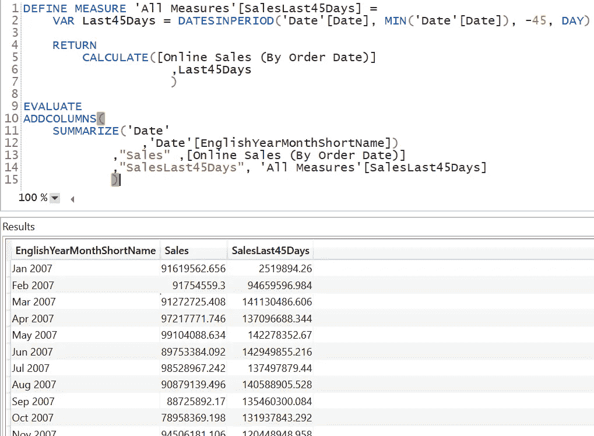
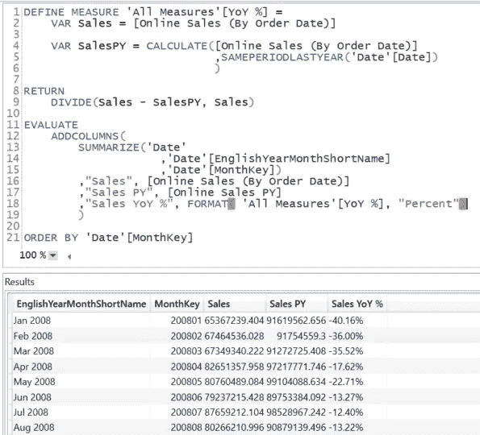
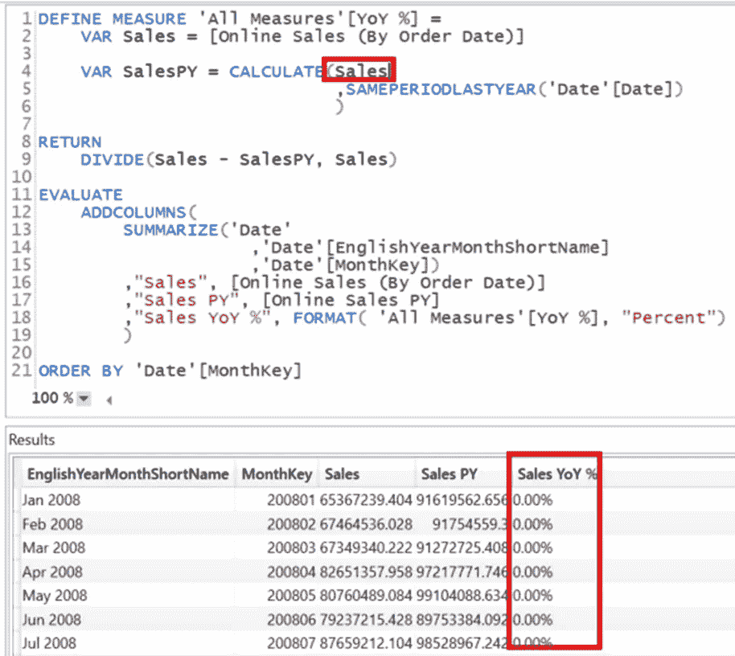
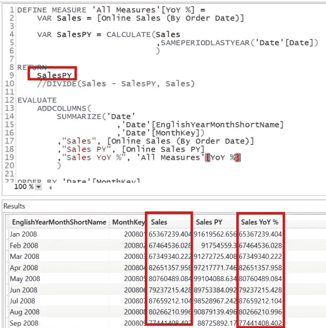

# 在 DAX 中使用变量时，你需要知道三件事

> 原文：<https://towardsdatascience.com/three-things-you-need-to-know-when-using-variables-in-dax-c67724862b57>

## 在 DAX 中，变量可以被长期使用来简化代码，有时还可以提高性能。以下是你需要知道的关于 DAX 变量的内容。


由[机器人神童](https://unsplash.com/@robowunderkind?utm_source=medium&utm_medium=referral)在 [Unsplash](https://unsplash.com?utm_source=medium&utm_medium=referral) 上拍摄的照片

# DAX 中的变量是什么

如果您已经知道如何在 DAX 代码中使用变量，请继续学习。这部分是给初学者的。

变量可以在任何 DAX 代码中长期用于 Power BI 和 SQL Server Analysis Services。

我们可以使用变量来存储中间结果。

使用以下语法定义变量:

```
VAR VarName = <Value>
```

您不需要在 DAX 中指定数据类型，因为数据类型是自动分配的。

你甚至不需要事先声明一个变量。当你要给一个变量赋值的时候，你就已经创建了一个变量。

一旦创建了变量，就必须将 RETURN 子句添加到 DAX 代码中以返回值。

例如，我想用名为 Var1 的变量执行一个查询，将它的值设置为 100 并返回这个值:

```
EVALUATE
 VAR Var1 = 100

RETURN
 {Var1}
```

我需要添加花括号来将变量转换成一个一列一行的表格。

那么，我们能对变量做些什么呢？

# 我们可以分配比标量值更多的值

我们可以像任何其他编程语言一样，在 DAX 中为变量赋值一个标量值。

变量的创建看起来像这样:

```
VAR Var1 = 100
```

这一行创建了一个名为 Var1 的变量，并将值 100 赋给它。

此外，我们可以调用 DAX 测量，并将测量结果赋给变量:

```
VAR SalesAmount = [Sum of Sales Amount
```

然后在度量的筛选器上下文中评估该度量。

但是我们可以做得更多。

我们可以将整个表添加到一个变量中，并在下面的表达式中使用该变量。

例如，我想创建一个过去 45 天的日期列表，并计算这些天的销售额:

```
DEFINE MEASURE ‘All Measures’[SalesLast45Days] =
 VAR Last45Days = DATESINPERIOD(‘Date’[Date], MIN(‘Date’[Date]), -45, DAY)

 RETURN
     CALCULATE([Online Sales (By Order Date)]
               ,Last45Days
               )

 EVALUATE
    ADDCOLUMNS(
        SUMMARIZE(‘Date’
               ,’Date’[EnglishYearMonthShortName])
               ,”Sales”, [Online Sales (By Order Date)]
               ,”SalesLast45Days”, ‘All Measures’[SalesLast45Days]
               )
```

我在 DAX Studio 的查询中动态地创建了一个度量“All Measures”[sales last 45 days]。

使用 DATESINPERIOD()，我生成一个日期列表，从查询的过滤器上下文中的第一天开始，到 45 天之前。然后将这个列表赋给变量 Last45Days。

在返回之后，我在 CALCULATE()函数中使用这个表作为过滤器。

结果如下图所示:



图 1 —查询过去 45 天的销售额和结果(图由作者提供)

听起来很酷？

# 一个变量只计算一次

使用变量时，变量只计算一次，变量中的值可以在表达式中多次使用。

查看以下代码，以百分比形式计算年销售额(YoY)的变化:

```
[YoY %] =
 VAR Sales = [Online Sales (By Order Date)]

 VAR SalesPY = CALCULATE([Online Sales (By Order Date)]
 ,SAMEPERIODLASTYEAR(‘Date’[Date])
 )

RETURN
    DIVIDE(Sales — SalesPY, Sales)
```

如您所见，Sales 变量可以在 DIVIDE()函数中重用两次。

这意味着分配给 Sales 变量的度量结果只计算一次。

这项措施的结果如下:



图 2 —用 YoY %度量值进行查询(作者提供的数据)

度量中变量的这种可重用性可以显著提高性能。

# 一个变量只计算一次(又一次？)

您可能已经注意到了上面代码中的一个小细节。

当我可以重用一个变量时，为什么我不这样写这个度量呢？

```
[YoY %] =
VAR Sales = [Online Sales (By Order Date)]

VAR SalesPY = CALCULATE(Sales
 ,SAMEPERIODLASTYEAR(‘Date’[Date])
 )

RETURN
    DIVIDE(Sales — SalesPY, Sales)
```

这一次，我在 CALCULATE()函数中使用了 Sales 变量。

可惜这不管用。

以上带有变体的查询结果如下所示:



图 3 —使用错误的年同比百分比度量进行查询(由作者提供)

当我更改度量的代码以返回 CALCULATE()函数的结果时，我们可以找到原因:



图 4——销售变量可以在计算中重用的原因(由作者提供)

您可以看到 CALCULATE()函数的结果与原始销售度量值相同。

原因是分配给变量的值已经被评估，并且过滤器上下文丢失。所以，计算并不影响结果。

当使用变量来理解 DAX 代码的结果时，您必须始终考虑过滤器上下文。如果你不去做，你会得到意想不到的结果。

# 结论

变量是 DAX 工具箱的重要组成部分，我建议使用它们来简化 DAX 代码。

当我在 DAX 中开发复杂的计算时，我总是使用变量来获得中间结果。使用这种方法，我可以交叉检查每一步并验证结果。

在 DAX 中使用变量的另一个好处是，您可以避免创建中间度量，因为您可以在一个度量中完成所有这些。

谢谢你一直读到最后。


山姆·克拉克在 Unsplash[上的照片](https://unsplash.com?utm_source=medium&utm_medium=referral)

# 参考

我使用 Contoso 样本数据集，就像我以前的文章一样。你可以从微软[这里](https://www.microsoft.com/en-us/download/details.aspx?id=18279)免费下载 ContosoRetailDW 数据集。

Contoso 数据可以在 MIT 许可下自由使用，如这里的[所述](https://github.com/microsoft/Power-BI-Embedded-Contoso-Sales-Demo)。

[](https://medium.com/@salvatorecagliari/membership) 