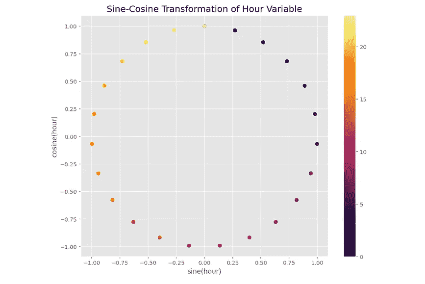
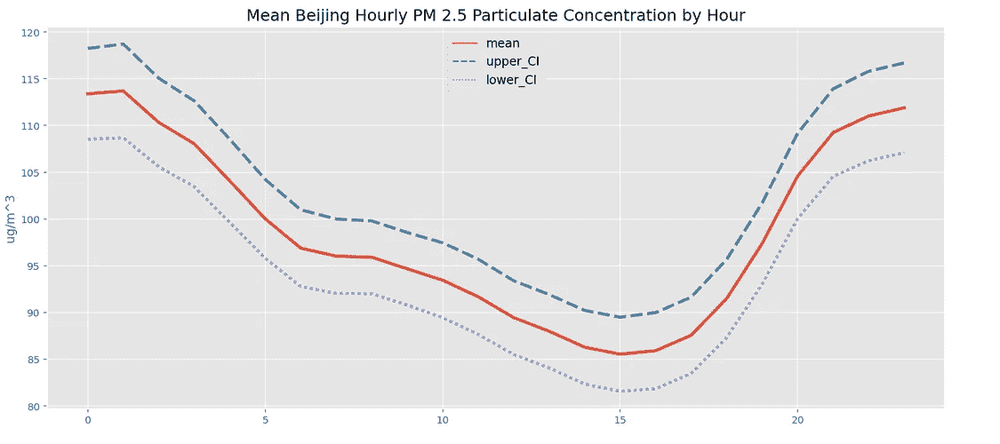
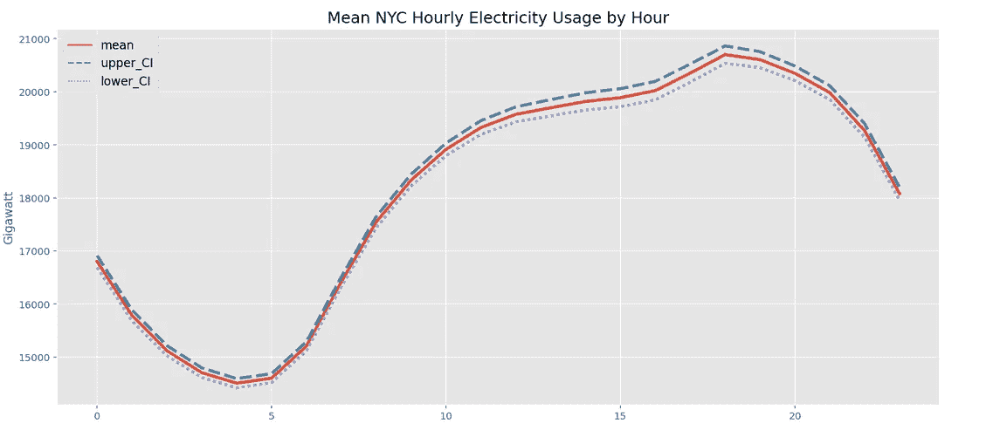
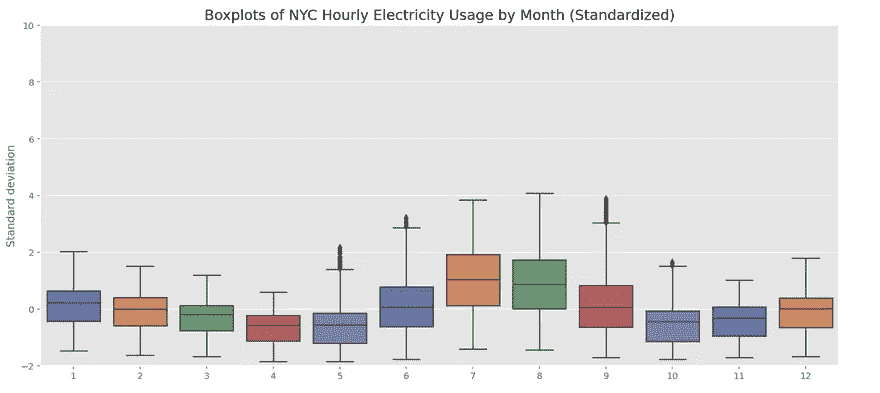
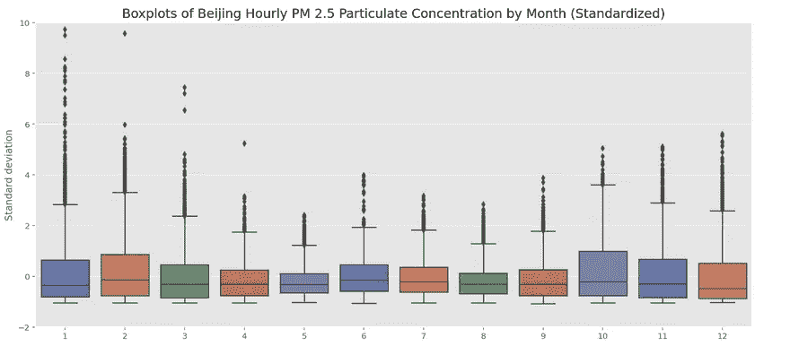
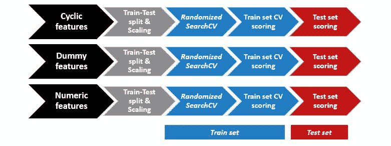
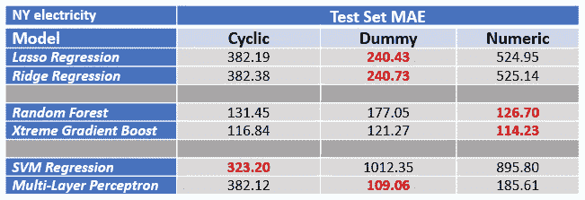
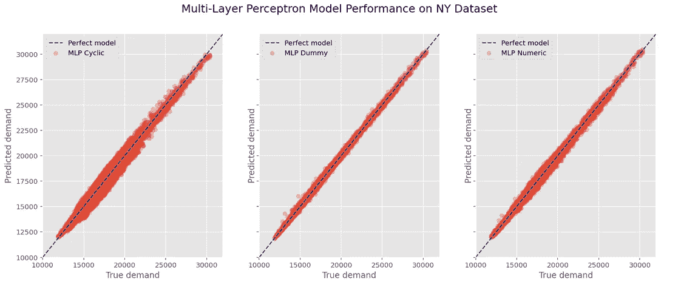
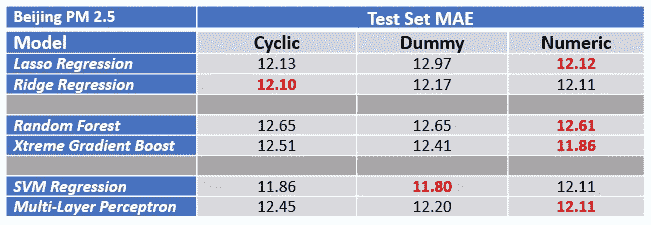
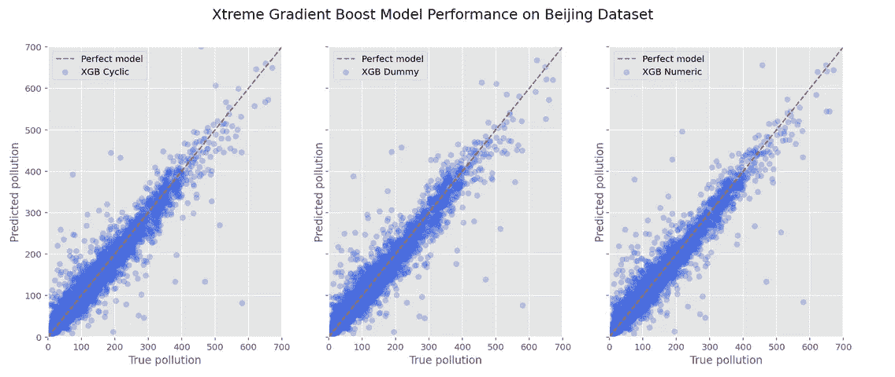

# 时间序列中的时间和季节性特征

> 原文：<https://towardsdatascience.com/time-seasonality-features-in-time-series-7e8236f7b04a>

## 在数据世界里争吵

## 以数据为中心，并在模型校准过程中包括季节性选项

来自 Unsplash 的杰克·亨特制作的布拉格天文钟

T **ime 和季节性特征** s 在时间序列分析中经常被假设，忽略了它们在**模型校准**中作为输入的重要作用。最近，**周期性季节性变量**在数据科学中变得非常流行。然而，寻找季节性效应的最佳形式应该是建模过程的一部分，而不是简单地想当然。

通过**三角正弦和余弦变换**的周期性季节性特征长期用于生物医学和生态学研究。他们背后的直觉是时间是循环的。一天的 24 小时或一年的 12 个月确实形成了一个无限的循环。**小时**的三角变换图如下所示。它描绘了一个看似直观的令人愉快的循环模式。

这种直觉往往是不正确的。首先，重要的是考虑目标变量是否随时间以起伏的**正弦型波**移动。另一个相关要求是，当在机器学习模型中使用这些循环变量时，目标变量必须是固定的。非平稳时间序列需要在正弦和余弦变量之上估计一个**趋势变量**，因此增加了使用这种时间/季节性处理的复杂性。

**自然世界之外的现象或事件**如电力消耗或商店访问或媒体流活动可能会明显偏离正弦模式前提，即使它们可能是静止的。在时间序列分析中，这就是周期性季节性模式假设开始失效的地方。从我的经验来看，当然我的重点是在非自然现象上，周期性季节性特征通常不是最好的选择，因为时间本身通常不是所研究现象的*预测器。*

*通过正弦和余弦变量的组合捕捉季节性也可能产生另一个问题，因为每个季节性特征(如小时或月)现在同时在**两个变量**中捕捉。基于树的算法一次根据一个特征分割样本数据。因此，一个特征同时编码在两个变量中可能对这种模型没有帮助，或者至少这是人们普遍认为的。*

## *时间变量的用途*

***让我们回到基本原则**。为什么我们要加入时间或季节性特征？是因为时间还是季节本身就是目标的预测因素？或者是因为时间或季节表明一些未观察到的或潜在的变量解释了目标？当试图模拟**非自然现象**时，感兴趣的几乎总是**潜在影响**。*

*例如，没有人会认为电力需求在一天中仅仅因为小时而上下波动。这是因为一天中的某个时刻捕捉到了社会经济行为的某些重要方面。比方说，在午夜和凌晨 5 点之间，任何城市的社会和商业活动都会大大减少，这就是导致电力需求在这些时间达到最低点的原因。因此，不是时间本身解释了用电量，而是时间对人类行为意味着什么。*

*再举一个例子，在大城市，交通高峰往往出现在上午 8:00-9:30 和下午 4:30-6:00，但这是因为这些时间神奇地诱导了更多的驾驶吗？当早上 8 点钟声敲响的时候，人们会下意识地被提醒上车开车吗？当然不是！交通高峰期在那些时间，因为这是典型的现代人类社会的工作时间表。现代工作时间表是原因，而不是工作时间本身。*

*因此，当涉及到模拟非自然季节性时，关键问题是:**潜在的驱动因素是周期性的吗**？还是更加**飘忽不定或者零星**？问题是潜在的行为没有被观察到，否则我们应该直接建模。由于未被观察到，我们通常对如何最好地建模没有很高的信念，尽管广泛的领域知识可能是有帮助的。这意味着**时间和季节性变量的最优形式受到不确定性**的影响，并且是我们可以**校准模型性能**的另一种方式。*

*有三种常见的方法来模拟时间和季节性效应。我已经讨论过流行的循环正弦和余弦方法。下面是用于生成此类特性的一段 *Python-NumPy* 代码:*

**

*还有传统的**虚拟变量**方法，我们为每个时间或季节创建一个虚拟变量，或者用现在的行话来说就是“一次性编码”。最后，我们也可以在**数字变量**中捕捉季节性(例如，在单个变量中从 1 到 12 的月份)。从现有数据帧的*日期时间指数*中生成数字季节性特征非常简单:*

**

*数字季节性特征将提供最少数量的季节性特征，因此在这方面将产生最**节约的**方法。三角季节性特征将总是**两倍于**数值变量的数量，因为每个季节性值同时被两个变量捕获。最后，虚拟季节性变量将生成迄今为止数量最大的**季节性特征。***

*当我们使用这些方法中的每一种时，我们有效地做出了关于特定时间或季节如何影响目标变量的**不同假设**，同时考虑了**不同的机器学习算法如何处理信息**。没有一种方法是先验的建模时间或季节的最佳方式，除非我们在深厚的领域知识的指导下有非常高的信念。这通常取决于数据、手头的其他特征、**和**算法。*

## *数据和模型*

*在本文中，我查看了在*小时和*月使用**周期正弦和余弦季节性特征**与使用**季节性虚拟变量**和**数字变量**的**比较性能**。我还使用两个不同的时间序列数据集进行评估，但两个目标变量都表现出平稳性，没有任何转换，因此可以对不同的季节性工程处理进行公平的比较。*

*第一个数据集是空气污染数据集，其中目标变量是 2010 年 1 月至 2014 年 12 月期间北京市空气中每小时 2.5 微米颗粒物(“PM 2.5”)的浓度***【1】。原始数据可以从这个 UCI [库](https://archive.ics.uci.edu/ml/datasets/Beijing+Multi-Site+Air-Quality+Data)免费获得。****

**[1]梁，邹，郭，李，张，黄，陈。《评估北京的 PM2.5 污染:严重性、天气影响、APEC 和冬季供暖》，*英国皇家学会学报*471(2015 年 10 月)。**

**第二个数据集来自对美国各城市用电量的研究。我使用 2015 年 7 月至 2019 年 12 月之间的**小时用电量为千兆瓦(“GW”)的纽约市电力数据子集作为*前一时期的目标变量[2]。原始数据可从研究的 *GitHub* [资源库](https://github.com/LBNL-ETA/City-Scale-Electricity-Use-Prediction)中获得。*****

**[2] Z. Wang、T.Z. Hong、H. Li 和 M.A. Piette。“使用数据驱动模型预测城市规模的日用电量”，*应用能源进展，第 2 卷*(2021 年 5 月)*。***

**因此，我们有两种不同的现象——空气污染和用电。两个目标变量自然都是**稳定的，**通过*增强的 Dickey-Fuller* 测试得到证实。在数据工程之后，包括缺失数据插补，**北京污染数据集产生 43，799 个观察值**，而**纽约电力数据集有 39，455 个**。**

**为了简洁起见，我将不讨论所涉及的数据工程，但是感兴趣的读者可以仔细阅读我的 *GitHub* 库中相关的 *Jupyter Notebook* 文件，链接在文章底部。北京 PM2.5 数据的**小时图和月图如下，显示出明显的**季节性影响**。****

********

**下面的**每小时和每月纽约电力需求图表也显示了相当大的季节性影响**。然而，正如我们所观察到的，两个数据集中的季节性模式都不像平滑的正弦波。**

********

**我没有**包括任何季节性变量**。从我的经验来看，人类活动的大部分日常季节性(一旦你控制了每小时的季节性)可以通过工作日-周末和工作日-假日的区别来解释。所以我在两种情况下都包括了一个周末假人。**

**当查看按月份分组的观察值的**箱线图时，显而易见的是，纽约电力目标值以更平滑的方式分布，因为与北京污染数据相比，其数据点分布更少。两个标准化目标变量的箱线图显示如下，其中**平均值为 0，标准差为 1** ，以便直接相互比较:****

********

**我们马上注意到，北京的污染数据中除了方框中的“胡须”之外，还有更多的观察数据。因此，北京的数据比纽约电力公司的数据更不稳定，更不平滑，有更多的“异常”值。**

****六个**流行的机器学习模型被评估为练习的一部分:**

*   ****套索回归** n(线性)**
*   ****岭回归** n(线性)**
*   ****随机森林**(基于树)**
*   ****极限渐变增强**(基于树)**
*   ****支持向量机****
*   ****多层感知器**神经网络**

**这些模型的任务是根据各种时间/季节性特征来预测目标，并相应地进行评分。**

## **季节性治疗**

**这将是一个**多变量时间序列**建模练习，目标是**提前**一个周期，因此还涉及到其他非季节性特征，包括两种情况下目标的滞后变量。为了长话短说，我将不讨论其他特性，但是感兴趣的读者可以研究我的 *GitHub* 库中的文件以获得完整的细节。**

**两个数据集的每一个都被给予**不同的季节性处理**，覆盖**小时*和*月**，导致在每种情况下三个数据集的**集合**:**

*   **一个**“循环特征”**数据集，具有正弦和余弦小时*和*月特征；**
*   **带有小时*和月*虚拟变量的**“虚拟特征”**数据集；和**
*   **带有小时*和月*数字变量的**“数字特征”**数据集，即小时在单个变量中呈现为 0 到 23，月在单个变量中呈现为 1 到 12。**

**所有其他非季节性变量在这些季节性特征的每个集合中都**完全相同**。然后我们总共有**六个数据集**，分别为北京和纽约数据集**收集了三个不同的**小时*和*月**季节性特征。****

****让我重复这一点，这样就不会有误解。在每种情况下(北京污染和纽约电力)，“循环数据集”、“虚拟数据集”和“数值数据集”之间唯一的**差异是季节性特征的形式。******

## ******对比评分程序******

****评估程序很简单，但由于数据集的数量而有些复杂。所有六个数据集都经过**训练测试分割**，按照时间顺序保留的**最新的 20%** 数据作为测试集。因此，在季节性处理的每个集合中，测试集具有相同的长度。在*最小最大*缩放之后，在每个训练集上运行*随机搜索 CV* ，为上面列出的六个机器学习算法中的每一个找到最佳参数设置。****

********

******每个原始数据集的评估过程图******

******然后使用训练数据对最优模型进行三重交叉验证**和*时间序列分割*，并根据**平均误差** (MAE)进行评分。根据 MAE 和均方根误差(RMSE)度量，测试集**也最终被评分。换句话说，每个模型在每个季节性数据集上的表现被评分两次，**第一次通过训练集交叉验证，最后在测试集上**。******

****概括地说，采用以下评分程序:****

*   ****训练测试分割，然后对六个数据集的每一个进行*最小最大*缩放(分别针对北京和纽约数据集的三个不同的季节性特征)；****
*   ****然后*对评估中六个模型的所有六个数据集**进行随机搜索；*******
*   ****训练集的*时间序列片段*三重**交叉验证** **与六个模型**所有六个数据集的**MAE 评分；和******
*   ****六个模型的所有六个数据集的**测试集**在**的 MAE 和 RMSE 指标上的得分。******

## ****比较分数****

****我将把重点放在 MAE 分数上，尽量缩短文章的长度。来自纽约州电力数据集**的发现似乎证实了一个假设，即**虚拟季节性变量最适合线性模型**(拉索&山脊)。线性模型对数字变量的表现最差，这也证实了另一个假设。这个结果在训练集和测试集中是一致的。******

****然而，**基于树的模型** (RF & XGB)在具有周期性季节性特征的训练集交叉验证中取得了他们的**最佳成绩，但最终**在具有数字特征**的测试集中表现最佳。该结果证明了基于树的算法可能不适用于循环正弦和余弦特征的假设。尽管如此，最终的测试集结果似乎证实了通常的前提，即基于树的变量在数字季节性特征中表现最佳。******

****SVM 在这种情况下表现相当差，尽管它的最佳得分是通过使用循环特征。**在使用虚拟季节性变量的测试集中，MLP 在所有六个模型中获得了最高分**，尽管它在训练集交叉验证中的得分没有那么令人印象深刻。顺便提一下，各种模型的不同季节性特征的 MAE 分数的显著差异也突出了前者在**模型校准**过程中的关键作用。****

********

******训练集平均绝对误差分数******

********

******测试集平均绝对误差分数******

****评估模型性能的一种图形方式是观察预测值与测试集中实际目标值的映射程度。如果预测 100%正确，那么我们应该在预测值与真实值的**散点图中观察到一条 **45 度线**。下面的图表显示了**岭回归**模型的预测值与实际目标值的对比，很明显，利用**虚拟季节性变量**提高了模型的预测能力(中图)。与其他两种季节性处理相比，预测值更接近“完美模型”线。******

********

****这种影响在 **MLP** 模型的预测中更加明显。带有**虚拟季节性变量**的 MLP 模型无疑是三种季节性处理中表现最好的。****

********

****然而，来自北京空气污染数据集的结果在某些方面令人惊讶。在这种情况下，**线性模型的**最高分分散在各种季节性处理中，没有明确的赢家**。另一方面，**基于树的模型**在**数字季节性变量** s 上得分最高，唯一的例外是在列车组交叉验证中具有循环特征的 XGB。******

****在这种情况下， **SVM** 算法做得更好，事实上通过虚拟季节性变量在测试集中获得了**最高 MAE 分数。 **MLP** 模型显示出对北京数据集中**数字变量**的明显偏好，而不像它对纽约数据集中虚拟变量的偏好，因此显示出**缺乏一致性**。******

********

******训练集平均绝对误差分数******

********

******测试集平均绝对误差分数******

****我们之前注意到，北京 PM 2.5 的目标值充满了“异常值”，这表明获得准确的预测将更具挑战性。下面的**北京数据集**测试集中的**XGB 预测值与真实值**的散点图确实揭示了这一挑战。尽管如此，在这种情况下，我们还是可以通过**数字季节性特征**看出一些更好的表现，特别是在极端目标值下。例如，对于 PM 2.5 读数超过 400 的情况，数字特征的预测通常更接近“完美模型”线。****

********

****至于 **MLP 模型**，使用**数字季节性特征**同样会在目标值高于 400 时产生更好的预测性能。也就是说，在最极端的目标值 600 以上时，循环变量似乎确实具有性能优势，但在这些水平上的观察数量非常少。****

********

****我们还没有考虑**在小时和月**之间改变季节性特征的可能性，但那是以后的事了。如果要从这个练习中得出任何一个结论，那就是在分析自然世界之外的时间序列现象时，我们不应该**假设任何时间/季节性处理总是最佳的**。****

****尽管如此，如果需要进行快速的初步分析，还是有一些经验法则的。**基于树的模型往往表现良好，具有数字季节性特征**。**同时，线性模型往往对虚拟季节性变量表现良好**。****

## ****结论****

****时间和季节性特征经常被选择，而没有理解它们在时间序列模型校准中的关键作用。**在自然世界之外的现象中，时间很少是直接的因果因素**，但通常是未观察到的**潜在变量**的代理，这些潜在变量在解释变量中没有得到明确控制。因此，季节性特征的最佳形式受到相当大的**不确定性**的影响。****

****本研究针对两个时间序列数据集中的*小时和*月的虚拟和数字季节性变量，评估了**周期正弦和余弦季节性特征的性能。其中一个数据集是关于北京的空气污染，另一个是关于纽约的用电量。作为评估的一部分，**六个流行的机器学习模型**接受了测试，它们的预测在各种季节性处理中得分。******

******基于树的模型**被发现在周期性季节性特征方面表现良好，但它们的最佳测试集分数最终是通过使用**数字季节性特征**获得的。**线性模型似乎对虚拟季节性特征表现更好**，但并不一致。****

******多层感知器**神经网络在一个数据集中使用虚拟季节性变量，而在另一个数据集中使用数字变量，从而取得了最好的成绩。**支持向量机算法**确实显示出对**周期性季节性特征**的偏好，但同样不一致。****

****该研究表明，对于任何特定的数据集，尤其是非自然现象，季节性特征的**最佳形式**是校准机器学习模型性能的另一种方式**。因此，我们应该以数据为中心，而不是假设任何特定的时间/季节性特征选择对于每个机器学习算法都是最优的，除非有**固体领域知识**指示特定的选择。******

****(这个练习的完整 Python 代码和数据可以在我的*GitHub*资源库中找到。如果直接渲染 *GitHub* 笔记本文件有问题，使用 [nbviewer](https://nbviewer.org/) 。)****

****如果你在阅读这样的文章中看到了价值，你可以在这里订阅 Medium**来阅读我和无数其他作家的其他文章。谢谢你。******

****     ****