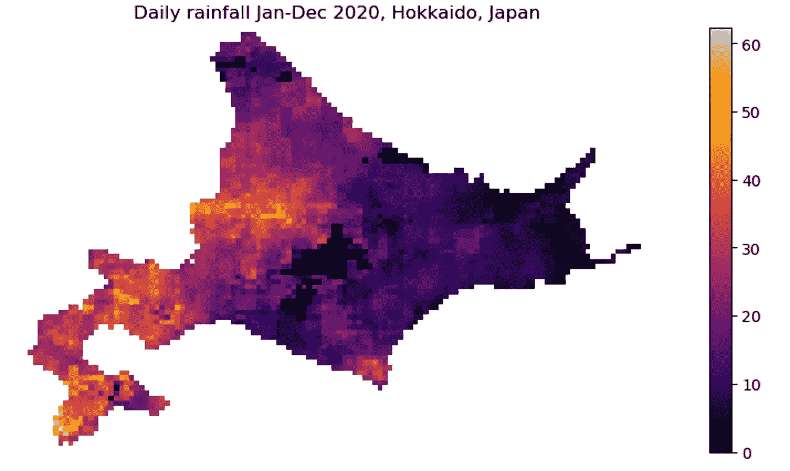
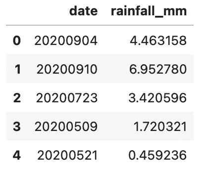

# 地理空间数据的时间序列分析

> 原文：<https://towardsdatascience.com/time-series-analysis-of-geospatial-data-bee45f156ba>

## 从地理空间信息到用于时间序列分析的熊猫数据框架


照片由[凯蒂·哈普](https://unsplash.com/@kharp?utm_source=medium&utm_medium=referral)在 [Unsplash](https://unsplash.com?utm_source=medium&utm_medium=referral) 拍摄

地理空间数据的时间序列分析允许我们分析和理解一个地方的事件和属性如何随时间而变化。它的使用案例非常广泛，特别是在社会、人口、环境和气象/气候研究方面。例如，在环境科学中，时间序列分析有助于分析一个地区的土地覆盖/土地利用如何随时间变化及其潜在驱动因素。它在理解天气模式的时空变化的气象研究中也是有用的(我将很快使用降雨数据演示一个这样的案例研究)。社会和经济科学极大地受益于这种分析，了解时间和空间现象的动态，如人口，经济和政治模式。

数据的空间表示非常强大。然而，分析地理空间数据并提取有趣的见解可能是一项具有挑战性的任务，尤其是对于没有接受过地理信息科学培训的数据科学家/分析师而言。幸运的是，有工具可以简化这个过程，这就是我在这篇文章中尝试的。我写了一篇关于地理空间数据争论的基础的文章——请随意查看:

</geospatial-data-wrangling-for-pandas-experts-96c130c78bd8>  

在本文中，我将介绍一系列过程——从下载栅格数据开始，然后将数据传输到 pandas 数据框架中，并设置传统的时间序列分析任务。

# 案例研究:日本北海道的日降雨模式

## 数据源

在这个案例研究中，我使用的是日本北海道地区[2020 年 1 月 1 日至 12 月 31 日期间](https://www.google.com/maps/place/Hokkaido,+Japan/@43.4390591,142.575852,7z/data=!3m1!4b1!4m5!3m4!1s0x5f9f59209f6c888b:0x1c3cc3564fce038f!8m2!3d43.2203266!4d142.8634737)的降雨量空间分布，相当于一年中的 366 天。我从一个开放的空间数据平台 [ClimateServe](https://climateserv.servirglobal.net) 下载了数据——这是 NASA/USAID 合作的产物。任何能上网的人都可以很容易地下载数据。我已经把它们和代码上传到了 GitHub 上，如果你想继续的话。以下是我的本地目录中的一些光栅图像的快照:


本地目录中一些光栅文件的快照(来源:作者)

## 设置

首先，我设置了一个存储栅格数据集的文件夹，以便以后可以循环访问它们。

```
# specify folder path for raster dataset
tsFolderPath = './data/hokkaido/'
```

接下来，我将导入几个库，其中大部分是数据科学家熟悉的。为了处理栅格数据，我使用了`rasterio`库。

```
# import libraries
import os
import rasterio 
import matplotlib.pyplot as plt
import numpy as np
import pandas as pd
```

## 可视化数据

让我们看看光栅图像在绘图中的样子。我将首先使用`rasterio`加载一个随机图像，然后使用`matplotlib`功能绘制它。

```
# load in raster data
rf = rasterio.open('./data/hokkaido/20201101.tif')

fig, ax = plt.subplots(figsize=(15,5))

_ = ax.imshow(rf.read()[0], cmap = 'inferno')
fig.colorbar(_, ax=ax)
plt.axis('off')
plt.title('Daily rainfall Jan-Dec 2020, Hokkaido, Japan');
```



2020 年 11 月 1 日日本北海道的降雨量分布(单位:毫米)

正如你所看到的，这个图像是像素的组合，每个像素的值代表了特定位置的降雨量。较亮的像素雨量值高。在下一节中，我将提取这些值，并将它们传输到一个`pandas`数据帧中。

## 从光栅文件中提取数据

现在进入关键步骤——为 366 幅光栅图像中的每一幅提取像素值。这个过程很简单:我们将遍历每幅图像，读取像素值并将它们存储在一个列表中。

我们将在另一个列表中单独记录日期。我们从哪里得到日期信息？如果你仔细看看文件名，你会注意到它们是以各自的日期命名的。

```
# create empty lists to store data
date = []
rainfall_mm = []

# loop through each raster
for file in os.listdir(tsFolderPath):

    # read the files
    rf = rasterio.open(tsFolderPath + file)

    # convert raster data to an array
    array = rf.read(1)

    # store data in the list
    date.append(file[:-4])
    rainfall_mm.append(array[array>=0].mean())
```

请注意，由于图像分辨率较低(即像素较大)，遍历 366 个栅格并不需要很长时间。但是，对于高分辨率数据集来说，这可能是计算密集型的。

所以我们刚刚创建了两个列表，一个存储文件名中的日期，另一个存储降雨量数据。以下是两个列表的前五项:

```
print(date[:5])
print(rainfall_mm[:5])

>> ['20200904', '20200910', '20200723', '20200509', '20200521']
>> [4.4631577, 6.95278, 3.4205956, 1.7203209, 0.45923564]
```

接下来将列表转移到一个`pandas`数据帧中。我们将从这里采取额外的步骤，将 dataframe 更改为一个时间序列对象。

## 转换为时间序列数据帧

在`pandas`中，将列表转换为数据帧格式是一项简单的任务:

```
# convert lists to a dataframe
df = pd.DataFrame(zip(date, rainfall_mm), columns = ['date', 'rainfall_mm']) 
df.head()
```



从列表中生成的数据帧的前几行(来源:作者)

我们现在有了一个`pandas` dataframe，但是注意‘date’列保存字符串中的值，`pandas`还不知道它表示日期。所以我们需要稍微调整一下:

```
# Convert dataframe to datetime object
df['date'] = pd.to_datetime(df['date'])
df.head()
```


日期列现在转换为日期时间对象(来源:作者)

```
df['date'].info()
```


这确认了该列是一个日期时间对象(来源:作者)

现在数据帧是一个日期时间对象。

将日期列设置为索引也是一个好主意。这有助于按不同的日期和日期范围分割和过滤数据，并使绘图任务变得容易。我们将首先按照正确的顺序对日期进行排序，然后将该列设置为索引。

```
df = df.sort_values('date')
df.set_index('date', inplace=True)
```

好了，所有的处理都完成了。现在，您可以随意使用这些时间序列数据了。我就把数据画出来看看怎么样。

```
# plot
df.plot(figsize=(12,3), grid =True);
```


2020 年 1 月至 12 月日本北海道降雨量数据的时间序列图(来源:作者)

剧情很美！我过去写过几篇关于如何分析时间序列数据的文章，这里有一篇:

</formating-and-visualizing-time-series-data-ba0b2548f27b>  

# 一锤定音

从地理空间时间序列数据中提取有趣且可操作的见解非常有用，因为它在空间和时间维度上显示数据。然而，对于没有受过地理空间信息培训的数据科学家来说，这可能是一项艰巨的任务。在本文中，我通过一个案例研究演示了如何以最小的努力轻松完成这项困难的任务。如果你想复制这个练习或者把它带到下一个水平，可以在我的 [GitHub](https://github.com/mabalam/timeseriesRaster) 上找到数据和代码。

感谢阅读。请随意[订阅](https://mab-datasc.medium.com/subscribe)以获得我即将在媒体上发表的文章的通知，或者通过 [LinkedIn](https://www.linkedin.com/in/mab-alam/) 或 [Twitter](https://twitter.com/DataEnthus) 与我联系。下次见！