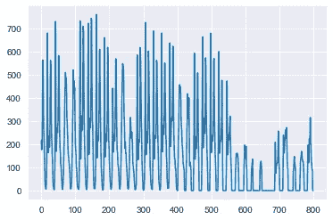
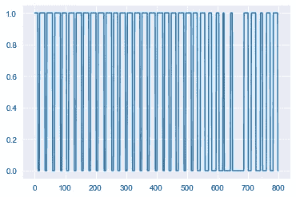

# 基于 LightGBM 的时间序列分类

> 原文：<https://towardsdatascience.com/time-series-classification-with-lightgbm-d79d2d81bfd0>

## 使用 LazyProphet 的示例


由 [Unsplash](https://unsplash.com/s/photos/colorful-trees?utm_source=unsplash&utm_medium=referral&utm_content=creditCopyText) 上的[隐形力量](https://unsplash.com/@invisiblepower?utm_source=unsplash&utm_medium=referral&utm_content=creditCopyText)拍摄的照片

处理时间序列数据时，分类是一项常见的任务。类似于时间序列回归，趋势和季节性的存在使这项任务变得困难。幸运的是，使用 LightGBM 进行回归所得到的相同特性也可以用于分类。通过使用 [LazyProphet](https://github.com/tblume1992/LazyProphet) ，这个任务就变得简单了。

# 介绍

这篇文章是我之前对 LazyProphet 的评论的后续:

</lazyprophet-time-series-forecasting-with-lightgbm-3745bafe5ce5>  

在那篇文章中，我们解决了标准时间序列回归问题，并在 M4 数据集上实现了单变量时间序列树的最先进(我认为)的结果。关键在于利用线性分段基函数。虽然并不都是独一无二的，但我们添加了一个扭曲——函数被加权以更好地适应数据。这使得树实现了显著更好的性能。如果你不知道这些是什么，一定要看看之前的文章！

此外，LazyProphet 还提供了“递归”预测功能，即使用以前的目标值进行预测。这要求我们在过程中的某个时刻使用未来预测，这对于从头开始编码和处理来说有点烦人。

最后，我们也有一些独特的方式来思考树木的趋势，这也有助于改进，你可以在这里查看一篇文章:

</handling-trends-in-tree-based-time-series-forecasting-fea5e4c066fb>  

幸运的是，这些相同的技术也可以用来解决分类问题。在本文中，我们将快速浏览一下用 [LazyProphet](https://github.com/tblume1992/LazyProphet) 解决这样一个问题。

但是首先，如果您还没有安装这个包，那么只需要一点点:

```
pip install LazyProphet
```

现在，让我们来看数据。

# 例子

对于这个例子，我们将使用 Scikit-Learn 开放数据集的一个例子:自行车共享需求数据集。

```
from sklearn.datasets import fetch_openml
import matplotlib.pyplot as plt
import seaborn as sns
sns.set_style('darkgrid')bike_sharing = fetch_openml("Bike_Sharing_Demand", version=2, as_frame=True)
y = bike_sharing.frame['count']
y = y[-800:].values
plt.plot(y)
plt.show()
```



作者图片

显然，这些数据不是为二进制分类创建的，所以让我们来解决这个问题。

```
y_class = y > 70
y_class = y_class * 1
plt.plot(y_class)
plt.show()
```



作者图片

在这里，我们简单地将任何超过 70 的值标记为 1，将所有低于 0 的值标记为 0。显然存在一些季节性，以及 600 到 700 小时之间的一些“冲击”。

接下来，我们简单地构建模型:

```
from LazyProphet import LazyProphet as lplp_model = lp.LazyProphet(seasonal_period=[24],
                          n_basis=10,
                          objective='classification',
                          fourier_order=5,
                          decay=.99,
                          ar=3,
                          return_proba=True)
```

*   `seasonal_period` —数据的季节性。我们可以传递一个 *int* 或 *float* 以及一个 *list* 。如果我们传递一个列表，我们可以为复杂的季节性传递多个值，比如`[7, 365.25]`。
*   `n_basis` —要使用的分段基函数的数量。这是用来衡量“趋势”以及允许季节性随时间变化。
*   `objective`—`'classification'`或`'regression'`。如果我们通过了`classification`，那么 LazyProphet 使用一个二元交叉熵目标函数。如果我们通过`regression`，那么 LazyProphet 将使用 RMSE。
*   `fourier_order` —用于近似季节性脉冲的正弦和余弦分量的数量。数字越大，它就越适合摆动！
*   `decay` —趋势基函数的“衰减”或惩罚权重。如果你不知道这是什么，那么看看前面提到的文章。
*   `ar` —用于预测的过去值的数量。如果我们在这里传递一个 int，那么 LazyProphet 会自动进行一步预测，并将该预测用于整个预测范围的下一步。
*   `return_proba` —布尔标志，如果设置为`True`，则 LazyProphet 返回概率，如果设置为`False`，则仅返回[1，0]分类。

现在我们只需要将模型与我们的数据相匹配，并预测 100 步:

```
fitted = lp_model.fit(y_class)
predicted_class = lp_model.predict(100)
plt.plot(y_class)
plt.plot(np.append(fitted, predicted_class), alpha=.5)
plt.axvline(800)
plt.show()
```


作者图片

瞧！

我们对概率有一个合理的预测。当然，树模型与训练数据*不合理地*拟合得很好，所以我们应该小心评估我们的拟合度。可以用不同的超参数进行进一步的迭代。

有时(比如在这个例子中),我们的标签是由一个实数而不是二进制数的时间序列派生出来的，或者与这个时间序列密切相关。如果是这种情况，我们只需要在构建模型对象时传递该系列。看起来会像这样:

```
lp_model = lp.LazyProphet(seasonal_period=[24],
                          n_basis=3,
                          objective='classification',
                          fourier_order=5,
                          decay=.99,
                          #ar=3, ar should be turned off here
                          return_proba=True,
                          series_features=y,
                          )
```

其中“y”是我们处理成二元分类标签的原始系列。**注意** **需要禁用 ar**。从这里开始，其余的程序是相同的！

# 结论

在本文中，我们尝试用 LazyProphet 进行时间序列分类。因为核心是用 LightGBM 构建的，所以从回归问题转换到分类问题非常容易。但是，我们看到的真正性能提升来自加权基函数。

请务必查看 github 并公开您遇到的任何问题！

如果你喜欢这篇文章，你可能会喜欢我写的其他几篇:

</gradient-boosted-arima-for-time-series-forecasting-e093f80772f6>  </thymeboost-a0529353bf34> 