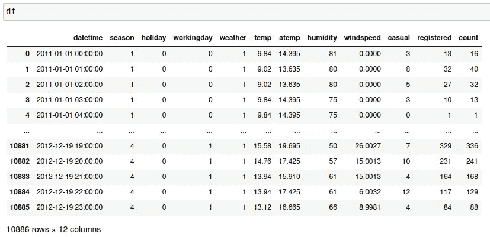
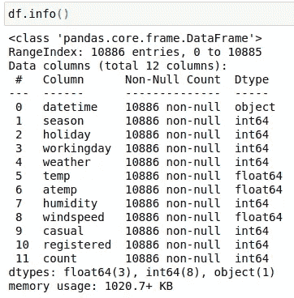
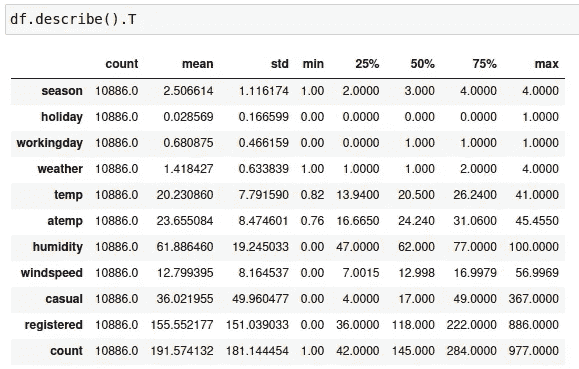
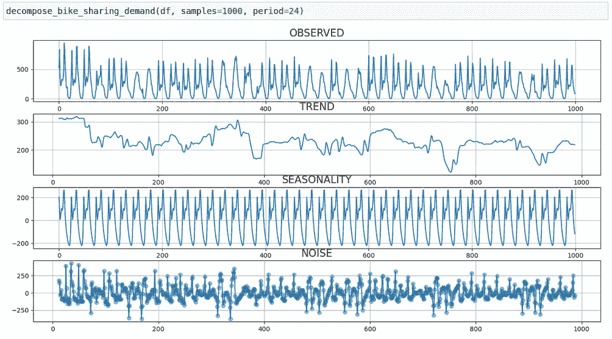
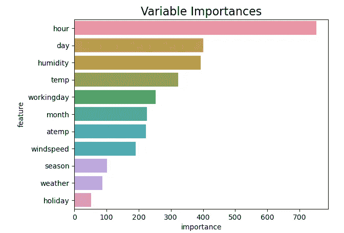
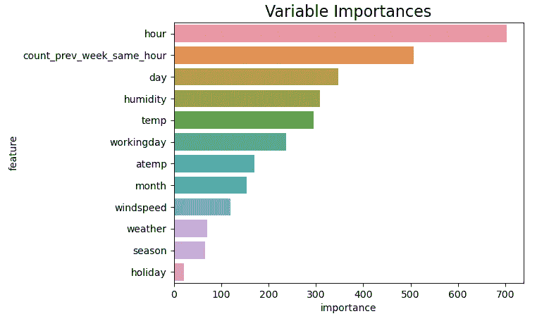

# 基于监督机器学习的时间序列预测

> 原文：<https://towardsdatascience.com/time-series-forecasting-with-machine-learning-b3072a5b44ba>

# 基于监督机器学习的时间序列预测

## 使用监督机器学习模型的时间序列分析和预测

在 [Unsplash](https://unsplash.com?utm_source=medium&utm_medium=referral) 上由 [Aron 视觉](https://unsplash.com/@aronvisuals?utm_source=medium&utm_medium=referral)拍摄的照片

当我第一次看到时间序列预测问题时，我非常困惑。在那之前，我只是对表格数据做了一些监督学习预测，所以如果没有目标值，我不知道如何做预测。你们中的许多人可能都面临这个问题，所以在这篇文章中，我想介绍一种非常强大的方法来解决时间序列预测问题，使用监督机器学习模型，而不是统计模型，如 ARIMA，ARMA，MA，AR…

我决定写关于解决时间序列问题的机器学习方法，因为我相信这些模型非常通用和强大，并且它们比其他统计方法对初学者更友好。

代码可从以下链接获得:

 [## 朝向-数据-科学-帖子-笔记本/自行车共享需求预测. ipynb at master …

### 通过在 GitHub 上创建一个帐户，为 unaiLopez/forward-data-science-posts-notebooks 的开发做出贡献。

github.com](https://github.com/unaiLopez/towards-data-science-posts-notebooks/blob/master/time%20series/Bike%20Sharing%20Demand%20Prediction.ipynb) 

# 资料组

我们将使用 Kaggle 的自行车共享需求竞争数据集，因为它非常适合本教程。您可以下载并阅读以下链接中的数据:

 [## 自行车共享需求

### 城市自行车共享系统的使用预测

www.kaggle.com](https://www.kaggle.com/c/bike-sharing-demand/data) 

# 时间序列分析

在使用任何模型之前，做一些时间序列分析来理解数据是很重要的。在这一步，我们将检查所有变量类型、季节性、序列是否自回归等。

首先，让我们将数据可视化:

自行车共享需求熊猫数据框架

如果我们看上面的截图，我们可以看到 dataframe 长 10886 行，宽 12 列。时间序列有一个小时周期，我们的目标变量将是计数列。该列是临时列和注册列的总和，但是为了本教程的简单起见，我们稍后将删除临时列和注册列，并且我们将只预测计数列。如果你想更好地理解数据的不同变量，你可以查看上面 kaggle 的链接，并阅读一些关于自行车共享需求竞争数据集的信息。

现在让我们检查 dataframe 的变量类型:

自行车共享需求的可变类型熊猫数据框架

除了日期时间列之外，dataframe 的所有变量都是正确的。这个变量的类型应该是 pandas 的 datetime 而不是 object。我们以后再改。

让我们来看一些关于数据框架各列的统计数据:

关于自行车共享需求的统计数据熊猫数据框架的列

截图中显示的数据对于从我们的数据中提取一些见解可能很有意思。让我们继续我们的数据分析，寻找季节性和趋势。

我们可以使用 statsmodels 的 seasonal_decompose 函数轻松地寻找季节性。该函数将我们的时间序列分解为趋势、季节性和噪声:

用于时间序列分解的自定义函数

现在，我们将使用上面的自定义函数来分解 1000 个小时的时间序列，其中包含每日季节性(周期=24 小时):

使用我们的自定义函数和 statsmodels 包进行时间序列分解

我们走吧！我们可以从上面的图表中获得很多见解。如果我们仔细观察，我们可以看到一个清晰的每日季节性模式，有两个高峰，中间有一个山谷。尽管存在这种模式，但仍有许多噪音无法用我们的日常季节性来解释，因此我们将尝试使用数据集中的其他变量和一些特征工程来对此噪音进行建模。但在此之前，让我们看看我们的数据是否是自回归的:

滞后 48 小时的时间序列的自相关图

在绘制了这个自相关图之后，我们可以非常自信地说，我们的数据是自回归的，并且我们可以使用 lags 来改善我们模型的性能。换句话说，自行车共享需求可以用前一小时和前一天的值来解释。

# 时间数列预测法

在了解数据并获得一些见解后，我们准备开始建模和预测每小时的自行车共享需求。在本帖中，我们将预测 1 周的自行车共享需求。这意味着，如果一周有 7 天，每天有 24 小时，我们将预测未来 168 小时的自行车共享需求。

我们将使用微软的光梯度增强机器模型。这个模型是由微软开发的，它在训练速度和准确性方面击败了标准的极端梯度增强(XGBoost)。即使我使用这个机器学习模型，你也可以在 scikit-learn 回归器或更远的地方使用任何你想要的模型。

在这种方法中，我们将从时间戳中提取新特征，并使用这些新特征来执行多输出回归:

执行特征工程

让我们看看这一特性工程流程的结果:

包含从日期中提取的新要素的数据集

一旦我们有了包含我们要使用的回归量的数据集，让我们构建一个自定义函数来预测我们的范围:

自定义训练函数和预测图

## 没有滞后

一旦我们定义了自定义函数，我们将使用它并检查模型的结果:

没有滞后的模型预测

在没有使用任何滞后变量的情况下，我们得到了 53 的 MAE。那一点也不差！

无滞后的模型变量重要性

如果我们根据我们的模型检查变量的重要性，小时和日期似乎非常重要，因此我们可以说我们的特征工程过程创建的特征非常有用。

但是，我们能创造更多的功能并进一步提高我们的性能吗？

## 有滞后

正如我们之前所说，数据似乎非常自相关，因此让我们尝试添加滞后，看看这一新功能是否能提高模型的性能:

创建新的滞后特征

如果我们看看上面的代码，我们可以看到 panda 的 shift 函数是如何帮助创建滞后功能的。让我们看看这项新功能是否能帮助我们提高模型的性能:

滞后 1 周(168 小时)的模型预测

哇！仅仅增加了一个新的滞后特征，模型精度就提高了很多。平均绝对误差从 53 降到了 32。与没有滞后功能的模型相比，这大约提高了 40%!

具有滞后的模型变量重要性

如果我们仔细观察变量重要性，滞后特征(count_prev_week_same_hour)似乎对预测我们的目标非常有用。特色工程太棒了！

# 结论

正如我们在这篇文章中看到的，监督机器学习模型可以非常通用，甚至在某些情况下比其他时间序列预测的统计方法更好。也就是说，我们可以得出结论，这些模型对于时间序列预测是非常强大的。尽管它们很强大，但它们需要一些功能工程才能工作，否则，它们的性能会很差。

如果你喜欢我的内容，你也可以看看我的其他帖子:

 [## 释放 Scikit-learn 管道的力量

### scikit-learn 管道中级指南

towardsdatascience.com](/unleash-the-power-of-scikit-learns-pipelines-b5f03f9196de)  [## Scikit-learn 管道介绍

### 使用 scikit-learn 构建端到端的机器学习管道

towardsdatascience.com](/introduction-to-scikit-learns-pipelines-565cc549754a)  [## 如何检测、处理和可视化异常值

### 当我第一次开始开发数据科学项目时，我既不关心数据可视化，也不关心离群点检测，我…

towardsdatascience.com](/how-to-detect-handle-and-visualize-outliers-ad0b74af4af7) 

# 参考

 [## 欢迎阅读 LightGBM 的文档！-light GBM 3.3.1.99 文档

### 编辑描述

lightgbm.readthedocs.io](https://lightgbm.readthedocs.io/en/latest/)  [## python | Pandas data frame . shift()-GeeksforGeeks

### Python 是一种很好的数据分析语言，主要是因为以数据为中心的 python 有着奇妙的生态系统…

www.geeksforgeeks.org](https://www.geeksforgeeks.org/python-pandas-dataframe-shift/)  [## Kaggle:你的机器学习和数据科学社区

### Kaggle 是世界上最大的数据科学社区，拥有强大的工具和资源来帮助您实现您的数据…

www.kaggle.com](https://www.kaggle.com/)