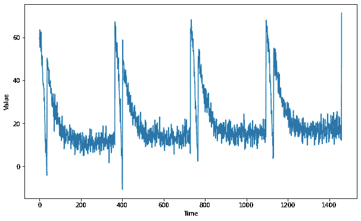
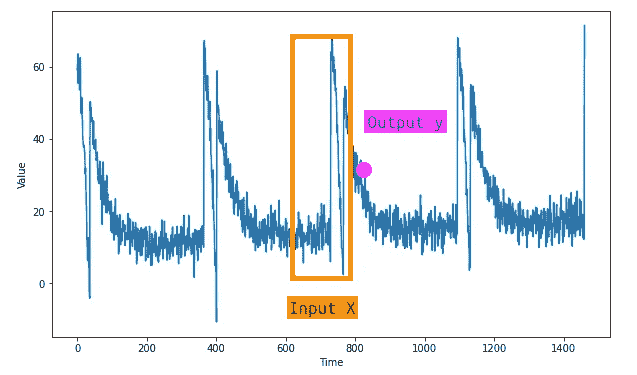
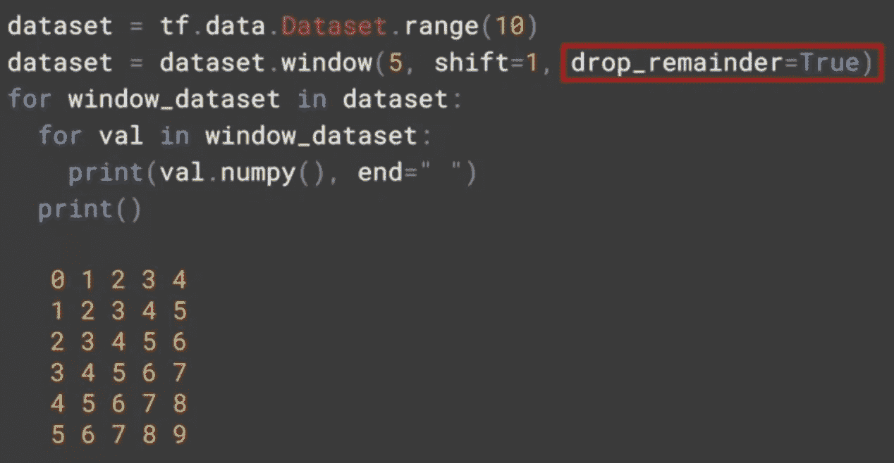
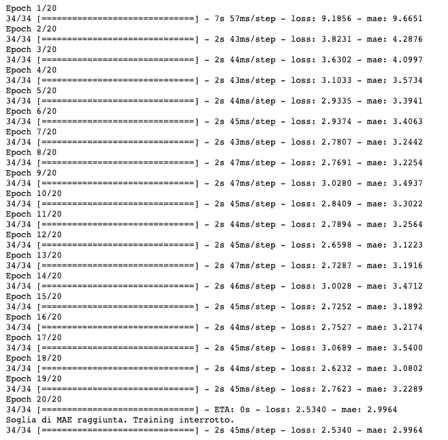
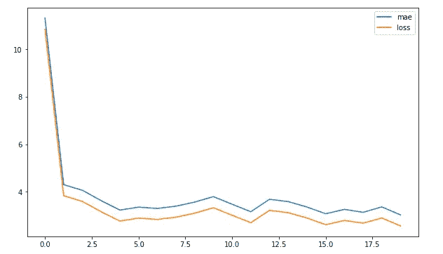
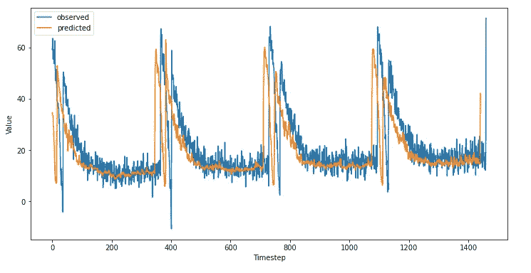
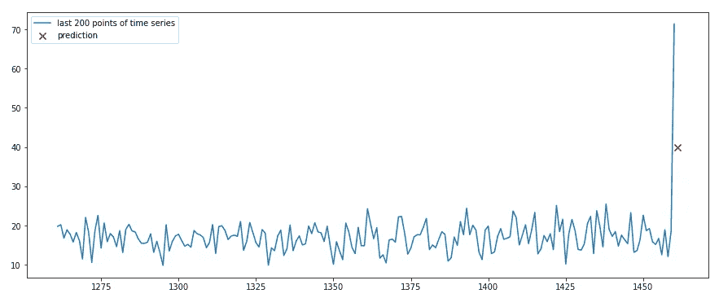

# 张量流中的 LSTM 时间序列预测

> 原文：<https://towardsdatascience.com/time-series-prediction-with-lstm-in-tensorflow-42104db39340>

## *了解如何创建基于 LSTM 的神经网络来预测单变量时间序列*

[阿格巴洛斯](https://unsplash.com/@agebarros?utm_source=unsplash&utm_medium=referral&utm_content=creditCopyText)在 [Unsplash](https://unsplash.com/?utm_source=unsplash&utm_medium=referral&utm_content=creditCopyText) 上的照片

在本文中，您将学习如何使用 Python 中的 Tensorflow 和 Keras 对时间序列进行预测。

我们将使用基于**双向 LSTM 层**在 Tensorflow 中创建的序列神经网络来捕获我们将输入到模型中的单变量序列中的模式。

特别是我们将看到如何

*   **生成合成数据**模拟具有不同特征的时间序列
*   **处理训练和验证集中的数据**并基于时间窗口创建数据集
*   使用 LSTM (长短期记忆)为我们的神经网络定义一个**架构**
*   **训练和评估模型**

本教程的目标是在给定一系列数据的情况下预测未来的某一点。不包括多步情况，即预测了前一个点，而该点又被模型预测了。

这个指南的灵感来自于 Coursera 的 DeepLearning。AI TensorFlow 开发者专精，我强烈建议任何感兴趣的读者去看看。

我们开始吧。

# 生成数据

我们将使用允许我们为我们的情况生成合成时间序列的函数，而不是从网上下载数据集。我们还将使用 **dataclasses** 将我们的时间序列参数存储在一个类中，这样我们就可以使用它们而不用考虑范围。数据类名称将为 ***G*** ，代表“全局”。

我决定使用这种方法，而不是使用真实的数据集，因为这种方法允许我们测试多个时间序列，并在项目的创作过程中具有灵活性。

让我们用这段代码生成一个合成时间序列

这是获得的系列

通过我们的功能创造的合成系列。图片作者。

现在我们有了可用的时间序列，让我们继续进行**预处理**。

# 深度学习时间序列的预处理

时间序列的特点是，它们必须分为训练集和验证集，而训练集和验证集又必须分为长度由我们的配置定义的序列。这些序列被称为*窗口*，模型将使用这些序列生成预测。

让我们再看两个助手函数来实现这一点。

这里需要一些解释。 *train_val_split* 函数只是根据之前在 G 数据类中定义的 *G.SPLIT_TIME* 值来划分我们的序列。此外，我们将传递给它 G.TIME 和 G.SERIES 参数。

让我们回忆一下 G 数据类的定义。

用于存储和维护数据的全局数据类。图片作者。

通过调用 *generate_time_series，*我们得到

*时间=范围(0，1439)*

*SERIES = array([ 0.81884814，0.82252744，0.77998762，…, -0.44389692，-0.42693424，-0.39230758])*

长度都是 1439。

*train_val_split* 的分割将等于

*time_train = range(0，1100)*

*time_val = range(1100，1439)*

如何将时间序列分为 X 和 y。图片由作者提供。

分成训练集和验证集后，我们将使用一些 Tensorflow 函数来创建一个数据集对象，它将允许我们创建 X 要素和 y 目标。回想一下，X 是模型将用来预测下一个值(即 y)的 n 个值。

让我们看看如何实现这些功能

我们会用 Tensorflow 的*。window()* 方法在 dataset 对象上对我们的点应用 1 的移位。这里可以看到一个应用逻辑的例子:

如何制作窗口数据集。图片作者。

在示例中，我们使用 Tensorflow 创建了一个从 0 到 10 的范围，并应用了一个 5 的窗口。然后，我们将总共创建 5 列。传递 *shift = 1* 每一列将从顶部开始减少一个值，并且 *drop_remainder = True* 将确保您总是有一个相同大小的矩阵。

让我们应用这两个函数。

现在数据已经准备好了，我们可以继续构建我们的神经网络。

# 神经网络体系结构

正如文章开头提到的，我们的神经网络将主要基于 **LSTM(长短期记忆)层**。LSTM 之所以适合这种任务，是因为它的内部结构能够通过长序列传播信息。

这使得它们在自然语言处理(NLP)和时间序列中非常有用，因为这两种类型的任务可能需要在整个序列中传递信息。

在下面的代码中，我们将看到 LSTM 层是如何包含在一个双向层中的。该层允许 LSTM 考虑两个方向上的数据序列，因此**不仅具有过去的上下文，还具有未来的上下文**。它将帮助我们建立一个比单向网络更精确的网络。

除了 LSTMs，还有 gru(门控递归单元)可用于时间序列预测任务。

我们还将使用 *Lambda* 层，这将允许我们根据网络正确调整输入数据格式，最后使用密集层来计算最终输出。

让我们看看如何在 Keras 和 Tensorflow 中依次实现这一切。

Lambda 层允许我们在一个层中使用自定义函数。我们使用它来确保输入的维数对于 LSTM 是足够的。因为我们的数据集由二维时间窗口组成，其中第一个是 *batch_size* ，另一个是*时间步长*。

然而，LSTM 接受第三维，这表明我们输入的维数。通过使用 Lambda 函数和*input _ shape =【None】*，我们有效地告诉 Tensorflow 接受任何类型的输入维度。这很方便，因为我们不必编写额外的代码来确保维度是正确的。

为了阅读更多关于 LSTM 和图层如何工作的信息，我邀请读者在这里查阅官方的张量流指南。

所有 LSTM 层都包含在一个双向层中，每个层都通过 *return_sequences = True 将处理后的序列传递给下一层。*

如果该参数为假，Tensorflow 将会给出一个错误，因为下一个 LSTM 将不会找到要处理的序列。唯一不能返回序列的层是最后的 LSTM，因为最后的密集层是负责提供最终预测的层，而不是另一个序列。

# 提前停止回调

正如您在文章[中看到的，在 Tensorflow 中使用回调](/control-the-training-of-your-neural-network-in-tensorflow-with-callbacks-ba2cc0c2fbe8)控制您的神经网络的训练，当我们的性能指标达到指定级别时，我们将使用回调来停止训练。我们将使用平均绝对误差(MAE)来衡量我们的网络正确预测系列中下一个点的能力。

事实上，这是一个类似于回归任务的任务，因此[将使用类似的性能指标](/assessing-model-performance-for-regression-7568db6b2da0)。

让我们看看实现提前停止的代码。

# 模特培训

我们准备训练我们的 LSTM 模型。我们定义一个调用*create _ un compiled _ model*的函数，并为模型提供一个损失函数和一个优化器。

Huber 损失函数可用于平衡平均绝对误差(MAE)和均方误差(MSE)。因此，当您有各种数据或只有几个异常值时，这是一个很好的损失函数，就像在这种情况下。

Adam 优化器通常是一个有效的选择—让我们将任意的 learning_rate 设置为 0.001。

让我们开始训练吧

训练神经网络。图片作者。

我们看到，在第 20 个时期，达到了目标 MAE，训练停止。

# 模型评估

让我们画出损失和 MAE 的曲线。

MAE 和 loss 绘制了。图片作者。

曲线显示了网的改善，直到在第 5 个时期后稳定。还是一个不错的结果。

让我们写一个 helper 函数，方便访问 MAE 和 MSE。此外，我们还定义了一个函数来创建预测。

现在让我们看看模型的表现如何！让我们对整个系列和验证集进行预测。

让我们看看验证集的结果

对验证集的预测。图片作者。

在整个系列中

对整个系列的预测。图片作者。

结果似乎不错。也许我们有办法通过增加训练周期或调整学习速率来提高模型的性能。

***mse: 30.91，mae: 3.32*** *预测。*

# 预测未来新的一点

现在让我们看看，给定序列中的最后一个序列，如何预测未来的某一点。

下面是结果(修改后——图片显示 200 分)。

对未来 a 点的预测。图片作者。

# 结论

总之，我们已经了解了如何

*   生成合成时间序列
*   将系列适当地分成 X 和 y
*   基于双向 LSTMs 在 Keras 和 Tensorflow 中构造神经网络
*   提前停止训练并评估表现
*   对培训系列、验证和未来进行预测

如果你有任何关于如何改善这种流程的建议，请写在评论中并分享你的方法。希望文章能对你的项目有所帮助。

## 推荐阅读

对于感兴趣的人来说，这里有一个我为每个与 ML 相关的主题推荐的书籍列表。在我看来，有一些必不可少的书籍对我的职业生涯产生了巨大影响。
*免责声明:这些是亚马逊会员链接。我会收到亚马逊为你推荐这些项目的一小笔佣金。你的体验不会改变，你也不会被收取更多费用，但它将帮助我扩大业务规模，围绕人工智能制作更多内容。*

*   **ML 简介** : [*自信的数据技能:掌握处理数据的基本原理，为你的职业生涯增压*](https://amzn.to/3WZ51cE) 作者:基里尔·叶列缅科
*   **sk Learn/tensor flow**:[*使用 Scikit-Learn、Keras 和 TensorFlow*](https://amzn.to/3jseVGb) 进行实际操作的机器学习
*   **NLP** : [*文本作为数据:机器学习和社会科学的新框架*](https://amzn.to/3l9FO22) 作者贾斯汀·格里默
*   **sk Learn/PyTorch**:[*用 py torch 和 Scikit 进行机器学习——Learn:用 Python 开发机器学习和深度学习模型*](https://amzn.to/3wYZf0e)Sebastian Raschka
*   **数据即** : [*用数据讲故事:商务人士数据可视化指南*](https://amzn.to/3HUtGtB) 作者 Cole Knaflic

## 有用的链接(我写的)

*   **了解如何在 Python 中执行顶层探索性数据分析**:[*Python 中的探索性数据分析——一步一步的过程*](/exploratory-data-analysis-in-python-a-step-by-step-process-d0dfa6bf94ee)
*   **学习 TensorFlow 的基础知识**:[*tensor flow 2.0 入门—深度学习入门*](https://medium.com/towards-data-science/a-comprehensive-introduction-to-tensorflows-sequential-api-and-model-for-deep-learning-c5e31aee49fa)
*   **用 Python 中的 TF-IDF 进行文本聚类** : [*用 Python 中的 TF-IDF 进行文本聚类*](https://medium.com/mlearning-ai/text-clustering-with-tf-idf-in-python-c94cd26a31e7)

> **如果你想支持我的内容创作活动，欢迎点击我下面的推荐链接，加入 Medium 的会员计划**。

我将收到你投资的一部分，你将能够以无缝的方式访问 Medium 的大量数据科学文章。

  

感谢您的关注，很快再见！👋