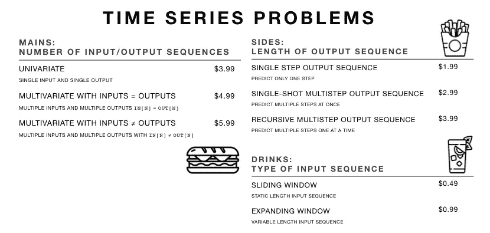
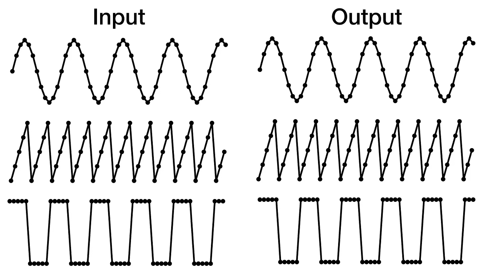
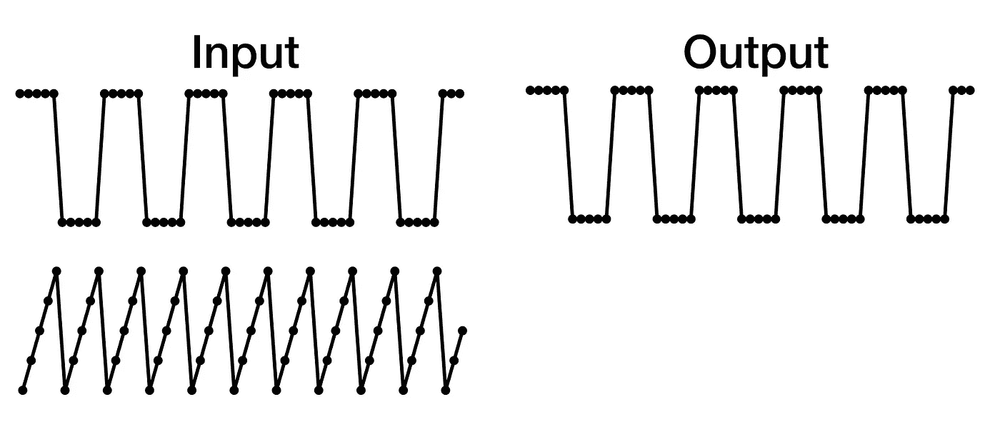
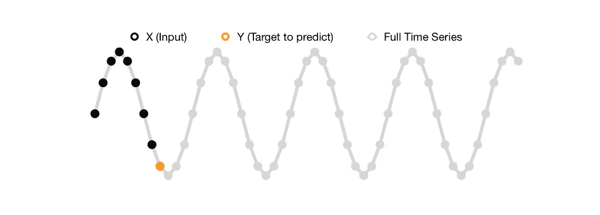
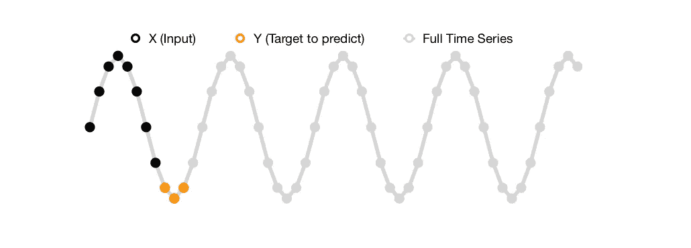
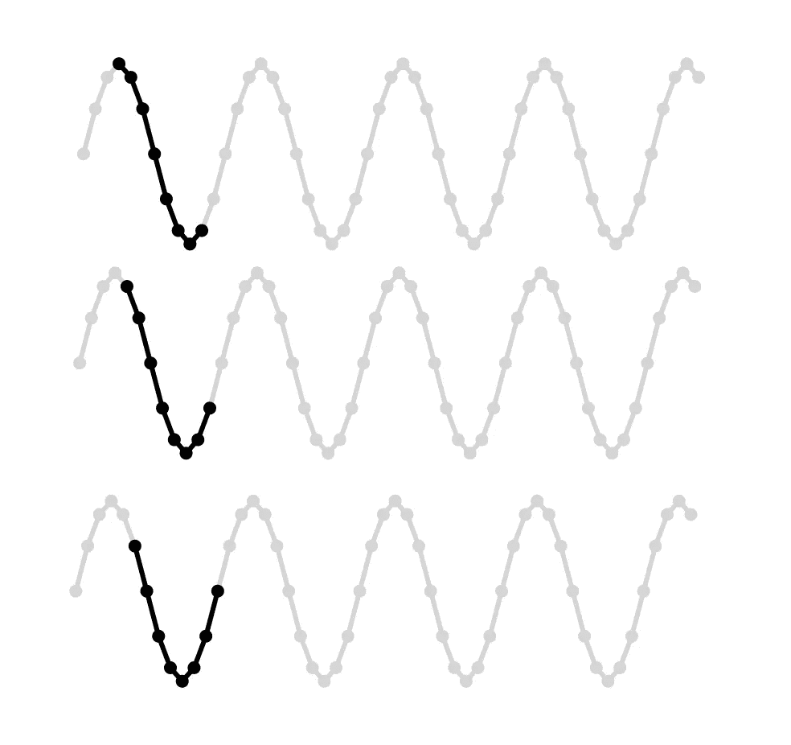
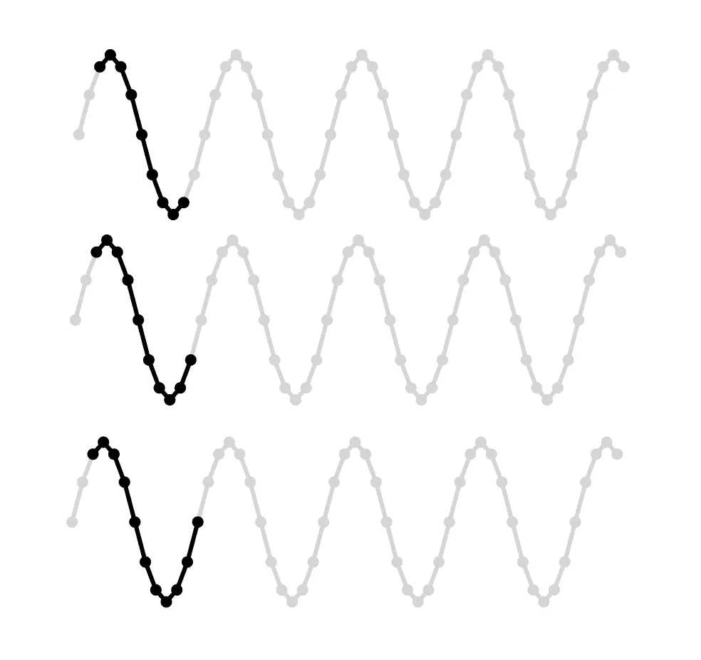

# 简单解释为快餐套餐的时间序列问题

> 原文：<https://towardsdatascience.com/time-series-problems-simply-explained-as-fast-food-combo-meals-70c6eb9bdef>

## 单变量与多变量、单步与多步以及滑动与扩展窗口时间序列问题之间的区别



作者用来自[平面图标](https://www.flaticon.com/)的图标创建的图像

开始时间序列预测可能是势不可挡的，因为有许多变化。时间序列问题可能因输入和输出序列的数量、预测的步骤数量以及输入序列长度是静态还是可变而异。

> 开始时间序列预测可能是势不可挡的，因为有许多变化。

例如，您可能有一个巧克力棒的销售数据，您正试图根据过去 12 个月来预测其未来 6 个月的销售。

或者，你可以根据过去所有可用的温度和降雨量数据来预测第二天的降雪量。

在本文中，我们将复习一下**不同类型的时间序列预测问题。**由于时间序列问题可能是不同变化的组合，我们将使用快餐套餐的例子来展示这些变化。

所以，欢迎来到“*时间系列小酒馆*”！

请看看菜单，从以下类别中各选一个:

*   [电源:输入和输出序列的数量](#1f10)
*   [边:输出序列的长度](#0fda)
*   [饮料:输入序列的类型](#a070)

# 电源:输入和输出序列的数量

首先，我们将看看输入和输出时间序列的数量。这意味着您可以将单个时间序列或多个时间序列作为输入。预测输出也是如此。

我们区分单变量和多变量时间序列问题。对于多元问题公式，我们还区分了**相同和不同的输入和输出序列**。


照片由 [Pille R. Priske](https://unsplash.com/@pillepriske?utm_source=unsplash&utm_medium=referral&utm_content=creditCopyTex) 在 [Unsplash](https://unsplash.com/photos/U0PiIS4Uvkc) 上拍摄

## 单变量的

在单变量时间序列问题中，您只有一个时间序列，它既用作输入序列，也用作输出序列。

```
input_cols = ["chocolate_bar_sales"]
output_cols = input_cols
```

如果您尝试预测的时间序列与其他时间序列没有任何相关性，则可以使用此选项。


单变量时间序列问题公式化(图片由作者提供)

**用例示例:**根据巧克力棒的过去销售额预测其未来销售额。

## 投入和产出相等的多元变量

在多元时间序列问题中，可以有多个时间序列，既可以用作输入序列，也可以用作输出序列。

```
input_cols = ["stock_1", ..., "stock_n"]
output_cols = input_cols
```

当多个时间序列之间存在相关性时，通常会使用这个问题公式。



输入输出相等的多元时序问题时序问题公式化(图片由作者提供)

**用例示例:**根据股票市场指数中所有股票的过去价格预测其未来价格。

## 具有不同输入和输出的多元变量

与上述输入和输出相等的多变量时间序列问题相反，您也可以有不同的输入和输出序列。

```
input_cols = ["precipitation", "temperature"]
output_cols = ["snowfall"]
```

如果您需要来自另一个时间序列的额外信息来预测目标序列，您通常会使用这个问题公式。例如，您可以通过向模型提供模数或正弦波信号来提供一些时间意识)。



具有不同输入和输出时间序列问题公式的多元时间序列问题(图片由作者提供)

**用例示例:**根据之前的降水和温度预测降雪量。

# 边:输出序列的长度

接下来，我们将看看输出序列(边)的长度。这意味着您可以预测未来的单个时间步长或多个时间步长。

我们区分**单步和多步**时间序列问题。对于多步问题公式，我们还区分了**单次预测和递归预测**。


照片由 [Pauline Loroy](https://unsplash.com/es/@paulinel?utm_source=unsplash&utm_medium=referral&utm_content=creditCopyText) 在 [Unsplash](https://unsplash.com/photos/FNPnoX6EzY0) 上拍摄

## 单步输出序列

单步时间序列问题可能是最简单的，因为你只需要预测未来的一个时间步。



单步时序问题公式化(图片由作者提供)

**用例示例:**预测第二天要烘焙的商品数量。

## 单次多步输出序列

与单步时间序列问题相比，多步时间序列问题稍微困难一些，因为您必须预测未来的多个时间步。我们试图立刻预测的未来越远，我们的预测就越不可靠。



单发多步时间序列问题公式化(图片由作者提供)

**用例示例:**预测下周学校午餐的数量，以购买适量的食品。

## 递归多步输出序列

您可以多次预测单个时间步长，而不是一次预测多个时间步长。虽然我们提到预测一个时间步长比一次预测多个时间步长更可靠，但是您必须记住，在这种方法中，您将会从之前的预测中带走误差。


递归多步时间序列问题公式化(图片由作者提供)

# 饮料:输入序列的类型

最后，我们将看看输入序列的类型(饮料)。这意味着您可以使用固定长度的输入序列，也可以使用可变长度的输入序列。

我们区分**滑动窗口和扩展窗口**时间序列问题。

另一个要考虑的因素是**步长。**虽然您可以一次移动或扩展序列窗口一个时间步长，但也可以一次移动几个时间步长。步长越小，可用的训练样本数量就越多。


照片由 [Iamninoslav](https://unsplash.com/@iamninoslav?utm_source=unsplash&utm_medium=referral&utm_content=creditCopyText) 在 [Unsplash](https://unsplash.com/photos/NgN7e6ROip0) 拍摄

## 推拉窗

滑动窗口意味着您的输入序列总是有一个指定的**固定长度**，例如一小时、一天、一周、六个月、一年、五年等等。



滑动窗口时间序列问题公式化(图片由作者提供)

**用例示例:**根据上一年预测下一年的学校午餐需求。

## 扩展窗口

顾名思义，对于扩展窗口时间序列问题，输入序列的长度会增加。



扩展窗口时间序列问题公式化(图片由作者提供)

**用例示例:**基于所有历史数据预测下个月某平台的新用户数量。

# 结论

你现在是不是对一些时间序列问题如饥似渴？

基于我们的组合菜单，你可以看到至少有 18 个(3 * 3 * 2)不同类型的时间序列问题。难怪感觉力不从心。

通过套餐类比，时间序列问题有三个主要组成部分变得很清楚:

1.  输入和输出时间序列数量的变化
2.  预测未来的方式和程度的变化
3.  训练样本长度的弹性变化

# 喜欢这个故事吗？

*这里是我其他时间序列文章的合集:*


莉奥妮·莫尼加蒂

## 时间序列分析和预测

[View list](https://medium.com/@iamleonie/list/time-series-analysis-and-forecasting-ff223343e5b3?source=post_page-----70c6eb9bdef--------------------------------)6 stories

*如果你想把我的新故事直接发到你的收件箱里，请务必* [*订阅*](https://medium.com/subscribe/@iamleonie) *！*

*成为媒介会员，阅读更多来自我和其他作家的故事。报名时可以用我的* [*推荐链接*](https://medium.com/@iamleonie/membership) *支持我。我将收取佣金，不需要你额外付费。*

[](https://medium.com/@iamleonie/membership)  

*在*[*Twitter*](https://twitter.com/helloiamleonie)*[*LinkedIn*](https://www.linkedin.com/in/804250ab/)*，以及*[*ka ggle*](https://www.kaggle.com/iamleonie)*！**