# TinyML:用 Arduino Pro 实现机器人的坡度控制

> 原文：<https://towardsdatascience.com/tinyml-slope-control-for-robots-with-arduino-pro-b2bca81e939e>

## 用 Arduino Nicla Sense ME 和内乌顿 TinyML 构建倾角估算系统

> “追随一个人的爱好是件好事，只要它能把人引上坡路。”——a·纪德

真空吸尘器机器人是过去十年中最有用的发明之一，任何有不同看法的人都意味着他没有！这个神奇的家用电器是技术的集中:一个复杂的嵌入式系统，由一些微控制器、许多传感器和许多…软件组成！


我的吸尘器机器人。图片作者。

但是有多少次你会觉得你的机器人很蠢？
特别是，当你的小帮手挡住了家里地毯、晾衣架等障碍物时。如何在为时已晚之前认识到这一点？

避免这种恼人情况的一种方法是实时计算机器人相对于地板的路径，并根据其当前位置执行决策。例如，如果坡度超过 4 度，机器人会自动停止并返回。

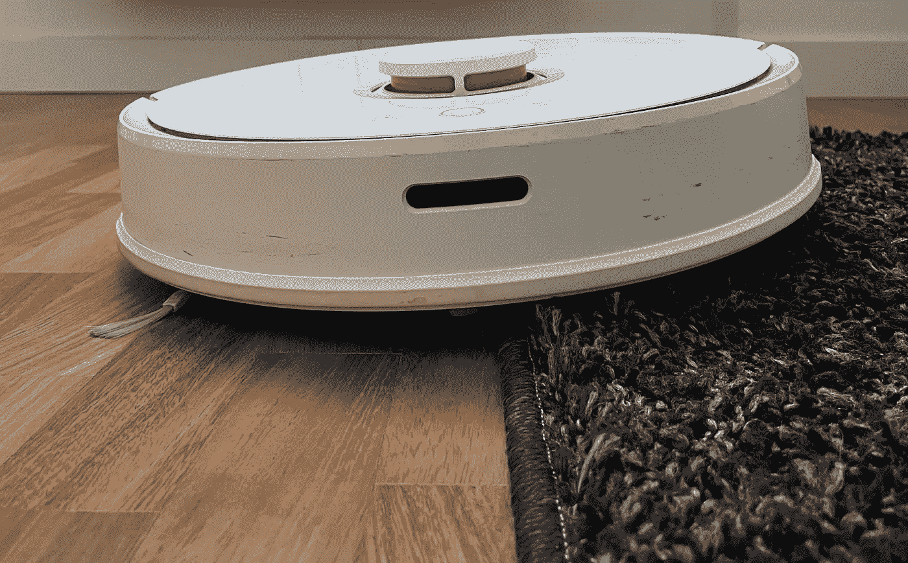

我的真空吸尘器机器人卡在地毯上了。图片作者。

在本教程中，我将使用基于数据的技术**机器学习**来解决这个问题，并展示如何在 *Arduino Pro* 板上使用 ML 模型来实现基于**加速度计**的**倾斜度估计器系统**。为了在微控制器上训练和部署这个模型，我将使用 [*内乌顿*](https://bit.ly/36rN4Pg) ，这是一个 TinyML 框架，允许在没有任何机器学习经验的情况下自动构建神经网络，并将它们嵌入到小型计算设备中。

# 微控制器:Nicla Sense ME

ML 模型将部署在 [Arduino Nicla Sense ME](https://store.arduino.cc/products/nicla-sense-me) 板上，这是一种微型低功耗的 Arduino 板，具有强大的计算能力。它基于一个带有 4 个传感器**的 **32 位微控制器**:运动、磁力计、压力和气体传感器。它适用于需要在一个小设备上结合传感器测量和 AI 任务的项目。这个实验的完美匹配！**


Arduino Nicla 感觉我。图片作者。

*Nicla* 是 [Arduino Pro](https://www.arduino.cc/pro/) 平台的一部分。要开始使用 *Nicla* ，只需使用 [Arduino IDE](https://www.arduino.cc/en/software) 并从*板管理器下载"*Arduino Mbed OS NIC la Boards "*包。*

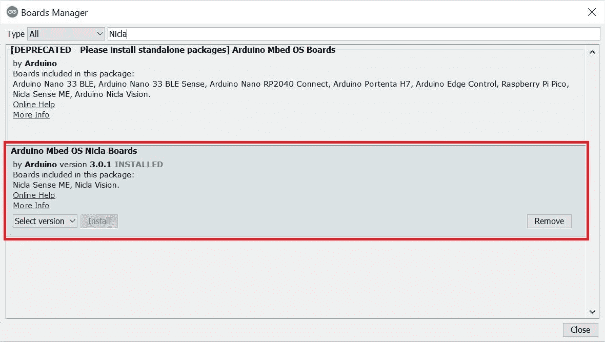

电路板管理器中的 Arduino Mbed OS Nicla 电路板包。图片作者。

使用 USB 电缆将 *Arduino* 板连接到您的计算机，然后…完成！您的主板已准备好与 IDE 通信。

在用机器学习“弄脏你的手”之前，检查一下 *Nicla* 是否正常工作:打开“ *Nicla_Blink* “里面的草图” *Nicla_Sense_System"* 示例并上传。安装在 Nicla 上的 LED 将开始闪烁绿色。

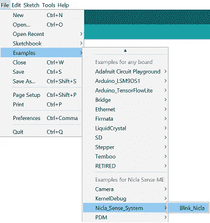

Nicla_Sense_System 示例。图片作者。

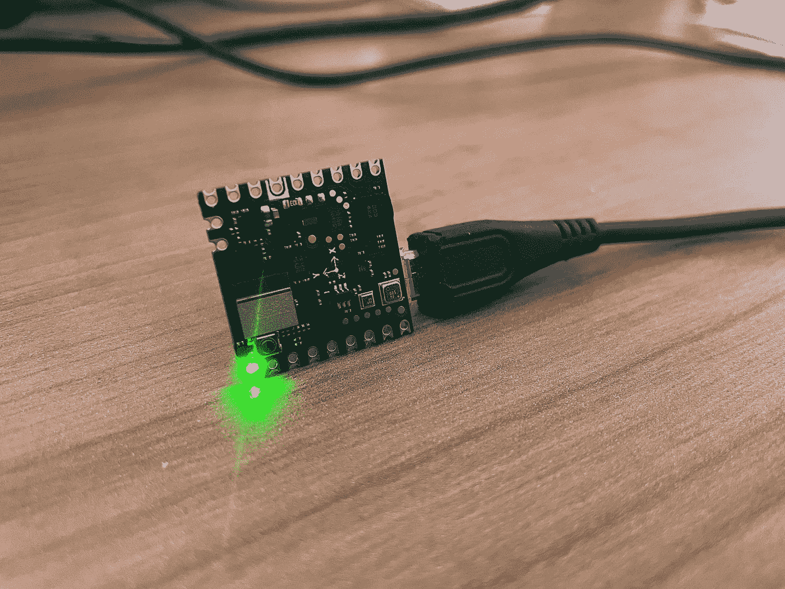

*Blink_Nicla* sketch 在 Arduino Nicla Sense ME 上运行。图片作者。

加速计测量将由[博世 BHI260AP](https://www.bosch-sensortec.com/products/smart-sensors/bhi260ap/) 执行:一个安装在 *Nicla* 上的 6 轴 IMU 传感器。
为了验证所有 *Nicla* 传感器是否正常工作，从*库管理器*下载“*Arduino _ BH y2”*库，并打开“*独立*示例。

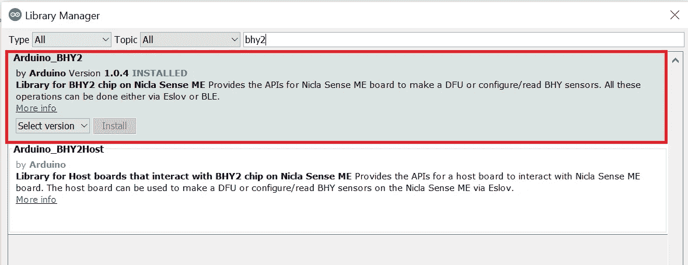

Arduino_BHY2 库。图片作者。

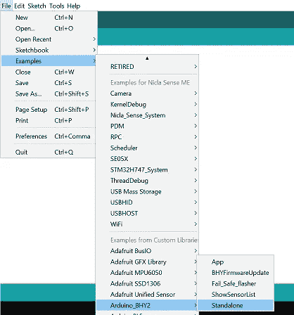

Arduino_BHY2 示例。图片作者。

将此示例上传到 *Arduino* 板上，并在*串行绘图仪*上查看结果。该草图配置并读取所有传感器数据(*加速度、温度、气体等……*)。

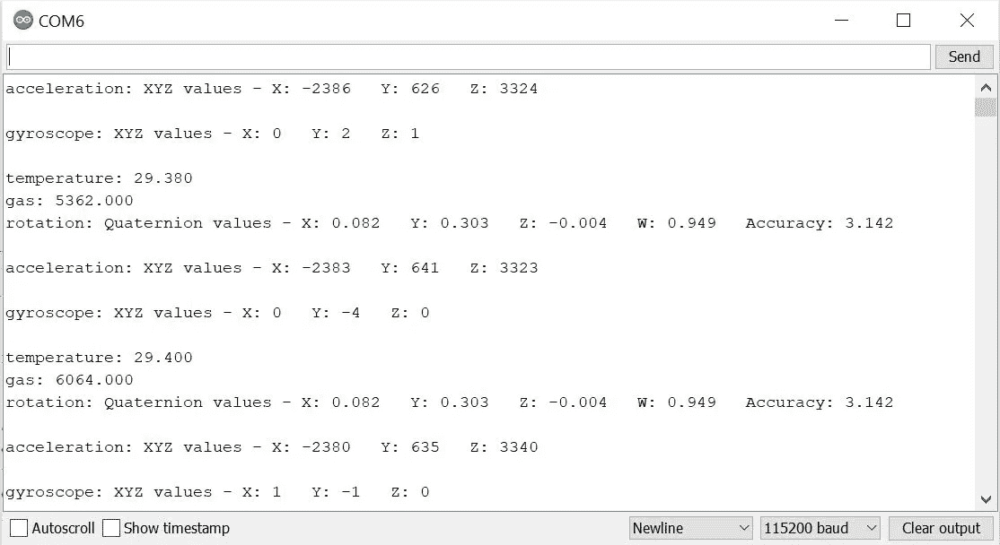

Arduino_BHY2 —独立示例。图片作者。

现在， *Nicla* 真的准备好了！

# 模型结构

该系统被设计为仅沿一个轴估计倾斜度，斜率值以度表示，在[0；5 ]范围。
该模型将由在 *1-* 第二时间窗(*采样时间:20ms — 50Hz* )内采样的 50 个加速度和 50 个陀螺仪测量值组成的数据集作为输入。

在机器学习环境中，这项任务可以通过两种方式完成:

*   **回归**:是预测一个连续数值的问题。
    模型将倾斜度计算为 0 到 5 之间的连续值(例如 *2.54* )。
*   **多类分类**:将输入分类到三个或更多离散类中的问题。
    该模型识别 6 个类别:0、1、2、3、4 和 5。

我们将使用这两种方法并对它们进行比较。

实验包括三个阶段:

1.  **捕获**训练数据集
2.  **使用*内乌顿*训练**模型
3.  **在 *Nicla* 上部署**模型

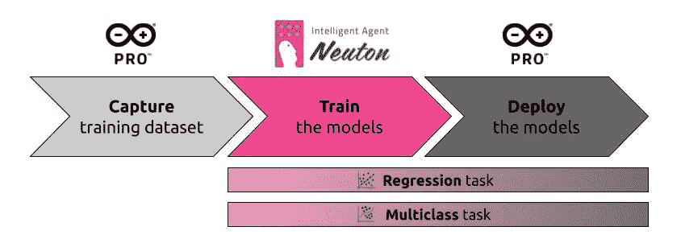

实验流程。图片作者。

## 1.捕获训练数据集

第一阶段是创建用于训练神经网络的**训练数据集**。
对于每个倾斜度， *10 个*测量值将被捕获并存储在 *CSV* 文件中。每次测量将由 50 个加速计和 50 个陀螺仪读数组成。

一个 *Arduino* 草图被设计用来根据 [*内乌顿*需求](https://lab.neuton.ai/#/support_library/user_guide/TRAINING_DATASET_REQUIREMENTS)创建数据集。该程序将获取每个倾斜度的测量值，并将传感器数据打印在串行端口控制台上。用户将通过输入串行端口插入要采集的每个度数值。

为了创建精确的数据集，有必要通过将 *Nicla* 板放置在代理(在本例中为*真空吸尘器机器人*)上方，并使用精确的仪器来测量真实的坡度，例如数字测斜仪。如果你没有它，你可以使用你的智能手机和 *Android* 和 *iOS* 商店中的众多测斜仪应用中的一个。在这个项目中，我使用了[测量](https://apps.apple.com/us/app/measure/id1383426740) *iPhone* app。

下面， *Arduino* 程序:

*   包括标题，定义项目参数和变量

```
#**include** “Arduino.h”
#**include** “Arduino_BHY2.h”#**define** NUM_SAMPLES 50
#**define** SAMPLE_TIME_MS 20*// IMU sensor handlers*
SensorXYZ **acc**(SENSOR_ID_ACC);
SensorXYZ **gyro**(SENSOR_ID_GYRO);
```

*   设置串行端口、IMU 传感器和 CSV 接头

```
void **setup**() {
 *// init serial port*
 **Serial**.begin(115200);
 while (!Serial) {
    delay(10);
 } *// init IMU sensor*
 **BHY2**.begin();
 **acc**.begin();
 **gyro**.begin(); *// print the CSV header (ax0,ay0,az0,…,gx49,gy49,gz49,target)*
 for (int i=0; i<NUM_SAMPLES; i++) {
    Serial.print(“aX”);
    Serial.print(i);
    Serial.print(“,aY”);
    Serial.print(i);
    Serial.print(“,aZ”);
    Serial.print(i);
    Serial.print(“,gX”);
    Serial.print(i);
    Serial.print(“,gY”);
    Serial.print(i);
    Serial.print(“,gZ”);
    Serial.print(i);
    Serial.print(“,”);
  }
 Serial.println(“target”);
}
```

*   等待用户输入以执行测量

```
void **loop**() {
 static int    samplesRead = 0;
 static String target; *// wait for user input (degree target value)*
 while(Serial.**available**() == 0) {}
 target = Serial.**readStringUntil**(‘\n’);
 samplesRead = 0; *// read samples of the requested input orientation*
 while (samplesRead < NUM_SAMPLES) {
    *// read the acceleration and gyroscope data*
    **BHY2**.update(); samplesRead++; *// print the sensor data in CSV format*
    Serial.print(acc.x());
    Serial.print(‘,’);
    Serial.print(acc.y());
    Serial.print(‘,’);
    Serial.print(acc.z());
    Serial.print(‘,’);
    Serial.print(gyro.x());
    Serial.print(‘,’);
    Serial.print(gyro.y());
    Serial.print(‘,’);
    Serial.print(gyro.z());
    Serial.print(‘,’); *// print target at the end of samples acquisition*
    if (samplesRead == NUM_SAMPLES) {
       Serial.println(**target**);
    }

    **delay**(SAMPLE_TIME_MS);
 }
}
```

上传并运行草图，打开串行监视器，在目标位置倾斜 *Nicla* (用倾斜仪或 app 验证)。然后，在串行接口的输入字段中输入度数值，并按 enter 键:程序将执行测量…在此期间不要移动您的板！
每度重复此步骤进行测量。在这个实验中，我以 1 度(0、1、2、3、4 和 5)为步长从 0 到 5 进行测量。


Nicla Sense ME 和 iOS Measure app。图片作者。

将串口输出复制到一个名为" *trainingdata "的文件中。* ***csv*** ”。

## 2.用内乌顿训练模型

在此阶段，您将使用相同的数据集训练两个不同的模型:一个使用**回归**任务类型，另一个使用**多类**类型。

## 2a。上传数据集

*   创建两个新的解决方案，名称分别为:“*倾斜度估计器 Reg* 和“*倾斜度估计器 Mul* ”。

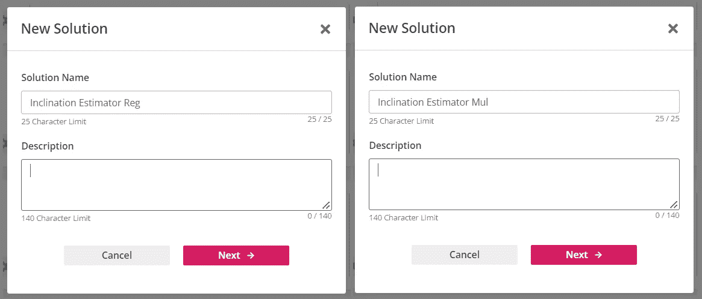

内乌顿:添加一个新的解决方案。图片作者。

对于每个解决方案:

*   上传训练数据集文件，并验证是否满足*内乌顿*要求(文件名旁边会出现一个绿色复选标记)。然后，点击*确定*。
*   在目标变量部分，选择包含度数值的列名(如*目标*，点击*下一个*。

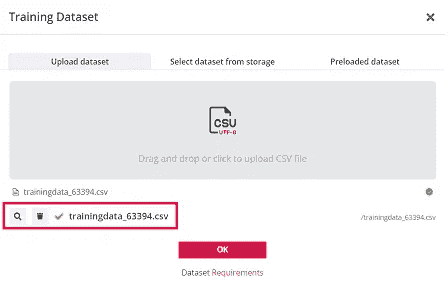

内乌顿:经过验证的数据集和目标变量。图片作者。

## 2b。我们训练吧！

*   一旦数据集被成功验证，*内乌顿*自动提供可用的 ML 任务类型。在第一个解决方案中选择“*回归*”，在第二个解决方案中选择“*多分类*”。

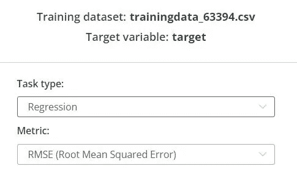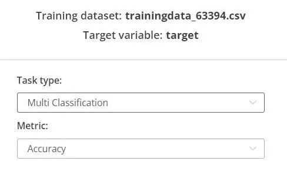

内乌顿:任务类型选择。图片作者。

*   由于模型将在微控制器上运行，因此在两种解决方案中启用 **TinyML** 选项。

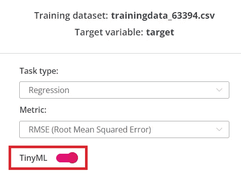

内乌顿:TinyML 选项。图片作者。

*   打开*高级模式*，进入*高级设置*，在*位深*下拉菜单中选择 32。通过这样做，您将充分利用 32 位 *Nicla* 微控制器的强大功能。

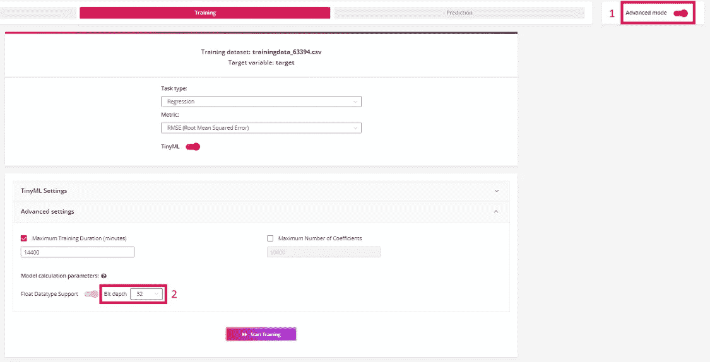

内乌顿:TinyML 高级设置。图片作者。

*   现在…按下“*开始训练*”:训练程序开始，进度逐步显示。

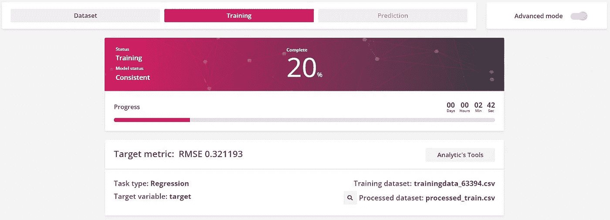

内乌顿:培训过程。图片作者。

*   当“*状态*变为“*训练完成*时，表示训练结束，模型达到最佳预测能力。

## 2c。模型准备好了

“预测”选项卡显示训练阶段的结果。

*回归*解已达到 **0.29** 的 *RMSE* 。RMSE 代表*均方根误差*，它是测量模型误差的标准方法。
低值表示模型预测数据准确。一个好的值在 *0.2* 和 *0.5* 之间。

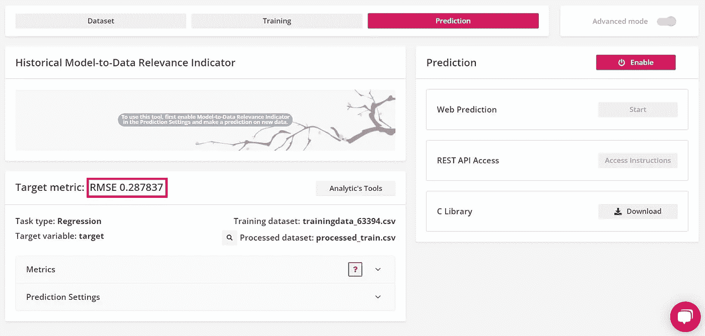

内乌顿:回归解决方案的预测选项卡。图片作者。

*多类*解决方案已经达到 **88%** 的*精度*。这意味着从 100 个预测记录中，有 88 个被分配到正确的类别。较高的值表示模型拟合较好。


内乌顿:多类解决方案的“预测”选项卡。图片作者。

在这两种方案中，用于嵌入的模型的大小小于 **3 *KB*** *。*与*微控制器的* ( [*)北欧 nRF52832*](https://www.nordicsemi.com/products/nrf52832) )内存大小 512 *KB 相比，这是一个非常小的尺寸。*

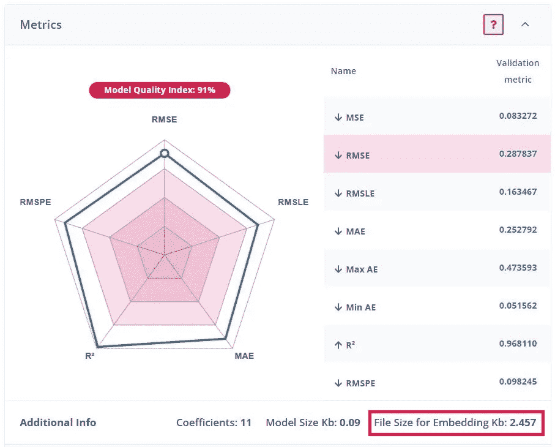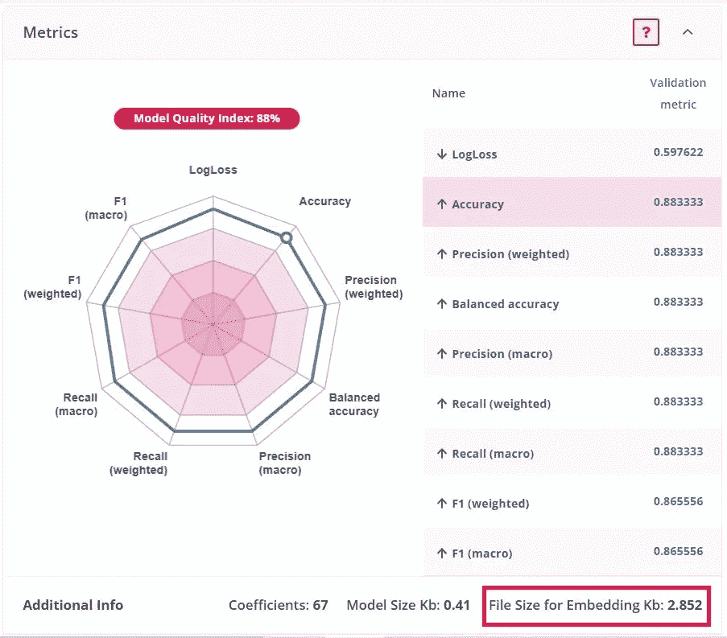

内乌顿:预测选项卡的度量部分。图片作者。

## 3.在 Nicla 上部署模型

要生成两个模型的 C 库，点击每个解决方案的“*下载*按钮。

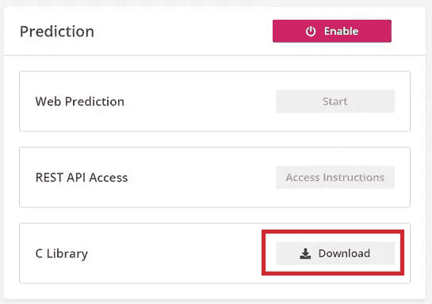

内乌顿:C 库下载。图片作者。

*内乌顿* C 库包括:

*   / **模型**:神经网络模型
*   / **预处理**:用于执行预处理操作的一组函数:*数据操作、数据过滤等。*
*   **neuton . c**—**neuton . h**:应用逻辑用来执行模型和读取预测结果的一组函数。

库集成很简单，由 3 个步骤组成:

1.包括*内乌顿*图书馆

```
**#include** "neuton.h"
```

2.声明输入变量并设置输入值

```
float **inputs**[300] = {
    *aX0*,
    *aY0*,
    // ...
    *gZ49*
};**neuton_model_set_inputs**(inputs);
```

3.运行预测

```
**neuton_model_run_inference**(*…*);
```

两个模型的主要应用程序是相同的，但是每个解决方案都包含各自的库文件。开发了应用程序来计算每 1 秒的倾斜度值(单位为度)。

```
#**define** REGRESSION 0
#**define** MULTICLASS 1
#**define** TASK_TYPE /* Choose task type: REGRESSION or MULTICLASS */#**include** "Arduino.h"
#**include** "Arduino_BHY2.h"#if (TASK_TYPE == **REGRESSION**)
   #include "src/**regression**/neuton.h"
#elif (TASK_TYPE == **MULTICLASS**)
   #include "src/**multiclass**/neuton.h"
#endif*[...]*
```

下面是倾斜度估算系统的 *Arduino* 程序:

```
float **inputs**[NUM_SAMPLES*6] = { 0 };void **setup**() {
  *// init serial port*
  *[...]* *// init IMU sensor*
  *[...]* Serial.println(“Neuton ANN model: Inclination estimator system”);
}void **loop**() {
  int samplesRead = 0; *// perform IMU measurement*
  while (samplesRead < **NUM_SAMPLES**) {
     *// read the acceleration and gyroscope data*
     **BHY2**.update(); *// fill sensor data array (model input)*
     **inputs**[0+samplesRead*6] = (float) **acc.x**();
     **inputs**[1+samplesRead*6] = (float) **acc.y**();
     **inputs**[2+samplesRead*6] = (float) **acc.z**();
     **inputs**[3+samplesRead*6] = (float) **gyro.x**();
     **inputs**[4+samplesRead*6] = (float) **gyro.y**();
     **inputs**[5+samplesRead*6] = (float) **gyro.z**(); samplesRead++;

     delay(**SAMPLE_TIME_MS**);
  } *// provide inputs to Neuton neural network model*
  if (**neuton_model_set_inputs**(inputs) == 0) {
     uint16_t  **predictedClass**;
     float*    **probabilities**; *// run model inference*
     if (**neuton_model_run_inference**
                           (&predictedClass, &probabilities) == 0) {
        Serial.print("Estimated slope: ");
        #if (TASK_TYPE == **MULTICLASS**) 
          Serial.print(predictedClass);
          Serial.print("°");
          *// show class probabilities*
          Serial.print(" - Probabilities [ ");
          for (int i=0; i<**neuton_model_outputs_count**(); i++) {
             Serial.print(**probabilities**[i]);
             Serial.print(" ");
          }
          Serial.println("]");   
        #elif (TASK_TYPE == **REGRESSION**) 
          Serial.print(**probabilities**[**0**]);
          Serial.println("°");
        #endif
     }
     *[...]* }
  *[...]*
}
```

# 我们来预测一下！

…是时候在 *Nicla* 上运行推理了！
让我们在板上验证并上传应用程序，倾斜系统并在串行监视器中查看估计的倾斜度值。它将每 1 秒钟实时计算和打印一次。

## 回归解

```
#**define** TASK_TYPE **REGRESSION**
```

对于回归任务，度值将在*概率*数组的 *0* 位置作为连续值输出。

以下是回归解决方案串行输出的示例:

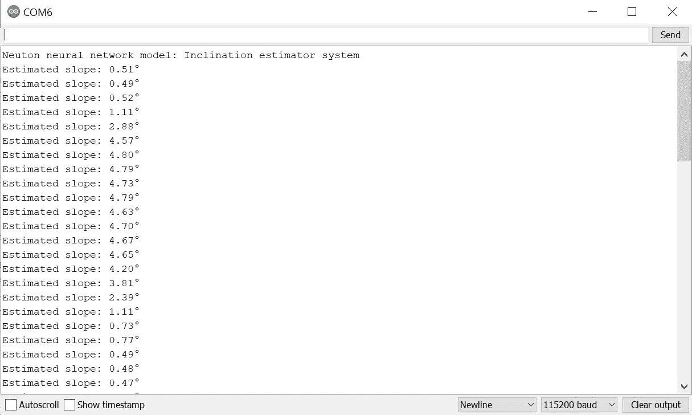

内乌顿倾斜估计器的串行输出—回归任务。图片作者。

## 多类解决方案

```
#**define** TASK_TYPE **MULTICLASS**
```

对于多类任务， *predictedClass* 变量将包含估计度值的类索引。
*概率*数组将包含 6 个类别的概率。预测类的精度将存储在数组的位置 *predictedClass* 处。

以下是多类别解决方案串行输出的示例:


内乌顿倾斜估计器的串行输出—多类任务。图片作者。

# 让我们行动起来吧！

为了显示倾斜度估计的实际效果，我将由小电池供电的 Nicla 放在真空机器人上。
Nicla 用 led 颜色指示斜率值:

*   **绿色**:如果倾斜度**小于**小于 **4**
*   **红色**:如果是**超过 4**

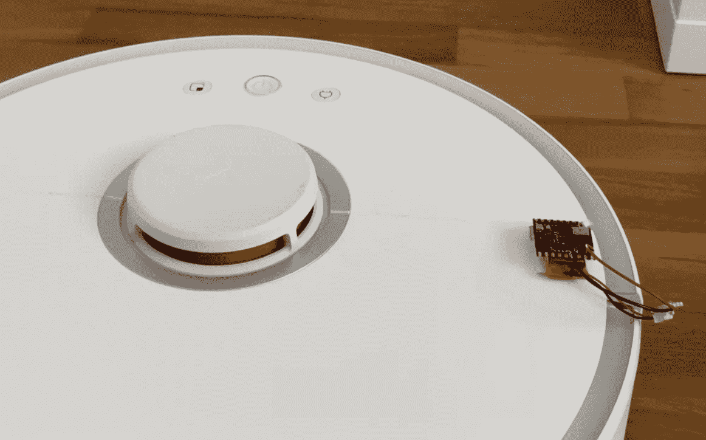

镍镉和电池安装在我的真空吸尘器机器人。图片作者。

倾斜度评估正在进行中。作者视频。

> [这里](https://github.com/leonardocavagnis/InclinationEstimator_Arduino_NeutonTinyML)，你可以找到本文所描述的 Arduino 草图！