# 将 Excel 电子表格加载到 Pandas 数据框架中的技巧和诀窍

> 原文：<https://towardsdatascience.com/tips-and-tricks-for-loading-excel-spreadsheets-into-pandas-dataframes-c486ac1ed16f>

## 了解如何正确地将工作表加载到 Pandas 数据框架中


鲁拜图·阿扎德在 [Unsplash](https://unsplash.com?utm_source=medium&utm_medium=referral) 上的照片

在大多数数据分析项目中，您通常会遇到的最常见和最流行的数据文件格式之一是 CSV。然而，来自金融部门的人经常处理另一种格式——Excel 电子表格。

虽然很多关于 Pandas DataFrame 的文章都侧重于使用 CSV 文件加载，但在本文中，我将重点讨论 Excel。我将向您展示如何将工作表从 Excel 加载到您的数据框架中，以及一些将工作表的一部分加载到数据框架中的技巧和诀窍。

对于本文，我将使用两个示例 Excel 电子表格。

> **注**:本文所有图片和截图均由作者创作

## 相关阅读

> **将大型 CSV 文件加载到 Pandas DataFrames 的提示和技巧** — **第 2 部分**([https://towards data science . com/Tips-and-Tricks-for-load-Large-CSV-Files-into-Pandas-data frames-Part-2-5fc 02 fc 4 E3 ab](/tips-and-tricks-for-loading-large-csv-files-into-pandas-dataframes-part-2-5fc02fc4e3ab))
> 
> **将大型 CSV 文件加载到 Pandas DataFrames 的提示和技巧—第 1 部分**([https://towards data science . com/Tips-and-Tricks-for-load-Large-CSV-Files-into-Pandas-data frames-Part-1-fac 6 e 351 Fe 79](/tips-and-tricks-for-loading-large-csv-files-into-pandas-dataframes-part-1-fac6e351fe79))

# 样本 Excel 电子表格#1

我的第一个 Excel 电子表格样本(**my data . xls**)；自行创建)包含两个工作表:

*   **机场**
*   **航空公司**

> 两个工作表中的数据来自航班延误数据集—[https://www.kaggle.com/datasets/usdot/flight-delays](https://www.kaggle.com/datasets/usdot/flight-delays)。**许可** : [CC0:公共领域](https://creativecommons.org/publicdomain/zero/1.0/)

以下是机场工作表的样子:

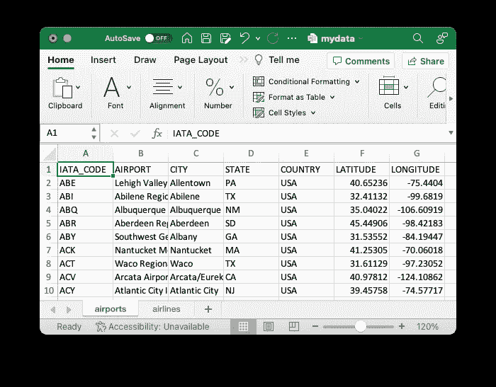

以下是**航空公司**的工作表:

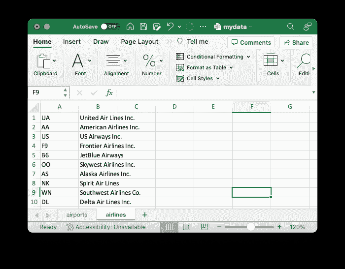

> 请注意，airlines 工作表不包含标题。

# 安装 xlrd 包

加载旧的**。xls** 格式的 Excel 文件，需要安装 **xlrd** 包:

> **xlrd** 是一个库，用于从历史记录中的 Excel 文件读取数据和格式化信息。xls 格式。

```
pip install xlrd
```

# 导入 Excel 电子表格

让我们尝试使用 Pandas 中的`read_excel()`函数加载 Excel 电子表格中的数据:

```
import pandas as pd

df = pd.read_excel('mydata.xls')
df
```

以下是数据帧的内容:

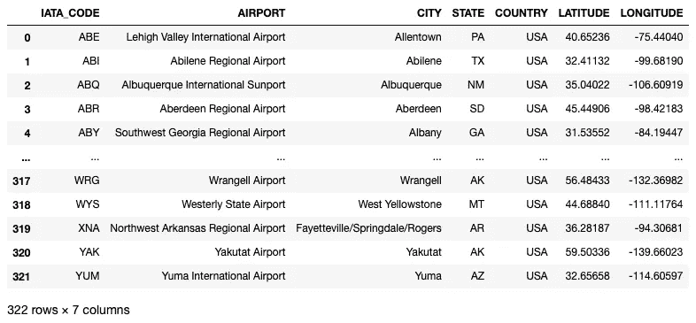

请注意，虽然我们的 Excel 电子表格有两个工作表，但只加载了第一个工作表。

# 加载所有工作表

要加载 Excel 电子表格中的所有工作表，请将`sheet_name`参数设置为`None`:

```
df = pd.read_excel('mydata.xls', 
                   sheet_name=None)
print(df)
```

结果不再是熊猫的数据框架；相反，它是一个数据框架的字典:

```
{'**airports**':     IATA_CODE                              AIRPORT  \
0         ABE  Lehigh Valley International Airport   
1         ABI             Abilene Regional Airport   
2         ABQ    Albuquerque International Sunport   
3         ABR            Aberdeen Regional Airport   
4         ABY   Southwest Georgia Regional Airport   
..        ...                                  ...   
317       WRG                     Wrangell Airport   
318       WYS               Westerly State Airport   
319       XNA  Northwest Arkansas Regional Airport   
320       YAK                      Yakutat Airport   
321       YUM           Yuma International Airport   

                               CITY STATE COUNTRY  LATITUDE  LONGITUDE  
0                         Allentown    PA     USA  40.65236  -75.44040  
1                           Abilene    TX     USA  32.41132  -99.68190  
2                       Albuquerque    NM     USA  35.04022 -106.60919  
3                          Aberdeen    SD     USA  45.44906  -98.42183  
4                            Albany    GA     USA  31.53552  -84.19447  
..                              ...   ...     ...       ...        ...  
317                        Wrangell    AK     USA  56.48433 -132.36982  
318                West Yellowstone    MT     USA  44.68840 -111.11764  
319  Fayetteville/Springdale/Rogers    AR     USA  36.28187  -94.30681  
320                         Yakutat    AK     USA  59.50336 -139.66023  
321                            Yuma    AZ     USA  32.65658 -114.60597  

[322 rows x 7 columns], '**airlines**':     UA         United Air Lines Inc.
0   AA        American Airlines Inc.
1   US               US Airways Inc.
2   F9        Frontier Airlines Inc.
3   B6               JetBlue Airways
4   OO         Skywest Airlines Inc.
5   AS          Alaska Airlines Inc.
6   NK              Spirit Air Lines
7   WN        Southwest Airlines Co.
8   DL          Delta Air Lines Inc.
9   EV   Atlantic Southeast Airlines
10  HA        Hawaiian Airlines Inc.
11  MQ  American Eagle Airlines Inc.
12  VX                Virgin America}
```

结果中的关键字是工作表的名称。以下语句显示为**机场**工作表加载的数据帧:

```
display(df['airports'])
```


同样，以下语句显示为 **airlines** 工作表加载的数据帧:

```
display(df['airlines'])
```

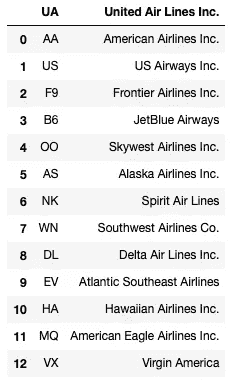

> 不要担心标题；我会尽快修好它。

# 加载特定工作表

如果您想要加载特定的工作表，将您想要加载的工作表的名称存储为一个列表，并将其传递给`sheet_name`属性:

```
df = pd.read_excel('mydata.xls', 
                   sheet_name=['airports','airlines'])
print(df)
```

上面的语句加载了**机场**和**航空公司**工作表，结果是一个数据帧字典。

# 转换列的类型

您可以使用`dtypes`属性检查加载到**机场**数据框架中的每一列的数据类型:

```
df['airports'].dtypes
```

观察熊猫将根据工作表中每一列的值的类型来加载它们:

```
IATA_CODE     object
AIRPORT       object
CITY          object
**STATE         object
COUNTRY       object** LATITUDE     float64
LONGITUDE    float64
dtype: object
```

特别是对于**机场**数据帧，最好将**州**和**国家**列表示为`category`类型，而不是`object`类型。这是为了减少数据帧的内存占用。您可以使用`dtype`参数在加载期间执行类型转换:

```
import numpy as np

df = pd.read_excel('mydata.xls', 
                   sheet_name='airports',
                   dtype= {
                       'STATE': 'category',
                       'COUNTRY':'category'
                   })
df.dtypes
```

在上面的语句中，我加载了**机场**工作表，并指示使用`category`数据类型加载**州**和**国家**列。您可以在加载数据帧后验证这一点:

```
IATA_CODE      object
AIRPORT        object
CITY           object
**STATE        category
COUNTRY      category** LATITUDE      float64
LONGITUDE     float64
dtype: object
```

# 转换列的值

除了加载特定类型的列，您还可以在加载期间使用`converters`参数执行值转换。例如，假设我想将所有的纬度和经度值转换成*度、分和秒*格式。

我首先定义了进行转换的函数:

```
# convert from decimal degrees to degrees, minutes, seconds
def deg_to_dms(deg):
    deg = float(deg)
    m, s = divmod(abs(deg)*3600, 60)
    d, m = divmod(m, 60)
    return int(-d if deg < 0 else d), int(m), s
```

然后，使用`converters`参数指定您想要转换的列:

```
df = pd.read_excel('mydata.xls', 
                   sheet_name='airports',
                   dtype= {
                       'STATE': 'category',
                       'COUNTRY':'category'
                   },
                   converters={
                       'LATITUDE': deg_to_dms,
                       'LONGITUDE': deg_to_dms,
                   })
df
```

这是转换的结果:

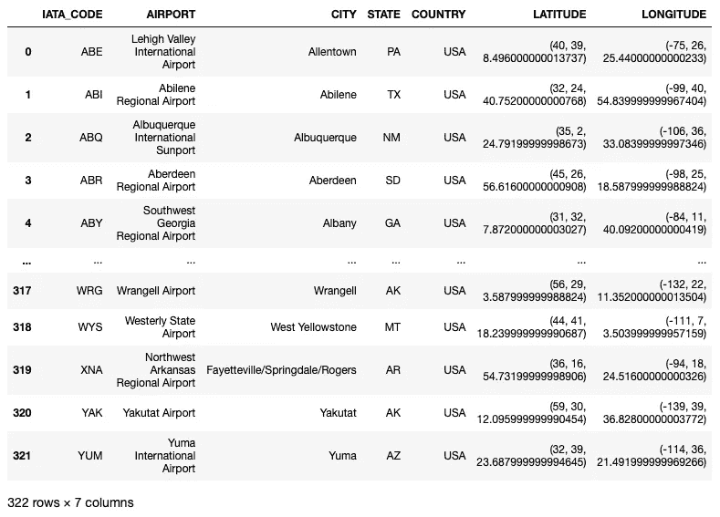

检查列的数据类型:

```
df.dtypes
```

您会看到**纬度**和**经度**列都是`object`类型:

```
IATA_CODE      object
AIRPORT        object
CITY           object
STATE        category
COUNTRY      category
**LATITUDE       object
LONGITUDE      object** dtype: object
```

如果您尝试提取第一行的纬度值:

```
lat_first_row = df.iloc[0,5]
type(lat_first_row)
```

您将看到该值的类型为`tuple`:

```
tuple
```

# 使用列标题加载

前面我提到过**航空公司**工作表没有标题。所以如果你把它载入一个数据帧:

```
df = pd.read_excel('mydata.xls', 
                   sheet_name='airlines')
df
```

结果是第一行的内容将被用作标题:

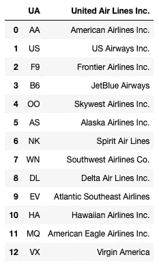

显然这是不可接受的。要修复它，使用`header`参数并将其设置为`None`:

```
df = pd.read_excel('mydata.xls', 
                   sheet_name='airlines', 
                   header=None)
df
```

现在将使用默认的标题 **0** 和 **1** :

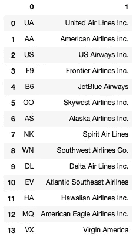

您可以使用`names`参数更改标题:

```
df = pd.read_excel('mydata.xls', 
                   sheet_name='airlines', 
                   header=None,
                   names=['IATA_CODE','AIRLINE'])
df
```

现在已经设置了列名:

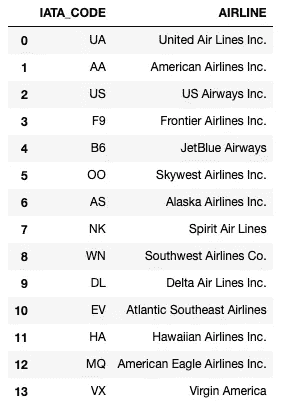

# 加载特定列

如果您只想加载工作表中的特定列，您可以使用`usecols`参数:

```
df = pd.read_excel('mydata.xls', 
                   sheet_name='airports', 
                   usecols=['IATA_CODE','AIRPORT','CITY','STATE','COUNTRY'])
df
```

在上面的语句中，我只想加载' **IATA_CODE** '、**机场**'、**城市**'、**州**'和'**国家**'列:

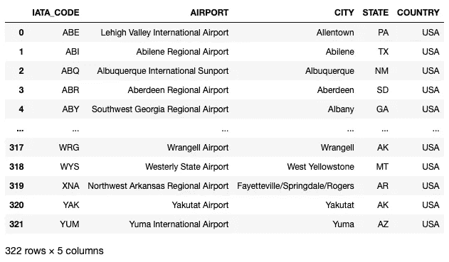

实际上，您省略了纬度列**和经度列**和经度列。在这种情况下，使用 lambda 函数指定*省略*可能会更容易:

```
df = pd.read_excel('mydata.xls', 
                   sheet_name='airports', 
                   usecols=lambda column: column not in ['LATITUDE','LONGITUDE'])
df
```

另一种方法是指定要加载到 Excel 电子表格中的列名。嘿，还记得我们正在使用 Excel 电子表格吗？以下语句显示了如何使用 *Excel-way* 加载列 **F** ( **纬度**)到 **G** ( **经度**):

```
df = pd.read_excel('mydata.xls', 
                   sheet_name='airports', 
                   usecols='F:G')
df
```

结果如下:

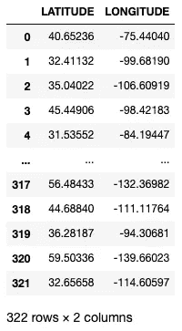

如果你还想要 **IATA_CODE** 和**机场**栏目，可以轻松搞定，像这样！

```
df = pd.read_excel('mydata.xls', 
                   sheet_name='airports', 
                   usecols='A,B,F:G')
df
```

结果现在包含四列:


# 示例 Excel 电子表格#2

到目前为止，第一个 Excel spreahsheet 相当简单(我想说它对于现实世界来说太干净了)。我将使用的第二个数据集更加真实，它可以从[https://data.world/davelaff/restaurant-inventory-log](https://data.world/davelaff/restaurant-inventory-log)下载。

> 这是一个餐厅库存工作簿。这些数据是真实的，但远远不是最新的。列出的价格不是实际价格。**许可**:公共领域

该 Excel 电子表格包含两个工作表:

*   **库存工作表**
*   **子类别库存值**

下面是**库存工作表**的样子:


这里是**子类别库存值**工作表:

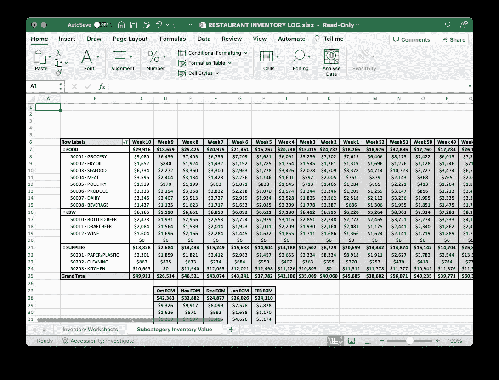

# 安装 xlrd 包

加载更新的**。xlsx** Excel 文件格式，需要安装 **openpyxl** 包:

```
pip install openpyxl
```

> openpyxl 是一个 Python 库，用于读取/写入 Excel 2010 xlsx/xlsm 文件。

# 加载数据集

让我们加载第一个工作表:

```
df = pd.read_excel('RESTAURANT INVENTORY LOG.xlsx', 
                   sheet_name='Inventory Worksheets')

df
```

以下是输出结果:


注意到**未命名:0** 列了吗？此外，请注意最下面几行包含 **NaN** s？

如果您检查 Excel 电子表格，您会注意到实际数据从 B 列开始，并且在工作表的底部有一些空单元格:


为了让 Pandas 正确加载数据帧，您需要指定想要加载的列以及要加载的行数。这里，我将使用`usecols`和`nrows`参数来实现:

```
df = pd.read_excel('RESTAURANT INVENTORY LOG.xlsx', 
                   sheet_name='Inventory Worksheets',
                   usecols="B:Q", 
                   nrows=797)
df
```

结果现在看起来好多了:

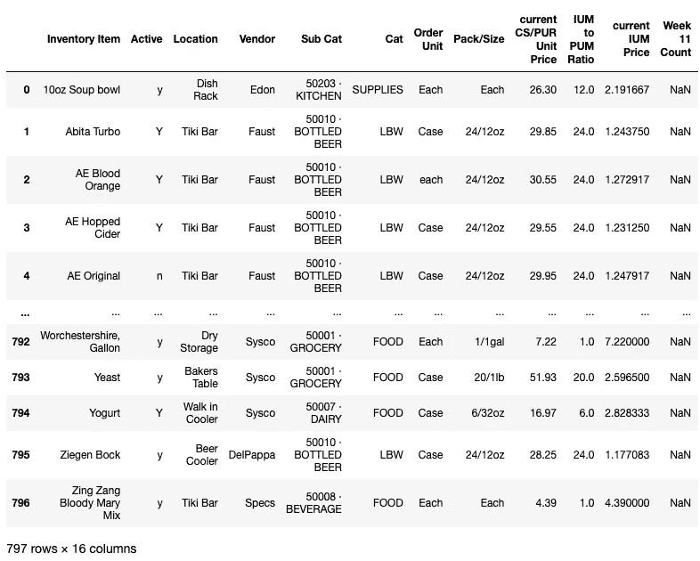

对于第二个工作表，假设我要加载的实际数据在工作表的中间(我用红色突出显示)。为了帮助您直观地看到要加载的行，如果您想要加载以红色突出显示的数据，我已经指出了需要跳过加载的行:

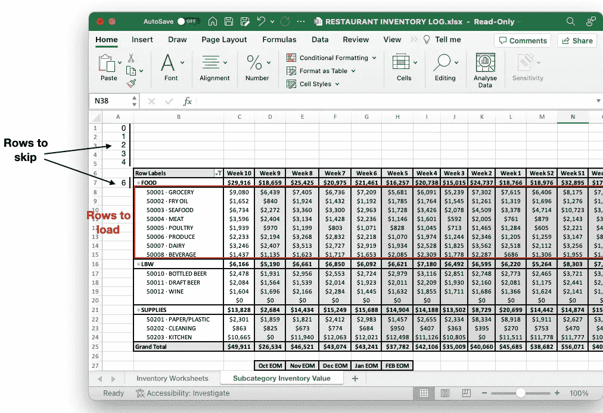

要加载 **FOOD** 部分下的所有行，首先创建一个列表来存储要跳过的行:

```
rows_to_skip = list(range(0,5))
rows_to_skip.append(6)
```

上面将生成一个值列表— `[0,1,2,3,4,6]`。然后，使用`skiprows`、`usecols`和`nrows`参数从工作表中的准确位置加载数据:

```
df = pd.read_excel('RESTAURANT INVENTORY LOG.xlsx', 
                   sheet_name='Subcategory Inventory Value',
                   skiprows=rows_to_skip,
                   usecols="B:AA", 
                   nrows=8)
df
```

下图显示了包含**食物**部分下的行和列的数据帧:

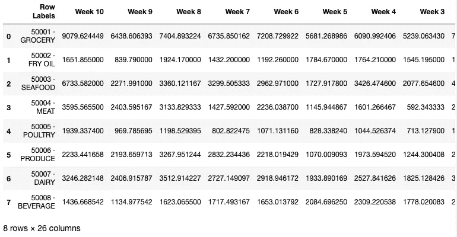

## 如果你喜欢阅读我的文章，并且认为它对你的职业/学习有所帮助，请考虑注册成为一名灵媒会员。每月 5 美元，你可以无限制地访问 Medium 上的所有文章(包括我的)。如果你使用下面的链接注册，我会赚一小笔佣金(不需要你额外付费)。你的支持意味着我将能够投入更多的时间来写这样的文章。

<https://weimenglee.medium.com/membership>  

# 摘要

从 Excel 文件加载 Pandas 数据帧与从 CSV 文件加载非常相似。主要区别在于:

*   一个 Excel 文件可能包含多个工作表，您需要指明要加载哪个工作表。
*   从 Excel 加载提供了通过 Excel 列名指定列的灵活性。这使您可以轻松识别要从中加载数据的列。
*   由于 Excel 工作表中的数据可能不会以严格的表格格式填充，因此通常需要指定要加载的行数，以及加载时要跳过的行数。

一般来说，从 Excel 文件加载时，需要特别注意工作表中数据的格式。玩得开心！