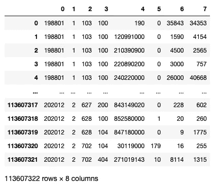
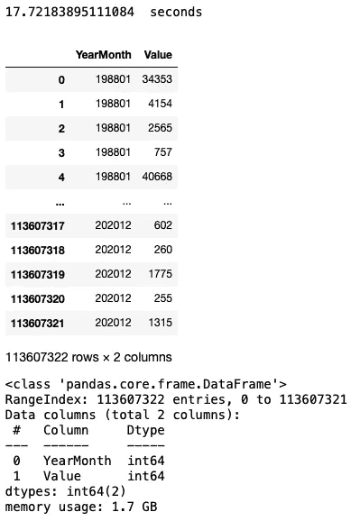
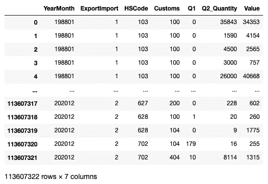
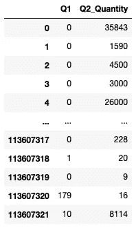
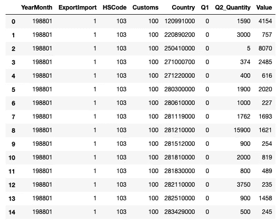
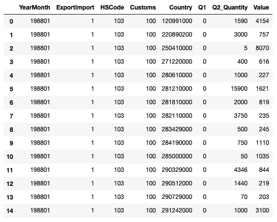
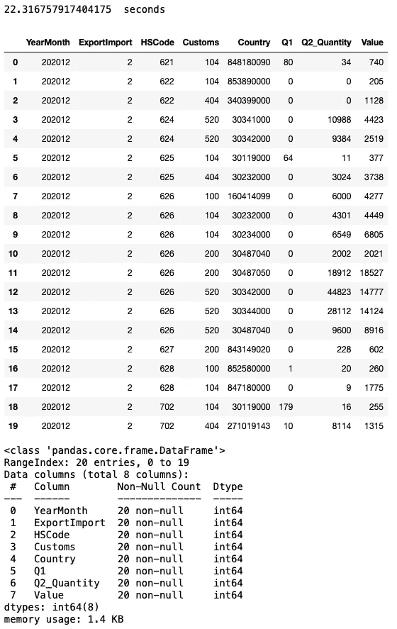

# 将大型 CSV 文件加载到 Pandas 数据帧的提示和技巧—第 1 部分

> 原文：<https://towardsdatascience.com/tips-and-tricks-for-loading-large-csv-files-into-pandas-dataframes-part-1-fac6e351fe79>

## 了解如何读取大型 CSV 文件，以最大限度地减少内存使用和加载时间


照片由[乔丹·哈里森](https://unsplash.com/@jordanharrison?utm_source=medium&utm_medium=referral)在 [Unsplash](https://unsplash.com?utm_source=medium&utm_medium=referral) 拍摄

您在现实世界中使用的大多数数据集通常非常庞大，它们以千兆字节为单位，包含数百万行。在本文中，我将讨论一些在处理大型 CSV 数据集时可以使用的技术。

处理大型 CSV 文件时，有两个主要问题:

*   加载大型 CSV 文件时使用的内存量。
*   加载大型 CSV 文件所花费的时间。

理想情况下，您希望最小化数据帧的内存占用以及加载时间。在本文中，我将使用一个样本数据集向您展示。

# 我们的数据集

对于本文，我将使用来自[https://www . ka ggle . com/datasets/4 e 614 EC 846 ab 778 f 6 a2 ff 166232 D5 a 65 f 5 e 6786 B4 f 5781690588 BD 2 CCD 71 CB 6 的**日本贸易统计数据**？资源=下载](https://www.kaggle.com/datasets/4e614ec846ab778f6a2ff166232d5a65f5e6786b4f5781690588bd2cccd71cb6?resource=download)。

> 许可证类型: [CC BY-SA 4.0](https://creativecommons.org/licenses/by-sa/4.0/)

该数据集包含 1988 年至 2020 年的贸易数据。它包含超过 1 亿行，CSV 文件占据了 4.5 Gb 的巨大空间。因此它是阐释本文中概念的理想数据集。

# 将 CSV 文件加载到熊猫数据帧中

让我们首先加载超过 1 亿行的整个 CSV 文件。我很想知道加载数据帧需要多长时间，以及它的内存占用量:

```
import time
import pandas as pd

start = time.time()

df = pd.read_csv("custom_1988_2020.csv")

print(time.time() - start, ' seconds')
display(df)
display(df.info())
```

输出如下所示:


总内存占用量高达 6.8 GB。)我花了 30 秒把它载入熊猫的数据框。

> 作为参考，我用的是 32GB 内存的 Mac Studio。

# 检查列

让我们检查数据框中的列:

```
df.columns
```

您现在应该意识到这个 CSV 文件没有标题，因此 Pandas 将假定 CSV 文件中的第一行包含标题:

```
Index(['198801', '1', '103', '100', '000000190', '0', '35843', '34353'], dtype='object')
```

# 使用标题加载

由于 CSV 文件没有标题，您至少可以使用`header`参数告诉 Pandas 在 CSV 文件中没有标题:

```
# loading with no headers specified
df = pd.read_csv("custom_1988_2020.csv", header=None)
display(df)
```



Pandas 现在将自动从 0 开始命名列，然后是 1，依此类推。

从[https://www . ka ggle . com/datasets/4 e 614 EC 846 ab 778 f 6 a2 ff 166232 D5 a 65 f 5 e 6786 B4 f 5781690588 BD 2 CCD 71 CB 6 上对数据集的描述？resource=download](https://www.kaggle.com/datasets/4e614ec846ab778f6a2ff166232d5a65f5e6786b4f5781690588bd2cccd71cb6?resource=download) ，我们知道各个栏目的含义:

*   ym(年+月)
*   exp_imp(导出:1，导入:2)
*   hs9(协调制度编码)
*   海关
*   国家
*   雌三醇环戊醚
*   Q2(数量)
*   价值(以千日元计)

让我们使用`names`参数来命名列:

```
df = pd.read_csv("custom_1988_2020.csv", 
                 header=None, 
                 names=['YearMonth', 'ExportImport', 'HSCode', 'Customs', 
                        'Country', 'Q1', 'Q2_Quantity', 'Value'])
display(df)
```


DataFrame 现在有以下列名:' **YearMonth'** ，' **ExportImport'** ，' **HSCode** ，'**海关**，'**国家**，' **Q1'** ，'**Q2 _ 数量'**，'**值'**。

# 加载特定列

由于 CSV 文件如此之大，您想问自己的下一个问题是—您真的需要所有的列吗？要加载特定的列，您可以使用`usecols`参数来指定您想要加载的列:

```
start = time.time()

df = pd.read_csv("custom_1988_2020.csv", 
                 header=None, 
                 names=['YearMonth', 'ExportImport', 'HSCode', 'Customs', 
                        'Country', 'Q1', 'Q2_Quantity', 'Value'],                 
                 usecols = ["YearMonth", "Value"])

print(time.time() - start, ' seconds')
display(df)
display(df.info())
```



正如您从上面的输出中看到的，内存占用已经减少到 1.7GB，加载时间现在减少到 17 秒。

`usecols`参数也支持列位置索引。上面的内容也可以用列号 0 和 7 重写:

```
df = pd.read_csv("custom_1988_2020.csv", 
                 header=None, 
                 names=['YearMonth', 'ExportImport', 'HSCode', 'Customs', 
                        'Country', 'Q1', 'Q2_Quantity', 'Value'],                 
                 usecols = [0, 7])

print(time.time() - start, ' seconds')
display(df)
```

请注意，不能使用-1 来表示最后一列，如下所示:

```
usecols = [0, -1])   # -1 is not supported
```

`usecols`参数也支持 lambda 函数。例如，如果要检索除**国家**列之外的所有列，可以使用下面的 lambda 表达式:

```
df = pd.read_csv("custom_1988_2020.csv", 
                 header=None, 
                 names=['YearMonth', 'ExportImport', 'HSCode', 'Customs', 
                        'Country', 'Q1', 'Q2_Quantity', 'Value'],                 
                 usecols = lambda column: column not in ['Country'])
display(df)
```



**国家**列现在将从结果中排除。

在`usecols`参数中使用 lambda 函数可以让你做一些有趣的事情，比如加载名称中包含“Q”的列，例如:

```
usecols = lambda column: "Q" in column
```



或者列名长度超过七个字符:

```
usecols = lambda column: len(column) > 7
```


# 加载前 n 行

在许多情况下，您不需要整个 CSV 文件中的所有行。也许前 100 行就足够了。为此，您可以使用`nrows`参数来指定想要加载的前 n 行:

```
start = time.time()

df = pd.read_csv("custom_1988_2020.csv", 
                 header=None, 
                 names=['YearMonth', 'ExportImport', 'HSCode', 'Customs', 
                        'Country', 'Q1', 'Q2_Quantity', 'Value'],                 
                 nrows=100)

print(time.time() - start, ' seconds')
display(df[:15])
display(df.info())
```


从上面的结果中，您可以看到加载前 100 行只需要 0.1 秒，生成的数据帧只占用 6.4 KB。

# 跳过行

有时，您可能希望跳过 CSV 文件中的某些行。为此，使用`skiprows`参数:

```
df = pd.read_csv("custom_1988_2020.csv", 
                 header=None, 
                 names=['YearMonth', 'ExportImport', 'HSCode', 'Customs', 
                        'Country', 'Q1', 'Q2_Quantity', 'Value'],                 
                 skiprows=2,
                 nrows=100
)
display(df[:15])
```


上面的结果显示 CSV 文件的前两行被跳过:


您也可以跳过特定的行:

```
df = pd.read_csv("custom_1988_2020.csv", 
                 header=None, 
                 names=['YearMonth', 'ExportImport', 'HSCode', 'Customs', 
                        'Country', 'Q1', 'Q2_Quantity', 'Value'],                 
                 skiprows=[0,2,4],
                 nrows=100
)
display(df[:15])
```



上面的结果显示第 0、2 和 4 行被跳过:


您也可以使用一个`range`对象来指定要跳过的行的范围:

```
df = pd.read_csv("custom_1988_2020.csv", 
                 header=None, 
                 names=['YearMonth', 'ExportImport', 'HSCode', 'Customs', 
                        'Country', 'Q1', 'Q2_Quantity', 'Value'],                 
                 skiprows=range(5,10),
                 nrows=100
)
display(df[:15])
```


上面的结果显示第 5 行到第 9 行被跳过。`skiprows`参数的值也可以使用 lambda 函数编写，如下所示:

```
df = pd.read_csv("custom_1988_2020.csv", 
                 header=None, 
                 names=['YearMonth', 'ExportImport', 'HSCode', 'Customs', 
                        'Country', 'Q1', 'Q2_Quantity', 'Value'],                 
                 skiprows=lambda x: 5 <= x < 10,
                 nrows=100
)
```

使用 lambda 函数，您可以跳过所有偶数行:

```
df = pd.read_csv("custom_1988_2020.csv", 
                 header=None, 
                 names=['YearMonth', 'ExportImport', 'HSCode', 'Customs', 
                        'Country', 'Q1', 'Q2_Quantity', 'Value'],                 
                 skiprows=lambda x: x % 2 == 0,
                 nrows=100
)

print(time.time() - start, ' seconds')
display(df[:15])
```



上述结果显示所有偶数行都被跳过:


# 加载特定行

到目前为止，您已经学习了如何加载前 n 行，以及跳过 CSV 文件中的特定行。如何在 CSV 文件中加载特定的行？没有允许你这样做的参数，但是你可以利用`skiprows`参数得到你想要的。

使用`skiprows`参数中的 lambda 函数，您可以指定跳过哪些行*而不是*(这实际上意味着您*希望*加载哪些行):

```
start = time.time()

df = pd.read_csv("custom_1988_2020.csv", 
                 header=None, 
                 names=['YearMonth', 'ExportImport', 'HSCode', 'Customs', 
                        'Country', 'Q1', 'Q2_Quantity', 'Value'],                 
                 skiprows=lambda x: x not in [1,3],
                 nrows=100
)

print(time.time() - start, ' seconds')
display(df[:15])
display(df.info())
```


上面的结果显示保留了编号为 1 和 3 的行:


> 这种方法的缺点是必须扫描整个 CSV 文件，因此仅加载两行就需要 20 秒。

# 正在加载最后 n 行

我想讨论的最后一个挑战是如何从 CSV 文件中加载最后 n 行。虽然加载前 n 行很容易，但加载后 n 行就不那么简单了。但是你可以利用你到目前为止所学的知识来解决这个问题。

首先，计算 CSV 文件中有多少行:

```
# read the last n rows
start = time.time()

row_count = sum(1 for l in open('custom_1988_2020.csv')) 

print(time.time() - start, ' seconds')
row_count
```


由于 CSV 文件中有超过 1 亿行，所以计算行数大约需要 10 秒钟。另外，记住这个 CSV 文件没有头文件。所以 113607322 是记录的实际行数。

然后，要加载最后 20 行，使用`skiprows`参数并传递给它一个 lambda 函数来跳过除最后 20 行之外的所有行:

```
# read the last n rows
start = time.time()

df = pd.read_csv("custom_1988_2020.csv", 
                 header=None, 
                 names=['YearMonth', 'ExportImport', 'HSCode', 'Customs', 
                        'Country', 'Q1', 'Q2_Quantity', 'Value'],                 
                 skiprows=lambda x: 0 <= x < row_count - 20,
                 nrows=100)

print(time.time() - start, ' seconds')
display(df)
display(df.info())
```



结果显示了加载到 Pandas 数据帧中的最后 20 行。

> 与上一节一样，缺点是在加载过程中必须扫描整个 CSV 文件(因此加载数据帧需要 22 秒)。

## 如果你喜欢阅读我的文章，并且认为它对你的职业/学习有所帮助，请考虑注册成为一名灵媒会员。每月 5 美元，你可以无限制地访问 Medium 上的所有文章(包括我的)。如果你使用下面的链接注册，我会赚一小笔佣金(不需要你额外付费)。你的支持意味着我将能够投入更多的时间来写这样的文章。

[](https://weimenglee.medium.com/membership) [## 加入媒介与我的介绍链接-李伟孟

### 阅读李维孟(以及媒体上成千上万的其他作家)的每一个故事。您的会员费直接支持…

weimenglee.medium.com](https://weimenglee.medium.com/membership) 

# 摘要

在本文中，我介绍了从 CSV 文件中加载熊猫数据帧的多种技术。通常，不需要将整个 CSV 文件加载到数据帧中。通过只加载您需要的内容，您不仅节省了时间，还节省了在内存中保存数据帧所需的内存。在下一篇文章中，我将向您展示减少数据帧内存占用的技术。敬请期待！