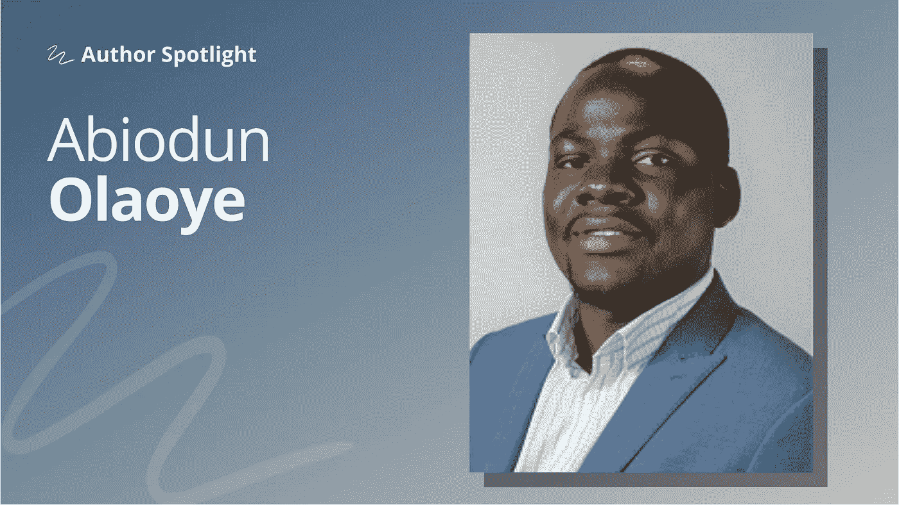

# 要在任何行业产生影响，领域知识至关重要

> 原文：<https://towardsdatascience.com/to-make-an-impact-in-any-industry-domain-knowledge-is-critical-bdd93a304a1d>

## [作者聚焦](https://towardsdatascience.com/tagged/author-spotlights)

## Abiodun Olaoye 讨论了他在可再生能源方面的工作

*在 Author Spotlight 系列中，TDS 编辑与我们社区的成员谈论他们在数据科学领域的职业道路、他们的写作以及他们的灵感来源。今天，我们很高兴与* [*阿比奥顿·欧劳耶*](https://medium.com/u/ec14ee65bc42?source=post_page-----bdd93a304a1d--------------------------------) *分享我们的对话。*

阿比奥顿·奥劳耶的摄影师

*Abiodun Olaoye 是一名经验丰富的数据科学家，在德克萨斯州奥斯丁的 RWE 可再生能源公司担任高级性能工程师(数据分析)。他于 2019 年获得了麻省理工学院(MIT)机械工程和计算博士学位。他获得了多项学术奖学金，包括尼日利亚总统创新与发展特别奖学金(PRESSID)，并三次获得拉各斯大学捐赠奖学金。*

## 您的数据科学学习之旅是怎样的？

我对数据科学的兴趣最初是在麻省理工学院读研究生时出现的，当时我正在对 2014 年左右在拖曳水池实验室的船只上进行的实验中的传感器数据进行预处理。尽管那时我还没有像今天这样正式接触数据科学，但我当时所做的分析基本上都是时间序列分析。

也许是因为重点更多地放在科学研究海洋结构和船只在海洋波浪中的性能上，我没有意识到我已经掌握了多少数据科学的基础知识。当我开始参加 Udemy 和 Cousera 的课程时，这确实帮助我顺利地完成了数据科学技能的正规化。比如我用 MATLAB 写了几个数据处理和分析的程序，用了 5 年左右，这让我学习 Python 相对容易。

此外，我在线性代数和数值模拟方面的所有计算科学和工程研究生课程为我作为数据科学家的技能提供了一个坚实的起点。因此，老实说，我的学习曲线并不太陡。

## 随着你职业生涯的发展，你的数据科学和机器学习方法有没有随着时间的推移而发展？

绝对的。当我刚开始学习数据科学时，我喜欢使用超参数来提高 ML 模型的性能。然而，随着我的经验增加，我在一个给定的项目中花费了更多的时间来扩展我的领域知识，以提高我的特征工程技能，而模型调整成为了锦上添花。因此，我的方法逐渐从以模型为中心转向以数据为中心的建模。

在解决问题方面，我从用玩具数据集解决一般问题发展到解决更实际的问题，重点是将最先进的数据科学技术应用于现实世界的问题，特别是在可再生能源行业。展望未来，我看到自己将数据科学的应用扩展到解决工程研究问题和/或通过数据驱动的方法实现基于物理的解决方案。

## 你在科学、工程和数据方面的背景如何影响你目前在可再生能源方面的工作？

拥有涵盖机械工程和计算科学与工程领域的博士学位，我已经为我的职业生涯打下了广泛的基础。

一方面，我在研究生学习期间为机械部件所学的流体流动物理、动量和能量原理知识构成了我在可再生能源行业领域知识的基础。

另一方面，我研究生学习的计算方面涵盖了高级线性代数以及非线性和偏微分方程的数值解，这些都与数据科学中的优化和建模相关。有了这些知识，我就能够应用先进的数据分析技术，从传感器数据中获得可行的见解，从而提升我们可再生能源资产的性能。

## 你有什么建议可以和那些想找可持续发展相关工作，但不知道如何着手的人分享吗？

当然——我对在可持续发展领域工作的坦率建议是，首先确定行业的哪些方面你最感兴趣，当前的挑战，以及在这些领域部署的最先进的解决方案。

这将有助于增加你的领域知识，这对在任何行业产生影响都是至关重要的。此外，我建议建立一个当前专业人士的网络(通过 Medium、LinkedIn 等。)通过分享文章和帖子来增加你对行业的了解和获得第一份工作的机会。

## 你已经写了几年关于数据和可再生能源的交集。是什么促使你与更广泛的受众分享你的知识？

可再生能源行业的数据从业者有研究和运营的机会，我们的资产在全球范围内每秒产生数千兆字节的数据，我们需要更好地了解这些数据，以提高这些资产的性能、可用性和可靠性。我相信我的文章可以帮助人们发现新的职业前景或研究兴趣，因为有大量的机会，而拥有数据技能和核心工程知识的专业人士相对较少。

此外，我开始更多地写作，因为我意识到我能够以初学者友好的方式分解困难的概念，这可以帮助点燃初级专业人员的兴趣，同时扩展专家的知识。

就个人而言，自从我第一次发现有机会通过应用最先进的数据科学技术来帮助加速世界能源转型，我就开始进行独立研究，开发开源 python 包，并撰写文章。

## 作为一个在最近引起很多关注的领域工作的人，你希望它在未来一两年内如何发展？

在未来几年，可再生能源行业将越来越依赖现代数据技术来存储、提取、集成、转换和模拟传感器数据，总体目标是通过提高涡轮机性能和可用性来增加收入，同时降低能源成本。

此外，AutoML 等技术的低代码云平台将有助于降低该行业新专业人士的准入门槛。最后，我希望看到更多的开源项目、跨组织计划和社区驱动的知识共享，这些行业(如信息技术)多年来从中受益匪浅。

要了解更多关于[阿比奥顿](https://medium.com/u/ec14ee65bc42?source=post_page-----bdd93a304a1d--------------------------------)的工作，并了解他的最新文章，请在[媒体](https://aolaoye.medium.com/)和[推特](https://twitter.com/dualprince)上关注他。为了体验 Abiodun 的 TDS 文章，下面是我们的档案中的一些突出的:

*   [**特征工程中的 3 个基本过程**](/3-fundamental-processes-in-feature-engineering-d6b84983754)(2022 年 10 月，4 分钟)
*   [**使用机器学习技术预测太阳能输出**](/predicting-solar-power-output-using-machine-learning-techniques-56e7959acb1f)(2022 年 1 月，7 分钟)
*   [**根据多个数值天气预报预测风力**](/forecasting-wind-power-from-multiple-numerical-weather-predictions-63c9a67cfc5)(2020 年 7 月，6 分钟)
*   ****【基于聚类的运行风机数据预处理】(2022 年 9 月，10 分钟)****
*   ****[**异常检测系统的 5 个必备素质**](/5-essential-qualities-of-anomaly-detection-systems-fcd1ec5ee9d5)(2022 年 10 月，4 分钟)****

****想和广大观众分享一些你自己的作品吗？[我们希望听到您的意见](http://bit.ly/write-for-tds)。****

*****这个问题&是为了长度和清晰度而稍加编辑的。*****