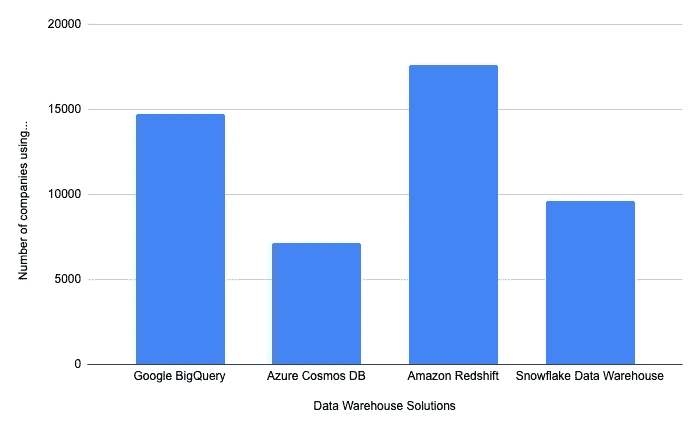
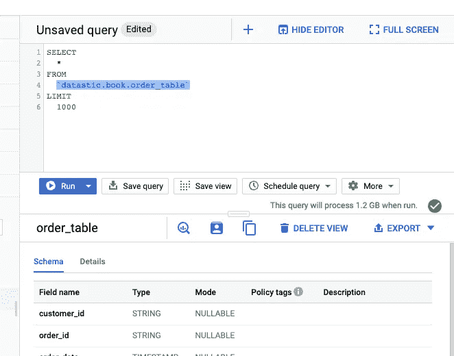
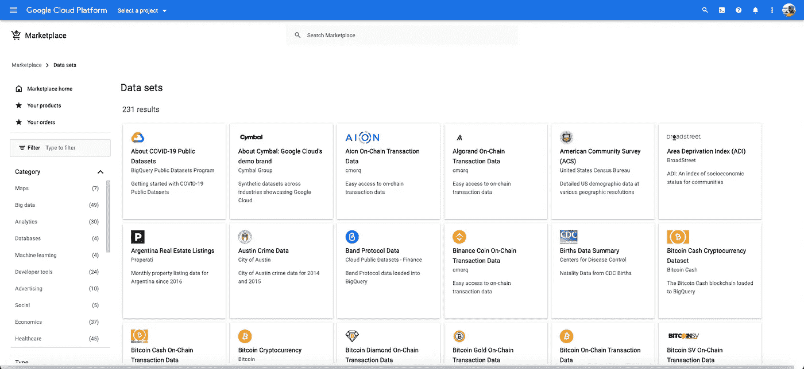
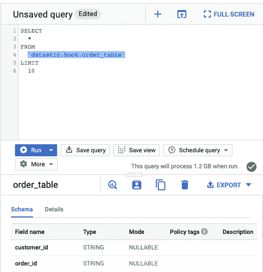
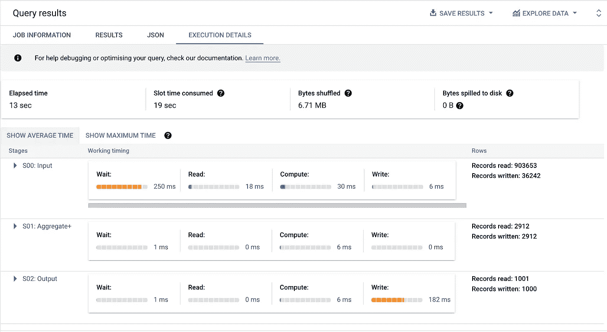

# 给初学者的关于 BigQuery 和 SQL 的 12 条建议

> 原文：<https://towardsdatascience.com/top-12-advice-on-bigquery-and-sql-for-beginners-cc82924ca60b>

## 以正确的方式使用 BigQuery 开始您的数据仓库项目

凯瑟琳·拉威利在 [Unsplash](https://unsplash.com?utm_source=medium&utm_medium=referral) 上拍摄的照片

# 介绍

BigQuery 是众多数据仓库解决方案中的一个，但却是最受欢迎的一个。在对不同公司使用的四种相互竞争且熟悉的解决方案进行快速研究比较后， **BigQuery 似乎在领奖台上排名第二。**

每个解决方案的采用量。来源:[https://discovery.hgdata.com](https://discovery.hgdata.com/)(图片由[作者](https://romaingranger.medium.com/))

为了分析数据，Google BigQuery 以及许多其他数据仓库系统使用 SQL 作为编程语言。

所以，无论你是想学习 SQL，启动一个数据仓库项目，还是想在顶级数据仓库平台上实践，这里有一些建议我很乐意与你分享！

# 建议 1:免费使用 BigQuery

您可以在一定程度上免费使用 BigQuery。通常需要考虑两个问题:**数据存储**和**数据分析(查询)**。

您每月可以免费获得:

*   **10 GB 存储空间**
*   **1 TB 的查询**

其他操作，如批量加载数据(流接收将收费)、复制数据、删除数据或导出数据，通常是免费的。所以，如果你的数据量允许，就不要再等着开始了！

您可以在此找到所有 BigQuery 定价详情:

<https://cloud.google.com/bigquery/pricing>  

关于所有谷歌云平台服务(BigQuery 和其他)的免费层和免费层的更多细节可以在这里找到:

<https://cloud.google.com/free>  

# 建议 2:理解查询定价

BigQuery 的主要用例是对数据进行查询，以便提取有用的信息。有两大类成本:

*   保管费用
*   查询成本(分析)

从前面的建议中，我们看到有一个免费层，但在此之后，对于分析统一费率(这是最常见的一种)**您将对每 TB 查询的数据收取 5 美元。**

要估计一个查询需要解析多少数据，您可以查看您的 web 浏览器代码编辑器，其中有一个通知说:

**该查询在运行时将处理“10 GB”。**

其中“10”将根据您的查询进行调整，“GB”也是如此(*这个* *可以是 24 MB、102 KB、14TB 等等……*)

运行该查询将处理的字节数(这里是 1.2GB)

为了了解成本，您可以将查询中处理的数据量转换为兆字节，然后乘以 5 美元。

在我们的示例中，我们有 1.2GB，相当于 0.0012 TB，然后乘以 5 等于 0.006 美元。

正如你所看到的，我们将为这个查询支付一个非常适中的金额，但我相信你会运行不止一个！

一般来说，控制查询成本是一个好的做法。你可以通过这个链接来学习。

<https://cloud.google.com/bigquery/docs/best-practices-costs>  

# 建议 3:探索 BigQuery 免费数据集

如果您没有加载数据，并且想要练习您的技能，BigQuery 通过 [Google Cloud 公共数据集计划](https://cloud.google.com/public-datasets)向公众提供了许多可用的数据集。

稍后，如果您想要合并/丰富您自己的数据，这些数据集也会很有用。(例如，地理数据等)

你可以上[数据集市场](https://console.cloud.google.com/marketplace/browse?filter=solution-type:dataset)。这就是市场的样子，当点击一个可用的数据集时，您会看到详细信息(数据的描述和每个字段的描述)。

谷歌大查询数据集市场(图片由[作者](https://romaingranger.medium.com/)提供)

我个人使用以下数据集:

*   Google 分析示例
*   秘密党员
*   公用事业 _ 欧盟

**费用警告:**谷歌为这些数据集的存储付费，但你将为你执行的查询付费。(参见 ***建议# 1****——免费使用 big query*)。

您可以在 SQL FROM 语句中使用项目前缀`bigquery-public-data`来查询它们，如下所示:

查询 Google BigQuery 公共数据集

# 建议 4:在同一地区创建数据集

创建数据集时，您必须填写以下信息:

*   **数据集 Id** :您想要给数据集起的名字
*   **数据位置**:决定你的数据存储在哪里(欧洲、美国、亚洲等)
*   **默认表过期:**如果您希望在指定的天数后自动删除该数据集中的表，或者从不删除
*   **加密:**您希望数据如何加密(默认情况下是加密的)

重要的是在你的项目中选择三个可用位置中的一个:美国、欧洲或亚太地区

主要原因是，如果您在欧盟有一个数据集，并且您正尝试对美国的数据集进行联接/合并，BigQuery 将返回如下错误:

> 运行查询时出错
> 
> 未找到:在位置 US 中未找到数据集 datastic:crypto

如果您试图连接来自不同位置的数据，这也适用于其他服务(云 SQL 等)。

还要记住，数据集一旦创建，其位置就不能更改。(但是您可以将数据集复制/移动到另一个位置，这需要额外的工作)

此外，不同的地区和位置有不同的定价和特性，您可以在 Google 文档中找到更多信息。

<https://cloud.google.com/bigquery/docs/locations>  

# 建议 5:极限陈述不会降低成本

运行查询时，BigQuery 会评估需要处理多少字节(比较 ***建议#2*** *—了解查询价格)*。

使用或不使用 LIMIT 子句的每个查询处理的字节数(图片由[作者](https://romaingranger.medium.com/)提供)

在左边，我们观察到这个查询将使用 1.2 GB 的数据，而没有使用`LIMIT`子句。在右边，我们看到这个查询将使用子句处理完全相同的数据量。

**那么这个条款有什么好处呢？**

优点是它减少了用户界面中显示的数据量，使得显示速度更快。

此外，当您有一个聚集表时，`LIMIT`子句可以减少扫描的字节数，并且确实减少了查询的成本。

# 建议 6:只选择你需要的列

BigQuery 是一个**面向列的数据库，**简而言之，在大型数据库中扫描和聚合(求和或平均等)数据非常有效。

它是高效的，因为它不必从整个行中读取数据。想象一下需要处理的数据，如果您有 10 亿行 40 列，您需要读取每行所有 40 列中包含的数据，而您只需要两三列。

作为一个良好的实践，建议尽可能不要使用通配符 *SELECT * FROM table* ，而是实际上只选择您需要的列，例如:

`SELECT col_1,col_2 FROM table;`

这将极大地降低您的查询成本。

您可以在下面的 BigQuery 中找到关于数据如何存储和表示的更多细节。

<https://cloud.google.com/bigquery/docs/storage_overview>  

# 建议 7:在末尾排序，在使用 a `JOIN`之前减少数据

编写查询的方式对成本和执行性能都有影响。这可以通过避免 SQL 反模式和使用正确的语法来避免。

以下是我可以分享的一些优化:

*   当你之前不需要的时候，在最后订购一次结果
*   在执行连接之前减少数据量
*   在查询开始时使用 WHERE 和 DISTINCT 语句，以减少所需的数据量。
*   使用近似聚合函数

除了本文中的其他建议(参见 ***建议# 5****——仅选择您需要的列*)之外，另一个优秀的实践是在早期减少必要的数据量，以减轻后续查询步骤的负担。

一般来说，避免 **SQL 反模式是最佳实践**。SQL 反模式只是开发 SQL 代码时的一个常见错误。

<https://cloud.google.com/bigquery/docs/best-practices-performance-patterns>  <https://github.com/boralp/sql-anti-patterns>  

您还可以更深入地了解 SQL 查询优化和性能。

<https://cloud.google.com/bigquery/docs/best-practices-performance-overview>  

# 建议 8:格式化你的查询

格式化你的查询将会对你的读者或者在完成代码审查时产生影响，这是我鼓励从一开始就养成的习惯。

对于 mac 用户，可以在 BigQuery 浏览器编辑器中使用以下快捷键: **cmd+shift+f**

它将改变您的查询的外观:

非格式化查询

更易读、更清晰的格式，突出显示函数、名称、子句和语句，如下所示:

使用 BigQuery 自动格式化 cmd+shift+f 的 SQL 格式化查询

# 建议 9:跟上时代

谷歌开发人员不断地给他们的产品添加新功能，BigQuery 也是如此。这可以是**新功能**、**公告**、 **bug 修复**、**或者简单的改动。了解这些变化是值得的。**

这些说明包括对 BigQuery、BigQuery ML、BigQuery 数据传输服务和 BigQuery Omni 的更改。

<https://cloud.google.com/bigquery/docs/release-notes>  

您可以在 BigQuery 中以编程方式访问发布说明，这也将使您能够灵活地通过日期和**以及说明类型**(修复、问题、特性、服务、重大变更等)对**进行排序**

查询 BigQuery 的 Google 发行说明

# 建议 10:在你的查询中添加评论

不管使用什么语言(SQL、Python、R、C++、Javascript 等)，注释代码都是一个好习惯。

**它解释了代码做什么**，SQL 查询也不例外。

在 BigQuery 以及许多其他系统中，可以使用双破折号(连字符)进行注释，如下所示:

使用双破折号插入注释

对于 mac 用户，可以使用键盘快捷键 **cmd+/** 来自动注释查询的每一行。

# 建议 11:学会调试你的查询

调试和改进您的查询可能需要一些练习。但是，如果您发现您的查询过于缓慢或过于昂贵，您可以阅读查询编辑器中的查询执行细节选项卡。

查询的执行细节(图片由[作者](https://romaingranger.medium.com/)提供)

一篇很好的帖子讨论了 BQvisualiser，这是一个可以用来评估你的查询哪里可以改进的工具。此工具直接连接到您的项目。

<https://medium.com/google-cloud/visualising-bigquery-41bf6833b98>  

有关查询执行的更多信息，请访问:

<https://cloud.google.com/bigquery/query-plan-explanation?_ga=2.124063242.-1866349659.1650452569>  

# 建议#12:社区 UDF

尽管 UDF(用户定义函数)已经是一个比较复杂的主题，但是有一些社区资源可以帮助您入门，或者至少在您自己的项目中重用它们！

<https://github.com/GoogleCloudPlatform/bigquery-utils>  

UDF 是允许您将 Javascript 或 SQL 代码作为函数运行的函数。例如，假设您的表中有一个包含城市名称的字段，并且您希望对它们进行整理，那么您可以使用 Javascript 库编写一个函数，并将它一次性应用到整个表中。

# 让我们付诸行动吧。✨

我希望这十二条建议能够帮助您在 BigQuery 上有一个良好的开端，或者只是探索并熟悉这项技术。

许多数据仓库技术都有类似的品质，肯定会是您的应用程序的绝佳选择。我要说的是，根据您的特殊要求仔细检查规格和细节仍然很重要。

请让我知道你是否觉得这篇文章内容丰富，是否在评论中对你有所帮助！🤓