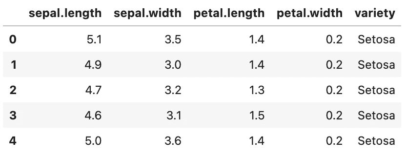
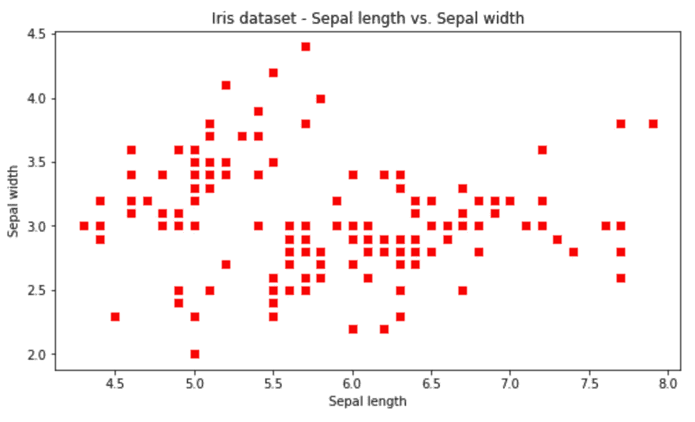
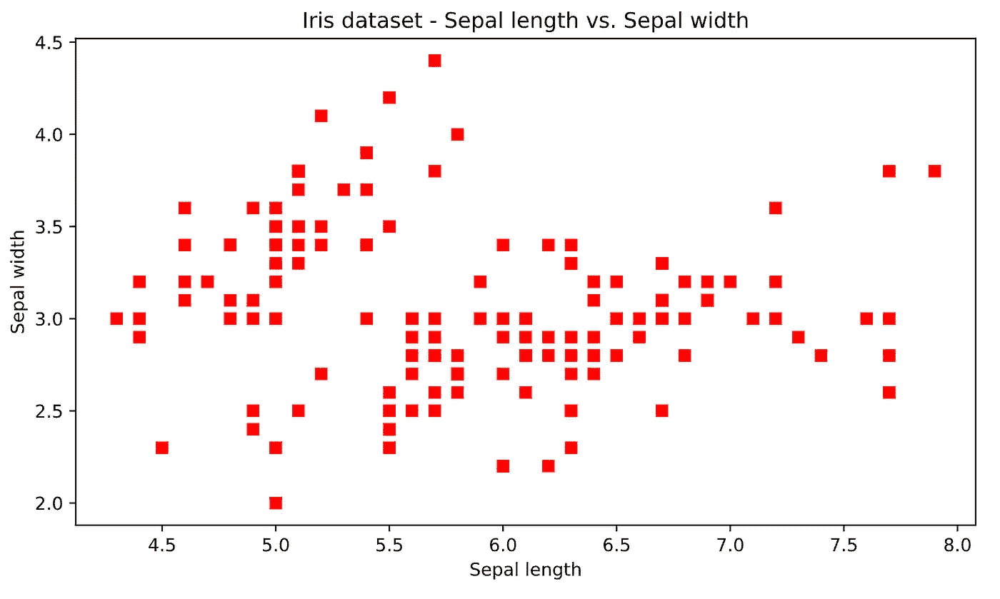
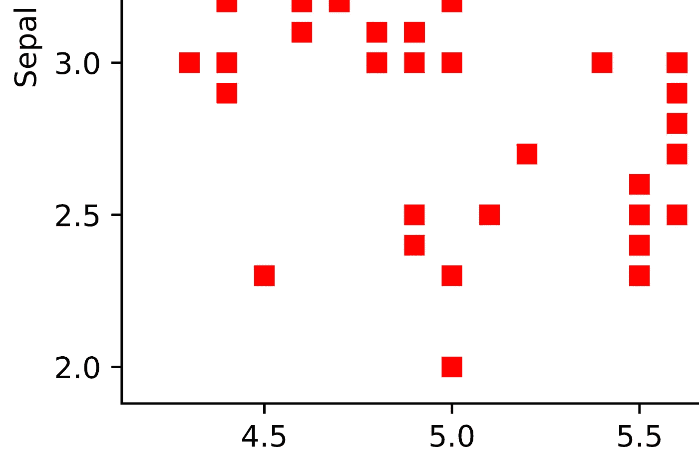
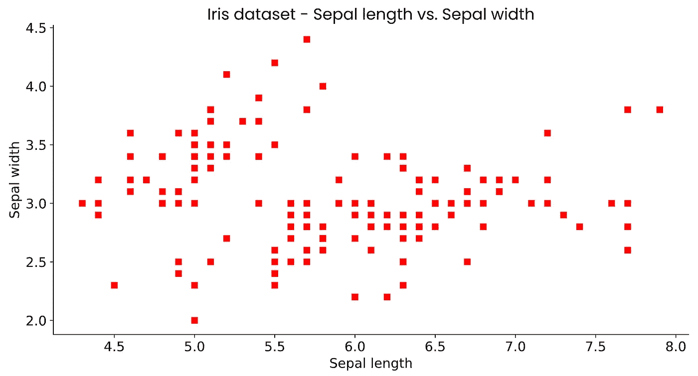

# 三大 Matplotlib 技巧——如何像专业人士一样设计图表

> 原文：<https://towardsdatascience.com/top-3-matplotlib-tips-how-to-style-your-charts-like-a-pro-f79bd53f45d7>

## **Matplotlib 可视化不必碍眼——这些提示会有所帮助**


由[康尼·施耐德](https://unsplash.com/@choys_?utm_source=unsplash&utm_medium=referral&utm_content=creditCopyText)在 [Unsplash](https://unsplash.com/?utm_source=unsplash&utm_medium=referral&utm_content=creditCopyText) 上拍摄的照片

如果我必须用一句话来总结 Matplotlib，那将是下面这句话——易于使用，难以查看。默认情况下，Matplotlib 图表看起来不是最好的，这不是什么秘密，所以许多数据专业人员选择了不同的数据可视化库。你可以实施一些简单的调整，这些将会使白天和黑夜有所不同。

首先，我们需要一个数据集来可视化。[虹膜数据集](https://gist.githubusercontent.com/netj/8836201/raw/6f9306ad21398ea43cba4f7d537619d0e07d5ae3/iris.csv)会做得很好，因为我们在这里不需要任何复杂性。它是在知识共享 0 (CC0)下授权的，这意味着你可以免费使用它。以下代码片段将其作为熊猫数据帧加载到 Python 中:

```
import pandas as pd
import matplotlib.pyplot as plt

df = pd.read_csv("https://gist.githubusercontent.com/netj/8836201/raw/6f9306ad21398ea43cba4f7d537619d0e07d5ae3/iris.csv")
df.head()
```

它看起来是这样的:



图片 1 —虹膜数据集(图片由作者提供)

X 轴上的萼片长度和 Y 轴上的萼片宽度的简单散点图将作为基线。下面是如何绘制它:

```
plt.figure(figsize=(9, 5))

plt.plot(df["sepal.length"], df["sepal.width"], "rs")
plt.xlabel("Sepal length")
plt.ylabel("Sepal width")
plt.title("Iris dataset - Sepal length vs. Sepal width")
plt.show()
```

正如你所想象的，它看起来不是最好的:



图 2-默认的 Matplotlib 可视化(作者图片)

这张图表四四方方，模糊不清，还有许多不足之处。让我们开始逐一解决这些缺点。

# 提示 1 —将 Matplotlib 图形显示为 SVG

之前 Matplotlib 图形模糊的原因很简单——它是作为图像(像素)而不是可缩放矢量图形(SVG)呈现的。SVG 允许您任意缩放图形，并且质量保持不变。

这听起来像是魔术，但它如何与 Matplotlib 一起工作呢？您可以在笔记本环境中更改 Matplotlib 格式，如下所示:

```
from IPython import display
display.set_matplotlib_formats("svg")
```

这就是你要做的全部。如果使用 Python 脚本生成 Matplotlib 图表，请使用以下语法将其保存为 SVG 格式:

```
plt.savefig("<figure-name>.svg")
```

现在，您可以像以前一样运行完全相同的图表生成代码:

```
plt.figure(figsize=(9, 5))

plt.plot(df["sepal.length"], df["sepal.width"], "rs")
plt.xlabel("Sepal length")
plt.ylabel("Sepal width")
plt.title("Iris dataset - Sepal length vs. Sepal width")
plt.show()
```

图像质量的差异是白天和黑夜:



图 SVG 格式的 Matplotlib 图形(图片由作者提供)

即使放大到图表段，质量也保持不变，如下所示:



图 4 —放大的 SVG 图(图片由作者提供)

一言以蔽之，始终使用 SVG。这是迄今为止最好的方法，它需要 1-2 行代码，这取决于您是在脚本环境中还是在笔记本环境中。

# 技巧 2 —调整默认绘图参数

每次要制作图表时，指定图形大小、标题大小、轴刻度大小和许多其他参数可能会非常繁琐。这就是为什么 Matpltolib 打包了一个名为`rcParams`的配置字典。更好的是，你可以随意改变它的关键值。

看看下面的代码片段——它修改了默认的图形大小，删除了顶部和右边框，并调整了整体字体大小:

```
plt.rcParams["figure.figsize"] = 12, 6
plt.rcParams["axes.spines.top"] = False
plt.rcParams["axes.spines.right"] = False
plt.rcParams["font.size"] = 14
plt.rcParams["figure.titlesize"] = "xx-large"
plt.rcParams["xtick.labelsize"] = "medium"
plt.rcParams["ytick.labelsize"] = "medium"
```

您现在可以呈现任何 Matplotlib 图表，修改后的样式将适用:

```
plt.plot(df["sepal.length"], df["sepal.width"], "rs")
plt.xlabel("Sepal length")
plt.ylabel("Sepal width")
plt.title("Iris dataset - Sepal length vs. Sepal width")
plt.show()
```


图 5 —调整了 rcParams 的 Matplotlib 图形(图片由作者提供)

您可以将这些修改后的参数保存在计算机上的单独文档中，然后将它们粘贴到任何将使用 Matplotlib 的笔记本中。没有必要每次都从头开始写。

# 技巧 3——改变字体

这个技巧可能是将您公司的外观和感觉添加到数据可视化中的最简单的方法。添加自定义字体的方法有很多种，但我要展示的这种方法每次都能奏效。没有必要安装字体，只需下载即可。

比如，你可以从谷歌字体下载 [Poppins，解压 ZIP 文件。完成后，使用 Matplotlib 的`font_manger`从目录中添加字体。以下是 Poppins 提供的所有内容:](https://fonts.google.com/specimen/Poppins?query=poppins)

```
import matplotlib.font_manager as font_manager

font_dir = ["/Users/dradecic/Desktop/Poppins"]
for font in font_manager.findSystemFonts(font_dir):
    print(font)
    font_manager.fontManager.addfont(font)
```


图 6 —目录中的 TTF 字体(作者图片)

字体口味倒是挺多的，但是在 Matplotlib 里怎么用呢？这很简单，只需指定另一个`rcParam`:

```
plt.rcParams["font.family"] = "Poppins"

plt.plot(df["sepal.length"], df["sepal.width"], "rs")
plt.xlabel("Sepal length")
plt.ylabel("Sepal width")
plt.title("Iris dataset - Sepal length vs. Sepal width")
plt.show()
```



图 7 —带有自定义字体的 Matplotlib 图形(图片由作者提供)

不用说，这种方法适用于你能找到的任何 TTF 字体。

# 3 个 Matplotlib 样式技巧总结

默认情况下，Matplotlib 看起来不是最好的——我承认这一点——但是它是高度可定制的。在呈现静态可视化方面，您可以做的事情没有限制。唯一的问题是你愿意在文档和代码样本上钻研多深。如果你需要交互式图表， [Plotly](/plotly-front-to-back-bar-charts-line-charts-2b591d29c6ba) 可能是一个不错的解决方案。

你有什么使用 Matplotlib 的顶级技巧？你在每个项目中都使用一些参数吗？请在下面的评论区告诉我。

*喜欢这篇文章吗？成为* [*中等会员*](https://medium.com/@radecicdario/membership) *继续无限制学习。如果你使用下面的链接，我会收到你的一部分会员费，不需要你额外付费。*

[](https://medium.com/@radecicdario/membership) [## 通过我的推荐链接加入 Medium-Dario rade ci

### 阅读达里奥·拉德契奇(以及媒体上数以千计的其他作家)的每一个故事。您的会员费直接支持…

medium.com](https://medium.com/@radecicdario/membership) 

## 保持联系

*   雇用我作为一名技术作家
*   订阅 [YouTube](https://www.youtube.com/c/BetterDataScience)
*   在 [LinkedIn](https://www.linkedin.com/in/darioradecic/) 上连接

*原载于 2022 年 8 月 29 日 https://betterdatascience.com**[*。*](https://betterdatascience.com/top-3-matplotlib-tips/)*