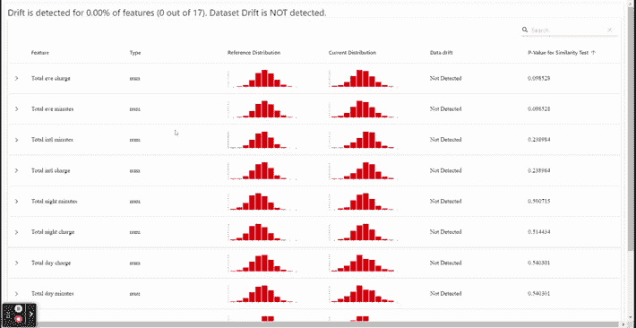
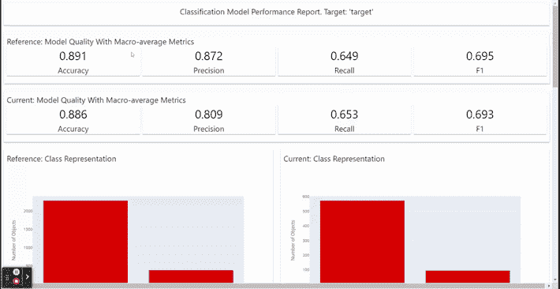
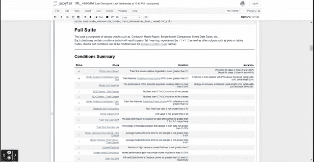
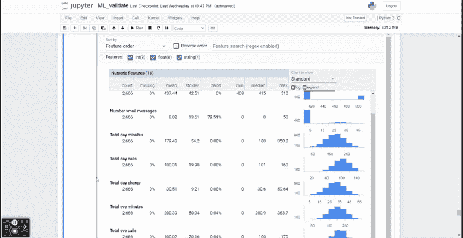

# 用于机器学习验证的前 3 个 Python 包

> 原文：<https://towardsdatascience.com/top-3-python-packages-for-machine-learning-validation-2df17ee2e13d>

## 用这些包验证你的机器学习模型


约翰·施诺布里奇在 [Unsplash](https://unsplash.com?utm_source=medium&utm_medium=referral) 上的照片

作为数据科学家，我们被期望开发机器学习模型来分析数据和解决业务问题。无论我们是开发一个简单的模型还是一个复杂的模型，模型验证对于衡量我们工作的质量都是必不可少的。

我们需要测量每一个移动的部分，以确保通过验证数据、方法和机器学习模型指标，模型是适当的。有很多技术可以做机器学习验证。尽管如此，在这篇文章中，我想介绍 python 包，它将使我们在验证机器学习模型时的生活变得更容易。

以下是我最喜欢的 3 个用于机器学习验证的 python 包。让我们开始吧。

# 1.明显地

[显然](https://evidentlyai.com/)是一个分析和监控机器学习模型的开源 python 包。该软件包是明确开发的，以建立一个易于监控的机器学习仪表板，并检测数据中的漂移。它是专门为生产而设计的，所以在有数据管道的情况下使用更好。然而，你仍然可以在开发阶段使用它。

让我们尝试使用显然来验证我们的机器学习模型开发。在现实环境中，我们会有参考数据集和生产数据集，但对于我们现在的情况，让我们使用来自 [Kaggle](https://www.kaggle.com/mnassrib/telecom-churn-datasets) 的分割训练和测试数据。

作为一个初学者，我们需要安装明显的软件包。

```
pip install evidently
```

安装软件包后，我们可以尝试检测数据集中发生的数据漂移。数据漂移一种现象，即参考数据或以前时间表中的数据在统计上不同于当前数据。

```
import pandas as pdtrain = pd.read_csv('churn-bigml-80.csv')
test = pd.read_csv('churn-bigml-20.csv')
```

数据集需要预处理，我现在只想使用数字数据。

```
train.drop(['State', 'International plan', 'Voice mail plan'], axis =1,inplace = True)
test.drop(['State', 'International plan', 'Voice mail plan'], axis =1, inplace = True)train['Churn'] = train['Churn'].apply(lambda x: 1 if x == True else 0)
test['Churn'] = test['Churn'].apply(lambda x: 1 if x == True else 0)
```

数据准备就绪后，我们将构建仪表板来检测任何偏差。显然需要我们独立地导入每个选项卡；对于**数据漂移**，我们将使用`DataDriftTab`。

```
from evidently.dashboard import Dashboard
from evidently.tabs import  DataDriftTabdata_drift_report = Dashboard(tabs=[DataDriftTab()])
data_drift_report.calculate(train, test, column_mapping = None)
data_drift_report.save("reports/my_report.html")
```

我们将数据保存在 HTML 报告中，并在不同的选项卡中打开它。



数据漂移选项卡(作者 GIF)

正如你在上面的 GIF 中看到的，我们有一个监控仪表板。我们可以在这个仪表板中看到每个特性分布和数据漂移的统计测试。在我们的样本中，训练数据和测试数据之间没有显示任何漂移——这意味着所有的数据分布都是相似的。如果是在生产中，传入的数据和我们当前的数据在模式上没有差异。

显然也可以用来创建一个机器学习分类仪表板，以监控机器学习的健康状况。例如，让我们使用以前的数据训练一个分类模型。

```
from sklearn.neighbors importX_train = train.drop('Churn', axis =1)
X_test = test.drop('Churn', axis =1)
y_train = train['Churn']
y_test = test['Churn']model = KNeighborsClassifier(n_neighbors=5)
model.fit(X_train, y_train)
```

拟合模型后，我们需要实际和预测的结果。我们还需要完整的训练和测试数据集。

```
train_predictions = model.predict(X_train)
test_predictions = model.predict(X_test)X_train['target'] = y_train
X_train['prediction'] = train_predictionsX_test['target'] = y_test
X_test['prediction'] = test_predictions
```

监视器还需要我们映射我们使用的列；在这种情况下，我们显然会使用来自。

```
from evidently.pipeline.column_mapping import ColumnMappingchurn_column_mapping = ColumnMapping()churn_column_mapping.target = 'target'
churn_column_mapping.prediction = 'prediction'
churn_column_mapping.numerical_features =train.drop('Churn', axis =1).columns
```

所有准备工作完成后，让我们设置分类器监视器仪表板。

```
from evidently.tabs.base_tab import Verbose
from evidently.tabs import ClassificationPerformanceTabchurn_model_performance_dashboard = Dashboard(tabs=[ClassificationPerformanceTab(verbose_level=Verbose.FULL)])
churn_model_performance_dashboard.calculate(X_train, X_test, column_mapping = churn_column_mapping)
churn_model_performance_dashboard.save("reports/classification_churn.html")
```



分类器仪表板(作者 GIF)

如上面的 GIF 所示，我们可以从整体上监控我们的机器学习模型指标，并对每个特征进行预测。细节足够好，可以知道新数据传入时是否有差异。

如果你想清楚地知道所有可以使用的仪表板，请参考[文档](https://docs.evidentlyai.com/)。

# 2.深度检查

[Deepchecks](https://docs.deepchecks.com/en/stable/index.html) 是一个 python 包，用几行代码验证了我们的机器学习模型。许多 API 可用于检测数据漂移、标签漂移、训练测试比较、评估模型等等。深度检查非常适合在研究阶段和模型投入生产之前使用。你应该在下面的第[页](https://docs.deepchecks.com/en/stable/user-guide/when_should_you_use.html)中了解更多关于何时使用深度检查的信息。

让我们尝试使用 Deepchecks 包来生成完整的数据集和模型性能报告。我们将使用`full_suite`类来生成报告。

首先，让我们安装 Deepchecks 包。

```
pip install deepchecks
```

安装完成后，我们需要准备训练数据集和机器学习模型。对于我们的例子，我将使用来自深度检查的简单虹膜数据集。

```
import pandas as pd
from deepchecks.datasets.classification import iris
from sklearn.ensemble import RandomForestClassifier# Load Data
iris_df = iris.load_data(data_format='Dataframe', as_train_test=False)
```

加载完数据后，我们需要拆分训练测试数据，加载机器学习模型。你可以用你的模型来拟合数据，但我会用现成的模型。

```
df_train, df_test = iris.load_data(data_format='Dataframe', as_train_test=True)
label_col = "target"rf_clf = iris.load_fitted_model()
```

如果将 Pandas 数据框转换为 Deepchecks 数据集对象，Deepchecks 会工作得更好，因此我们会这样做。

```
from deepchecks import Datasetds_train = Dataset(df_train, label=label_col, cat_features=[])
ds_test =  Dataset(df_test,  label=label_col, cat_features=[])
```

一切准备就绪；我们只需要从我们的 Jupyter 笔记本上运行完整的套件报告。

```
from deepchecks.suites import full_suitesuite = full_suite()
suite.run(train_dataset=ds_train, test_dataset=ds_test, model=rf_clf)
```


运行 Deepchecks 完整套件(图片由作者提供)



全套报告(作者 GIF)

完整套件报告将包含许多信息，如混淆矩阵报告、简单模型比较、混合数据类型、数据漂移等。检查机器学习模型所需的所有信息都可以在一次代码运行中获得。

# 3.张量流-数据-验证

[TensorFlow 数据验证](https://www.tensorflow.org/tfx/data_validation/get_started)或 TFDV 是由 TensorFlow 开发者开发的一个 python 包，用于管理数据质量问题。它用于自动描述数据统计，推断数据模式，并检测传入数据中的任何异常。

让我们尝试安装软件包。

```
pip install tensorflow-data-validation
```

首先，我们需要导入包并从 CSV 数据中生成统计对象。我会使用我们之前使用的培训流失数据集作为参考数据集。

```
import tensorflow_data_validation as tfdv
stats = tfdv.generate_statistics_from_csv(data_location='churn-bigml-80.csv')
```

我们可以将统计对象的统计信息可视化。

```
tfdv.visualize_statistics(stats)
```



TFDV 统计推断(作者提供的 GIF)

TFDV 包不仅可以生成统计可视化，还可以帮助检测输入数据的任何变化。为此，我们需要推断原始或参考数据模式。

```
schema = tfdv.infer_schema(stats)
tfdv.display_schema(schema)
```


作者图片

该模式将用于验证任何传入的数据；如果传入的数据在模式中没有推断出任何列或类别，那么 TFDV 将通知异常的存在。我们将使用下面的代码和测试数据来完成这项工作。

```
new_csv_stats = tfdv.generate_statistics_from_csv(data_location='churn-bigml-20.csv')

anomalies = tfdv.validate_statistics(statistics=new_csv_stats, schema=schema)tfdv.display_anomalies(anomalies)
```


作者图片

没有发现异常，因为所有的数据都是相似的。

# 结论

机器学习模型项目不是一蹴而就的事情；这是一个持续的项目。如果存在任何异常，生产中的模型将需要不断地被监视和控制。为了帮助我们验证机器学习模型，我们可以使用以下 python 包:

1.  明显地
2.  深度检查
3.  张量流验证数据

希望有帮助！

在我的 [**LinkedIn**](https://www.linkedin.com/in/cornellius-yudha-wijaya/) 或 [**Twitter**](https://twitter.com/CornelliusYW) 上访问我。

> *如果您喜欢我的内容，并希望获得更多关于数据或数据科学家日常生活的深入知识，请考虑在此订阅我的* ***简讯。***

> *如果您没有订阅为中等会员，请考虑通过* [*我的推荐*](https://cornelliusyudhawijaya.medium.com/membership) *订阅。*