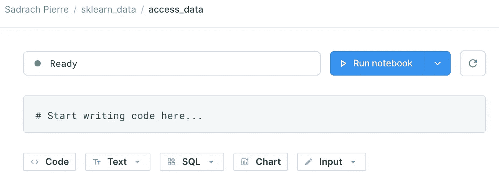

# 前 5 名基准数据集

> 原文：<https://towardsdatascience.com/top-5-benchmark-datasets-35d38bc9bfd7>

## 使用 Scikit-learn 和 Keras 访问玩具数据

图片由[像素](https://www.pexels.com/photo/black-and-brown-wooden-plane-scale-model-1720957/)上的 [Ashutosh Sonwani](https://www.pexels.com/@ashutoshsonwani/) 拍摄

玩具数据集可以用来教授机器学习中的重要概念，而不必应对数据工程的挑战。虽然数据工程是机器学习管道中非常重要的一部分，但使用玩具数据集可以避免缺失值处理、异常值处理、文件格式等问题。

玩具数据集对于数据科学教育来说是特别有用的资源。例如，如果有人第一次学习如何构建随机森林分类模型，他们不应该担心如何并行处理丢失的数据。由于这些原因，玩具数据集是教育工作者和教育平台的常用资源。例如，DataCamp 有关于使用糖尿病数据集的表格数据分类的学习模块。它还有一个使用手写数字(MNIST)数据集的影像分类课程。玩具数据集使教师能够以可控的方式教授基本概念。这对于真实数据来说要困难得多。

玩具数据集还可以让研究人员轻松构建模型基准，这些基准可用于比较最先进的方法和新颖的机器学习方法。例如，MNIST 数据集已被用于各种机器学习研究任务中的模型基准测试。具体来说，MNIST 已被用于测试卷积神经网络模型的改进、神经网络中的新型激活函数、利用生成对抗网络的异常检测等等。

鉴于其在教育和研究中的普遍用途，玩具数据集是机器学习和数据科学生态系统的重要组成部分。这有助于教师培养下一代数据科学家，研究人员在机器学习领域进行创新。话虽如此，对数据科学家来说，了解哪些玩具数据集是可用的，无论是用于学习、教学还是研究，都是至关重要的。Scikit-learn 和 Keras 是两个开源包，可以轻松访问开源玩具数据集，用于学习和研究基准标记。

Scikit-learn 是 python 中的一个开源机器学习库，它使数据科学家和研究人员能够执行各种分析任务，如分类、回归、聚类、数据预处理、降维、模型选择等。Scikit-learn 中的 datasets 模块有一系列用于分类和回归的玩具数据集。

Scikit-learn 数据集模块中三个最常用的分类数据集是手写数字数据集(MNIST)、虹膜数据集和糖尿病数据集。由于这些数据集是预加载的，我们不必担心与访问和准备数据相关的许多挑战。这对机器学习教育和研究有积极的意义。

Keras 是一个开源的深度学习 API，建立在 tensorflow 之上。鉴于许多机器学习研究涉及开发新的神经网络架构，轻松访问玩具数据集进行基准标记和测试非常有用。Keras 有各种各样的基准数据集。像 Scikit-learn 一样，Keras 提供了访问 MNIST 的途径。此外，Keras 提供了对时尚 MNIST 数据集的访问，这是 MNIST 的替代方案。时尚 MNIST 包含 10 个时尚类别的图像，包括衬衫、外套、连衣裙、运动鞋、包、凉鞋等。Keras 还提供对 CIFAR100 数据集的访问，该数据集包含各种图像，如飞机、汽车、鸟、鹿、猫、狗等。

在这里，我们将介绍如何访问五个最常用的基准数据集。对于这项工作，我将在 [Deepnote](https://deepnote.com/) 中编写代码，这是一个协作数据科学笔记本，使运行可重复的实验变得非常容易。

## sci kit-学习数据集

首先，让我们导航到 Deepnote 并创建一个新项目(如果您还没有帐户，可以免费注册)。

让我们创建一个名为“sklearn_data”的项目，并在该项目中创建一个名为“access_data”的笔记本:

作者截图

接下来，让我们从 Scikit-learn 导入数据集模块:

作者创建的嵌入

## 分类数据集

*手写数字(MNIST)*

让我们从 Scikit-learn 中导入 datasets 类开始:

作者创建的嵌入

接下来，我们可以通过调用 datasets 类的 load_digits 方法来访问 MNIST 数据。让我们将数据存储在一个名为 digits 的变量中:

作者创建的嵌入

接下来，让我们将数据集中的第一幅图像可视化。我们可以使用 Matplotlib 来做到这一点:

作者创建的嵌入

我们还可以在一台显示器上显示多幅图像:

作者创建的嵌入

*虹膜数据*

用于学习和基准标记分类模型的流行数据集是 Iris flowers 数据集，该分类模型是基于表格数据训练的。为了访问 Iris 数据集，我们从 datasets 模块导入 load_iris 方法。与 MNIST 类似，我们可以调用 load_iris 方法，并将返回值存储在一个名为 iris_data 的变量中:

作者创建的嵌入

我们可以用 Matplotlib 中的散点图来显示目标:

作者创建的嵌入

## 回归数据集

*糖尿病数据集*

另一个流行的数据集是糖尿病数据集。该数据集最常用于回归任务。它包含诊断测量的特征，如胰岛素水平、葡萄糖水平和身体质量指数，可用于预测患者是否患有糖尿病。

与前面的数据集类似，我们从 datasets 模块导入 load_diabetes 方法，我们可以调用该方法并将数据存储在名为 diabetes_data 的变量中。我们还将为参数 as_frame 传入值“True ”,这使得 load_diabetes 在被调用时返回一个数据帧:

作者创建的嵌入

我们还可以从糖尿病数据中生成一些散点图:

作者创建的嵌入

## Keras 数据集

接下来，我们将看看如何通过 Keras API 访问玩具图像分类数据集。让我们从导入 Keras 开始:

作者创建的嵌入

*时尚 MNIST*

Keras 为 MNIST 数据集提供了另一种选择，称为时尚 MNIST。它包含几个时尚类别的图像。与 Scikit-learn 类似，Keras 有一个数据集模块，允许您访问这些数据集。让我们从 dataset 模块访问 fashion_mnist 数据，并在 fashion_mnist 类上调用 load_data 方法:

作者创建的嵌入

我们还可以轻松地解开这些数据中的训练集和测试集:

作者创建的嵌入

生成可视化效果非常简单:

作者创建的嵌入

*CIFAR100*

最后，CIFAR100 数据集是另一个流行的图像分类数据集。与时尚 MNSIT 类似，我们可以从数据集模块访问 CIFAR100:

作者创建的嵌入

打开数据包装:

作者创建的嵌入

并生成可视化效果:

作者创建的嵌入

这篇文章中使用的代码可以在 [GitHub](https://github.com/spierre91/deepnote/blob/main/access_data.ipynb) 上获得。

## 结论

在这篇文章中，我们学习了如何使用 Scikit-learn 和 Keras 访问公开的玩具数据集。玩具数据集对于教育和研究是必不可少的。由于玩具数据通常是干净的、结构化的和易于访问的，因此它对于教授机器学习和数据科学的基本概念非常有用，而不必担心数据准备的问题。这包括围绕数据清理、异常值去除和结构化数据的复杂性。此外，出于同样的原因，在开发新的机器学习算法时，玩具数据集也可用于研究基准。无论您是第一次学习机器学习概念的学生，还是开发新算法的经验丰富的研究人员，了解可用于分类和回归任务的玩具数据集都是至关重要的。