# 用于分类的 6 大机器学习算法

> 原文：<https://towardsdatascience.com/top-machine-learning-algorithms-for-classification-2197870ff501>

## 如何用 Python 构建机器学习模型管道

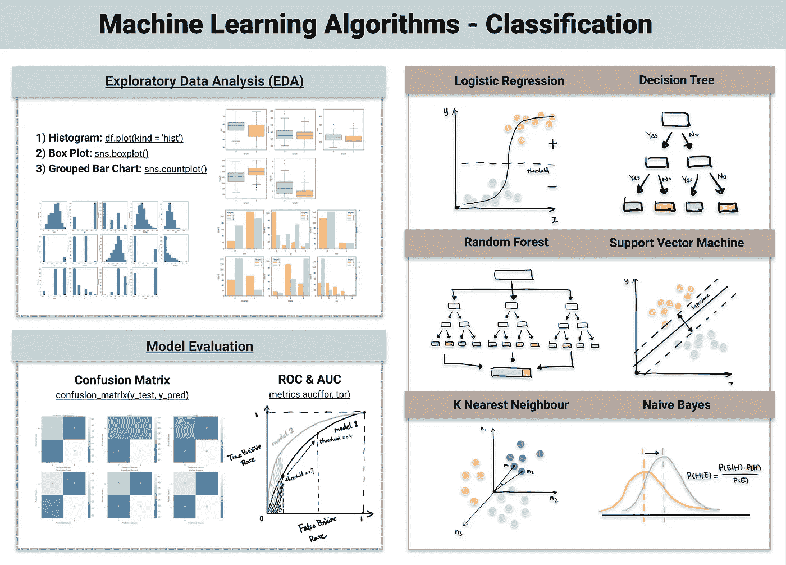

用于分类的机器学习算法(原图来自我的[网站](https://www.visual-design.net/)

## 监督与非监督与强化学习

区分有监督学习和无监督学习最简单的方法就是看数据是否被标注。

**监督学习**学习一个函数，根据输入数据对定义的标签进行预测。它可以是将数据分类(分类问题)或预测结果([回归算法](/top-machine-learning-algorithms-for-regression-c67258a2c0ac))。

**无监督学习**揭示数据集中没有明确呈现的潜在模式，它可以发现数据点的相似性(聚类算法)或揭示变量的隐藏关系(关联规则算法)…

**强化学习**是另一种类型的机器学习，其中代理学习根据其与环境的交互采取行动，目的是最大化回报。它非常类似于人类的学习过程，遵循试错法。

## 分类与回归

监督学习可以进一步分为分类和回归算法。**分类模型**识别对象属于哪个类别，而 [**回归模型**](/top-machine-learning-algorithms-for-regression-c67258a2c0ac) 预测连续输出。

*有关回归算法的指南，请参见:*

[](/top-machine-learning-algorithms-for-regression-c67258a2c0ac)  

有时在分类算法和回归算法之间有一条模糊的线。许多算法既可以用于分类，也可以用于回归，而分类只是应用了阈值的回归模型。当数量高于阈值时，它被分类为真，而低于阈值时，它被分类为假。

在本文中，我们将讨论分类问题的 6 大机器学习算法，包括:l *逻辑回归、决策树、随机森林、支持向量机、k 近邻和朴素贝叶斯*。我总结了每种方法背后的理论，以及如何使用 python 实现每种方法。在我的[网站](https://www.visual-design.net/code-snippets)上查看模型管道的代码。

# 1.逻辑回归

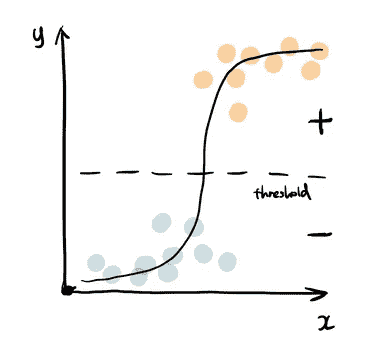

逻辑回归(图片由作者提供)

逻辑回归使用上面的 sigmoid 函数来返回标签的概率。当分类问题是二元的——真或假，赢或输，正或负时，它被广泛使用...

sigmoid 函数生成概率输出。通过将该概率与预定义的阈值进行比较，对象被相应地分配给标签。查看我在[逻辑回归](/simple-logistic-regression-using-python-scikit-learn-86bf984f61f1)上的帖子，获得详细的演示。

[](/simple-logistic-regression-using-python-scikit-learn-86bf984f61f1)  

下面是默认逻辑回归和常用超参数的代码片段，看看哪些组合能带来最好的结果。

```
from sklearn.linear_model import LogisticRegression
reg = LogisticRegression()
reg.fit(X_train, y_train)
y_pred = reg.predict(X_test)
```

[**logistic 回归常用超参数**](/tuning-the-hyperparameters-of-your-machine-learning-model-using-gridsearchcv-7fc2bb76ff27) **:** penalty，max_iter，C，solver

# 2.决策图表

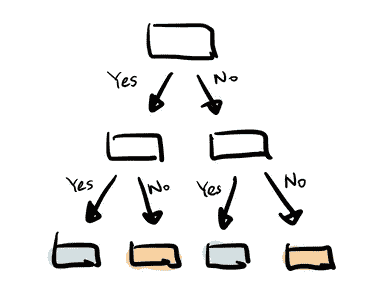

决策树(图片由作者提供)

决策树以分层的方式构建树分支，每个分支可以被视为一个 if-else 语句。分支是通过基于最重要的特征将数据集划分为子集来发展的。最终的分类发生在决策树的叶子上。

```
from sklearn.tree import DecisionTreeClassifier
dtc = DecisionTreeClassifier()
dtc.fit(X_train, y_train)
y_pred = dtc.predict(X_test)
```

[**决策树常用超参数**](/how-to-tune-a-decision-tree-f03721801680) : criterion，max_depth，min_samples_split，min _ samples _ leaf 最大 _ 功能

# 3.随机森林

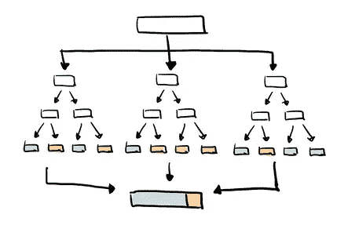

随机森林(图片由作者提供)

顾名思义，随机森林是决策树的集合。这是一种常见的集合方法，它集合了来自多个预报器的结果。随机森林还利用 bagging 技术，允许每棵树在原始数据集的随机采样上训练，并从树中获得多数票。与决策树相比，它具有更好的泛化能力，但可解释性较差，因为模型中增加了更多的层。

```
from sklearn.ensemble import RandomForestClassifier
rfc = RandomForestClassifier()
rfc.fit(X_train, y_train)
y_pred = rfc.predict(X_test)
```

[**随机森林常用超参数**](/hyperparameter-tuning-the-random-forest-in-python-using-scikit-learn-28d2aa77dd74) : n_estimators，max_features，max_depth，min_samples_split，min_samples_leaf，boostrap

# 4.支持向量机(SVM)

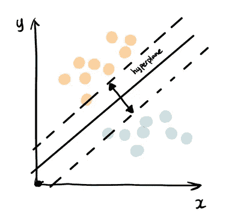

支持向量机(图片作者提供)

支持向量机根据与正类和负类之间的边界相关的位置找到对数据进行分类的最佳方式。这个边界被称为超平面，它最大化来自不同类的数据点之间的距离。类似于决策树和随机森林，支持向量机可以用于分类和回归，SVC(支持向量分类器)用于分类问题。

```
from sklearn.svm import SVC
svc = SVC()
svc.fit(X_train, y_train)
y_pred = svc.predict(X_test)
```

[**支持向量机常用超参数:**](https://www.vebuso.com/2020/03/svm-hyperparameter-tuning-using-gridsearchcv/) c，内核，伽马

# 5.k-最近邻(KNN)

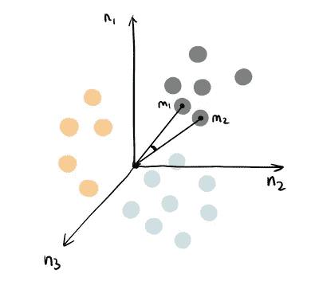

knn(图片由作者提供)

您可以将 k 最近邻算法视为表示由 n 个特征定义的 n 维空间中的每个数据点。它计算一个点到另一个点的距离，然后根据最近的观察数据点的标签分配未观察数据的标签。KNN 也可以用来构建推荐系统，如果你对这个话题感兴趣，可以看看我的文章“[协同过滤推荐电影](/a-beginner-friendly-guide-to-recommender-system-3f5fa2a57c02)”。

```
from sklearn.neighbors import KNeighborsClassifier
knn = KNeighborsClassifier()
knn.fit(X_train, y_train)
y_pred = knn.predict(X_test)
```

[**KNN 常用超参数**](https://medium.datadriveninvestor.com/k-nearest-neighbors-in-python-hyperparameters-tuning-716734bc557f)**:**n _ neighbors，weights，leaf_size，p

# 6.朴素贝叶斯

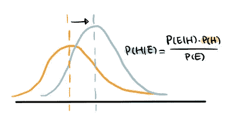

朴素贝叶斯(作者图片)

朴素贝叶斯基于[贝叶斯定理](https://machinelearningmastery.com/bayes-theorem-for-machine-learning/)——一种基于先验知识计算条件概率的方法，以及每个特征相互独立的朴素假设。朴素贝叶斯的最大优点是，虽然大多数机器学习算法依赖于大量的训练数据，但即使训练数据量很小，它也能表现得相对较好。高斯朴素贝叶斯是一种遵循正态分布的朴素贝叶斯分类器。

```
from sklearn.naive_bayes import GaussianNB
gnb = GaussianNB()
gnb.fit(X_train, y_train)
y_pred = gnb.predict(X_test)
```

[**高斯朴素贝叶斯常用超参数**](https://www.analyticsvidhya.com/blog/2021/01/gaussian-naive-bayes-with-hyperpameter-tuning/) :先验，var_smoothing

如果你想知道更多其他机器学习算法，请查看我的列表:


[德斯坦贡](https://destingong.medium.com/?source=post_page-----2197870ff501--------------------------------)

## 机器学习实用指南

[View list](https://destingong.medium.com/list/practical-guides-to-machine-learning-a877c2a39884?source=post_page-----2197870ff501--------------------------------)10 stories

# 构建分类模型管道

## 1.加载数据集和数据概述

我选择了 Kaggle 上流行的数据集[心脏病 UCI](https://www.kaggle.com/ronitf/heart-disease-uci) 来预测基于几个健康相关因素的心脏病的存在。


使用`df.info()`获得数据集的汇总视图，包括**数据类型、缺失数据和记录数。**

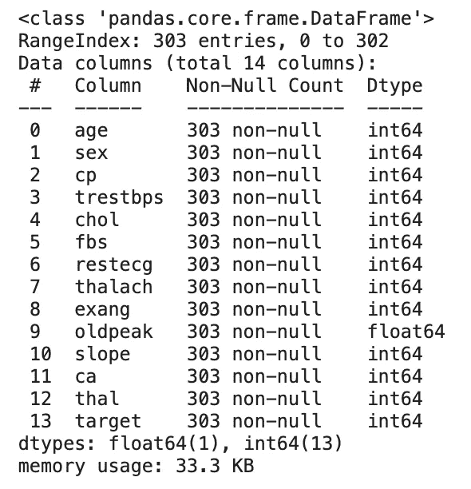

## 2.探索性数据分析

**直方图、分组条形图和箱线图**是适合分类机器学习算法的 EDA 技术。如果你想要更全面的 EDA 指南，请参见我的帖子“[Python 中的半自动探索性数据分析过程](https://www.visual-design.net/post/semi-automated-exploratory-data-analysis-process-in-python)

[](https://www.visual-design.net/post/semi-automated-exploratory-data-analysis-process-in-python)  

**单因素分析**

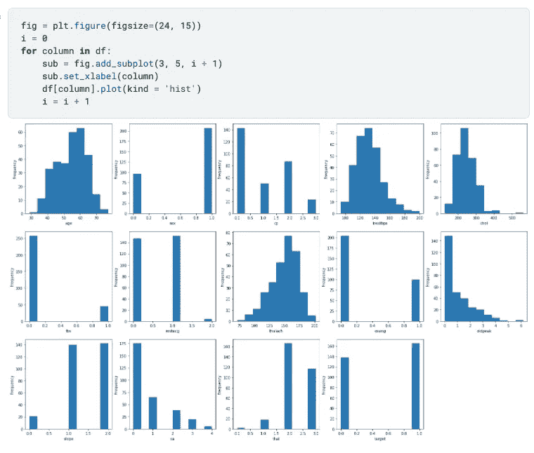

单变量分析(图片由作者提供)

直方图用于所有要素，因为所有要素都已编码为数据集中的数值。这为我们节省了通常发生在[特征工程](https://www.visual-design.net/post/data-transformation-and-feature-engineering-in-python)阶段的分类编码时间。

**分类特征与目标—分组条形图**

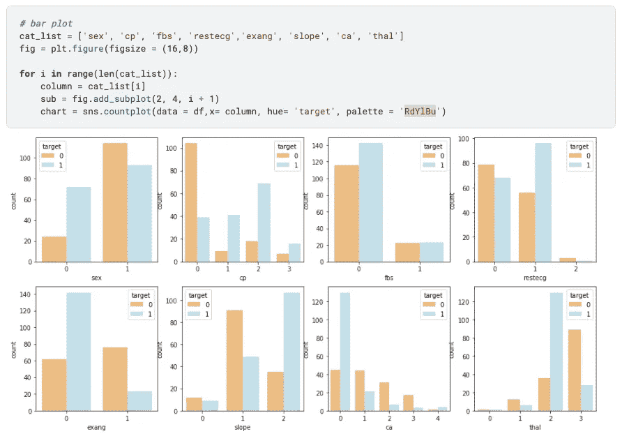

分组条形图(作者图片)

为了显示分类值在确定目标值时的权重，分组条形图是一种直观的表示方法。例如，性别= 1 和性别= 0 具有明显的目标值分布，这表明它可能对目标的预测贡献更大。相反，如果不管分类特征如何，目标分布是相同的，那么它们很可能是不相关的。

**数值特征与目标值的对比——箱线图**

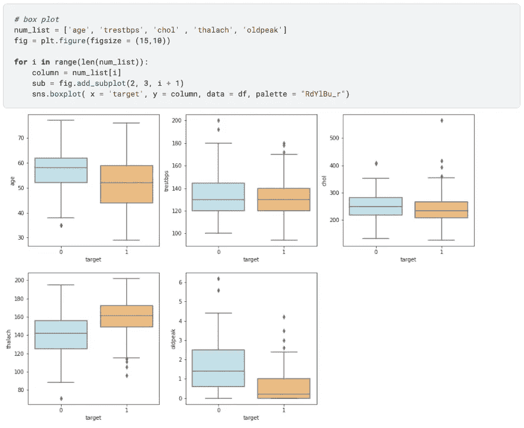

箱线图(图片由作者提供)

箱线图显示了不同目标群体的数值特征如何变化。例如，我们可以看出，当目标值为 0 与目标值为 1 时,“旧峰”具有明显的差异，这表明它是一个重要的预测因子。然而，“trestbps”和“chol”似乎不太突出，因为目标群体之间的箱线图分布相似。

## 3.将数据集分成训练集和测试集

分类算法属于监督学习的范畴，因此数据集需要分成一个子集用于训练，一个子集用于测试(有时也是一个验证集)。该模型在训练集上进行训练，然后使用测试集进行检查。

```
from sklearn.model_selection import train_test_split
from sklearn import preprocessingX = df.drop(['target'], axis=1)
y = df["target"]X_train, X_test, y_train, y_test = train_test_split(X, y, test_size=0.33, random_state=42)
```

## 4.机器学习模型流水线

为了创建一个管道，我将上面提到的所有分类算法的默认状态附加到模型列表中，然后迭代通过它们来训练、测试、预测和评估。


模型管道(图片由作者提供)

## 5.模型评估

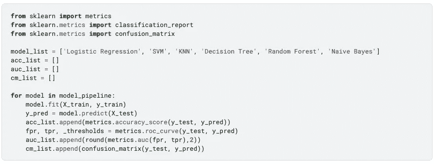

模型评估(图片由作者提供)

下面是分类模型常用评价方法的抽象解释——**准确率、ROC & AUC 和混淆矩阵**。以下每个指标都值得深入研究，请随意访问我关于[逻辑回归](/simple-logistic-regression-using-python-scikit-learn-86bf984f61f1)的文章，获取更详细的说明。

**1。精确度**

精确度是模型性能最直接的指标。它衡量准确预测的百分比:*准确性=(真阳性+真阴性)/(真阳性+假阳性+假阴性+假阳性)*

**2。ROC & AUC**

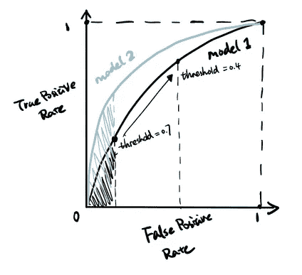

ROC 和 AUC(图片由作者提供)

ROC 是在不同分类阈值下**真阳性率对**假阳性率的图。AUC 是 ROC 曲线下的面积，AUC 越高表明模型性能越好。

**3。混乱矩阵**

混淆矩阵显示实际值与预测值，并以矩阵形式汇总**真阴性、假阳性、假阴性和真阳性值**。


然后，我们可以使用 seaborn 在热图中可视化混淆矩阵。


混乱矩阵图(图片由作者提供)


准确性和 AUC 结果(图片由作者提供)

基于上述三种评估方法，随机森林和朴素贝叶斯的性能最好，而 KNN 的表现不佳。然而，这并不意味着随机森林和朴素贝叶斯是优越的算法。我们只能说，它们更适合这种规模相对较小、数据不在同一尺度的数据集。

每种算法都有自己的偏好，需要不同的数据处理和特征工程技术，例如 KNN 对不同尺度的特征很敏感，多重共线性会影响逻辑回归的结果。了解每种模型的特征使我们能够权衡利弊，并根据数据集选择合适的模型。

感谢您到目前为止，如果您想阅读更多来自 Medium 的文章并支持我的工作，我真的很感谢您使用这个附属[链接](https://destingong.medium.com/membership)注册 Medium 会员。

# 带回家的信息

本文介绍了以下 6 种机器学习算法，并指导您构建模型管道来解决分类问题:

1.  逻辑回归
2.  决策图表
3.  随机森林
4.  支持向量机
5.  KNN
6.  朴素贝叶斯

## 更多这样的资源


[德斯坦贡](https://destingong.medium.com/?source=post_page-----2197870ff501--------------------------------)

## 机器学习实用指南

[View list](https://destingong.medium.com/list/practical-guides-to-machine-learning-a877c2a39884?source=post_page-----2197870ff501--------------------------------)10 stories[](/how-to-self-learn-data-science-in-2022-a537a76d138e)  

[德斯坦贡](https://destingong.medium.com/?source=post_page-----2197870ff501--------------------------------)

## 开始学习数据科学

[View list](https://destingong.medium.com/list/get-started-in-data-science-8006bb4ba3ad?source=post_page-----2197870ff501--------------------------------)8 stories

*原载于 2022 年 2 月 22 日 https://www.visual-design.net**的* [*。*](https://www.visual-design.net/post/3-ux-design-principles-for-better-data-visualization)