# 机器学习中的四大线性回归变量

> 原文：<https://towardsdatascience.com/top-machine-learning-algorithms-for-regression-c67258a2c0ac>

## 初学者友好的实现和比较指南

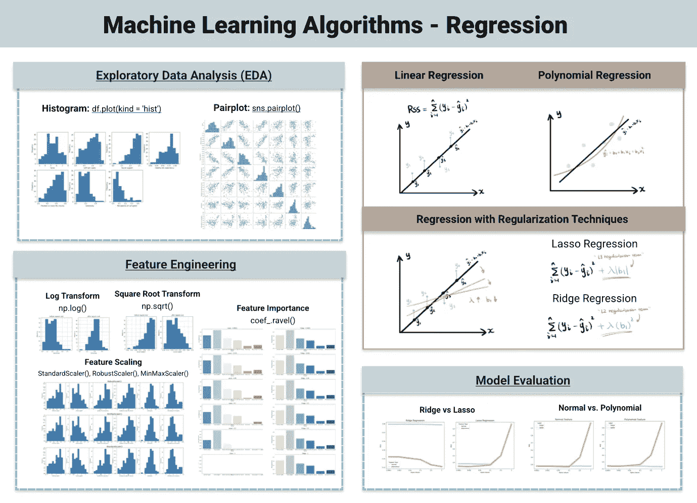

回归的机器学习算法(原图来自我的[网站](https://www.visual-design.net/)

在我之前的文章“[用于分类的顶级机器学习算法](/top-machine-learning-algorithms-for-classification-2197870ff501?source=your_stories_page----------------------------------------)”中，我们介绍了常见的分类算法。现在让我们深入到监督学习的另一个类别——回归，其中输出变量是连续的数字。主要是，如何实现和比较四种常见类型的回归模型:

*   线性回归
*   套索回归
*   里脊回归
*   多项式回归

如果你喜欢视频演练，请查看我在本文末尾的 YouTube 视频。

# 线性回归

线性回归找到自变量和因变量之间的最佳线性关系，从而做出相应的预测。最简单的形式是 *y = b0 + b1x。*当只有一个输入特征时，线性回归模型拟合 2 维空间中的直线，以最小化预测值和实际值之间的残差。测量残差大小的常用成本函数是残差平方和(RSS)。

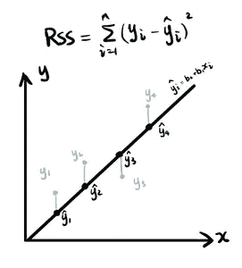

线性回归(作者图片)

随着更多功能的引入，简单线性回归演变为多元线性回归 *y = b0 + b1x1 + b2x2 + … + bnxn。*如果你想要[简单线性回归模型](/a-practical-guide-to-linear-regression-3b1cb9e501a6)的具体指南，请随意查看我的文章。

</a-practical-guide-to-linear-regression-3b1cb9e501a6>  

# 套索回归

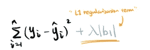

拉索回归(图片由作者提供)

Lasso 回归是 L1 正则化的线性回归的变体。听起来令人畏惧？简单地说，它给回归模型试图最小化的残差(RSS)增加了一个额外的元素。它被称为 L1 正则化，因为这个增加的正则化项与系数的绝对值成比例。上面的项是基于最简单的线性回归形式 *y = b0 + b1x。*

与岭回归相比，它更好地将某些特征的系数变为 0，因此是一种合适的特征消除技术。您将在后面的“特性重要性”一节中看到。

# 里脊回归

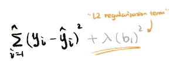

岭回归(图片作者提供)

岭回归是 L2 正则化的另一种回归变体。因此不难推断，正则项是基于系数的**平方值**——2 次。与 Lasso 回归相比，岭回归具有**收敛速度快、计算量小的优点。**

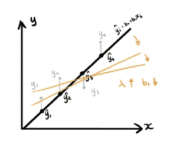

正则化强度(图片由作者提供)

拉索和脊线的正则化强度由λ值决定。λ值越大，系数越小，模型越平坦，方差越小。因此，正则化技术通常用于防止模型过拟合。

# 多项式回归

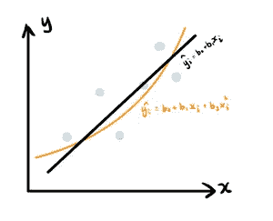

多项式回归(作者图片)

多项式回归是线性回归通过多项式特征变换的一种变体。它增加了独立变量之间的相互作用。`PolynomialFeatures(degree = 2)`用于将输入特征转换到最大程度 2。例如，如果原始输入要素是 x1、x2、x3，这会将要素扩展为 x1、x2、x3、x1、x1x2、x1x3、x2、x2x3、x3。结果，该关系不再是线性的，而是能够提供对数据的非线性拟合。

# 实践中的回归模型

在所有的理论之后，时间来实现和比较这些回归模型，并探索不同的 lambda 值如何影响模型性能。

如果你有兴趣获得这个项目的完整代码，请查看[代码片段](https://www.visual-design.net/code-snippets)。

## 1.目标和数据集概述

该项目旨在使用回归模型，根据其他因素“人均国内生产总值”、“社会支持”、“健康预期寿命”、“做出生活选择的自由”、“慷慨程度”和“对腐败的看法”来预测国家幸福指数。

我用的是 Kaggle 上的[《世界幸福报告》](https://www.kaggle.com/unsdsn/world-happiness)数据集，包含 156 个条目，9 个特征。`df.describe()`用于提供数据集的概述。

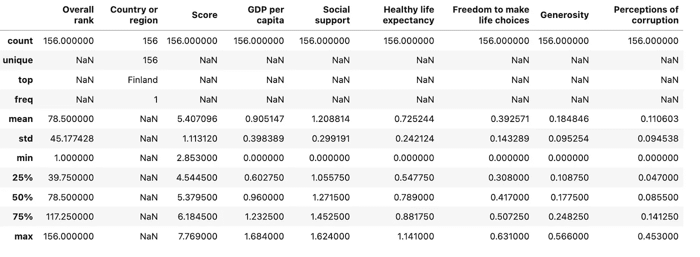

数据集概述(按作者分类的图片)

## 2.数据探索和特征工程

**1)删除冗余特征**

特性*“总体排名”*被删除，因为它是目标*“得分”*的直接反映。此外，*“国家或地区”*被删除，因为它不会给预测带来任何值。

**2)单变量分析**

应用直方图了解每个特征的分布。如下图所示，*“社会支持”*似乎严重左倾，而*“慷慨”*和*“对腐败的看法”*则是右倾——这为转换的特征工程技术提供了信息。

```
# univariate analysis
fig = plt.figure(figsize=(16, 8))  
i = 0
for column in df:
    sub = fig.add_subplot(2,4 , i + 1)
    sub.set_xlabel(column)
    df[column].plot(kind = 'hist')
    i = i + 1
```

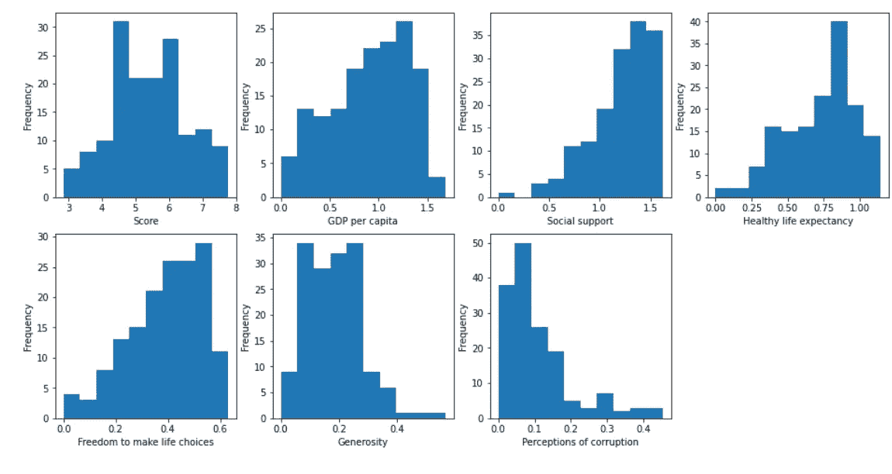

单变量分析(图片由作者提供)

我们还可以将直方图与下面的偏斜度结合起来，以量化特征是否严重向左或向右偏斜。

```
skew_limit = 0.7
for col in df.columns:
    skewness = df[col].skew()
    if skewness + skew_limit < 0:
        print(col, ": left skewed", str(skewness))
    elif skewness > skew_limit:
        print(col, ": right skewed", str(skewness))
    else: 
        print(col, ": not skewed", str(skewness))
```


偏斜度

**3)平方根变换**

`*np.sqrt*` 是应用于变换**右斜特征** — *“慷慨”和“对腐败的看法”*。因此，这两个特征变得更加正态分布。

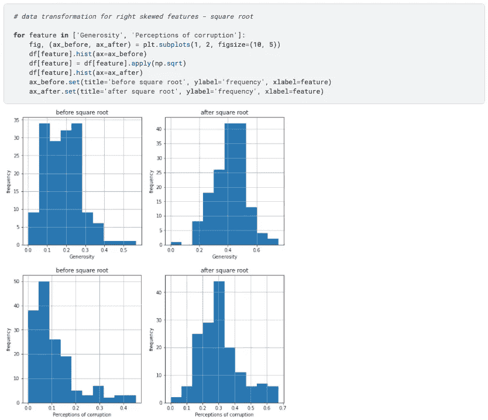

平方根变换(图片由作者提供)

**4)日志转换**

`*np.log(2 — df['Social Support'])*`用于变换**左歪斜特征**。偏斜度从 1.13 显著降低到 0.39。


日志转换(图片由作者提供)

**5)双变量分析**

`*sns.pairplot(df)*`可以用来可视化变换后特征之间的相关性。散点图表明*“人均 GDP”、“社会支持”、“健康预期寿命”*与目标特征*“得分”*相关，因此可能具有较高的系数值。让我们在后面的部分看看是否是这样。

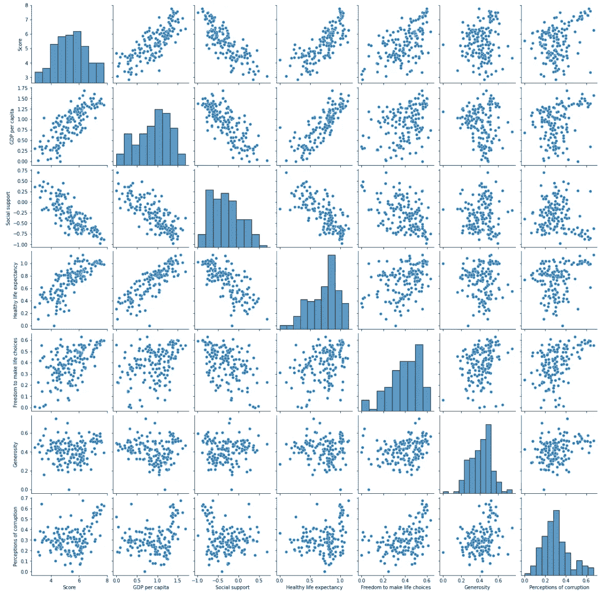

**6)特征缩放**

由于正则化技术正在操纵系数值，这使得模型性能对特征的比例敏感。所以特征应该被转换成相同的比例。我在三种定标器上做了实验——标准定标器、最小最大定标器和鲁棒定标器。

查看我的文章“3 种常见的数据转换技术”以获得更全面的数据转换技术指南。

</data-transformation-and-feature-engineering-e3c7dfbb4899>  

请注意，缩放器仅适合使用训练集，然后将变换应用于训练集和测试集。所以，应该先拆分数据集。

```
from sklearn.model_selection import train_test_splitX = df.drop(['Score'], axis=1)
y = df['Score']X_train, X_test, y_train, y_test = train_test_split(X, y, test_size=0.33, random_state=42)print(X_train.shape, X_test.shape)
```

然后，迭代这 3 个缩放器，比较它们的结果。

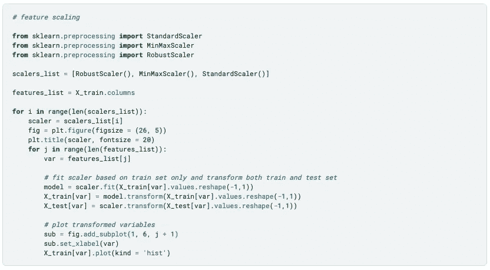

特征缩放代码(图片由作者提供)

如您所见，缩放器不会影响数据的分布和形状，但会改变数据的范围。


特征比例比较(图片由作者提供)

要获得更全面的 EDA 和特征工程指南，请查看我的精选列表。


[德斯坦贡](https://destingong.medium.com/?source=post_page-----c67258a2c0ac--------------------------------)

## EDA 和特征工程技术

[View list](https://destingong.medium.com/list/eda-and-feature-engineering-techniques-e0696974ed54?source=post_page-----c67258a2c0ac--------------------------------)9 stories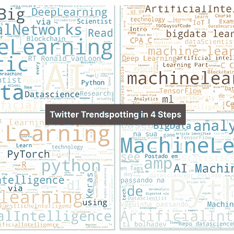

## 3.回归模型比较

现在我们来比较下面三种线性回归模型——线性回归、岭回归和套索回归。

```
lr = LinearRegression().fit(X_train, y_train)
l2 = Ridge(alpha = 0.1).fit(X_train, y_train)
l1 = Lasso(alpha = 0.001).fit(X_train, y_train)
```

**1)预测比较**

首先，在一个散点图中可视化三个模型的预测值与实际值，这表明在当前的参数设置下，它们的预测大部分相互重叠。


回归预测比较(图片由作者提供)

**2)特征重要性**

第二步是实验不同的 lambda 值(scikit-learn 中的 alpha)如何影响模型。具体来说，当 alpha 值从 0.0001 增加到 1 时，**特征重要性和系数值**如何变化。

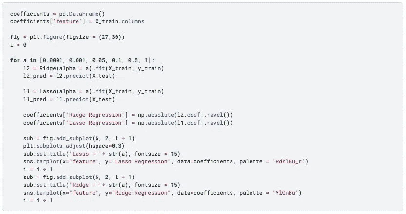

特征重要性代码(图片由作者提供)


套索与山脊的特征重要性(图片由作者提供)

基于 Lasso 和 Ridge 模型生成的系数值，*“人均 GDP”、“社会支持”、“健康预期寿命”*似乎是前 3 个最重要的特征。这与之前散点图的发现一致，表明它们是“*乡村快乐得分*”的主要驱动力。并排比较还表明，alpha 值的增加在不同程度上影响 Lasso 和 Ridge，Lasso 中的特征被更强烈地抑制。这就是为什么**套索经常被选择用于特征选择的目的。**

**3)应用多项式效果**

此外，还引入了多项式要素来增强基线线性回归，从而将要素数量从 6 个增加到 27 个。

```
from sklearn.preprocessing import PolynomialFeatures
pf = PolynomialFeatures(degree = 2, include_bias = False)
X_train_poly = pf.fit_transform(X_train)
X_test_poly = pf.fit_transform(X_test)
```

看看它们在多项式变换后的分布。

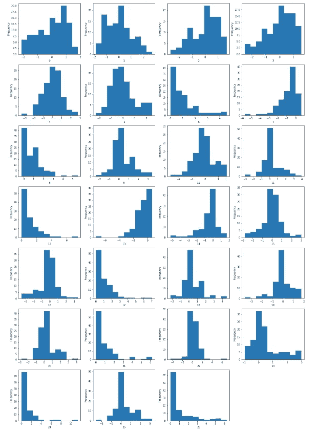

多项式特征单变量分析(图片由作者提供)

## 4.模型评估

最后一步，评估多项式效应前后 Lasso 回归与岭回归模型的性能。在下面的代码中，我实现了四个模型:

*   l2:没有多项式特征的岭回归
*   l2_poly:具有多项式特征的岭回归
*   l1:无多项式特征的套索回归
*   l1_poly:具有多项式要素的套索回归


回归模型评估(图片由作者提供)

常见的回归模型评估指标有 MAE、MSE、RMSE 和 R 平方——查看我的文章“[线性回归实用指南](/a-practical-guide-to-linear-regression-3b1cb9e501a6?source=your_stories_page----------------------------------------)”了解详细解释。在这里，我使用 MSE(均方误差)来评估模型性能。

1)通过在一个图表中比较**山脊与套索，**表明当α值较低时，它们具有相似的精度，但是当α值接近 1 时，套索显著恶化。在多项式变换之前和之后观察到相同的模式。

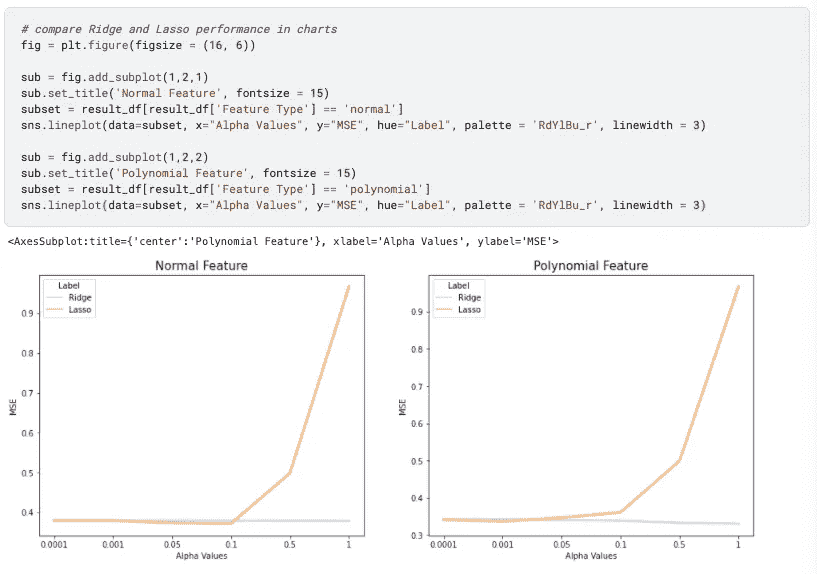

一张图中的山脊与套索(图片由作者提供)

2)通过在一个图表中比较**之前与之后的多项式效应，**我们可以知道，多项式总体上降低了 MSE，从而增强了模型性能。当α增加到 1 时，这种效应在岭回归中更显著，当α接近 0.0001 时，这种效应在套索回归中更显著。

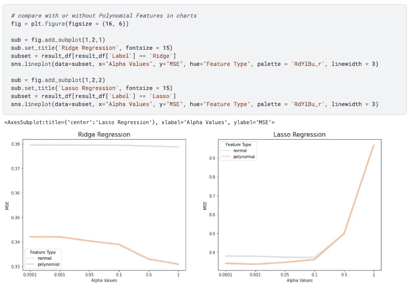

一个图表中多项式效果的前后对比(图片由作者提供)

但是，即使多项式变换提高了回归模型的性能，它也会使模型的可解释性变得更加困难-很难从多项式回归中分辨出主要的模型驱动因素。

更少的错误并不总是保证更好的模型，它将在基于项目目标的可预测性和可解释性之间找到正确的平衡。

**感谢到达终点。如果你想阅读更多我关于媒介的文章，我将非常感谢你的支持，注册成为** [**媒介会员**](https://destingong.medium.com/membership) **。**

# 带回家的信息

希望本文提供了不同类型回归模型的一般思路，包括:

*   线性回归
*   里脊回归
*   套索回归
*   多项式回归

我们还将演练:

*   回归模型的基本 EDA 和特征工程技术。
*   不同 alpha 值下的特征重要性
*   套索和脊的模型比较
*   多项式特征前后的模型比较

## 更多这样的文章

</top-machine-learning-algorithms-for-classification-2197870ff501>  

[德斯坦贡](https://destingong.medium.com/?source=post_page-----c67258a2c0ac--------------------------------)

## 机器学习实用指南

[View list](https://destingong.medium.com/list/practical-guides-to-machine-learning-a877c2a39884?source=post_page-----c67258a2c0ac--------------------------------)10 stories

[德斯坦贡](https://destingong.medium.com/?source=post_page-----c67258a2c0ac--------------------------------)

## 开始学习数据科学

[View list](https://destingong.medium.com/list/get-started-in-data-science-8006bb4ba3ad?source=post_page-----c67258a2c0ac--------------------------------)8 stories

*原载于 2022 年 3 月 20 日 https://www.visual-design.net*<https://www.visual-design.net/post/top-machine-learning-algorithms-for-regression>**。**