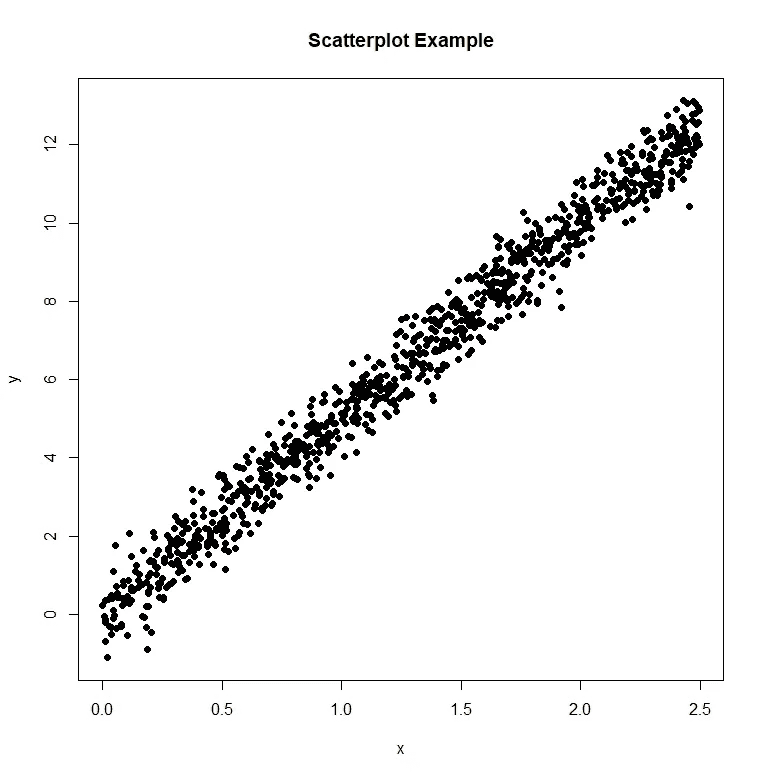
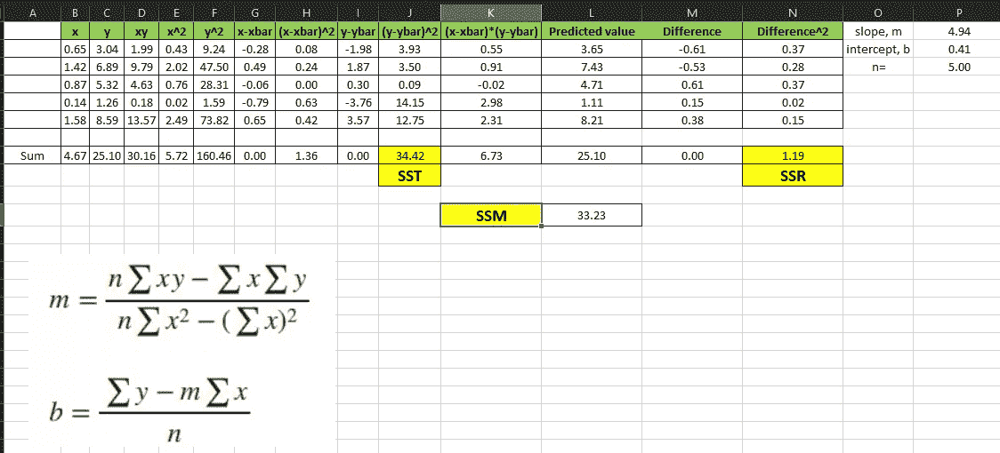

# R 中回归和 ANOVA 命令的全部解释

> 原文：<https://towardsdatascience.com/total-interpretation-of-regression-and-anova-commands-in-r-ed8982c12473>

## R 系列中的统计

图片来自 [Unsplash](https://unsplash.com/photos/1_CMoFsPfso)

> **简介**

回归是统计学家首先执行的统计分析之一，以获得因变量对一个或多个自变量的依赖性细节。只有一个自变量的分析，称为简单线性回归，如果有多个自变量，则称为多元线性回归。使用 R，只需执行几行代码就可以获得与回归相关的必要统计数据。我们知道，多元线性回归受制于一些假设，这些假设在应用回归参数之前需要得到满足。读者可以在下面找到关于这个主题的文章。

  

简单线性回归也需要所有这些条件，但多重共线性除外，因为在这种情况下只有一个独立参数。

> **假设**

*   ***线性*** —做第一个假设是相当明显和直接的。我们应该能够在我们试图拟合的变量之间保持线性关系。如果变量之间没有线性关系，可以将数据转换成线性形式。可以通过对响应数据采用对数函数或者通过对响应数据求平方根来转换响应数据。查看散点图是确定数据是否是线性的最佳和最简单的方法。
*   ***同方差—*** 同方差假设也是对简单线性回归建模时要考虑的一个重要因素。为了使线性拟合有效，数据点的两侧需要具有相等的方差。如果不是这样，数据有可能是异方差的。这种异方差行为往往是由数据质量引起的。当响应变量呈现锥形分布，而不是线性增加或减少时，可以说模型中每一点的方差都不相等。
*   ***多元正态—*** 基于这个假设，假设模型的残差具有正态分布。为了在确定模型的参数之后确定残差的分布，最好检查该分布。为了更好地理解分布，不仅要看一下分布的直观表示，还要看 Q-Q 图。我鼓励读者阅读下面的文章，以便他们熟悉 Q-Q 情节的基础知识，以及它是如何实现的。

  

*   ***误差独立性*** —除了这些情况，没有相关性假设，即残差散点图不应显示任何特定模式。特定位置的残差与其周围的残差之间不应存在相关性。在某些方面，这与恒定方差假设有关。

> **数据**

出于解释 R 输出的目的，我将在 R 中生成随机数据用于回归分析。

随机生成的数据[图片由作者提供]

> **R 中的线性回归命令**

在 r 中是单行执行，我们还可以查看模型的概要。

> slm 总结(slm)

R 中的线性回归

让我们一行一行地解释这个输出。

*   电话线路说明了该模型的全部内容。它用 x 来模拟 y。
*   残差数据显示了误差的统计。误差是实际 y 数据点和拟合线值之间的差异。它还提供四分位值。
*   系数块是提供拟合线细节的实际块。有对 x 变量以及截距的估计。一旦确定了标准误差，就可以通过将估计值除以标准误差来计算 t 值。相应的 p 值也显示在最右栏中。
*   截距行的 p 值为 0.883，表明 t 值大于-0.147 小于 0.883。对于 x 变量，对应的 p 值几乎为 0，由 r 标记为三颗星。这意味着重要性代码为 0，这在下面的输出行中提到。因为它小于 0.05，我们可以拒绝零假设。在这种情况下，零假设表示预测 y 的 x 变量的估计值为 0，我们拒绝这一假设，因为很明显，x 在很大程度上决定 y，并且估计值与 0 显著不同。
*   模型残差的标准误差为 0.5341，自由度= n–1–k = 1000–1–1 = 998。这里 k 是独立变量的数量，n 是观察值的总数。
*   由于只有一个独立变量，调整后的 R 平方值与 R 平方值相似。添加多个要素将会降低校正后的 R 平方值，因为这不利于添加多个要素。
*   最后提供 F 统计值和相应的 p 值。r 使用数据运行 f 检验，根据 p 值，我们可以决定是否应该拒绝零假设。这里的零假设说的是 x 这个单变量的回归系数为 0，备择假设说的是相反的(估计值与 0 显著不同)。在这里，p 值几乎为 0，因此，我们可以拒绝零假设，并得出结论，这个单变量模型可以很好地预测因变量。

> **方差分析**

还可以对该数据进行方差分析，以确定来自模型和残差的方差水平。方差有两个来源:模型(SSM)和残差(SSR)。总方差(SST)是这两个方差的总和。

SSR(残差平方和)由实际值和预测值之间的平方差确定。SST(平方和)由实际输出和该变量平均值之间的平方差确定。SST 和 SSR 之间的区别是来自回归模型的 SSM。这可以通过预测值和该变量的平均值之间的平方差来计算。

这种计算可以在 excel 中完成。为了简单起见，我只进行了 5 次观察。这里，SST 和 SSM 被突出显示。SST=34.42，SSR=1.19，这基本上告诉我们，残差产生的方差很小，并且很大一部分是由模型平方和贡献的。

r 平方值是拟合优度或决定系数，基本上解释了来自自变量的可变性百分比。

> r 平方= SSM/SST

在上述情况下，R 平方= 33.23/34.42 = 0.97，我们可以得出结论，97%的可变性由模型的独立参数决定。

在 R 中，当进行 1000 次观察时，我们得到以下输出。

这里，SSR=284.7，SSM=12893.4，这基本上告诉我们相同的故事，即使只考虑 5 次观察。“均方”列显示平均值的平方和。F 值与线性回归模型相同。F=12893.4/0.3。p 值同样告诉我们拒绝零假设。

> **结论**

在本文中，我们解释了线性回归和 ANOVA 命令的 R 输出。ANOVA 通常在有分类因变量时使用，但为了从线性回归中的模型和残差中获得可变性的洞察力，ANOVA 也可以使用。

感谢阅读。

   