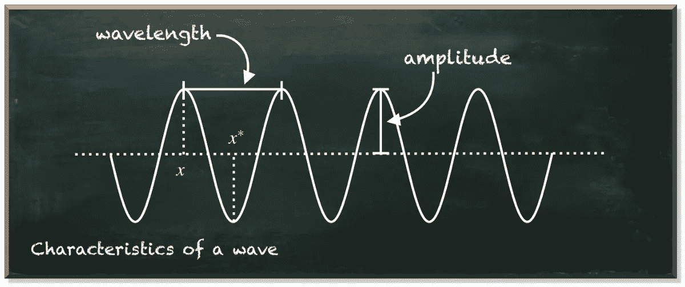
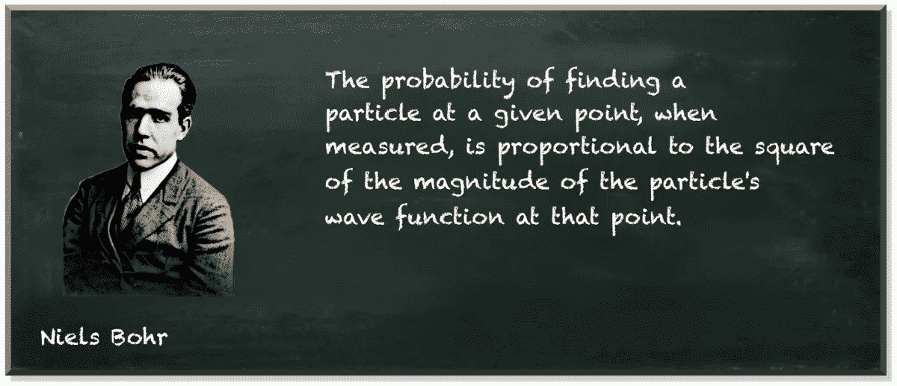
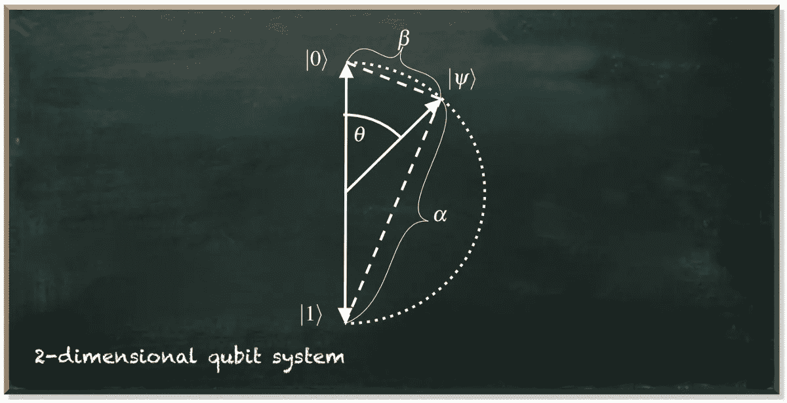

# 用量子计算机解决最优化问题

> 原文：<https://towardsdatascience.com/toward-solving-optimization-problems-with-a-quantum-computer-d1d2dedd2c26>

## 实用量子机器学习

量子机器学习要不要入门？看看 [**动手量子机器学习用 Python**](https://www.pyqml.com/page?ref=medium_solvopt&dest=/) **。**

优化不仅是机器学习算法的重要组成部分。它本身也是许多工业问题的解决方案。需要从有限的事物集合中找到一个最佳对象的应用程序的例子无处不在。

量子计算在解决问题上以指数级的加速向我们招手。不过，有一个问题。不能随便把一个问题放到一个量子算法里，就万事大吉了。

为了使用量子算法，我们必须把我们的问题公式化，这样量子算法才能工作。我们必须把我们想要解决的问题编码成量子比特。

作者图片

但是，我们如何做到这一点？我们如何将一个优化问题编码成量子比特？

当然，有无数种方法可以做到这一点。一个选择是量子预言。

量子预言是一个未知量子转换门的占位符，代表你想要识别的东西。首先，您为每个可能的事物定义一个 oracle 实例。然后，您制作一个量子电路，为不同的 oracle 实例产生不同的结果。因此，您可以判断神谕是否代表了您要寻找的东西。

简单地说，甲骨文让你回答是或否的问题和多项选择的问题。

但是优化问题就不一样了。我们不去寻找正确的答案。我们不想给未知的东西贴上标签。但是我们的目标是在众多合适的解决方案中找到最好的。

这迫使我们采取不同的方法。我们必须将问题编码成量子位，这样我们才能找到解决方案，并评估它有多好。

那么，让我们来看看我们如何做到这一点。

量子位是一个量子力学系统，这意味着它根据亚原子世界的规则运行。亚原子的东西不同于传统的东西，它具有类波、类粒子的特性。这就是所谓的波粒二象性。

这并不意味着亚原子的东西，如电子，是一种波。但是，这是一种具有特定特征的粒子，在某些情况下，它的行为可以用通常用来描述波的函数来更好地解释。

那么，波是如何表现的呢？一般来说，波浪在行进时会上下移动。所以，它不是一个静态的东西。相反，它会随着时间而变化。一次，我们在特定的时间和地点看到波峰。然后，在另一个时间和地点，处于平均水平。

作者图片

所以，当你在一个点看一个波的时候，你可能会看到完全不同的东西。这正是我们在处理量子位时所经历的。当我们观察两个相似的量子位时，我们可能会在它们轨道上的不同点捕捉到它们，因此，将它们作为两个不同的值来测量。当我们看到一个量子位处于顶点时，它就是 1。当我们捕捉到第二个量子位的平均值时，它是 0。

我们看到的并不是完整的波。这是波浪的快照。这就是梅克斯·玻恩在 1926 年提出的假设:

作者图片

这是量子位状态标准化的直接结果。对于一个量子位状态，它说|α| +|β| = 1

𝛼和𝛽表示波在两个不同点的大小，它们的绝对平方指定了在该点捕捉到波的概率。这两点对应于一个量子位的计算基础——它的两个可能值，0 和 1。所有可能测量的概率必须为 1 (=100%)。

下图以图形方式对此进行了描述。𝛼和𝛽是基础国家的近邻。

作者图片

因此，使用量子位本来就是随机的。但这并不意味着它是随机的。相比之下，我们可以很好地处理量子位。我们使用量子算符将其置于特定测量比其他测量更有可能的状态。

量子算符将一种量子位状态转换成另一种。例如，让我们看看 NOT 运算符。

数学上，X 门量子算符是矩阵:

当我们将这个算符应用于不同的量子位状态时——我们将相应的变换矩阵乘以状态向量——我们可以看到它反转了|0⟩和|1⟩.的振幅

逆转|0⟩在|1⟩:的结果

逆转|1⟩在|0⟩:的结果

通常，它会反转任意状态:

此外，我们可以结合量子算符来创建任何任意状态——只要它是有效的量子位状态。我们可以创造一个量子位系统，展示我们喜欢的任何测量概率。

通常的方法是将解决方案编码成一个量子预言，稍微改变一下量子位的状态。尽管我们不知道神谕的确切例子，但我们知道它可能产生的影响。然后，我们使用量子门来放大这些微小的差异，最终得到不同的测量结果，让我们得出准确的 oracle 实例。

但是有一个大问题。神谕让我们区分解决问题的状态和没有解决问题的状态。这是一个是或否的问题。但是，在最优化中，我们寻找一整套合理解决方案中的最佳方案。

所以，我们需要遵循另一种方法。在这种方法中，我们将以不同的方式使用运算符。

在量子力学中，有一些特殊的算符。这些算符作用于量子态的方式对应于物理可观测性，例如粒子的位置、动量、自旋，以及最重要的能量。这就是所谓的对应原理。

例如，哈密顿算符就是这些算符之一。它描述了量子系统的可能能量。能量也不是布尔值。这是一个实数。因此，我们可以比较两种能量，决定哪种能量更大。

因此，当我们将我们旨在优化的目标函数公式化为哈密尔顿函数时，该系统的能量对应于解的性能。然后，优化是寻找系统的最低(或最高)能量。

  

不要错过下一集，订阅我的[子栈频道](https://pyqml.substack.com/)。

量子机器学习要不要入门？看看 [**动手量子机器学习用 Python**](https://www.pyqml.com/page?ref=medium_solvopt&dest=/) **。**

免费获取前三章[这里](https://www.pyqml.com/page?ref=medium_solvopt&dest=/)。