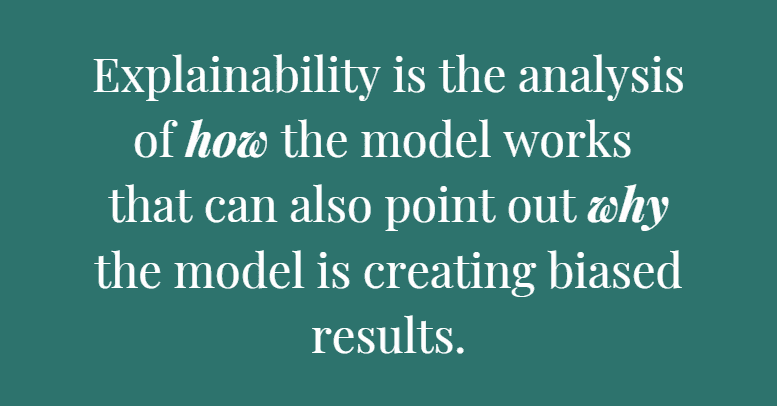
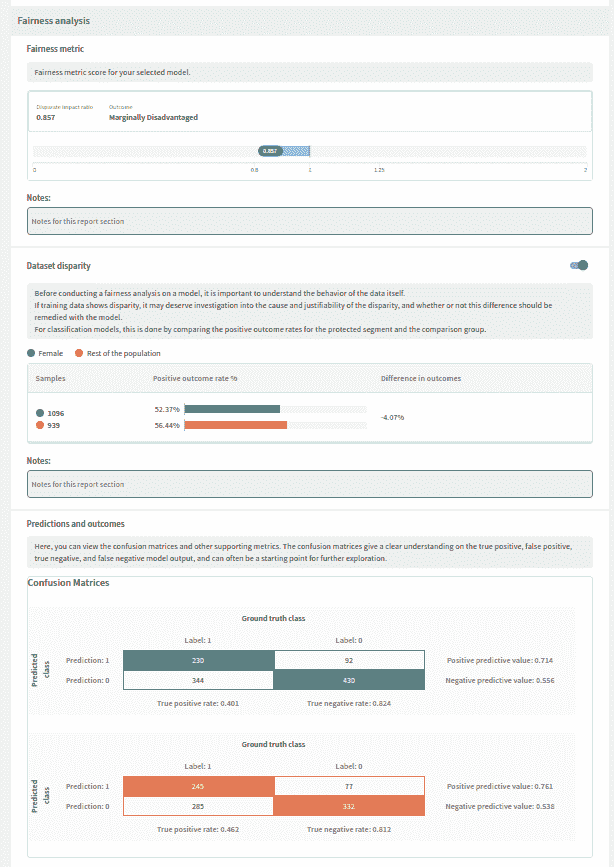

# 用人工智能建立一个更公平的世界:本月和所有月份

> 原文：<https://towardsdatascience.com/towards-a-fairer-world-with-ai-this-month-and-all-months-aec9d47ad176>

## 人工智能/人工授精中的性别偏见

在 [Unsplash](https://unsplash.com?utm_source=medium&utm_medium=referral) 上拍摄的 [ThisisEngineering RAEng](https://unsplash.com/@thisisengineering?utm_source=medium&utm_medium=referral)

*Divya Gopinath 和 Mesi Kebed 对本文有贡献。*

妇女历史月是一个强有力的提醒，提醒我们记住并反思我们作为一个社会已经走了多远，也提醒我们还需要取得多少进步。作为一家专注于改善人工智能的技术公司的女性工程师，我们深刻意识到技术如何改变我们实现公平世界的进程。随着人工智能和机器学习(AI/ML)应用在现代社会中激增，算法不再是无论环境如何变化都重复执行其命令的静态函数；在某种程度上，AI/ML 模型有自己的思维和观点，它们随着时间的推移随着数据的变化而演变。出于这些原因，实现真正公平的社会需要专注于实现人工智能中的算法公平。

然而，当偏见如此普遍时，即使考虑打击偏见也是势不可挡的——Gartner 预测[“到 2022 年，85%的人工智能项目将由于数据、算法或负责管理它们的团队的偏见而交付错误的结果。在这篇博客中，我们将试图通过识别算法“出错”的案例研究来揭开性别偏见的神秘面纱，并揭示如何打破 AI/ML 模型的一些不公平元素。](https://www.gartner.com/en/newsroom/press-releases/2018-02-13-gartner-says-nearly-half-of-cios-are-planning-to-deploy-artificial-intelligence)

# 性别偏见无处不在——来自实地的案例研究

近年来，ML 模型已经被用来增强——在某些情况下取代——人类做出关键决策。亚马逊负责审查工作申请和提出招聘建议的人工智能模型被发现会惩罚女性候选人，因为它是根据有偏见的数据进行训练的。甚至在[定向招聘广告](https://arxiv.org/abs/1904.02095)中的角色/头衔对男性和女性来说也是截然不同的；脸书招聘秘书和幼儿教师的广告显示女性比例较高。

作者图片

不幸的是，在[招聘](https://www.reuters.com/article/us-amazon-com-jobs-automation-insight/amazon-scraps-secret-ai-recruiting-tool-that-showed-bias-against-women-idUSKCN1MK08G)、[信用卡审批](https://www.nytimes.com/2019/11/10/business/Apple-credit-card-investigation.html)、[执法](https://www.technologyreview.com/2019/01/21/137783/algorithms-criminal-justice-ai/)、[大学招生](https://www.cs.utexas.edu/users/ai-lab/downloadPublication.php?filename=http://www.cs.utexas.edu/users/nn/downloads/papers/waters.iaai13.pdf&pubid=127269)以及许多其他方面，ML 模特表现出性别偏见的例子比比皆是。然而，如果不正确理解模型训练所依据的数据，以及它做出这些决定所依赖的特征，就可能导致对历史上代表性不足的群体的偏见永久化。不公平会以多种方式蔓延到人工智能/人工智能模型中，那么我们如何系统地解决偏见呢？

# 透明度是关键:为什么需要可解释性来停止偏见

回到 2019 年，许多申请苹果新信用卡的女性在推特上讨论一个奇怪的现象:她们的申请被拒绝，但她们的丈夫似乎获得了批准。尽管有混合财务，这些妇女仍然被拒绝，她们中的许多人问同样的问题:*为什么与我的丈夫相比，我被拒绝？*

该算法对其最终用户完全不透明，这意味着没有明显的理由来解释为什么给定的人被拒绝或批准。不仅财务状况相似的个人看起来有很大不同的结果，信用卡的发行者苹果和高盛也不能快速简单地解释算法是如何工作的，为什么它会产生不同的结果，以及这些结果是如何证明的。

可能很难克服明显的偏见。即使有一种算法有偏差的感觉，我们如何衡量这一点？而我们如何挖掘*为什么*有偏差的根本原因呢？如果不了解模型的决策，这些问题是不可能回答的。通过在我们的公司 TruEra 将人工智能可解释性作为一个解决方案，我们正在深入挖掘如何找到这些问题的答案。ML 模型可解释性是帮助我们回答这些关键问题的工具，因为它提供了对模型功能的最深刻的见解，这种见解阐明了对模型结果的主要影响，以及这些影响如何可能导致有偏见的结果。可解释性是对*模型如何*工作的分析，也可以指出*为什么*模型会产生有偏差的结果。

作者图片

# 超越性别:交叉公平的重要性

在进行公平性分析时，性别通常是一个方便使用的轴，特别是因为性别人口统计数据通常是作为一个二元变量收集的，可以根据该变量对数据进行分割。但是这个世界不是二元的，除了性别之外，还有一些属性也需要考虑。

Joy Buowamlini 和 Timnit Gebru 的著名论文揭露了商业面部识别技术如何在深色皮肤女性身上表现得比浅色皮肤男性差得多，这清楚地提醒了人们公平本质上是交叉的。根据定义，建立一个公平的世界必须包括每个人，因此我们不能只根据性别来考虑算法的公平性。必须考虑跨各种受保护特征(性别、种族、国籍、性取向等)的交叉群体。这可能听起来让人不知所措，但是分析不同数据属性之间的相互关系是可能的。例如，当您可以跨不同模型分析和比较不同*段*的数据时，您就能够详细捕捉子组公平性的复杂性。

# 赋予数据科学家权力:传达不公平

模型开发人员如何传达模型对模型开发过程中的其他涉众不公平，比如验证人员或数据工程师？在 TruEra，我们经常考虑这一点，尤其是在设计可用于分享偏见分析的公平报告时:

*公平性报告示例，显示混淆指标、数据集差异和公平性指标。*(图片由 TruEra 提供。)

我们经常从数据科学家那里听到同样的担忧:*公平对我很重要，但我如何让它对其他人也很重要？*数据科学家需要获得授权，就模型的不公平性提交客观、详细的报告，这些报告是无可辩驳的证据，可以与其他非技术性的法律和业务利益相关方共享。鉴于新的法规，如欧盟人工智能法和纽约市关于公平雇佣的法律，这一点变得越来越重要，这将增加模特在内部的审查，以及增加希望了解模特如何工作以及如何证明它没有歧视的外部利益相关者的数量。即使在目前没有积极监管的国家或地区，被视为歧视的业务和声誉压力也在推动对模型公平性分析和报告的需求增加。对社会而言，这些最终都是积极的趋势，也会给企业带来更好的结果。

# 减轻不公平—这是可能的，尤其是通过根本原因分析

打破不公平的根源也带来了如何减轻它的清晰，而不是被难住了。根本原因分析至关重要，因为它可以精确定位可能导致偏差的数据或特征。通常，这个问题的答案——*是什么导致了偏见？* —不明显，因为偏见甚至可能发生在没有性别、宗教或种族等明确数据特征的模型中。根本原因分析确保团队可以快速找到通常微妙的问题，确保模型可以更快地实现更公平的结果。关于缓解的更多信息，请参见本文《走向数据科学》——[“我的机器学习模型是如何变得不公平的？”](https://medium.com/towards-data-science/how-did-my-machine-learning-model-become-unfair-c6508a795989)

作者图片

# 公平是可以实现的——工具和流程已经存在

好消息是，有许多聪明的头脑在研究算法偏见的问题，从学术界到科技公司，再到希望人工智能更好地为银行、招聘、制造和无数其他用例中的客户服务的公司。对付它们的工具和技术已经存在，而且每天都在变得更加先进。在 TruEra，我们正在努力改进和提供更多工具，以满足自动化生产 ML 管道以及数据科学家报告等工具的需求，从各个方面应对这一问题。作为推动人工智能更加公平所需的人、过程和技术的更大组合的一部分，我们很自豪地尽了自己的一份力量。(那个组合长什么样？查看《走向数据科学》中的[“为您的 ML 模型设计公平的工作流程”](https://medium.com/towards-data-science/designing-a-fairness-workflow-for-your-ml-models-6518a5fc127e)。)

随着我们朝着成为一个更公平的社会取得进展，我们所有人都必须共同努力——解决算法偏见不仅会带来一个更公平的世界，而且会带来更好的整体结果。因此，在未来，85%的模型有准确的结果，偏差是一个消失的问题。