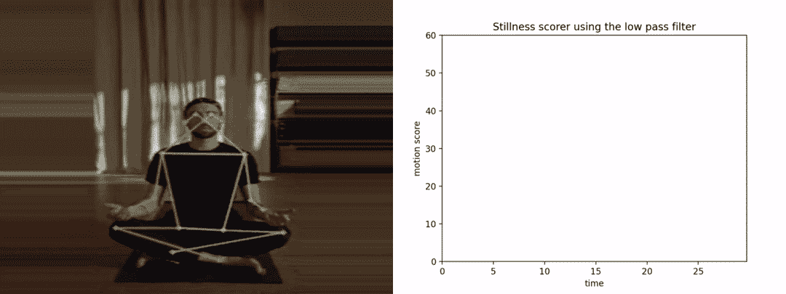
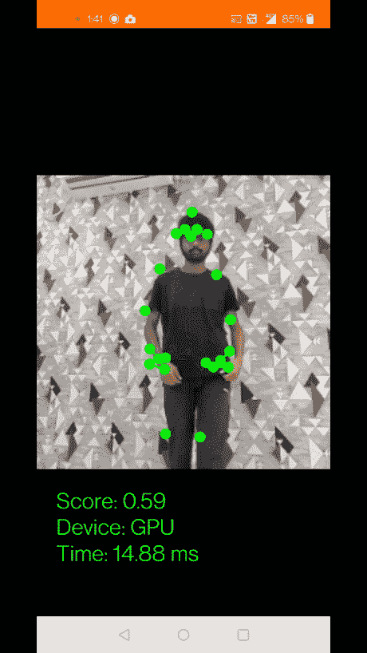

# 朝向更适用的姿态估计

> 原文：<https://towardsdatascience.com/towards-a-more-applicative-pose-estimation-bf18bc311228>

# 朝向更适用的姿态估计

## 为冥想者设计一个静止记分器——用 python 实现

照片由 [@ericmuhr](http://twitter.com/ericmuhr) 在 [Unsplash](https://unsplash.com/@ericmuhr) 上拍摄。

在这篇博客中，我将讨论如何通过强调推理过程中的一个关键问题来提高姿态估计算法的效率，并讨论缓解这个问题的方法。我还演示了一个例子，在这个例子中，通过在 python 中实现姿势估计，使姿势估计更具应用性。

关键词:*人体姿态估计，抖动，低通滤波器，信号。*

人体姿态估计是计算机视觉中极具挑战性的问题之一，其目标是定位人体关键点(如臀部、肩膀、手腕等)。).它有无数的应用，包括 AR、基于 VR 的游戏(如微软 Kinect)、互动健身、治疗、动作捕捉等。结果的逐帧平滑对于这些应用的任何使用都是非常关键的。

https://arxiv.org/pdf/1902.09212.pdf

## 抖动问题

几乎所有的姿态估计算法在推理过程中都存在**抖动**的问题。*表征噪声信号的关键点在一个点周围的高频振荡称为* ***抖动*** *。*

图:使用 Movenet 模型的抖动问题示例。人坐着不动，但姿势估计是抖动的。作者 GIF。

抖动原因可归因于我们在整个视频输入的帧级别上执行这些推断的事实。并且这些连续的帧具有变化的遮挡(以及一系列复杂的姿态)。另一个原因可能是训练数据中注释的不一致性，这导致姿态估计的不确定性。抖动会带来以下问题:

1.  故障和噪声数据将导致算法的不良性能。
2.  关键点噪音太大，无法在生产环境中构建任何有用的功能和应用程序。
3.  获得假阳性数据点的概率很高。
4.  例如:假设您想要使用姿势估计来构建一个静止记分器(针对正在进行冥想的人)；这些抖动会对分数产生很大影响。因此导致不准确和差的结果。

## 抖动问题的解决方案

信号处理提供了两种衰减信号中噪声的主要方法。 [**低通滤波器**](https://en.wikipedia.org/wiki/Low-pass_filter) **:** 衰减信号中低于指定阈值频率的所有频率并让其余信号不变通过的滤波器。

图:LPF(作者图片)

[**高通滤波器**](https://en.wikipedia.org/wiki/High-pass_filter) **:** 衰减指定阈值频率以上信号中所有频率并让其余信号不变通过的滤波器。

图:HPF(作者图片)

我们的自然运动是低频信号，而抖动是高频信号。因此，为了解决抖动问题，我们可以使用一个**低通滤波器**来过滤所有较高频率的信号。

解决抖动问题的其他方法包括使用神经网络进行姿态细化。一个这样的例子是[平滑网](https://arxiv.org/abs/2112.13715)。然而，LPF 更容易实现和使用。LPF 的另一个变体是[一欧元滤波器](https://jaantollander.com/post/noise-filtering-using-one-euro-filter/)，它在实时过滤噪声信号方面也非常强大。

## 时差姿态估计

让我们从一些代码开始，让 LPF 在 python 中工作。为了在这篇博客中进行说明，我使用了 Tensorflow 的 [**Movenet**](https://www.tensorflow.org/hub/tutorials/movenet) 姿态估计模型。这个模型非常快速和准确。

现在，让我们考虑一些将用于推理的简单函数。tflite 模型可以从 [*这里*](https://tfhub.dev/google/lite-model/movenet/singlepose/thunder/tflite/float16/4?lite-format=tflite) 下载。在 tflite 上运行推理的 Python API 在 [*tf.lite*](https://www.tensorflow.org/lite/api_docs/python/tf/lite) 模块中提供。 *(Ref:* [*使用 tflite*](https://www.tensorflow.org/lite/guide/inference#load_and_run_a_model_in_python) *在 python 中加载并运行一个模型)。*全部代码可以在我的 GitHub 资源库 [*这里*](https://github.com/aakash2016/blog-codes/tree/master/motion-detection) *找到。*

整个 Python 脚本可以在 [*这里*](https://github.com/aakash2016/blog-codes/blob/master/motion-detection/inference/movenet_infer.py) 找到。使用以下命令在本地运行推理(首先，在克隆后执行" *cd 运动检测*"):*python-m inference . movenet _ infer—路径 file.mp4—LPF n*让我们来看一个使用 Movenet 模型的示例推理结果:

图 5:使用 Movenet 模型进行推断的示例。这个模型看起来既准确又快速。作者 GIF。

显然，推断看起来相当准确，延迟也很小。现在，让我们回到开头看到的抖动示例，看看如何解决抖动问题。为了演示的目的，我们使用 [1€低通滤波器](https://jaantollander.com/post/noise-filtering-using-one-euro-filter/)。我们还可以使用 Python 中一个流行的信号处理库——Scipy，它支持不同类型的低通滤波器(例如， [signal.lfilte](https://docs.scipy.org/doc/scipy/reference/generated/scipy.signal.lfilter.html#scipy.signal.lfilter) r 模块)。1€ LPF 的用法已在下面突出显示:

整个 Python 脚本可以在 [*这里*](https://github.com/aakash2016/blog-codes/blob/master/motion-detection/inference/stillness_scorer.py) 找到。使用以下命令在本地运行推理(使用 LPF):

*python-m motion _ detection . inference . stilley _ scorer—路径 file.mp4—LPF y*

图 5:显示中心抖动姿态估计的示例.LPF 解决了右边的抖动问题，估计相当平滑。作者 GIF。

# 应用示例

现在，让我们看一个非常简单的例子，在这个例子中，使用上面提到的概念，姿态估计可以变得稍微更适用。考虑下面的问题陈述:*“根据身体静止给一个正在冥想的人打分。”*

除了姿势估计之外，你能想到其他一些技术来解决这个问题吗？

## 普通图像处理

也许我们可以用简单的图像处理方法来解决这个问题。我们可以从减去视频流中的两个连续帧开始，然后我们可以应用二进制阈值来获得减去的掩模；这里，白色像素的数量将表示静止。

图 2:亚光掩模。使用简单的图像处理技术测量静止。如果人是静止的，白色像素的数量将小于指定的阈值。图片作者。

方法是好的，但是当背景中也有风扇或猫移动时，问题就出现了；在这种情况下，这种方法可能无效。因为移动的猫将成为减影蒙版的一部分。目标是想出一种专门适用于人类的方法。

## 图像(人)分割

用一些人体分割技术怎么样？我们可以使用分割来专门分割出人，然后我们取两个连续分割帧的差，并检查白色像素的数量。局限性:当分割区域内有运动时，这种方法不起作用。

## 姿态估计

这里，我们为所有(平滑的)关键点计算特定身体部位关键点跨连续帧的欧几里德距离。我们的最终得分是所有这些欧几里得距离的加权和。显然，如果一个人做了一些运动，关键点的欧几里德距离将会更高，反之亦然。

***分数:*** 如果没有明显的动作，分数应该会低一些。较低的分数将意味着更好的冥想(基于身体静止，实际上有许多因素有助于良好的冥想，而不仅仅是静止)。*注意，如果我们之前没有平滑姿态关键点，抖动会影响分数，导致糟糕和不准确的结果。*下图显示了 y 轴上的运动分数与 x 轴上的时间。附带的代码可以在这里找到。首先，让我们看看在没有平滑的情况下乐谱是如何表现的。

图 3:不使用低通滤波器的静止记分器.该图是 y 轴上的运动分数对 x 轴上的时间。作者 GIF。

很明显，由于抖动，该图看起来有噪声。并且抖动也对分数有贡献。让我们看看分数如何使用 LPF。

图:使用低通滤波器的静止记分器。该图是 y 轴上的运动分数对 x 轴上的时间。作者 GIF。

在这里，图形这次看起来平滑干净。正如我们可以推断的那样，任何运动都对曲线下的面积有贡献。因此，平滑关键点在这样的应用中变得非常重要。

## 决赛成绩

我还在 android 中集成了一个低通滤波器，并在一个定制的姿势估计模型上运行它。我们得到了以下结果:

图 3:在自定义模型上使用 LPF 有平滑效果.作者 GIF。

# 参考

[1].曾爱玲，雷洋，宣菊，李洁峰，，徐强— [SmoothNet:一个即插即用的网络，用于提炼视频中的人体姿势](https://arxiv.org/abs/2112.13715)。

[2]. [MoveNet:超快速精确姿态检测模型](https://www.tensorflow.org/hub/tutorials/movenet)。

[3].Jaan Tollander de Balsch — [使用一个€滤波器进行噪声滤波](https://jaantollander.com/post/noise-filtering-using-one-euro-filter/)。

[4].博客中使用的 Python 脚本可以在[这里](https://github.com/aakash2016/blog-codes)找到。

我希望你喜欢使用低通滤波器来提高姿态估计的实用性。我希望这个例子足够合理，能够暗示在构建基于姿态估计的应用程序时，消除抖动是最关键的优化之一。

我很想知道任何阅读这篇文章的人的反馈。我很乐意回答对上述任何概念的疑问/问题。非常欢迎反馈。你可以通过 Linkedin 联系我。

# 谢谢你！

特别感谢@ [Apurva Gupta](https://www.linkedin.com/in/apurvagup/) 对博客的评论。